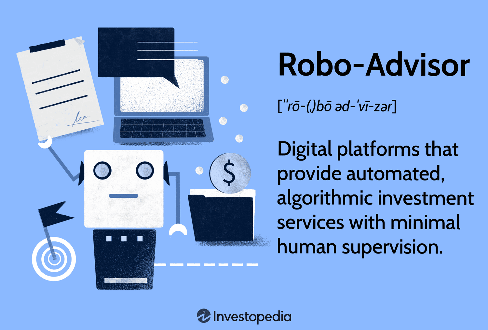

## Table of Contents

## What is a robo-advisor and how does it work?

A robo-advisor is a type of automated financial advisor that uses computer algorithms to manage your investments. It's like having a smart computer help you with your money. You tell the robo-advisor how much risk you want to take and what your financial goals are, and it creates a personalized investment plan for you. It then automatically invests your money in things like stocks and bonds, and it keeps an eye on your investments to make sure they are doing well.

Robo-advisors are easy to use because you can do everything online. You don't need to meet with a human advisor or go to a bank. You just need to answer some questions about your money goals and how much risk you're okay with. After that, the robo-advisor does the rest. It's a good option for people who want to invest but don't have a lot of time or knowledge about investing. Plus, robo-advisors usually charge less than human financial advisors, so it can save you money too.

## What are the basic services offered by robo-advisors?

Robo-advisors offer a few basic services that help people manage their money. One of the main services is creating a personalized investment plan. You tell the robo-advisor about your financial goals and how much risk you are comfortable with, and it uses this information to build a plan just for you. This plan usually includes investing your money in a mix of things like stocks and bonds, which helps spread out the risk.

Another important service is automatic portfolio management. Once your money is invested, the robo-advisor keeps an eye on it all the time. If the market changes or if your investments aren't doing well, the robo-advisor can make adjustments without you having to do anything. This is called rebalancing, and it helps keep your investments on track to meet your goals.

Lastly, robo-advisors often provide tools and resources to help you learn more about investing. They might have articles, videos, or calculators that can teach you about money and help you make better decisions. This way, even if you're new to investing, you can feel more confident about managing your money.

## How do robo-advisors determine an investor's risk profile?

Robo-advisors determine an investor's risk profile by asking a series of questions. These questions help them understand how much risk you are willing to take with your money. They might ask about your age, how long you plan to invest, and how you would feel if your investments went up or down a lot. Your answers to these questions help the robo-advisor figure out if you are someone who likes to play it safe or if you are okay with taking bigger risks for the chance of bigger rewards.

Once the robo-advisor has your answers, it uses a computer program to turn them into a risk profile. This profile helps the robo-advisor decide how to invest your money. For example, if you are young and okay with taking more risk, the robo-advisor might put more of your money into stocks, which can go up and down a lot. But if you are closer to needing your money and want to be safer, it might put more into bonds, which are usually less risky. This way, your investments match what you are comfortable with.

## What are the typical fees associated with using a robo-advisor?

Robo-advisors usually charge a fee based on a percentage of the money you have invested with them. This fee is often around 0.25% to 0.50% per year. So, if you have $10,000 invested, you might pay between $25 and $50 each year. This is much less than what you might pay for a human financial advisor, who could charge 1% or more of your total investments.

Sometimes, there are other costs too. For example, the robo-advisor might invest your money in funds that have their own fees, called expense ratios. These fees are usually small, often around 0.05% to 0.25% per year. So, you need to add these costs to the robo-advisor's fee to know the total cost of managing your money. Even with these extra costs, using a robo-advisor is often cheaper than working with a human advisor.

## Can robo-advisors provide personalized investment advice?

Robo-advisors can provide personalized investment advice, but it's different from what you'd get from a human advisor. When you start using a robo-advisor, you answer questions about your financial goals, how long you plan to invest, and how much risk you're okay with. The robo-advisor uses this information to create a personalized investment plan just for you. This plan will include a mix of investments like stocks and bonds that match your risk level and goals.

However, the advice from a robo-advisor is based on algorithms and set rules, so it might not be as flexible as talking to a human. If your situation changes, like if you get a new job or have a baby, you'll need to update your information with the robo-advisor. It will then adjust your investments based on the new information. While robo-advisors can personalize your investment strategy, they don't offer the same level of personal touch and detailed advice that a human financial advisor can provide.

## What are the advantages of using robo-advisors for beginners?

Robo-advisors are a great choice for beginners because they make investing easy and affordable. You don't need to know a lot about the stock market or how to pick the right investments. The robo-advisor does all the hard work for you. It asks you simple questions about your goals and how much risk you're okay with, and then it creates a plan that fits your needs. Plus, robo-advisors usually charge less than human advisors, so you can start investing without spending a lot of money.

Another big advantage is that robo-advisors take care of your investments automatically. Once you set up your account, the robo-advisor keeps an eye on your money and makes changes if needed. This means you don't have to worry about checking the market every day or figuring out when to buy or sell. It's a hands-off way to invest, which is perfect if you're new to this and don't have a lot of time to manage your money.

## How do robo-advisors handle tax-loss harvesting?

Robo-advisors can help you save money on taxes by doing something called tax-loss harvesting. This means they look at your investments to see if any have lost value. If they find some, they might sell those investments to use the losses to lower your taxes. It's like finding a silver lining in a bad investment. The robo-advisor then uses the money from the sale to buy similar investments, so your overall investment plan stays the same.

This process happens automatically, so you don't have to do anything. The robo-advisor keeps an eye on your investments all the time and makes these moves when it makes sense. Not all robo-advisors offer tax-loss harvesting, so if this is important to you, make sure to check if the one you're thinking about using has this feature. It can be a big help in saving you money on taxes, especially if you have a lot invested.

## What are the limitations of robo-advisors in terms of investment options?

Robo-advisors make investing easy by using computer programs to pick and manage your investments. But they don't offer as many choices as you might get with a human advisor. Most robo-advisors stick to a small list of things to invest in, like index funds and ETFs. These are groups of investments that track the market, like the S&P 500. This can be good for beginners because it's simple and low-cost, but it also means you can't pick individual stocks or more special investments that might fit your goals better.

Another thing to think about is that robo-advisors usually focus on broad, general investments. They might not offer things like real estate, commodities, or other alternative investments that some people like to include in their portfolios. If you want to invest in these types of assets, you might need to look elsewhere or work with a human advisor who can help you find those options. So, while robo-advisors are great for getting started and keeping things simple, they might not give you all the investment choices you want if you have more specific needs or interests.

## How do robo-advisors perform during market volatility?

Robo-advisors are designed to handle market ups and downs. They use computer programs to keep your investments balanced, which means they make changes to your portfolio to keep it in line with your goals and how much risk you want to take. During times when the market is moving a lot, robo-advisors might sell some investments that are doing badly and buy others that might do better. This is called rebalancing, and it helps keep your money safe even when the market is rocky.

However, robo-advisors can't predict the future or stop the market from going down. If the market drops a lot, your investments with a robo-advisor will go down too. But the good thing is that robo-advisors keep working to make your investments as stable as possible. They don't get scared or make quick decisions like people might. They just follow their plan, which can help you feel better during tough market times.

## What advanced features do some robo-advisors offer to experienced investors?

Some robo-advisors offer advanced features that can be really helpful for experienced investors. One of these features is tax-loss harvesting, which is when the robo-advisor looks for investments that have lost value and sells them to help you save on taxes. It then buys similar investments to keep your portfolio balanced. Another advanced feature is the ability to invest in socially responsible funds, which means you can choose investments that match your values, like protecting the environment or supporting fair labor practices.

In addition to these, some robo-advisors let you add your own investments to the mix. This means you can include specific stocks or other assets that you think will do well, which gives you more control over your portfolio. Some robo-advisors also offer more detailed reports and analytics, so you can see how your investments are doing and make smarter decisions. These advanced features can make robo-advisors a good choice for experienced investors who want more options and control over their money.

## How can robo-advisors be integrated with other financial planning tools?

Robo-advisors can work well with other financial planning tools to help you manage your money better. For example, many robo-advisors can connect with budgeting apps like Mint or YNAB. This means you can see all your money in one place, from your investments to your daily spending. This makes it easier to plan your finances because you can see how your investments are doing and how they fit into your overall budget.

Some robo-advisors also work with tax software, like TurboTax. This can make tax time less stressful because the robo-advisor can share information about your investments directly with your tax software. This way, you can make sure you're taking advantage of all the tax savings you can get, like from tax-loss harvesting. By connecting your robo-advisor with other tools, you can have a more complete picture of your financial health and make smarter decisions about your money.

## What are the potential risks and regulatory considerations when using robo-advisors?

Using robo-advisors can come with some risks. One risk is that they use computer programs to make decisions, and these programs can sometimes make mistakes or miss out on good investment chances. Also, robo-advisors might not react as quickly as a human to big changes in the market, which could mean you miss out on making quick moves to protect your money. Another thing to think about is that robo-advisors usually invest in a small range of options, so you might not have as many choices as you would with a human advisor. This can be a problem if you want to invest in specific things that the robo-advisor doesn't offer.

There are also some rules and regulations you need to know about when using robo-advisors. In the United States, robo-advisors have to follow rules set by the Securities and Exchange Commission (SEC) and the Financial Industry Regulatory Authority (FINRA). These rules are there to protect you and make sure the robo-advisor is doing things the right way. It's important to check if the robo-advisor you're thinking about using is registered with these groups. Also, robo-advisors have to be clear about their fees and how they make money, so make sure you understand all the costs before you start investing.

## What is the Rise of Robo-Advisors?

Robo-advisors have notably transformed the conventional investment advisory space through the use of automated, cost-effective portfolio management solutions. By employing sophisticated algorithms, these platforms are capable of constructing and managing diversified investment portfolios tailored to each investor's risk tolerance and financial objectives. This automation has effectively democratized access to investment services, significantly lowering the barriers to entry for new investors. Services offered by robo-advisors come at a fraction of the cost associated with traditional financial advisors, making them an attractive alternative for cost-conscious individuals.

The core process behind robo-advisors involves algorithm-driven decision-making. These algorithms assess various data points to construct a suitable portfolio. Typically, this includes factors such as age, income, investment horizon, and risk appetite. A simplified model can be expressed as:

$$
\text{Portfolio Allocation} = f(\text{Risk Tolerance}, \text{Time Horizon}, \text{Financial Goals})
$$

Despite the considerable impact of robo-advisors, they are not without limitations. One of the primary criticisms is their inability to provide personalized financial advice, particularly for individuals with intricate financial situations or unique needs. Unlike human financial advisors, robo-advisors are inherently limited to pre-programmed guidelines and lack the ability to interpret complex, nuanced financial contexts.

Additionally, the evolution of these platforms has seen the introduction of more advanced features, expanding their utility and appeal. Notably, many robo-advisors have started to offer socially responsible investing (SRI) options, catering to the growing number of investors interested in aligning their portfolios with ethical and sustainable values. This development further emphasizes the adaptable nature of financial technology, as it continues to respond to the shifting priorities of the modern investor.

In summary, robo-advisors have made notable strides in revolutionizing the investment advisory sector by offering accessible and affordable management services. However, as they continue to develop, it will be essential for these platforms to address their limitations, particularly in delivering nuanced financial advice and handling complex investor requirements.

## References & Further Reading

[1]: Barberis, N., & Thaler, R. (2003). ["A Survey of Behavioral Finance."](https://www.semanticscholar.org/paper/A-Survey-of-Behavioral-Finance-Barberis-Thaler/a4ab7d7161deac0f532d121b1614cf7b97d90e78) Handbook of the Economics of Finance.

[2]: Bodie, Z., Kane, A., & Marcus, A. J. (2013). ["Investments"](https://www.mheducation.com/highered/product/Investments-Bodie.html). McGraw-Hill Education.

[3]: Bogle, J. C. (2003). ["Common Sense on Mutual Funds: New Imperatives for the Intelligent Investor."](https://www.amazon.com/Common-Sense-Mutual-Funds-Imperatives/dp/0471392286) Wiley.

[4]: Chuen, D. L. K. (Ed.). (2015). ["Handbook of Digital Currency: Bitcoin, Innovation, Financial Instruments, and Big Data."](https://www.sciencedirect.com/book/9780128021170/handbook-of-digital-currency) Academic Press.

[5]: Fabozzi, F. J., Focardi, S. M., & Kolm, P. N. (2010). ["Quantitative Equity Investing: Techniques and Strategies."](https://www.semanticscholar.org/paper/Quantitative-Equity-Investing%3A-Techniques-and-Fabozzi-Focardi/1c49a2a53919f7e65cb96f16691b8ff726fd3cd7) Wiley.

[6]: Lo, A. W. (2017). ["Adaptive Markets: Financial Evolution at the Speed of Thought."](https://www.amazon.com/Adaptive-Markets-Financial-Evolution-Thought/dp/0691135142) Princeton University Press.

[7]: Ptaszynski, M., Dybala, P., Araki, K., & Momouchi, Y. (2010). ["Corpus-based Emotion Modeling for the Purpose of Automatic Event Extraction."](https://psycnet.apa.org/record/2013-37145-002) International Conference on Intelligent Information and Database Systems.

[8]: Shleifer, A. (2000). ["Inefficient Markets: An Introduction to Behavioral Finance."](https://academic.oup.com/book/27761) Oxford University Press.