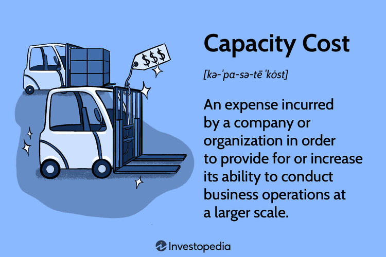

## Table of Contents

## What is capacity cost?

Capacity cost is the money a business spends to be able to produce goods or services. This includes the costs of machines, buildings, and other things needed to make products. For example, if a bakery buys a new oven, the cost of the oven is a capacity cost because it helps the bakery make more bread.

These costs are important because they help a business grow and meet customer demand. However, they can also be risky because if the business doesn't sell enough products, the money spent on capacity might be wasted. That's why businesses need to carefully plan and think about how much capacity they really need before spending money on it.

## How is capacity cost different from other types of costs?

Capacity cost is different from other types of costs because it focuses on the ability to produce goods or services. It includes expenses like buying new machines or building new factories, which help a business make more products. These costs are about preparing for the future and making sure the business can handle more work if needed. On the other hand, other types of costs, like operating costs, are the everyday expenses that keep the business running, such as paying for electricity or salaries.

For example, if a company buys a new delivery truck, that's a capacity cost because it helps the company deliver more products. But the gas used to run the truck is an operating cost. Capacity costs are usually big investments and are planned for the long term, while operating costs are smaller and more regular. Understanding the difference helps businesses manage their money better and plan for growth.

## What are the main components of capacity cost?

The main components of capacity cost are the expenses that help a business make more products or provide more services. This includes the cost of buying new machines, like ovens for a bakery or computers for an office. It also includes the cost of building new factories or expanding old ones. These are big investments that help a business grow and handle more work.

Another important part of capacity cost is the money spent on technology and systems that improve how the business works. For example, if a company buys software to manage its inventory better, that's a capacity cost. It helps the company keep track of what it has and what it needs, so it can make more products efficiently. All these components are about making sure the business can do more in the future.

## How do businesses calculate capacity cost?

Businesses calculate capacity cost by adding up all the money they spend on things that help them make more products or provide more services. This includes the cost of buying new machines, like a new oven for a bakery, or building new factories. They also include the cost of technology and systems that help them work better, like new software for managing inventory. All these costs are added together to find out the total capacity cost.

When calculating capacity cost, businesses also think about how long these investments will last and how much they will help the business grow. For example, if a company buys a new machine, they will consider how many years the machine will work and how much more it will help them produce. This helps them understand if the money spent on capacity is worth it and if it will help them make more money in the future.

## What are the common methods used to allocate capacity costs?

Businesses use different ways to figure out how to share capacity costs among their products or services. One common way is called the direct method. This means they look at how much each product or service uses the new machines or buildings. For example, if a bakery uses a new oven mostly for making bread, then more of the oven's cost is put on the bread than on other products.

Another way is the step-down method. This is a bit more complicated. It starts by sharing the costs of the biggest capacity items, like a new factory, among different parts of the business. Then, it moves on to smaller items, like machines inside the factory. This method tries to be fair by thinking about how each part of the business uses the new capacity.

A third way is the activity-based costing method. This looks at the activities that use the new capacity and shares the costs based on those activities. For example, if setting up machines takes a lot of time, then the cost of the machines is shared based on how often they need to be set up. This method tries to be very accurate by focusing on what really uses the capacity.

## How does capacity cost impact pricing strategies?

Capacity cost can change how a business decides on the prices of its products or services. When a business spends a lot of money on new machines or buildings, it might need to raise prices to make up for these costs. For example, if a bakery buys a new oven, it might need to charge more for its bread to cover the cost of the oven. This is because the business needs to make sure it earns enough money to pay for the new things it bought.

Sometimes, businesses might also lower prices if they think the new capacity will help them make more products faster and cheaper. If the bakery's new oven can bake more bread at once, it might lower the price of bread to sell more loaves and make up for the cost of the oven that way. This way, the business can still earn enough money, but by selling more products at a lower price. So, capacity costs can make prices go up or down, depending on how the business plans to use its new capacity.

## What are the key considerations when managing capacity costs?

When managing capacity costs, businesses need to think about how much they can spend without hurting their money situation. They should look at how much money they expect to make in the future and make sure the new machines or buildings won't cost more than they can afford. It's also important to plan carefully and think about how long the new things will last and how much they will help the business grow. If a business spends too much on capacity and doesn't sell enough products, it might lose money.

Another thing to consider is how the new capacity will fit with the business's goals. For example, if a bakery wants to make more bread, it should think about how a new oven will help with that goal. The business should also think about how it will share the costs of the new things among its products. This helps make sure that the prices of the products are fair and that the business can still make money. By thinking about these things, businesses can manage capacity costs better and make smart choices about how to grow.

## How can capacity cost affect a company's financial performance?

Capacity cost can affect a company's financial performance in big ways. When a company spends a lot of money on new machines or buildings, it might have less money to use for other things, like paying bills or buying materials. If the company doesn't sell enough products to cover these costs, it might lose money. This can make it hard for the company to stay in business. But if the company plans well and the new things help it make more products and sell them, the capacity cost can help the company make more money in the long run.

Another way capacity cost affects financial performance is through pricing. If a company needs to raise prices to cover the cost of new machines or buildings, it might lose customers if the prices are too high. On the other hand, if the company can make products faster and cheaper with the new capacity, it might be able to lower prices and sell more products. This can help the company make more money. So, capacity cost can make a company's financial performance better or worse, depending on how well the company plans and uses its new capacity.

## What are the best practices for optimizing capacity cost?

To optimize capacity cost, a business should first do a lot of planning. It needs to think about how much money it has and how much it can spend on new machines or buildings without getting into trouble. The business should also look at how much more it can make with the new things and how long they will last. By doing this, the business can make sure it is spending money wisely and not buying more than it needs. It's also a good idea to talk to experts or use special tools to help figure out the best way to spend money on capacity.

Another important thing is to keep checking how well the new capacity is working. The business should see if the new machines or buildings are helping it make more products and if it is making enough money to cover the costs. If something isn't working as expected, the business should be ready to make changes. This might mean using the new things differently or even selling them if they are not helping. By always keeping an eye on capacity costs and making smart choices, a business can make sure it is using its money in the best way possible.

## How do technological advancements influence capacity cost management?

Technological advancements can help businesses manage capacity costs better. New technology, like machines that work faster or software that helps plan better, can make it easier for a business to decide when and how much to spend on new things. For example, if a factory gets a new machine that can make more products in less time, the business might not need to buy as many machines as before. This can save money and help the business grow without spending too much.

Also, technology can help businesses keep track of how well their new machines or buildings are working. With special software, a business can see if the new things are helping it make more money or if they need to make changes. This way, the business can make sure it is spending its money wisely and not wasting it on things that don't help. By using technology, businesses can plan better and make smarter choices about capacity costs.

## What are the challenges faced by companies in controlling capacity costs?

Companies often find it hard to control capacity costs because they need to guess how much more they will sell in the future. If they guess wrong and buy too many new machines or build too big of a factory, they might spend more money than they can make back. It's like buying a big backpack when you only need a small one. If the backpack is too big, it's hard to carry and might be a waste of money. Companies have to be careful and plan a lot to make sure they are spending just the right amount on new things.

Another challenge is that capacity costs are big and can take a long time to pay off. When a company buys a new machine, it might take years before they make enough money to cover the cost. During that time, they need to keep paying for other things like electricity and salaries. If something goes wrong, like the machine breaks or they can't sell enough products, the company might lose money. It's like planting a tree and waiting for it to grow. You need to take care of it and hope it will give you fruit someday. Companies need to be patient and keep a close eye on their money to make sure they can handle the big costs of capacity.

## How can capacity cost analysis be used for strategic decision-making?

Capacity cost analysis helps businesses make smart choices about how to grow. When a company looks at its capacity costs, it can figure out if buying new machines or building new factories is a good idea. They think about how much more they can make with the new things and if they can sell enough products to cover the costs. By doing this, the company can plan better and decide if it's worth spending money on new capacity. This helps them avoid spending too much and getting into money trouble.

Using capacity cost analysis also helps businesses see how their new investments will affect their money in the future. They can guess how long it will take to make back the money they spent and if the new things will help them make more money over time. This is important for making long-term plans and setting goals. By understanding capacity costs, a company can make choices that help it grow and stay strong, even when things change in the market.

## What are the key aspects of Regulatory Compliance and Legal Considerations?

Navigating the regulatory landscape is a critical component for algorithmic trading firms to ensure compliance and financial integrity. Registration with relevant regulatory authorities, such as the U.S. Securities and Exchange Commission (SEC) or the Commodity Futures Trading Commission (CFTC) in the United States, represents the foundational financial outlay. Firms are required to adhere to specific legal standards which encompass a rigorous set of rules designed to foster transparency, protect investors, and maintain fair trading conditions.

Ongoing compliance is not a one-time effort but a continuous process that necessitates regular audits. These audits are essential for verifying that trading activities and the operational processes align with regulatory requirements. They may involve an examination of both trading data and algorithmic code, ensuring adherence to market conduct rules and the validation of execution quality. Alongside audits, firms often need to adjust their trading algorithms to align with evolving legal standards, incurring further costs related to development, testing, and implementation of changes.

Incorporating these elements into the financial strategy of an algorithmic trading firm can be quantified by considering compliance costs as a proportion of the total operational expenses. Let's denote:

- $C_{\text{reg}}$ as regulatory compliance costs,
- $E_{\text{total}}$ as total operational expenses.

The compliance cost ratio ($R_{\text{compliance}}$) can be expressed as:

$$
R_{\text{compliance}} = \frac{C_{\text{reg}}}{E_{\text{total}}}
$$

This ratio aids firms in monitoring the financial impact of their regulatory obligations. A systematic approach to integrating regular compliance assessments into the budget can prevent unforeseen penalties. These may include fines imposed for non-compliance or operational disruptions due to regulatory breaches. Hence, proactive and strategic financial planning in this area safeguards against financial liabilities and ensures the firm's long-term sustainability.

Moreover, legal considerations extend beyond national boundaries, especially for firms operating in multiple jurisdictions. International engagements may necessitate cross-border compliance adherence, demanding further resources to navigate the complexities of international regulatory frameworks.

To mitigate these costs, firms might employ advanced analytical tools and compliance software solutions. These technologies assist in automating compliance checks and managing large data sets necessary for regulatory reporting, thereby enhancing operational efficiency and reducing manual oversight.

By embedding these regulatory and legal considerations into their financial management strategies, algorithmic trading firms establish a robust framework. This framework is not only protective against regulatory penalties but also supports sustainable growth by allowing firms to focus resources on innovation and gaining competitive advantages in an ever-evolving market landscape.

## References & Further Reading

[1]: Bergstra, J., Bardenet, R., Bengio, Y., & Kégl, B. (2011). ["Algorithms for Hyper-Parameter Optimization."](https://dl.acm.org/doi/10.5555/2986459.2986743) Advances in Neural Information Processing Systems 24.

[2]: ["Advances in Financial Machine Learning"](https://www.amazon.com/Advances-Financial-Machine-Learning-Marcos/dp/1119482089) by Marcos Lopez de Prado

[3]: ["Evidence-Based Technical Analysis: Applying the Scientific Method and Statistical Inference to Trading Signals"](https://www.amazon.com/Evidence-Based-Technical-Analysis-Scientific-Statistical/dp/0470008741) by David Aronson

[4]: ["Machine Learning for Algorithmic Trading"](https://github.com/stefan-jansen/machine-learning-for-trading) by Stefan Jansen

[5]: ["Quantitative Trading: How to Build Your Own Algorithmic Trading Business"](https://www.amazon.com/Quantitative-Trading-Build-Algorithmic-Business/dp/1119800064) by Ernest P. Chan

[6]: Aldridge, I. (2013). ["High-Frequency Trading: A Practical Guide to Algorithmic Strategies and Trading Systems,"](https://books.google.com/books/about/High_Frequency_Trading.html?id=6l0DDQAAQBAJ) 2nd Edition. Wiley Finance.

[7]: Patterson, S. (2013). ["Dark Pools: The Rise of the Machine Traders and the Rigging of the U.S. Stock Market."](https://www.amazon.com/Dark-Pools-Machine-Traders-Rigging/dp/0307887189) Crown Business.