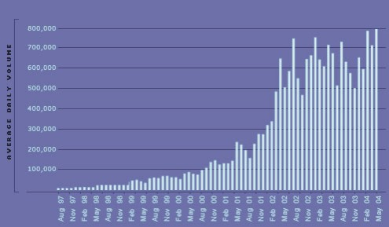

Algorithmic trading has revolutionized financial markets through its reliance on sophisticated strategies that are developed and validated for performance. A critical aspect of this development process is backtesting, which enables traders to simulate and evaluate how their strategies might have performed using historical data. Backtesting provides traders with valuable insights into the potential effectiveness of their strategies, highlighting strengths and weaknesses before actual capital is at risk.

However, a significant challenge faced during backtesting is dealing with capacity constraints. These constraints can severely impact the scalability and efficiency of executing a trading strategy. As traders attempt to scale up their strategies by increasing the volume of trades or capital, capacity becomes a crucial factor. A strategy that appears profitable in a backtest might fail to perform in live trading if capacity issues are not properly addressed. This could be due to factors such as insufficient market liquidity, resulting in an inability to execute trades at expected prices, or the significant market impact of large trade sizes.

In this article, we explore the dynamics of capacity constraints in the backtesting process of algorithmic trading strategies. Our focus is on emphasizing the role of capacity in achieving consistent and profitable trading outcomes. By understanding these constraints, traders can make informed decisions, ensuring their trading strategies are robust and capable of handling larger trade volumes in real-world conditions. Moreover, we highlight advanced techniques aimed at overcoming capacity challenges, ensuring that trading strategies are well-prepared for practical application. These techniques include advanced simulations, staged testing, and the incorporation of synthetic data, among others, all designed to enhance the resilience and scalability of trading strategies in live markets.

## Table of Contents

## Understanding Capacity in Backtesting

Capacity in [backtesting](/wiki/backtesting) is a pivotal concept in [algorithmic trading](/wiki/algorithmic-trading) that determines whether a trading strategy can sustain its performance as the trade [volume](/wiki/volume-trading-strategy) or invested capital increases. This capacity is essential because a trading strategy that performs admirably in constrained market conditions might falter when subjected to larger market scenarios. Several factors contribute to capacity limitations, affecting a strategy's scalability and effectiveness.

Market impact, for instance, can significantly alter a strategy’s performance as the volume of trades rises. In scenarios where transaction volumes are high, the price of the traded asset might shift unfavorably due to the trader's actions, leading to reduced profitability. This phenomenon is most commonly observed in high-frequency trading strategies, where rapid and recurrent trades can cumulatively impact market conditions.

Liquidity constraints further affect capacity by limiting the availability of assets to be traded at a desired price level. When market participants aim to buy or sell large quantities, the demand and supply imbalance can hinder optimal execution. This can cause slippage, where the expected price and the actual execution price differ, adversely impacting strategy performance.

Ignoring capacity constraints can result in backtested strategies appearing profitable but failing during live trading due to performance degradation when scaled. For instance, a strategy showing potential in backtests may suffer when introduced to real-world trading environments, predominantly due to underestimated market impact, [liquidity](/wiki/liquidity-risk-premium) issues, and transaction costs not reflected adequately in the backtest.

Addressing capacity constraints is indispensable for developing robust and scalable algorithmic trading strategies. By comprehending and managing these limitations during the backtesting phase, traders can fortify their strategies against possible inefficiencies in live trading. This understanding enhances a strategy’s resilience, ensuring consistent performance regardless of scale.

In summary, capacity plays a critical role in the success of a trading strategy, influencing its ability to adapt from theory to practice. A well-considered approach to capacity in backtesting leads to more reliable and effective trading solutions, allowing for a seamless transition from historical simulations to real-world application.

## Factors Affecting Backtesting Capacity

Market liquidity fundamentally influences a strategy's backtesting capacity. It refers to the availability of assets in the market and the ease with which transactions can occur without causing significant price changes. When market liquidity is insufficient, it can prevent a trading strategy from executing trades at the desired prices, leading to discrepancies between backtested results and real-world performance. For instance, in a low-liquidity environment, a large order might not be filled immediately or may only be filled at progressively worse prices, adversely affecting the strategy's outputs.

Market impact is closely related to liquidity and involves the price movements triggered by the act of trading itself. High trading volumes, particularly from algorithmic traders, can shift market prices unfavorably. During backtesting, this can lead to inflated results as the market impact is typically not fully incorporated. This becomes problematic in live trading when placing substantial trade orders, as they tend to exert pressure on the market price, reducing potential profits.

Order execution speed and efficiency are crucial factors that differentiate simulated from live trading environments. Backtests often assume instantaneous order execution, but in reality, there can be delays or deviations due to market conditions and infrastructure constraints. These differences affect a strategy's viability at scale, as slower execution can lead to missed opportunities or slippage, where the traded price diverges from the expected price.

The quality and granularity of data used in backtesting directly impact the assessment of a strategy's capacity. Inaccurate or insufficient data can lead to a misrepresentation of a strategy’s performance. Coarse data intervals might overlook critical price fluctuations, while inaccurate data can introduce bias. High-frequency trading strategies, in particular, demand granular and precise data to capture minute market changes and test the strategy's responsiveness.

Finally, brokerage and transaction costs can significantly affect backtesting results, particularly when scaling up trading operations. Realistic cost assumptions are essential to accurately predict a strategy's performance. These costs include commissions, fees, and bid-ask spreads that might be overlooked in backtests but can substantially erode profits, especially in strategies operating on slim margins. As such, incorporating these expenses into backtesting scenarios is vital for making informed decisions about a strategy's scalability.

## Strategies to Address Capacity Limitations

Advanced simulations are essential for addressing capacity limitations in algorithmic trading. By incorporating realistic slippage and market impact models, traders can emulate the complexities of actual trading environments more accurately. Slippage refers to the difference between expected transaction prices and the prices at which trades are actually executed. This phenomenon often occurs in fast-moving markets or with large order sizes. Market impact, on the other hand, describes the effect of large trade sizes on market prices. To mitigate these issues, traders can simulate dynamic order [books](/wiki/algo-trading-books), which adjust in response to trading activity, providing a more comprehensive view of potential market conditions.

Staged testing is another effective approach in tackling capacity constraints. By gradually increasing the volumes of simulated trades and capital allocations, traders can observe how strategies perform under varying capacity levels. This incremental approach helps identify the thresholds at which strategy performance begins to degrade. It allows for timely adjustments to trading strategies, ensuring they remain effective as market conditions and trading scales evolve.

Utilizing synthetic data is another strategy that enhances testing for capacity limitations. Synthetic data generation involves creating artificial, high-frequency data streams that can extend beyond the temporal and structural limitations of historical data. This method allows for stress-testing strategies under extreme or rare market conditions, which historical data alone might not sufficiently represent. By using synthetic data, traders can expose their strategies to a broader range of scenarios, effectively assessing their robustness and adaptability.

Portfolio diversification serves as a crucial method to address capacity constraints. By combining multiple uncorrelated trading strategies, traders can mitigate individual strategy restrictions while achieving overall scalability. Diversification spreads risk across different strategies, reducing the likelihood that capacity issues in one strategy will adversely affect the entire portfolio. This approach requires careful selection and management of strategies to ensure they complement rather than overlap with each other, maximizing scalability and performance.

Finally, parallel execution testing offers an advanced technique for evaluating capacity limitations. By employing backtesting platforms capable of simulating multiple strategies concurrently, traders can assess the collective market impact of these strategies. This parallel testing provides valuable insights into how strategies might interact under live market conditions, enabling traders to adjust their strategies to minimize potential conflicts and optimize overall performance.

In summary, addressing capacity limitations in backtesting involves a combination of advanced simulations, staged testing, synthetic data utilization, portfolio diversification, and parallel execution testing. Each of these strategies provides unique insights into how trading strategies might perform under increased trading volumes and more complex market conditions, ultimately leading to more resilient and scalable algorithmic trading strategies.

## Advanced Backtesting Techniques

Advanced backtesting techniques are essential for evaluating and refining algorithmic trading strategies to ensure they are robust and scalable in live market conditions. The following methods offer comprehensive approaches to enhance backtesting accuracy and reliability:

### Out-of-Sample Testing

Out-of-sample testing involves partitioning historical data into two sets: one for optimizing the trading strategy (in-sample) and another for validating its performance (out-of-sample). This technique assesses a strategy's effectiveness in unseen data, reducing the likelihood of overfitting. If a strategy performs well in out-of-sample conditions, it suggests a higher likelihood of reliable performance in live trading.

### Walk-Forward Analysis

Walk-forward analysis extends out-of-sample testing by implementing a rolling optimization and evaluation approach. It involves optimizing a strategy over a fixed data window and then testing its performance over a subsequent, separate window. This process is repeated iteratively across the entire dataset. Walk-forward analysis captures the dynamic nature of financial markets and ensures a strategy maintains adaptability and robustness, even as market conditions change.

### Monte Carlo Simulations

Monte Carlo simulations introduce stochastic variability to assess the robustness of a trading strategy. By conducting repeated random sampling from historical data, these simulations generate a wide array of potential outcomes, providing insight into the strategy's performance under different market scenarios. The process enables traders to understand the possible range of returns, drawdowns, and risk factors, contributing to more resilient strategy development.

### Cross-Validation

Cross-validation divides the historical dataset into multiple subsets, allowing a strategy to be tested across diverse market conditions. This method prevents overfitting by ensuring that the strategy is generalized across various data segments. Each subset serves as a validation set while the remaining data is used for training, cycling through all subsets. Cross-validation evaluates the consistency and stability of the strategy's performance, enhancing its reliability in unpredictable market environments.

### Factor-Based Testing

Factor-based testing examines how various market conditions, such as [volatility](/wiki/volatility-trading-strategies) or liquidity changes, influence a strategy's performance. By simulating these conditions, traders can assess whether the strategy remains effective across different market regimes. This method provides deeper insights into capacity constraints and enables traders to fine-tune strategies to accommodate evolving market dynamics, ultimately ensuring better scalability and performance in real markets.

In conclusion, employing advanced backtesting techniques allows traders to develop more robust, adaptable, and reliable algorithmic trading strategies, mitigating risks associated with overfitting and capacity constraints. These methodologies are crucial in replicating realistic trading environments and optimizing strategies for success in live trading scenarios.

## Conclusion

Capacity is a critical [factor](/wiki/factor-investing) in the development of algorithmic trading strategies, significantly affecting their scalability and real-world performance. By proactively addressing capacity constraints during the backtesting phase, traders can ensure that their strategies remain resilient and effective as they scale to larger market conditions. This approach mitigates the risk of performance degradation, which can occur when strategies encounter unexpected market dynamics and resource limitations in live trading.

Advanced backtesting techniques are pivotal in creating realistic trading environments. These techniques aid in the identification of capacity issues and the refinement of strategies for enhanced scalability. For instance, incorporating realistic market impact models, slippage assumptions, and dynamic order books significantly improves the fidelity of backtests, leading to more reliable and actionable insights. Staged testing, which involves gradually increasing simulated trading volumes, can provide valuable feedback on a strategy's performance across different capacity levels.

Understanding and optimizing for capacity not only safeguard against trading inefficiencies but also enhance the potential for consistent returns. Capacity optimization ensures that trading strategies are not only robust against current market conditions but also adaptable to potential future changes, thereby increasing the probability of sustainable profitability.

As the landscape of algorithmic trading evolves, staying informed about and adept with capacity considerations will remain integral to achieving long-term trading success. Continuous learning and adaptation are necessary to navigate the complexities of modern financial markets effectively. Traders and algorithm developers who prioritize capacity optimization in their testing processes are better positioned to capitalize on opportunities, while minimizing risks associated with high-frequency trading and large-scale operations.

## References & Further Reading

[1]: Bergstra, J., Bardenet, R., Bengio, Y., & Kégl, B. (2011). ["Algorithms for Hyper-Parameter Optimization."](https://proceedings.neurips.cc/paper/2011/file/86e8f7ab32cfd12577bc2619bc635690-Paper.pdf) Advances in Neural Information Processing Systems 24.

[2]: ["Advances in Financial Machine Learning"](https://www.amazon.com/Advances-Financial-Machine-Learning-Marcos/dp/1119482089) by Marcos Lopez de Prado

[3]: ["Evidence-Based Technical Analysis: Applying the Scientific Method and Statistical Inference to Trading Signals"](https://www.amazon.com/Evidence-Based-Technical-Analysis-Scientific-Statistical/dp/0470008741) by David Aronson

[4]: ["Machine Learning for Algorithmic Trading"](https://github.com/PacktPublishing/Machine-Learning-for-Algorithmic-Trading-Second-Edition) by Stefan Jansen

[5]: ["Quantitative Trading: How to Build Your Own Algorithmic Trading Business"](https://books.google.com/books/about/Quantitative_Trading.html?id=j70yEAAAQBAJ) by Ernest P. Chan