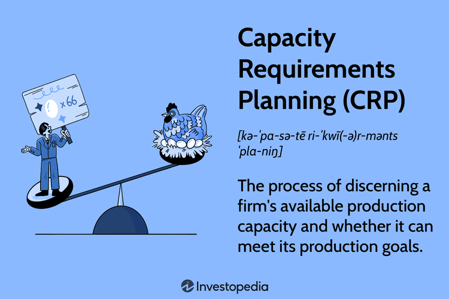

In today's dynamic business environment, balancing production capacity with demand is crucial for success. Capacity planning, especially through Capacity Requirements Planning (CRP), plays a pivotal role in ensuring that businesses can meet production goals efficiently. CRP assesses whether existing resources, including labor and machinery, can accommodate planned production levels. This process is essential for identifying potential bottlenecks and adjusting schedules to ensure smooth operations.

Besides CRP, production management and algorithmic trading also offer significant insights into enhancing business operations. Production management focuses on optimizing resource use, improving efficiency, and minimizing costs, thereby enhancing the overall productivity of manufacturing and service operations. Likewise, algorithmic trading utilizes complex algorithms to make data-driven decisions, optimizing financial market transactions efficiently. The methodologies of algorithmic trading—such as real-time data analysis, predictive modeling, and automated decision-making—can be applied to production management, particularly CRP.



This article explores how these seemingly disparate areas converge, underscoring their importance in contemporary business practices. We will examine the fundamentals of CRP, its role in production management, and how principles from algorithmic trading can be applied to improve CRP processes. This convergence highlights opportunities for businesses to leverage technology and analytics, optimizing operations and remaining competitive in an ever-changing market landscape. Whether through better resource allocation or more precise demand forecasting, the elements of CRP and algorithmic techniques provide compelling strategies for modern production management.

## Table of Contents

## Understanding Capacity Requirements Planning (CRP)

Capacity Requirements Planning (CRP) is a systematic approach utilized by companies to ascertain their ability to meet production targets with the resources currently available. This process centers on the comprehensive evaluation of the workload in relation to the accessible resources, including machinery, labor, and time. The primary objective of CRP is to ensure that production goals are aligned with the company's actual capacity, thereby facilitating efficient operations and preventing resource overload.

The CRP process involves several critical steps. Initially, the production targets for a given period are defined based on customer orders and market forecasts. These targets serve as the baseline for determining the workload. Following this, the available capacity is assessed by quantifying the resources that can be allocated towards meeting these targets. Capacity can be interpreted in terms of machinery availability, labor hours, and operational time frames.

One of the key functions of CRP is to identify bottlenecks in the production process. Bottlenecks occur when demand for a resource exceeds its capacity, leading to delays and inefficiencies. By pinpointing these problem areas, companies can make informed decisions regarding schedule adjustments or resource reallocations to ensure that customer demands are met without straining resources.

The structured evaluations conducted in CRP are crucial for aligning production goals with actual capacity. This alignment is often achieved through methods such as capacity smoothing and the use of finite capacity scheduling. Capacity smoothing involves leveling out the workload to ensure a consistent use of resources, while finite capacity scheduling creates production schedules that respect the limits of available resources.

Mathematically, the CRP process can involve calculations such as the following: if $C_{\text{total}}$ represents the total capacity available and $L_{\text{total}}$ denotes the total workload, then the capacity utilization ratio $U$ is given by:

$$
U = \frac{L_{\text{total}}}{C_{\text{total}}}
$$

A $U$ value below 1 indicates underutilization, whereas a value above 1 indicates overutilization, necessitating corrective action within the CRP framework.

Successfully implementing CRP requires the integration of quantitative methods and robust software tools, facilitating accurate workload assessments and capacity forecasting. These tools allow businesses to simulate various production scenarios and choose optimal paths that balance workloads with available capacity, ultimately enhancing production efficiency and meeting customer expectations effectively.

## CRP in Production Management

Capacity Requirements Planning (CRP) is crucial in production management as it allows organizations to optimize their resources effectively. By systematically assessing available production capacity against forecasted demands, CRP enables managers to align production objectives with actual capabilities, minimizing the risks of over- or under-utilization of resources.

### Forecasting and Alignment

CRP employs a methodical approach to predict production needs, aligning these needs with current capacity levels. This alignment prevents resource wastage by ensuring that equipment, labor, and materials are used efficiently. For instance, if the demand forecast indicates a requirement for increased production, CRP would guide the allocation of additional resources or adjustments in scheduling to meet this demand without overwhelming the existing capacity.

### Efficiency and Cost Reduction

A pivotal feature of CRP in production management is its impact on operational efficiency and cost reduction. By enabling precise capacity planning, CRP helps in avoiding unnecessary expenses associated with either idle resources or excessive overtime work. The meticulous planning facilitated by CRP leads to streamlined production processes, which can significantly enhance overall efficiency. Moreover, better capacity planning often results in improved product delivery schedules, ensuring that customer expectations are met promptly and consistently.

### Interdepartmental Communication and Cohesion

CRP also plays a fundamental role in bolstering communication across various departments within an organization. When capacity requirements are clearly defined and communicated, departments can synchronize their activities more effectively. For example, the production department can coordinate more closely with procurement, ensuring that materials are ordered just in time for production, reducing inventory costs. This interdepartmental cohesion fosters a unified organizational approach, where different functions work in harmony towards common production goals.

In summary, Capacity Requirements Planning is integral to production management, offering tools to forecast accurately, align capacity, enhance efficiency, cut costs, and improve interdepartmental collaboration. By implementing CRP, organizations can achieve a more agile and responsive production environment, better equipped to adapt to shifting market demands and operational challenges.

## Algorithmic Trading and Its Intersection with CRP

Algorithmic trading is a significant component of modern financial markets, utilizing automated systems that execute trades based on pre-defined criteria, including timing, price, and [volume](/wiki/volume-trading-strategy). These algorithmic systems are designed to take advantage of market conditions by executing orders at the most opportune moments, often faster and more efficiently than human traders. The core idea is to leverage computational power and data-driven strategies to enhance trading outcomes. 

Although [algorithmic trading](/wiki/algorithmic-trading) is primarily associated with financial markets, the underlying principles of algorithm-driven decision-making are increasingly being applied to production management, particularly in capacity requirements planning (CRP). CRP traditionally involves assessing the workload against available resources to ensure production targets are met without exceeding capacity limits. By integrating algorithms, CRP can become more dynamic and responsive.

One of the critical benefits of integrating algorithmic trading strategies into CRP is the ability to predict demand fluctuations more accurately. Algorithms can analyze historical data, current market trends, and external factors to forecast future demand, allowing businesses to adjust their production schedules accordingly. This predictive capability is essential for optimizing resource allocation and minimizing wasted capacity.

For instance, consider a manufacturing company that needs to determine its production schedule based on fluctuating market demands. By applying [machine learning](/wiki/machine-learning) algorithms, historical sales data can be analyzed to predict demand patterns. This would enable the company to align its production capacity with projected demand, thereby improving the efficiency of its operations and reducing the risk of overproduction or stockouts.

The integration of machine learning within CRP is exemplified by algorithms that not only forecast demand but also optimize the allocation of resources. For example, Python libraries such as scikit-learn can be employed to build predictive models:

```python
from sklearn.linear_model import LinearRegression
import numpy as np

# Sample historical data
# X: time periods, y: demand levels
X = np.array([[1], [2], [3], [4], [5]])
y = np.array([100, 150, 200, 250, 300])

# Create and train the model
model = LinearRegression().fit(X, y)

# Predict future demand
future_time_period = np.array([[6]])
predicted_demand = model.predict(future_time_period)

print(f"Predicted demand for time period 6: {predicted_demand[0]}")
```

This example illustrates how a simple linear regression model can be applied to predict future demand based on historical data. Such predictive models improve the accuracy of production forecasts, enabling more efficient and cost-effective resource use.

Furthermore, algorithmic strategies allow for real-time data analysis, providing CRP systems with the agility to adapt to changing conditions. This responsiveness is crucial for maintaining operational efficiency amid volatile markets. By continuously updating production forecasts, businesses can better balance supply and demand, thus maximizing resource utilization and customer satisfaction.

In summary, the intersection of algorithmic trading techniques and CRP represents a significant advancement in production management. By embracing these technologies, businesses can optimize their operations, reduce excess inventory, and align production more closely with actual market demands.

## Benefits of Integrating CRP with Algo Trading Strategies

Integrating Capacity Requirements Planning (CRP) with algorithmic trading strategies presents several benefits, particularly in resource management and operational efficiency. The use of automated data analysis forms the backbone of this integration, allowing businesses to make real-time production adjustments that align closely with shifting market demands. This synchronization helps companies maintain a balance between supply and demand, minimizing the discrepancies that often lead to inefficient resource allocation.

The integration benefits further from predictive analytics derived from algorithmic trading models. These models are designed to forecast market trends by analyzing vast datasets, which can also be applied to CRP. This predictive capability aids in optimizing production schedules, thereby reducing the risks associated with overproduction and underproduction. By ensuring that production capacity is neither underutilized nor overstretched, businesses can maintain optimal inventory levels and reduce wastage.

Such integration leads to enhanced business agility, a critical [factor](/wiki/factor-investing) in today's rapidly changing markets. The ability to swiftly adapt to market conditions ensures that businesses can maintain competitive advantage. This agility is achieved through the constant updating of production plans based on real-time analytics, facilitating immediate response to unexpected demand fluctuations.

For example, consider a manufacturer using Python for algorithmic predictions. By employing libraries like `pandas` and `scikit-learn`, businesses can process and analyze historical demand data to anticipate future trends. A sample code snippet to achieve this might look like:

```python
import pandas as pd
from sklearn.model_selection import train_test_split
from sklearn.ensemble import RandomForestRegressor

# Load historical demand data
data = pd.read_csv('demand_data.csv')

# Features and target variable
X = data.drop('future_demand', axis=1)
y = data['future_demand']

# Train-test split
X_train, X_test, y_train, y_test = train_test_split(X, y, test_size=0.2, random_state=42)

# Model training
model = RandomForestRegressor(n_estimators=100, random_state=42)
model.fit(X_train, y_train)

# Make predictions
predictions = model.predict(X_test)

```

This code illustrates how predictive analytics can be practically applied to enhance CRP by feeding accurate forecasts into production planning systems. Such innovations facilitate not only immediate, data-driven decision-making but also long-term strategic planning, solidifying the role of technology integration in modern business practices.

## Challenges and Solutions

Integrating Capacity Requirements Planning (CRP) with algorithmic trading strategies presents several challenges, notably in data management and system interoperability. The convergence of these systems requires a cohesive infrastructure capable of handling vast amounts of data swiftly and accurately. The sheer volume and velocity of data necessitate advanced IT solutions that can maintain consistent performance and reliability. Businesses can address these challenges by investing in cutting-edge IT infrastructure and comprehensive training for staff. This will help streamline data processes, enabling real-time data analytics and decision-making.

Another critical aspect is ensuring data accuracy. As CRP and algorithmic trading systems rely heavily on data-driven insights, any discrepancies can lead to suboptimal decisions, affecting production efficiency and market responsiveness. To mitigate this risk, companies must establish robust quality control measures and perform regular system updates. These steps are essential to uphold data integrity, ensuring that all insights and predictions are based on the most accurate and current information available.

Despite these challenges, integrating CRP with algorithmic trading provides strategic advantages, such as enhanced resource management and greater operational efficiency. Businesses are encouraged to embrace innovative solutions, which can significantly optimize production schedules and improve alignment with market demands. Investing in this integration can improve business agility, paving the way for more responsive and adaptable operations in a constantly changing market landscape.

## Conclusion

Capacity Requirements Planning (CRP), when integrated with the principles of algorithmic trading, provides a revolutionary framework for optimizing production management. This integration addresses the complexities and dynamic nature of modern markets by leveraging robust algorithmic strategies to streamline operations. As markets continue to evolve, the alignment of CRP with algorithmic strategies gains increasing importance. This convergence allows businesses to adapt to rapid market fluctuations and demand shifts efficiently.

By embracing these advanced technologies, companies can significantly improve their agility. Algorithmic models paired with CRP enable precise predictions of demand, allowing businesses to adjust their production schedules and resource allocation proactively. This proactive approach not only optimizes resource utilization but also ensures that companies can meet customer demands more satisfactorily and promptly.

For companies aiming to maintain a competitive edge, exploring the integration of CRP with algorithmic trading strategies is crucial. This integration fosters an environment of continuous improvement and innovation, equipping companies to navigate the complexities of the contemporary economic landscape. Implementing such a synergistic approach can lead to enhanced operational efficiency, reduced costs, and improved responsiveness to market changes, ultimately contributing to sustained business success.

## About the Author

This article was crafted by a seasoned expert in production management and financial technologies with a wealth of experience spanning several industries. The author's expertise lies at the intersection of Capacity Requirements Planning (CRP) and algorithmic trading, bringing a fresh perspective that bridges operational dynamics and financial insights. Throughout their career, they have contributed to the advancement of capacity planning strategies, incorporating cutting-edge technologies and data analytics to optimize production efficiency. Their work continuously influences best practices, providing strategic guidance that enhances organizational agility and resource management. By leveraging their deep understanding of both production systems and algorithmic techniques, the author helps businesses adapt to changing market conditions with precision and foresight.

## References & Further Reading

[1]: Vollmann, T. E., Berry, W. L., Whybark, D. C., & Jacobs, F. R. (2005). ["Manufacturing Planning and Control for Supply Chain Management"](https://www.mhebooklibrary.com/doi/book/10.1036/9780071750325). McGraw-Hill Education.

[2]: Pinedo, M. L. (2016). ["Scheduling: Theory, Algorithms, and Systems"](https://link.springer.com/book/10.1007/978-3-031-05921-6). Springer.

[3]: Silver, E. A., Pyke, D. F., & Thomas, D. J. (2016). ["Inventory and Production Management in Supply Chains"](https://www.taylorfrancis.com/books/mono/10.1201/9781315374406/inventory-production-management-supply-chains-edward-silver-david-pyke-douglas-thomas). CRC Press.

[4]: Lopez de Prado, M. (2018). ["Advances in Financial Machine Learning"](https://www.amazon.com/Advances-Financial-Machine-Learning-Marcos/dp/1119482089). Wiley.

[5]: Jansen, S. (2020). ["Machine Learning for Algorithmic Trading: Predictive models to extract signals from market and alternative data for systematic trading strategies with Python"](https://www.amazon.com/Machine-Learning-Algorithmic-Trading-alternative/dp/1839217715). Packt Publishing.

[6]: Chan, E. P. (2009). ["Quantitative Trading: How to Build Your Own Algorithmic Trading Business"](https://github.com/ftvision/quant_trading_echan_book). Wiley Trading.

[7]: Heizer, J., Render, B., & Munson, C. (2013). ["Operations Management: Sustainability and Supply Chain Management"](https://www.pearson.com/en-us/subject-catalog/p/operations-management-sustainability-and-supply-chain-management/P200000007031/9780137649136). Pearson.