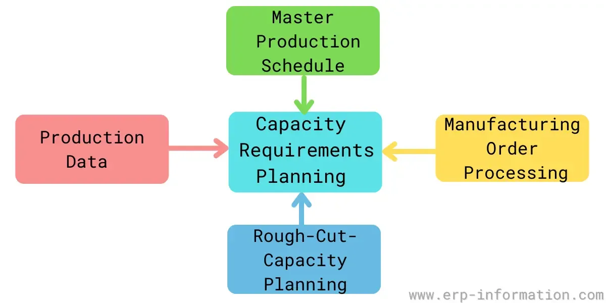

## Table of Contents

## What is Capacity Requirements Planning (CRP)?

Capacity Requirements Planning (CRP) is a process used in manufacturing to make sure a company can meet the demand for its products. It looks at how much work needs to be done and checks if the company has enough resources, like machines and workers, to do that work on time. By doing CRP, a company can find out if it needs to add more resources or change its plans to meet customer needs.

CRP is important because it helps avoid problems like delays in production or not being able to deliver products on time. It involves looking at the production schedule and comparing it with the available capacity. If there is a mismatch, the company can take action, such as hiring more workers, buying new equipment, or adjusting the production schedule. This planning helps keep customers happy and the business running smoothly.

## Why is Capacity Requirements Planning important for businesses?

Capacity Requirements Planning is important for businesses because it helps them make sure they can produce enough products to meet customer demand. By planning ahead, a company can see if it has enough machines, workers, and time to make all the products it needs to. If there's not enough capacity, the business can take steps like hiring more people or buying new equipment to fix the problem before it affects customers.

This planning also helps businesses avoid delays and keep their promises to customers. When a company can deliver products on time, it builds trust and keeps customers happy. Without good capacity planning, a business might face problems like late deliveries, which can lead to losing customers and hurting the company's reputation. So, by using Capacity Requirements Planning, a business can run more smoothly and be more successful.

## What are the basic steps involved in Capacity Requirements Planning?

The first step in Capacity Requirements Planning is to look at the production schedule. This means figuring out how many products need to be made and when they need to be finished. Then, the company checks its current resources, like machines and workers, to see if it can meet that schedule. This involves looking at how much each machine can produce and how many hours workers can work.

Next, the company compares the production schedule with the available capacity. If there's a gap, meaning the company can't make enough products on time, it needs to find a solution. This could mean hiring more workers, buying new equipment, or changing the production schedule to spread the work out more evenly. The goal is to make sure the company can meet customer demand without delays.

By following these steps, a business can plan ahead and avoid problems. It helps keep everything running smoothly and makes sure customers get their products on time. Good capacity planning is key to keeping a business successful and customers happy.

## How does Capacity Requirements Planning differ from Material Requirements Planning (MRP)?

Capacity Requirements Planning (CRP) and Material Requirements Planning (MRP) are both important for managing production in a business, but they focus on different things. CRP is all about making sure a company has enough resources, like machines and workers, to meet the production schedule. It looks at how much work needs to be done and checks if the company can do it on time with what it has. If there's not enough capacity, the company might need to hire more people or buy new equipment.

On the other hand, MRP is focused on making sure a company has all the materials it needs to make its products. It looks at the production schedule and figures out what materials are needed, when they are needed, and how much is needed. MRP helps make sure the right materials are in the right place at the right time, so production can keep going without running out of anything important.

In simple terms, CRP is about having enough people and machines to do the work, while MRP is about having enough materials to make the products. Both are important for a smooth production process, but they deal with different parts of it.

## What are the key components of a Capacity Requirements Planning system?

The key components of a Capacity Requirements Planning system include the production schedule, resource availability, and capacity analysis. The production schedule is a detailed plan that shows how many products need to be made and when they need to be finished. Resource availability means knowing how many machines and workers the company has and how much they can do. Capacity analysis involves comparing the production schedule with the available resources to see if the company can meet its goals.

If there's a gap between what needs to be done and what the company can do, the system helps find solutions. This could mean hiring more workers, buying new equipment, or changing the production schedule to spread out the work. By using these components, a company can plan ahead and make sure it has enough capacity to meet customer demand without delays. This keeps the business running smoothly and customers happy.

## How can a company assess its current capacity?

To assess its current capacity, a company needs to look at how much work its machines and workers can do. This means checking how many hours each machine can run and how many hours workers can work. The company also needs to know how fast each machine can make products and how many products workers can finish in a day. By adding up all this information, the company can figure out its total capacity.

Once the company knows its total capacity, it can compare this with the production schedule. The production schedule shows how many products need to be made and when they need to be finished. If the total capacity is enough to meet the schedule, the company is in good shape. But if the capacity is not enough, the company needs to find ways to increase it, like hiring more workers or buying new machines. This helps the company make sure it can meet customer demand without delays.

## What are the common methods used to measure capacity in manufacturing?

To measure capacity in manufacturing, companies often use two main methods: machine capacity and labor capacity. Machine capacity looks at how many products a machine can make in a certain amount of time. This means checking how fast the machine works and how many hours it can run each day. For example, if a machine can make 100 parts per hour and runs for 8 hours a day, its daily capacity is 800 parts. By knowing this, a company can figure out how many machines it needs to meet its production goals.

Labor capacity is about how much work the workers can do. This involves looking at how many hours workers can work each day and how many products they can finish in that time. For instance, if a worker can assemble 50 units in an 8-hour shift, the daily labor capacity for that worker is 50 units. By adding up the capacity of all workers, a company can see if it has enough people to meet the production schedule. Both machine and labor capacity are important for a company to plan its production and make sure it can meet customer demand.

## How do you forecast future capacity needs in Capacity Requirements Planning?

To forecast future capacity needs in Capacity Requirements Planning, a company looks at its sales forecasts and production plans. It starts by figuring out how many products it expects to sell in the future. This information comes from market research and past sales data. Then, the company uses this sales forecast to make a production plan, which shows how many products need to be made and when they need to be finished. By knowing the production plan, the company can estimate how much capacity it will need in the future.

Once the company has its production plan, it compares this with its current capacity. This means looking at how many machines and workers the company has now and how much they can produce. If the future production needs are more than what the current capacity can handle, the company needs to plan for more capacity. This could mean hiring more workers, buying new machines, or even expanding the factory. By forecasting future capacity needs, a company can make sure it's ready to meet customer demand without delays.

## What are the challenges faced when implementing Capacity Requirements Planning?

One of the main challenges when implementing Capacity Requirements Planning is getting accurate data. A company needs to know exactly how much its machines and workers can produce. If the data is wrong, the company might think it has enough capacity when it doesn't, or it might think it needs more capacity than it really does. This can lead to problems like buying too many machines or hiring too many workers, which costs a lot of money. It's important to keep the data up to date and correct to make good plans.

Another challenge is that things can change quickly in a business. For example, a big customer might suddenly want more products, or a machine might break down. These changes can mess up the capacity plans. The company needs to be able to change its plans quickly to deal with these surprises. This means having a flexible plan and being ready to adjust the production schedule or resources as needed. It takes good communication and teamwork to make sure everyone knows what's happening and can respond fast.

Lastly, getting everyone in the company to use the Capacity Requirements Planning system can be hard. Some people might not understand how it works or why it's important. They might keep doing things the old way, which can cause problems. The company needs to train its workers and show them how using the system can help them do their jobs better. It takes time and effort to make sure everyone is on board and using the system correctly.

## How can Capacity Requirements Planning be integrated with other business systems?

Capacity Requirements Planning can be integrated with other business systems like Enterprise Resource Planning (ERP) and Material Requirements Planning (MRP) to make a company run more smoothly. ERP systems help manage all parts of a business, like sales, finance, and human resources. By linking CRP with ERP, a company can see how much work it needs to do and make sure it has enough resources to do it. This helps the company plan better and avoid problems like running out of materials or not having enough workers. When CRP and ERP work together, the company can see the big picture and make smart decisions.

Another important system to integrate with CRP is MRP, which focuses on making sure the company has all the materials it needs for production. By connecting CRP and MRP, the company can see if it has enough machines and workers to use the materials on time. This helps avoid delays and keeps the production process running smoothly. When these systems work together, the company can make sure it has everything it needs to meet customer demand. Integrating CRP with other business systems helps a company plan better and keep everything running smoothly.

## What advanced techniques can be used to optimize capacity in complex manufacturing environments?

In complex manufacturing environments, one advanced technique to optimize capacity is using simulation software. This software creates a virtual model of the factory and lets you see how different changes might affect production. For example, you can test what would happen if you added more machines or changed the work schedule. By running these simulations, you can find the best way to use your resources without having to make real changes first. This helps save time and money and makes sure you're making the best decisions for your factory.

Another technique is using data analytics to predict future capacity needs. By looking at past production data and current trends, you can use algorithms to guess how much capacity you'll need in the future. This helps you plan ahead and make sure you have enough machines and workers to meet customer demand. Data analytics can also help you spot problems early, like machines that are breaking down often or parts of the production process that are slowing everything down. By fixing these issues, you can make your factory run more smoothly and use your capacity better.

## How can data analytics and machine learning enhance Capacity Requirements Planning processes?

Data analytics and [machine learning](/wiki/machine-learning) can make Capacity Requirements Planning a lot better by helping companies predict their future needs more accurately. By looking at past data, like how many products were made and how long it took, these tools can find patterns and trends. This means a company can guess how much capacity it will need in the future based on what happened before. For example, if sales usually go up in the summer, the company can use data analytics to plan for more machines and workers during that time. This helps avoid surprises and makes sure the company can meet customer demand without delays.

Machine learning can also help by finding small problems that might be hard for people to see. For instance, it can notice if a machine is slowing down over time or if one part of the production process is taking longer than it should. By spotting these issues early, the company can fix them before they cause big problems. This keeps the factory running smoothly and helps use capacity in the best way possible. Using data analytics and machine learning makes Capacity Requirements Planning smarter and more effective, helping companies plan better and keep their customers happy.

## What is Understanding Capacity Requirements Planning (CRP)?

Capacity Requirements Planning (CRP) is a systematic approach utilized by companies to ascertain their ability to meet production targets with the resources currently available. This process centers on the comprehensive evaluation of the workload in relation to the accessible resources, including machinery, labor, and time. The primary objective of CRP is to ensure that production goals are aligned with the company's actual capacity, thereby facilitating efficient operations and preventing resource overload.

The CRP process involves several critical steps. Initially, the production targets for a given period are defined based on customer orders and market forecasts. These targets serve as the baseline for determining the workload. Following this, the available capacity is assessed by quantifying the resources that can be allocated towards meeting these targets. Capacity can be interpreted in terms of machinery availability, labor hours, and operational time frames.

One of the key functions of CRP is to identify bottlenecks in the production process. Bottlenecks occur when demand for a resource exceeds its capacity, leading to delays and inefficiencies. By pinpointing these problem areas, companies can make informed decisions regarding schedule adjustments or resource reallocations to ensure that customer demands are met without straining resources.

The structured evaluations conducted in CRP are crucial for aligning production goals with actual capacity. This alignment is often achieved through methods such as capacity smoothing and the use of finite capacity scheduling. Capacity smoothing involves leveling out the workload to ensure a consistent use of resources, while finite capacity scheduling creates production schedules that respect the limits of available resources.

Mathematically, the CRP process can involve calculations such as the following: if $C_{\text{total}}$ represents the total capacity available and $L_{\text{total}}$ denotes the total workload, then the capacity utilization ratio $U$ is given by:

$$
U = \frac{L_{\text{total}}}{C_{\text{total}}}
$$

A $U$ value below 1 indicates underutilization, whereas a value above 1 indicates overutilization, necessitating corrective action within the CRP framework.

Successfully implementing CRP requires the integration of quantitative methods and robust software tools, facilitating accurate workload assessments and capacity forecasting. These tools allow businesses to simulate various production scenarios and choose optimal paths that balance workloads with available capacity, ultimately enhancing production efficiency and meeting customer expectations effectively.

## References & Further Reading

[1]: Vollmann, T. E., Berry, W. L., Whybark, D. C., & Jacobs, F. R. (2005). ["Manufacturing Planning and Control for Supply Chain Management"](https://www.mhebooklibrary.com/doi/book/10.1036/9780071750325). McGraw-Hill Education.

[2]: Pinedo, M. L. (2016). ["Scheduling: Theory, Algorithms, and Systems"](https://link.springer.com/book/10.1007/978-3-031-05921-6). Springer.

[3]: Silver, E. A., Pyke, D. F., & Thomas, D. J. (2016). ["Inventory and Production Management in Supply Chains"](https://www.taylorfrancis.com/books/mono/10.1201/9781315374406/inventory-production-management-supply-chains-edward-silver-david-pyke-douglas-thomas). CRC Press.

[4]: Lopez de Prado, M. (2018). ["Advances in Financial Machine Learning"](https://www.amazon.com/Advances-Financial-Machine-Learning-Marcos/dp/1119482089). Wiley.

[5]: Jansen, S. (2020). ["Machine Learning for Algorithmic Trading: Predictive models to extract signals from market and alternative data for systematic trading strategies with Python"](https://www.amazon.com/Machine-Learning-Algorithmic-Trading-alternative/dp/1839217715). Packt Publishing.

[6]: Chan, E. P. (2009). ["Quantitative Trading: How to Build Your Own Algorithmic Trading Business"](https://github.com/ftvision/quant_trading_echan_book). Wiley Trading.

[7]: Heizer, J., Render, B., & Munson, C. (2013). ["Operations Management: Sustainability and Supply Chain Management"](https://www.pearson.com/en-us/subject-catalog/p/operations-management-sustainability-and-supply-chain-management/P200000007031/9780137649136). Pearson.