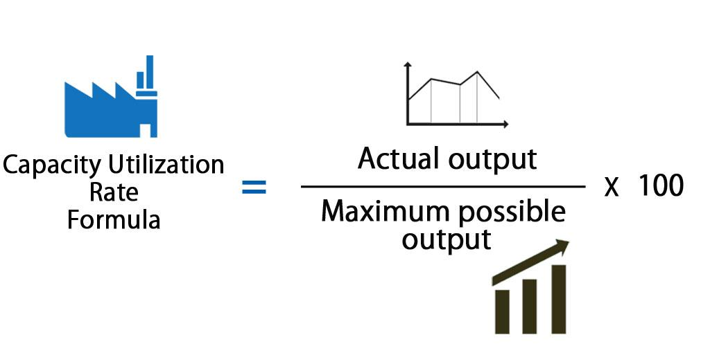

## Table of Contents

## What is the capacity utilization rate?

The capacity utilization rate is a measure that shows how much a company or a factory is using its resources compared to what it could use if it was working at full capacity. It's like figuring out how busy a factory is. If a factory can make 100 widgets a day but is only making 75, its capacity utilization rate is 75%.

This rate is important because it helps businesses understand if they are using their resources efficiently. If the rate is low, it might mean the company has too much equipment or space that it's not using. If the rate is high, it might mean the company is working close to its limits and might need to think about expanding or improving its processes.

## How is the capacity utilization rate calculated?

The capacity utilization rate is calculated by dividing the actual output by the potential output, and then multiplying the result by 100 to get a percentage. Actual output is what the company or factory is currently producing. Potential output is what the company or factory could produce if it was working at full capacity, using all its resources like machines, workers, and space.

For example, if a factory can make 200 cars a day but is only making 150 cars, the actual output is 150 cars and the potential output is 200 cars. To find the capacity utilization rate, you divide 150 by 200, which gives you 0.75. Then, you multiply 0.75 by 100 to get a percentage, which is 75%. So, the factory is using 75% of its capacity.

## Why is the capacity utilization rate important for businesses?

The capacity utilization rate is important for businesses because it tells them how well they are using their resources. If a business sees that its capacity utilization rate is low, it means they are not using their machines, workers, or space as much as they could. This can help the business decide if they need to find more work or if they have too much equipment or space that they are not using. It's like checking if you're using all the space in your backpack or if there's a lot of empty room.

On the other hand, if the capacity utilization rate is high, it means the business is working close to its limits. This can be good because it shows that the business is busy and making the most of what it has. But it can also mean that the business might need to think about expanding or finding ways to work more efficiently. It's like when your backpack is full and you need to either get a bigger one or pack things better to fit more in.

## What is considered a good capacity utilization rate?

A good capacity utilization rate can change depending on the type of business and the industry. Usually, a rate between 85% and 90% is seen as good. This means the business is using most of its resources but still has some room to grow or deal with unexpected problems.

If the rate is too low, like below 70%, it might mean the business has too much equipment or space that it's not using. This can be a problem because it means the business is spending money on things it doesn't need. On the other hand, if the rate is too high, like above 95%, it might mean the business is working too hard and might need to expand or find ways to work more efficiently.

## How does capacity utilization rate affect business profitability?

The capacity utilization rate can have a big effect on a business's profitability. When a business has a high capacity utilization rate, it means they are using their machines, workers, and space a lot. This can be good because it spreads out the costs of running the business over more products. For example, if a factory makes more cars, the cost of running the factory gets spread out over more cars, making each car cheaper to make. This can lead to higher profits if the business can sell all the extra products they make.

On the other hand, if the capacity utilization rate is too low, it means the business is not using its resources as much as it could. This can be bad for profits because the business is still paying for machines, workers, and space that it's not using. For example, if a factory only makes a few cars, the cost of running the factory gets spread out over fewer cars, making each car more expensive to make. This can lead to lower profits because the business might have to charge more for each product or sell fewer products.

## What are the factors that influence capacity utilization rate?

Several factors can influence the capacity utilization rate of a business. One big factor is demand for the products or services the business offers. If more people want to buy what the business is selling, the business will use more of its machines, workers, and space to meet that demand. This can push the capacity utilization rate higher. On the other hand, if fewer people want to buy what the business is selling, the business might not need to use all its resources, which can lower the capacity utilization rate.

Another factor is how well the business manages its resources. If the business has good ways to plan and organize its work, it can use its machines, workers, and space more efficiently. This can help keep the capacity utilization rate high even if demand stays the same. But if the business has problems with planning or organizing, it might not use its resources as well, which can lower the capacity utilization rate.

Lastly, external factors like economic conditions and industry trends can also affect the capacity utilization rate. During good economic times, businesses might see more demand for their products, which can increase their capacity utilization rate. But during tough economic times, demand might drop, leading to a lower capacity utilization rate. Also, if there are new technologies or changes in the industry, businesses might need to adjust how they use their resources, which can influence their capacity utilization rate.

## How can a business improve its capacity utilization rate?

A business can improve its capacity utilization rate by first understanding what's causing it to be low. If the business sees that not enough people are buying their products, they can try to increase demand. This can be done by marketing their products better, offering sales or discounts, or finding new customers. By getting more people to buy their products, the business can use its machines, workers, and space more, which can raise the capacity utilization rate.

Another way to improve the capacity utilization rate is by using resources more efficiently. This means the business should look at how it plans and organizes its work. If there are machines sitting idle or workers not having enough to do, the business can change its schedule or processes to make better use of these resources. For example, they might train workers to do different jobs or fix machines more often to keep them running smoothly. By using resources better, the business can make more products without needing to buy more machines or hire more workers, which can help increase the capacity utilization rate.

Lastly, businesses can also look at external factors that might be affecting their capacity utilization rate. If the economy is doing well, they might see more demand for their products naturally. But if the economy is struggling, the business might need to find ways to stand out from competitors or find new markets to sell to. Also, keeping up with new technologies or industry trends can help the business use its resources better and stay competitive, which can lead to a higher capacity utilization rate.

## What are the potential risks of operating at high capacity utilization rates?

When a business operates at a high capacity utilization rate, it can face some risks. One big risk is that if something goes wrong, like a machine breaking down or a worker getting sick, it can be hard to keep up with demand. Because the business is already working at almost full capacity, any small problem can cause big delays or even stop production completely. This can lead to unhappy customers and lost sales, which can hurt the business's reputation and profits.

Another risk is that working at high capacity all the time can wear out machines and tire out workers. Machines that are used a lot need more maintenance and might break down more often. Workers who are always busy might get stressed or tired, which can lead to more mistakes or even accidents. Both of these problems can cost the business money and time, and can make it harder to keep the high capacity utilization rate going in the long run.

## How does capacity utilization rate vary across different industries?

Capacity utilization rates can be different across industries because each industry has its own way of working and its own challenges. For example, manufacturing industries like car factories or steel mills often have high capacity utilization rates because they need to keep their big machines running to make a lot of products. These industries can reach rates of 80% or higher because they have a steady demand for their products and can plan their production well. On the other hand, service industries like restaurants or hotels might have lower capacity utilization rates. They can't always predict how many customers they will have, so they might not use all their tables or rooms all the time. Their rates might be around 60% to 70%.

Another factor that makes capacity utilization rates different across industries is how easy it is to change production levels. In industries like tech or software development, it can be easier to quickly increase or decrease the number of people working on a project. This means they can adjust their capacity utilization rates more easily, often keeping them between 70% and 80%. But in industries like mining or oil and gas, it's harder to change how much they produce because they need big equipment and a lot of planning. These industries might have capacity utilization rates that are either very high, like over 90%, when demand is strong, or very low, like below 50%, when demand drops.

## What role does capacity utilization play in economic cycles?

Capacity utilization plays a big part in economic cycles. When the economy is doing well, businesses often see more people wanting to buy their products. This means they use more of their machines, workers, and space to meet the demand. As a result, the capacity utilization rate goes up. When businesses are working at high capacity, they might hire more workers or invest in new equipment, which can help the economy grow even more. This is why high capacity utilization rates are often a sign that the economy is in a good phase, called an expansion.

On the other hand, when the economy is not doing so well, fewer people might want to buy things. Businesses then don't need to use all their resources, so the capacity utilization rate goes down. When businesses are working at low capacity, they might cut back on workers or delay buying new equipment, which can slow down the economy even more. This is why low capacity utilization rates can be a sign that the economy is in a tough phase, called a recession. By watching capacity utilization rates, economists can get a good idea of where the economy is in its cycle and what might happen next.

## How can advanced analytics be used to optimize capacity utilization?

Advanced analytics can help businesses figure out how to use their resources better by looking at a lot of data and finding patterns. For example, a business can use advanced analytics to see when their machines are most busy and when they are not. This helps them plan their work better so they can use their machines more often and keep their capacity utilization rate high. Analytics can also help businesses predict how much people will want to buy their products in the future. By knowing this, they can make just the right amount of products, not too many and not too few, which helps them use their resources efficiently.

Another way advanced analytics can help is by finding problems in how the business works. For example, if workers are waiting a lot because machines are slow, analytics can spot this and suggest ways to fix it, like buying faster machines or changing how work is done. This can make the business run smoother and use its resources better. By using advanced analytics, businesses can keep their capacity utilization rate at a good level, which can help them make more money and be more successful.

## What are the long-term strategic implications of capacity utilization rate management?

Managing the capacity utilization rate well can help a business stay healthy and grow over time. If a business keeps its capacity utilization rate at a good level, it can make sure it is using its machines, workers, and space in the best way. This means the business can make more products without spending more money on new things. Over the long run, this can lead to higher profits because the business is working efficiently. It also helps the business be ready for changes in how many people want to buy their products. If demand goes up, the business can handle it without needing to buy a lot of new equipment right away. If demand goes down, the business can still keep running without losing too much money.

But if a business doesn't manage its capacity utilization rate well, it can face problems in the long run. If the rate is too low for a long time, the business might be spending money on things it doesn't need, like extra machines or space. This can hurt the business's profits and make it hard to grow. On the other hand, if the rate is too high for a long time, the business might wear out its machines and tire out its workers. This can lead to more breakdowns and mistakes, which can cost the business money and time. In the long run, good capacity utilization rate management helps a business stay strong and be ready for whatever comes next.

## What is the Role of Capacity Utilization in Operational Performance?

Capacity utilization is critical for assessing how effectively a company employs its available resources to produce goods and services. It serves as a key indicator of operational performance, reflecting the extent to which an organization leverage its capabilities efficiently. A high capacity utilization rate, often expressed as a percentage, indicates that a company is maximizing its resource use, leading to improved productivity and reduced idle periods. Conversely, low utilization suggests potential inefficiencies, such as unused equipment or workforce underemployment, which could result in increased operational costs and lower profit margins.

The capacity utilization rate can be calculated using the formula:

$$
\text{Capacity Utilization Rate} = \left( \frac{\text{Actual Output}}{\text{Potential Output}} \right) \times 100\%
$$

This ratio provides insights into how much of the potential output is being realized.

The impact of capacity utilization on operational performance is significant. When utilization rates are high, production costs are generally lower, as fixed costs are spread over a larger number of units. This economy of scale enhances competitive positioning by allowing companies to offer products at more competitive prices. Furthermore, higher utilization can result in shorter lead times due to more efficient processes, thereby increasing customer satisfaction and service levels.

Maintaining an equilibrium between capacity and demand is crucial to sustaining operational efficiency. Companies must ensure that production capabilities align closely with market demands to avoid the pitfalls of overcapacity, such as excessive inventory holding costs, or undercapacity, leading to unmet customer needs. Efficient capacity management requires accurate demand forecasting to predict future sales and adjust production schedules accordingly.

Several strategies can be employed to optimize capacity utilization:

1. **Demand Forecasting**: Implementing sophisticated forecasting tools helps anticipate market trends and adjust resource allocation accordingly. By predicting demand accurately, companies can plan their production levels to match customer needs without excessive stockpiling or resource wastage.

2. **Flexible Production Systems**: Adopting adaptable manufacturing processes allows businesses to easily switch between different products and volumes, catering to varying customer demands without significant downtime or cost.

3. **Capacity Planning**: Regularly evaluating and adjusting capacity plans ensures that production facilities are neither overburdened nor underutilized. This involves strategic decisions about when to add new equipment, hire additional staff, or scale back operations based on projected workloads.

By effectively managing these elements, companies can achieve optimal capacity utilization, leading to enhanced operational performance and a more agile response to market changes.

## References & Further Reading

[1]: Harreld, B., O'Reilly, C., & Tushman, M. L. (2007). ["Dynamic Capabilities at IBM: Driving Strategy into Action."](https://journals.sagepub.com/doi/abs/10.2307/41166404) Harvard Business Review.

[2]: "Advances in Financial Machine Learning" by Marcos Lopez de Prado. Published by John Wiley & Sons, 2018. [Available here](https://books.google.com/books/about/Advances_in_Financial_Machine_Learning.html?id=oU9KDwAAQBAJ).

[3]: Bank, J. (2019). "Introducing Algorithmic Trading." [Available here](https://www.semanticscholar.org/paper/ALGORITHMIC-TRADING%3A-A-COMPREHENSIVE-REVIEW-OF-AND-Garg/94ead853e1835e7caae78d080e8b0e2f5f504607) Coursera.

[4]: Chan, E. P. (2008). "Quantitative Trading: How to Build Your Own Algorithmic Trading Business." [Available here](https://github.com/ftvision/quant_trading_echan_book) John Wiley & Sons.

[5]: Bertsimas, D., & Kallus, N. (2020). ["From Predictive to Prescriptive Analytics."](https://arxiv.org/abs/1402.5481) Management Science, 66(3), 1025-1044.

[6]: "Machine Learning for Algorithmic Trading" by Stefan Jansen. Published by Packt Publishing, 2020. [Available here](https://github.com/stefan-jansen/machine-learning-for-trading).

[7]: Aronson, D. (2006). "Evidence-Based Technical Analysis: Applying the Scientific Method and Statistical Inference to Trading Signals." [Available here](https://www.amazon.com/Evidence-Based-Technical-Analysis-Scientific-Statistical/dp/0470008741) John Wiley & Sons.