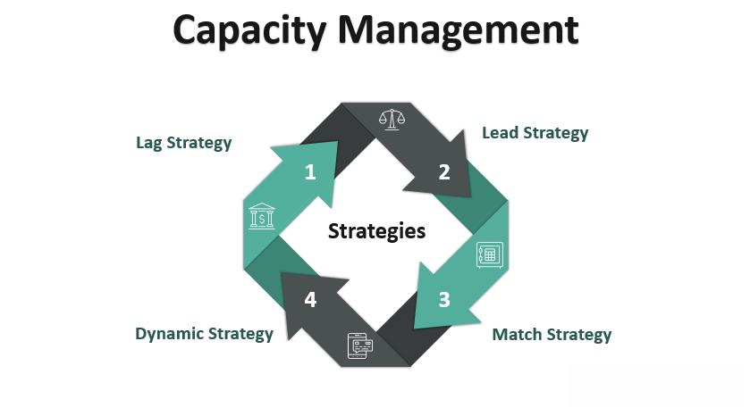

Algorithmic trading, commonly termed algo trading, employs sophisticated computer programs to conduct trades based on predefined strategies. This technological advancement has significantly transformed financial markets, enabling high-speed trading and mitigating emotional biases that often taint human decision-making. At the heart of algorithmic trading lies a crucial consideration: capacity. Capacity refers to a strategy's ability to manage larger trading volumes while maintaining optimal performance levels.

In this article, we examine the concept of capacity within the context of algorithmic trading, exploring its implications and outlining methods for optimizing strategic efficiency to maximize returns. To effectively grasp capacity, it is essential to understand the fundamentals of algorithmic trading and recognize how various strategies function under different market conditions.

Over recent decades, algorithmic trading has grown to become a dominant feature across global financial platforms. It accounts for a significant proportion of the trading volume in equities, forex, and futures markets. As trading activity intensifies, understanding capacity becomes increasingly pertinent for traders aiming to harness algorithmic strategies to their full potential.

Furthermore, this article aims to address the challenges posed by capacity limitations. It will also shed light on the techniques employed to manage these obstacles effectively. By doing so, traders can ensure that their algorithmic trading strategies remain both efficient and effective, even in the face of fluctuating market demands and conditions.

## Table of Contents

## Understanding Capacity in Algorithmic Trading

Capacity in [algorithmic trading](/wiki/algorithmic-trading) is a crucial concept, describing the maximum capital a strategy can process while maintaining its intended performance and profitability. Various factors determine this capacity, including market [liquidity](/wiki/liquidity-risk-premium), strategy type, and execution speed. Each of these factors can significantly affect how much [volume](/wiki/volume-trading-strategy) a strategy can handle before performance begins to degrade.

Market liquidity plays a significant role in capacity. It refers to the ability to quickly buy or sell assets without causing drastic price changes. When liquidity is high, large orders can be executed with minimal impact on the price, enhancing the capacity of an algorithmic strategy. Conversely, in low-liquidity environments, executing large trades can cause notable market disruptions, thus constraining capacity.

The type of strategy employed also influences capacity. High-frequency trading ([HFT](/wiki/high-frequency-trading-strategies)) strategies are particularly sensitive to capacity constraints. These strategies rely heavily on the speed of execution and the detailed structure of the market, known as microstructure. As HFT strategies need to place numerous trades in short timeframes, they can quickly exhaust capacity limits due to market impact or latency issues.

Execution speed is another pivotal element impacting capacity. Faster execution helps minimize market impact by allowing trades to be completed before market conditions change. However, this speed is often bound by technological limitations and network latency, which can restrict the volume a strategy can handle efficiently.

Understanding and measuring capacity are fundamental for traders to prevent negative outcomes associated with overloading a strategy. Exceeding a strategy's capacity can lead to negative returns, as the performance may deteriorate when the trading volume surpasses what the strategy can optimally manage. This scenario often results in diminishing returns, where the profitability per trade decreases as the trading volume increases. Consequently, careful evaluation and continuous monitoring of capacity are essential to maintaining the efficacy and profitability of trading strategies.

## Factors Affecting Capacity

Several factors can significantly impact the capacity of an algorithmic trading strategy. Understanding these factors is essential for traders to optimize performance and maintain efficiency.

1. **Market Liquidity**: Market liquidity refers to the ease with which an asset can be bought or sold in the market without affecting its price. High liquidity implies a large number of buyers and sellers, enabling trades to be executed swiftly and with minimal price disruption. In contrast, low liquidity can lead to higher market impact costs, where sizable orders may cause significant price movements detrimental to optimal trade execution.

2. **Execution Speed**: Execution speed is crucial for minimizing market impact and improving trade outcomes. High-frequency trading strategies particularly benefit from rapid execution, as delays can affect profitability due to price changes in the interim. However, execution speed can be hampered by technological limitations such as computational delays and network latency. Implementing advanced technologies and infrastructure is necessary to achieve the desired execution speeds and support high-capacity trading.

3. **Strategy Complexity**: The complexity of trading algorithms can also affect their capacity. Simpler algorithms are generally easier to implement and require fewer computational resources, potentially supporting higher capacity. Conversely, complex strategies with extensive data processing, multiple asset evaluations, and intricate decision trees may struggle under high volume, limiting capacity. Balancing complexity with performance needs is a strategic decision that can influence trading success.

4. **Asset Volatility**: Volatility is the rate at which the price of an asset increases or decreases for a given set of returns. High asset volatility can negatively impact the efficiency of order executions due to unpredictable price changes. This unpredictability raises the risk of slippage, where the executed price differs from the expected price, reducing the capacity of the strategy. Managing volatility through hedging and other risk management techniques can help maintain capacity.

5. **Transaction Costs**: Transaction costs include all expenses related to executing trades, such as brokerage fees, bid-ask spreads, and taxes. High transaction costs reduce the net returns on trades, thereby limiting the profitability and capacity of executing large volumes. To optimize capacity, it is necessary to reduce these costs through strategic venue selection, negotiating lower fees, and efficient order execution practices.

By addressing these factors, traders can better align their algorithmic trading strategies with market conditions, optimizing capacity and maximizing trading efficiency.

## Strategies for Maximizing Capacity

To maximize the capacity of algorithmic trading strategies, traders can employ several techniques designed to handle larger volumes effectively while minimizing market impact and operational risks. Here are some key strategies:

1. **Liquidity Seeking**: One of the primary methods to enhance capacity is the development of algorithms that specifically target liquid markets. These algorithms are capable of identifying and participating in markets with sufficient volume, thus reducing the potential for price disruption during trade execution. This approach requires a deep understanding of market microstructure and the ability to adapt to varying liquidity conditions across different trading venues.

2. **Order Splitting**: Also known as trade slicing, order splitting involves dividing large orders into smaller, more manageable pieces for execution. By doing so, traders can limit the market impact and reduce slippage, which refers to the difference between the expected price of a trade and the actual price at which the trade is executed. Algorithms employing this technique carefully monitor trade progress and adjust the pace of execution based on real-time market data.

3. **Adaptive Algorithms**: Designing algorithms that can dynamically adjust their parameters in response to market conditions is critical for maximizing capacity. These algorithms use real-time data to modify their trading signals and execution strategies. For instance, if market volatility increases, an adaptive algorithm might slow down execution or temporarily halt trading to avoid unfavorable price movements.

4. **Use of Dark Pools**: Dark pools are private, off-exchange trading venues that offer the advantage of executing large block trades with minimal market exposure. By leveraging dark pools, traders can reduce the visibility of their trades and minimize the price impact. This method is particularly beneficial for institutional traders who need to move substantial volumes without alerting the market.

5. **Backtesting and Simulation**: Comprehensive backtesting and simulation are essential to understand the capacity limits of a trading strategy under various market scenarios. By simulating trades using historical data, traders can evaluate how their algorithms would have performed in past market conditions. This practice not only helps in identifying potential capacity constraints but also provides insights for optimizing strategy parameters. Continuous testing and iteration ensure that the trading strategy remains robust and adaptable to market changes.

Employing these strategies effectively requires a combination of technological sophistication, market knowledge, and continuous strategy refinement. By adopting these techniques, traders can enhance their algorithmic trading capacity, thereby maintaining performance levels while executing larger trades in dynamic market environments.

## Challenges and Risks

Managing capacity in algorithmic trading involves navigating multiple challenges and risks, integral to maintaining strategy performance and profitability. 

1. Technological Failures: In algorithmic trading, technology forms the backbone of operations, facilitating the execution of complex trading algorithms at high speeds and volumes. However, this reliance brings potential vulnerabilities. System failures, software glitches, or connectivity disruptions can impede execution processes, sometimes leading to missed trading opportunities or unintended transactions. High-frequency trading, which demands rapid order execution, is particularly susceptible to latency issues and can suffer significant losses if technological problems arise unexpectedly.

2. Market Conditions: The dynamic nature of financial markets means conditions can shift rapidly due to unforeseen events or macroeconomic changes, potentially exceeding an algorithm's capacity limits. These shifts can result in liquidity shortages or heightened volatility, leading to increased slippage and deteriorating execution quality. Strategies optimized for specific conditions may falter under new circumstances, illustrating a need for adaptive algorithms capable of responding to real-time changes.

3. Over-Optimization: A prevalent risk in strategy development is overfitting—tailoring strategies too closely to historical data, which can result in models that perform well on past trends but falter in live markets. Over-optimization often leads to unrealistic expectations concerning a strategy's capacity, diminishing returns when deployed in variable market environments. Prudence dictates that strategies undergo rigorous backtesting with diverse scenarios to ascertain their robustness and flexibility.

4. Regulatory Compliance: Regulatory frameworks governing algorithmic trading are complex and vary across jurisdictions. Compliance is not merely a legal necessity but a risk mitigation tool. Failure to adhere to regulations can restrict a strategy's capacity, introducing risks of fines or trading halts. Adapting strategies to evolving regulatory demands requires ongoing monitoring and adjustments to trading algorithms, ensuring operations remain within legal confines while maintaining performance standards.

To address these challenges, effective risk management is crucial, involving robust infrastructure and contingency plans. Traders must implement systems capable of detecting and correcting technological errors swiftly and should frequently update algorithms to align with current market conditions. Additionally, continuous training and development for those involved can ensure adherence to best practices and regulatory standards, safeguarding the trading strategy's performance and capacity.

## Conclusion

Capacity is a vital consideration in the development and implementation of algorithmic trading strategies. It represents the maximum volume of trades that a strategy can handle efficiently and profitably. A well-understood and optimized capacity ensures traders can execute trades without detrimental impact on strategy performance. 

To achieve this, traders must evaluate and optimize key factors such as market liquidity, which influences how easily and at what cost trades can be executed. Execution speed is another critical [factor](/wiki/factor-investing); faster execution generally reduces market impact and slippage but may require sophisticated infrastructure. The design of the trading strategy itself also plays a crucial role, where simpler strategies may face fewer constraints compared to more complex ones that demand extensive computational resources.

Navigating the complexities of capacity in algorithmic trading necessitates continuous monitoring of strategy performance, along with iterative testing and adjustments. This dynamic approach enables traders to adapt to ever-changing market conditions and maintain efficient operations. Regular [backtesting](/wiki/backtesting) and simulation of strategies under varied market scenarios provide insights into capacity limits, guiding necessary adjustments. Furthermore, employing adaptive algorithms that can modify execution parameters based on real-time data ensures dynamic capacity management aligns with strategic goals. 

In conclusion, the effective management of capacity is essential to secure long-term success in the competitive landscape of financial markets. By systematically addressing capacity-related challenges, traders can bolster their strategies' resilience and adaptability, thereby enhancing overall trading efficacy.

## References & Further Reading

[1]: Marcos Lopez de Prado. ["Advances in Financial Machine Learning"](https://www.amazon.com/Advances-Financial-Machine-Learning-Marcos/dp/1119482089). Wiley, 2018.

[2]: Stefan Jansen. ["Machine Learning for Algorithmic Trading"](https://github.com/stefan-jansen/machine-learning-for-trading). Packt Publishing, 2020.

[3]: David Aronson. ["Evidence-Based Technical Analysis: Applying the Scientific Method and Statistical Inference to Trading Signals"](https://www.amazon.com/Evidence-Based-Technical-Analysis-Scientific-Statistical/dp/0470008741). Wiley, 2007.

[4]: Ernest P. Chan. ["Quantitative Trading: How to Build Your Own Algorithmic Trading Business"](https://www.amazon.com/Quantitative-Trading-Build-Algorithmic-Business/dp/0470284889). Wiley, 2008.

[5]: John Bergstra, Remi Bardenet, Yoshua Bengio, Balázs Kégl. ["Algorithms for Hyper-Parameter Optimization"](https://proceedings.neurips.cc/paper/2011/file/86e8f7ab32cfd12577bc2619bc635690-Paper.pdf). Advances in Neural Information Processing Systems 24, 2011.