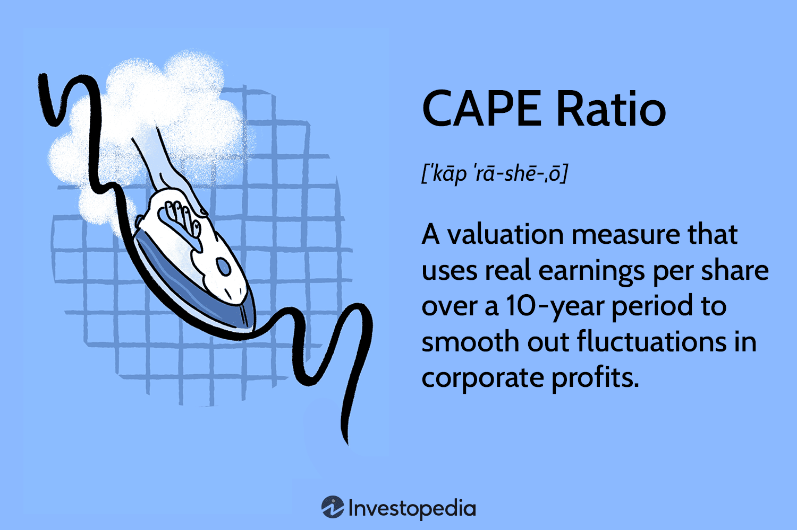

## Table of Contents

## What is the CAPE Ratio?

The CAPE Ratio, or Cyclically Adjusted Price-to-Earnings Ratio, is a way to measure how expensive or cheap the stock market is. It was created by economists Robert Shiller and John Campbell. The CAPE Ratio looks at the price of stocks compared to their earnings over the last 10 years. This helps smooth out the ups and downs of the economy and gives a better idea of the market's value over time.

Investors use the CAPE Ratio to see if stocks are a good buy or if they might be too expensive. A high CAPE Ratio might mean stocks are overpriced and could fall in value. A low CAPE Ratio might mean stocks are a good deal and could go up in value. The CAPE Ratio is especially useful for long-term investors who want to know if it's a good time to put money into the stock market.

## Who developed the CAPE Ratio and why?

The CAPE Ratio was developed by two economists, Robert Shiller and John Campbell. They wanted to create a better way to figure out if the stock market was priced too high or too low. They thought that looking at just one year's earnings could be misleading because earnings can go up and down a lot from year to year. So, they decided to use the average earnings from the past 10 years to get a smoother, more reliable picture of the market's value.

Shiller and Campbell introduced the CAPE Ratio because they believed it could help investors make smarter choices. By using a longer period of earnings, the CAPE Ratio helps to see through short-term ups and downs and focus on the bigger picture. This can be really useful for people who are planning to invest for many years and want to know if it's a good time to buy stocks.

## How is the CAPE Ratio calculated?

The CAPE Ratio is calculated by dividing the current price of a stock or an index by its average earnings over the past 10 years. First, you take the total earnings of the company or the index for each of the last 10 years. Then, you adjust these earnings for inflation to make sure you're comparing apples to apples. After adjusting for inflation, you find the average of these 10 years' earnings.

Once you have the average earnings, you divide the current market price of the stock or index by this average. The result is the CAPE Ratio. This ratio helps investors see if the market is expensive or cheap compared to its long-term earnings. A high CAPE Ratio might mean the market is overpriced, while a low CAPE Ratio might suggest it's a good time to buy.

## What is the difference between the CAPE Ratio and the traditional P/E Ratio?

The CAPE Ratio and the traditional P/E Ratio both help investors figure out if stocks are a good deal or too expensive, but they do it in different ways. The traditional P/E Ratio, or Price-to-Earnings Ratio, looks at the price of a stock compared to its earnings over just the last year. This can be helpful, but it can also be misleading because a company's earnings can change a lot from one year to the next.

The CAPE Ratio, on the other hand, uses the average earnings from the past 10 years, adjusted for inflation. This makes the CAPE Ratio a smoother measure that helps investors see the bigger picture over time. By using a longer period, the CAPE Ratio can give a better idea of whether the market is overvalued or undervalued, especially for long-term investors who are looking at the market's value over many years.

## Why is the CAPE Ratio also known as the Shiller P/E Ratio?

The CAPE Ratio is also known as the Shiller P/E Ratio because it was created by an economist named Robert Shiller. He worked with another economist, John Campbell, to come up with this way of measuring the stock market's value. They wanted to make it easier for people to see if stocks were a good buy or too expensive.

The reason it's called the Shiller P/E Ratio is to give credit to Robert Shiller for his work on it. This ratio uses the average earnings from the past 10 years, which makes it different from the regular P/E Ratio that only looks at one year's earnings. By using Shiller's name, it helps people remember who came up with this helpful tool for understanding the stock market.

## How can the CAPE Ratio be used to assess stock market valuations?

The CAPE Ratio helps people figure out if the stock market is a good deal or too pricey. It does this by looking at the price of stocks compared to their earnings over the last 10 years. When the CAPE Ratio is high, it means that the price of stocks is high compared to what companies have been [earning](/wiki/earning-announcement). This might mean the market is too expensive and could go down in the future. On the other hand, when the CAPE Ratio is low, it suggests that stocks are cheaper compared to their earnings. This could be a good time to buy stocks because they might go up in value.

Investors use the CAPE Ratio to make smarter choices about when to buy or sell stocks. For example, if someone sees that the CAPE Ratio is much higher than its average over many years, they might decide to wait before buying more stocks. They might think the market is too expensive and could drop. But if the CAPE Ratio is lower than usual, they might see it as a good time to invest because stocks could be a bargain. This makes the CAPE Ratio a useful tool for anyone who wants to understand if the stock market is a good place to put their money at any given time.

## What are considered typical values for the CAPE Ratio, and what do they indicate?

The CAPE Ratio usually has a long-term average around 16 or 17. This means that, over many years, the price of stocks has been about 16 or 17 times the average earnings from the past 10 years. When the CAPE Ratio is close to this number, it suggests that the stock market is fairly valued. Investors might see this as a normal time to buy or sell stocks, without expecting big changes in the market's value.

If the CAPE Ratio is a lot higher than 16 or 17, like above 25 or 30, it might mean that stocks are too expensive. This could be a warning sign that the market might go down in the future. On the other hand, if the CAPE Ratio is a lot lower than 16 or 17, like below 10, it could mean that stocks are a good deal. This might be a good time to buy stocks because they could go up in value later.

## Can the CAPE Ratio predict stock market crashes?

The CAPE Ratio can give a hint about the chances of a stock market crash, but it's not a perfect tool for predicting them. When the CAPE Ratio is very high, it might mean that stocks are too expensive and could fall in value. For example, right before big crashes like the one in 1929 or the dot-com bubble in 2000, the CAPE Ratio was much higher than its usual average. So, a high CAPE Ratio can be a warning sign that the market might be in for a rough time.

However, the CAPE Ratio alone can't tell you exactly when a crash will happen or how bad it will be. Other things like what's happening in the economy, what people are feeling about the market, and even big world events can also affect the stock market. So, while the CAPE Ratio is a helpful tool for long-term investors to see if the market is overpriced, it's just one piece of the puzzle and shouldn't be the only thing you look at when trying to guess if a crash is coming.

## How does the CAPE Ratio perform across different countries and markets?

The CAPE Ratio can be used to look at stock markets in different countries, but it works a bit differently in each place. In the United States, where the CAPE Ratio was first used, it has a long history of data that makes it easier to see patterns. But in other countries, especially those with newer stock markets or less data, the CAPE Ratio might not be as reliable. For example, in some emerging markets, the economy might be growing fast, so a higher CAPE Ratio might not mean the market is too expensive. It's important to think about each country's unique situation when using the CAPE Ratio.

Even though the CAPE Ratio can be helpful around the world, it's not perfect everywhere. In Japan, the CAPE Ratio has been high for a long time, but the market hasn't crashed like some people might expect. This shows that other things like how people feel about the market and what's happening in the economy can also matter a lot. So, while the CAPE Ratio can give you a good idea of whether stocks might be a good deal or too pricey in different countries, it's smart to use it along with other tools and information to get the full picture.

## What are the limitations and criticisms of using the CAPE Ratio?

The CAPE Ratio is helpful but it has some problems. One big issue is that it uses the last 10 years of earnings, which might not be the best way to look at today's market. For example, if there was a big economic downturn a few years ago, the earnings might be lower than usual, making the CAPE Ratio look higher than it should. Also, the CAPE Ratio doesn't change quickly enough to catch fast changes in the market. This means it might not be the best tool for people who want to make quick decisions about buying or selling stocks.

Another problem is that the CAPE Ratio can be different in different countries. What might be a normal CAPE Ratio in one country could mean the market is too expensive in another. This makes it hard to use the CAPE Ratio to compare markets around the world. Some people also say that the CAPE Ratio doesn't work as well in today's world because things like technology and globalization have changed how companies make money. So, while the CAPE Ratio can give a good idea of whether stocks might be a good deal or too pricey, it's not perfect and should be used with other tools to get a full picture of the market.

## How can investors incorporate the CAPE Ratio into their investment strategy?

Investors can use the CAPE Ratio to help decide when to buy or sell stocks. If the CAPE Ratio is a lot higher than its usual average, like above 25 or 30, it might mean that stocks are too expensive. This could be a good time to sell some stocks or wait before buying more. But if the CAPE Ratio is a lot lower than usual, like below 10, it might mean that stocks are a good deal. This could be a good time to buy stocks because they might go up in value later. By looking at the CAPE Ratio, investors can get a better idea of whether the market is a good place to put their money at any given time.

It's important for investors to not just look at the CAPE Ratio but also think about other things. The economy, how people feel about the market, and big world events can also affect stock prices. So, while the CAPE Ratio can be a helpful tool, it's just one piece of the puzzle. Investors should use it along with other information to make smart choices about their investments. This way, they can get a fuller picture of the market and make decisions that fit their long-term goals.

## What advanced statistical methods can enhance the predictive power of the CAPE Ratio?

To make the CAPE Ratio better at guessing what the stock market might do, people can use more advanced math methods. One way is to use regression analysis. This is a method that looks at how the CAPE Ratio and other things like how much people are spending or how the economy is doing might affect stock prices. By using regression, investors can see how important the CAPE Ratio is compared to other factors and make better guesses about where the market might go.

Another way to improve the CAPE Ratio is to use something called time series analysis. This method looks at how the CAPE Ratio changes over time and tries to find patterns. By understanding these patterns, investors can see if the CAPE Ratio is acting in a way that might mean the market will go up or down. Using time series analysis can help investors see the bigger picture and make smarter choices about when to buy or sell stocks.

## What is the CAPE Ratio and how can it be understood?

The CAPE Ratio, which stands for Cyclically Adjusted Price-to-Earnings Ratio, was popularized by Nobel laureate economist Robert Shiller as a tool to provide investors with a more integrative measure of stock market valuation. Unlike traditional P/E ratios that rely on trailing twelve months of earnings, the CAPE Ratio smooths out fluctuations by using the average of inflation-adjusted earnings over a ten-year span. This approach reduces the short-term noise and captures longer economic cycles, offering a more robust insight into the stock market's valuation.

Mathematically, the CAPE Ratio is calculated using the following formula:

$$
\text{CAPE Ratio} = \frac{\text{Current Market Price}}{\text{Average Inflation-Adjusted Earnings over 10 Years}}
$$

The CAPE Ratio provides valuable insights by accounting for the cyclical variations in corporate profits. During economic booms, corporate earnings can be unusually high, and during downturns, they may be uncharacteristically low. By averaging earnings over a decade, the CAPE Ratio offers a normalized view, allowing investors to discern whether the current stock prices are in line with historical earnings capacity.

One key insight the CAPE Ratio provides lies in its ability to signal potential overvaluation or undervaluation of markets. High CAPE values suggest that the market might be overvalued relative to its historical norm, implying potential lower future returns. Conversely, a low CAPE Ratio may indicate undervaluation, suggesting better prospective returns. However, despite its utility, the CAPE Ratio should not be used in isolation, as it fails to account for structural changes in the market, tax policies, or interest rates, which can substantially impact market dynamics.

In practical applications, the CAPE Ratio is embedded into investment strategies to guide asset allocation decisions, often advising caution during periods of high CAPE values and encouraging investment when the CAPE is low. Its historical effectiveness in signaling overpriced stock markets before major corrections has made the CAPE Ratio a respected tool among long-term investors.

## References & Further Reading

[1]: Shiller, R.J. (2000). ["Irrational Exuberance"](https://press.princeton.edu/books/paperback/9780691173122/irrational-exuberance). Princeton University Press.

[2]: Campbell, J.Y., & Shiller, R.J. (1988). ["The Dividend-Price Ratio and Expectations of Future Dividends and Discount Factors."](https://www.jstor.org/stable/2961997) National Bureau of Economic Research.

[3]: Siegel, J.J. (2016). ["The Shiller CAPE Ratio: A New Look."](https://www.tandfonline.com/doi/abs/10.2469/faj.v72.n3.1) CFA Institute Financial Analysts Journal.

[4]: ["A Quantitative Approach to Tactical Asset Allocation"](https://mebfaber.com/wp-content/uploads/2016/05/SSRN-id962461.pdf) by Meb Faber

[5]: Asness, C.S. (2000). ["Stocks vs. Bonds: Explaining the Equity Risk Premium."](https://www.aqr.com/-/media/AQR/Documents/Insights/Journal-Article/Stocks-Versus-Bonds-Explaining-the-Equity-Risk-Premium.pdf) Financial Analysts Journal.