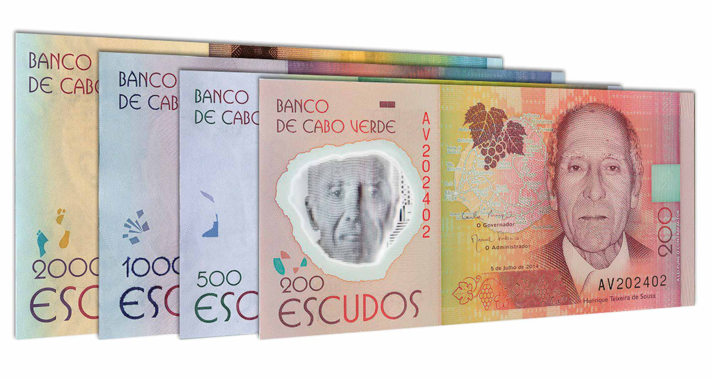

## Table of Contents

## What is the Cape Verdean Escudo?

The Cape Verdean Escudo is the official currency of Cape Verde, a country made up of islands off the coast of West Africa. It is abbreviated as CVE and symbolized as Esc or $. The currency is managed by the Bank of Cape Verde, which is the central bank of the country. The Escudo was introduced in 1914 when Cape Verde was still a Portuguese colony, replacing the Cape Verdean Real.

The Escudo is divided into 100 centavos, though coins in centavos are no longer used. Banknotes and coins are available in various denominations, with banknotes ranging from 200 to 5000 Escudos and coins from 1 to 100 Escudos. The currency is pegged to the Euro at a fixed rate, which helps stabilize its value. This means that the exchange rate between the Escudo and the Euro does not change, making it easier for Cape Verde to conduct trade with countries using the Euro.

## How is the Cape Verdean Escudo abbreviated?

The Cape Verdean Escudo is shortened to CVE. This is the official way to write it when talking about money in Cape Verde.

You might also see it written as Esc or $ when you are in Cape Verde. These symbols help people know they are dealing with Escudos.

## What is the exchange rate of the Cape Verdean Escudo to the US Dollar?

The exchange rate between the Cape Verdean Escudo and the US Dollar changes every day. It depends on many things like how much people want to buy or sell the currency and what's happening in the world's economy. You can find the most up-to-date rate on websites that track currency exchanges or by asking at a bank.

Right now, for example, you might need around 100 Cape Verdean Escudos to get 1 US Dollar. But remember, this number can go up or down. If you're planning to travel to Cape Verde or do business there, it's a good idea to check the rate before you go so you know how much your money is worth.

## Who issues the Cape Verdean Escudo?

The Cape Verdean Escudo is issued by the Bank of Cape Verde. This bank is like the boss of all the money in Cape Verde. It makes sure that there is enough money for people to use and that the money stays valuable.

The Bank of Cape Verde also decides how many Escudos should be made and when to make new ones. They do this to keep the economy of Cape Verde running smoothly. This means they help make sure that people can buy things and businesses can grow.

## What are the different denominations of the Cape Verdean Escudo?

The Cape Verdean Escudo comes in different amounts of money, called denominations. For paper money, you can find Escudos in 200, 500, 1000, 2000, and 5000. These are the big notes that people use to buy things that cost more money.

For coins, you can find them in 1, 5, 10, 20, 50, and 100 Escudos. These are the smaller amounts that people use for everyday things like buying a snack or paying for a bus ride. The coins and notes together help people in Cape Verde to buy all sorts of things they need.

## How stable is the Cape Verdean Escudo?

The Cape Verdean Escudo is quite stable because it is tied to the Euro. This means that the value of the Escudo does not change much compared to the Euro. When a country's money is tied to another country's money like this, it helps keep things steady. People in Cape Verde know that their money will stay about the same value, which makes it easier to plan and do business.

Even though the Escudo is stable compared to the Euro, it can still change a bit against other currencies like the US Dollar. This happens because the Euro itself can go up or down in value against other currencies. So, while the Escudo is generally stable, its value in other currencies might change a little bit from day to day.

## What role does the Cape Verdean Escudo play in the economy of Cabo Verde?

The Cape Verdean Escudo is really important for the economy of Cabo Verde. It's the money that people use to buy things and sell things. When people have Escudos, they can go to the store and get food, clothes, and other stuff they need. Businesses use Escudos to pay workers and to buy things they need to make their products. This helps the whole country's economy to work smoothly because everyone is using the same money.

The Escudo also helps Cabo Verde trade with other countries. Because the Escudo is tied to the Euro, it makes it easier for Cabo Verde to do business with countries that use the Euro. This connection makes the Escudo stable, which means people and businesses in Cabo Verde can plan better. They know their money won't change a lot in value, so they can save and spend without worrying too much about losing money because of changes in the Escudo's value.

## How does the economy of Cabo Verde benefit from tourism?

Tourism is a big help to the economy of Cabo Verde. When tourists come to visit, they spend money on hotels, food, and fun things to do. This means more jobs for people who work in these places, like hotel staff, restaurant workers, and tour guides. The money tourists spend also helps local businesses grow and makes more money for the country.

The government also gets money from tourism through taxes. This money can be used to make the country better, like building new roads or schools. When tourists enjoy their time in Cabo Verde, they tell their friends and family, which can bring even more visitors. This cycle helps the economy keep growing and gives more chances for people in Cabo Verde to have good jobs and a better life.

## What are the main industries contributing to the GDP of Cabo Verde?

The main industries that help make money for Cabo Verde are tourism, fishing, and farming. Tourism is really big because lots of people come to visit the beautiful beaches and islands. They spend money on hotels, food, and fun activities, which helps create jobs and brings in money for the country. Fishing is also important because the ocean around Cabo Verde has lots of fish. People catch fish and sell them, which adds to the money the country makes. Farming is another key industry, even though the land can be hard to farm on. People grow things like bananas, corn, and beans, which helps feed the people and also brings in some money.

Another important industry is services, which includes things like banking, transport, and communication. These services help the country run smoothly and make money too. The government also plays a role by getting money from taxes and using it to build things like roads and schools, which helps the economy grow. Overall, these industries together help make Cabo Verde's economy stronger and give people more chances to have good jobs and a better life.

## What are the major economic challenges faced by Cabo Verde?

Cabo Verde faces several big challenges with its economy. One big problem is that the country doesn't have a lot of natural resources. This means they have to buy things like food and fuel from other countries, which can be expensive. Also, the land is not easy to farm on, so growing enough food for everyone is hard. This makes the country rely a lot on tourism and fishing, but these can be affected by things like bad weather or fewer tourists coming.

Another challenge is that many young people in Cabo Verde want to leave to find better jobs in other countries. This can make it hard to keep the economy growing because there are fewer people to work and start new businesses. The government tries to help by making it easier for businesses to start and grow, but it's still a big problem. Also, the country's money is tied to the Euro, which can be good for stability but also means they have less control over their own economy.

## How does the government of Cabo Verde manage its fiscal policy?

The government of Cabo Verde works hard to manage its money wisely. They do this by deciding how much to spend and how much to save. This is called fiscal policy. They try to keep the country's money in good shape by making sure they don't spend more than they have. They also try to help the economy grow by spending money on things like building roads and schools. This can create jobs and make life better for people.

Sometimes, the government has to borrow money to pay for big projects or to help the economy during tough times. They are careful about how much they borrow because they need to pay it back later. They also collect taxes from people and businesses to get money. The government tries to set taxes in a way that helps the economy but also brings in enough money to run the country. By doing all these things, the government aims to keep the economy stable and help it grow.

## What are the future economic prospects for Cabo Verde and the role of the Escudo?

The future of Cabo Verde's economy looks promising but also challenging. The country is working hard to grow its tourism and fishing industries, which are big parts of its money-making. They also want to make it easier for new businesses to start and grow. This could bring more jobs and help the economy get stronger. But there are challenges too, like not having enough natural resources and many young people wanting to leave for better jobs elsewhere. The government is trying to solve these problems by investing in education and making the country a better place to live and work.

The Cape Verdean Escudo plays an important role in the future of the economy. Because it's tied to the Euro, it helps keep the country's money stable. This means businesses and people can plan better because they know their money won't change a lot in value. But it also means Cabo Verde has less control over its own money. The government needs to keep managing its money carefully, spending and saving in a way that helps the economy grow. By doing this, they can help make sure the Escudo stays strong and the economy keeps getting better.

## References & Further Reading

[1]: ["Advances in Financial Machine Learning"](https://www.amazon.com/Advances-Financial-Machine-Learning-Marcos/dp/1119482089) by Marcos Lopez de Prado

[2]: ["Quantitative Trading: How to Build Your Own Algorithmic Trading Business"](https://www.amazon.com/Quantitative-Trading-Build-Algorithmic-Business/dp/1119800064) by Ernest P. Chan

[3]: Bergstra, J., Bardenet, R., Bengio, Y., & Kégl, B. (2011). ["Algorithms for Hyper-Parameter Optimization."](https://dl.acm.org/doi/10.5555/2986459.2986743) Advances in Neural Information Processing Systems 24.

[4]: ["Evidence-Based Technical Analysis: Applying the Scientific Method and Statistical Inference to Trading Signals"](https://www.amazon.com/Evidence-Based-Technical-Analysis-Scientific-Statistical/dp/0470008741) by David Aronson

[5]: ["Machine Learning for Algorithmic Trading"](https://github.com/stefan-jansen/machine-learning-for-trading) by Stefan Jansen