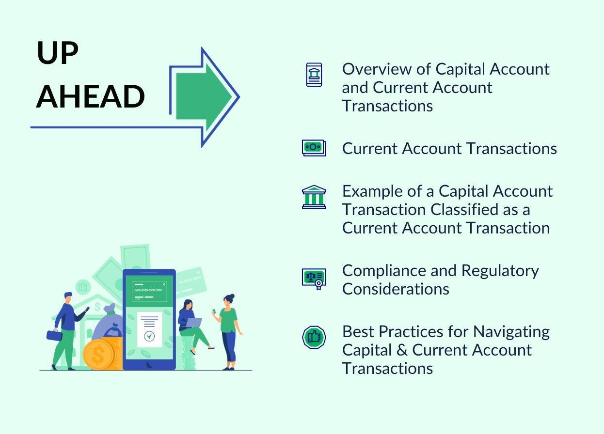

International finance is a pivotal area of study focused on the complexities of capital movement across national borders, the dynamics of fund transfers, and the execution and consequences of global economic policies. It plays a crucial role in understanding how economies interact, develop, and influence one another on a worldwide scale. Central to this field is the concept of the capital account, which serves as a critical ledger in a nation's balance of payments. The capital account meticulously tracks the flow of capital into and out of a country, offering a wealth of information regarding economic health, investment patterns, and cross-border financial interactions. These insights are invaluable for policymakers, investors, and economists who aim to gauge economic stability and predict future financial trends.

Simultaneously, the advent of algorithmic trading represents a significant innovation in international finance. Leveraging sophisticated algorithms and computational power, algorithmic trading is utilized to execute intricate trading strategies at speeds and accuracies unattainable by human traders. This technology is transforming how financial markets operate by increasing efficiency, reducing costs, and improving market liquidity. As markets continue to globalize, the use of algorithms in trading has become indispensable, especially for managing currency exchange risks and optimizing the timing of transactions.



This article endeavors to elucidate the economic ramifications of the capital account, the burgeoning role of algorithmic trading in contemporary finance, and the manner in which these components are interlinked across the global economic landscape. Such an exploration is vital for understanding the evolving mechanisms of international finance and the future trajectory of economic growth and development on a world scale.

## Table of Contents

## Understanding the Capital Account

The capital account is a fundamental component of a nation's balance of payments, which encompasses the systematized record of all economic transactions conducted between residents of a country and the rest of the world within a given period. Specifically, the capital account details transactions involving the transfer of financial capital, as well as the sales and acquisitions of non-produced, non-financial assets, such as land or natural resources.

These transactions are indicative of the broader economic activities and investments occurring within a nation, serving as a crucial measure of economic health and policy impact. For instance, changes in the capital account can wield substantial influence over a country's monetary policies. An influx of capital might lead to currency appreciation, which could, in turn, impact export competitiveness. Conversely, an outflow might lead to currency depreciation, potentially inciting inflationary pressures.

Analyzing whether a country holds a surplus or deficit in the capital account is instructive in understanding its financial positioning. A capital account surplus suggests that the nation is attracting more investment than it is investing abroad, often underscoring economic stability and investor confidence. This situation can be mathematically represented as:

$$
\text{Capital Account Surplus} = \text{Capital Inflows} - \text{Capital Outflows} > 0
$$

In contrast, a capital account deficit signifies that a country is investing more abroad than it is receiving in external investments. While this situation could indicate economic strain, it may also reflect strategic investments in foreign assets, which could yield benefits in the long term. The equation for a capital account deficit is:

$$
\text{Capital Account Deficit} = \text{Capital Inflows} - \text{Capital Outflows} < 0
$$

These dynamics are pivotal in determining a country's status as a net importer or exporter of capital. If a nation consistently records a capital account surplus, it is likely a net importer of capital, attracting more foreign investment than it sends out. Conversely, a persistent capital account deficit would imply that the country is a net exporter of capital, channeling resources to international markets, potentially for greater returns or expansion of economic influence.

In summary, the capital account serves as an essential analytical tool for gauging a country's economic interactions, offering insights into its financial stability and the potential impacts of its monetary policies.

## Economic Significance of the Capital Account

The capital account is an essential indicator of a country's economic stability and its appeal to foreign investors. By tracking the inflow and outflow of financial capital, this account provides a clear picture of a nation's economic health and investment climate. A surplus in the capital account typically signifies an influx of foreign investment, which often points towards a robust and growing economy. This influx may be in the form of foreign direct investment (FDI), portfolio investments, or other capital flows that enhance a country's financial resources. The increased capital can lead to higher economic growth, as these funds are often used for infrastructure projects, business expansion, and other developmental initiatives that contribute to an overall stronger economy.

Conversely, a deficit in the capital account can suggest economic challenges. It may indicate that a country is investing heavily in foreign assets, which could be a strategy to achieve higher returns on investment or to hedge against domestic economic uncertainties. While a deficit might raise concerns about capital flight, it also reflects strategic international engagement and diversifying investment profiles by resident investors. The ability to invest abroad can also enhance a nation's economic prospects by tapping into global growth opportunities and mitigating domestic market risks.

To assess future economic growth and development opportunities, understanding capital flows is crucial. Analysts and policymakers study patterns and magnitude of these flows to forecast economic trends and make informed decisions. For example, consistent capital account surpluses might lead to appreciation pressures on the domestic currency, impacting export competitiveness. On the other hand, persistent deficits could necessitate measures to attract foreign investment or improve economic conditions to retain domestic capital.

In summary, the capital account serves as a barometer for a country's economic stability and investment allure. Its surplus or deficit states reveal important information about foreign investments, national financial strategies, and potential economic pathways, making it a vital component for assessing national and international financial dynamics.

## Role of Algorithmic Trading in International Finance

Algorithmic trading employs sophisticated algorithms to execute orders based on predetermined criteria, enabling transactions at speeds and accuracies that surpass human capabilities. This approach to trading leverages advanced computational techniques to process vast datasets, identify trading opportunities, and execute trades with minimal latency.

One of the primary advantages of [algorithmic trading](/wiki/algorithmic-trading) is its ability to react swiftly to market dynamics. By automating the trading process, algorithms can execute large volumes of trades while maintaining low transaction costs, thereby enhancing overall market [liquidity](/wiki/liquidity-risk-premium). The precision and speed provided by algorithmic trading significantly reduce the bid-ask spread and improve price efficiency in financial markets.

In international finance, algorithmic trading plays a pivotal role by facilitating and optimizing cross-border transactions. It is instrumental in managing currency exchange risks, which are a significant concern for international investors dealing with multiple currencies. Algorithms can be programmed to monitor [forex](/wiki/forex-system) markets continuously, execute trades when certain criteria are met, and hedge against unfavorable currency movements, thereby reducing exposure to exchange rate [volatility](/wiki/volatility-trading-strategies).

The integration of [machine learning](/wiki/machine-learning) and [artificial intelligence](/wiki/ai-artificial-intelligence) into algorithmic trading systems further enhances their ability to predict market trends and make informed decisions. These sophisticated algorithms analyze historical data, recognize patterns, and adjust trading strategies accordingly. For example, machine learning models can forecast asset price movements or detect anomalies that may indicate potential market shifts.

The following Python code snippet illustrates a simple example of an algorithmic trading strategy using moving averages to identify buy and sell signals:

```python
import pandas as pd
import numpy as np

# Sample data: stock prices
data = {'prices': [100, 102, 105, 108, 107, 105, 106, 108, 110, 112]}
df = pd.DataFrame(data)

# Calculate moving averages
short_window = 3
long_window = 5
df['short_mavg'] = df['prices'].rolling(window=short_window).mean()
df['long_mavg'] = df['prices'].rolling(window=long_window).mean()

# Generate signals
df['signal'] = np.where(df['short_mavg'] > df['long_mavg'], 1, 0)  # 1 indicates a buy signal
df['position'] = df['signal'].diff()  # 1 for buy, -1 for sell

print(df[['prices', 'short_mavg', 'long_mavg', 'signal', 'position']])
```

This example demonstrates how a simple algorithm can be used to automate trading decisions based on moving averages, a common technical indicator in trading.

Overall, algorithmic trading is indispensable in modern international finance. Its capacity to efficiently manage large datasets and execute trades with precision is vital for leveraging opportunities and mitigating risks in increasingly complex and interconnected global markets. As technology advances, the role of algorithmic trading is expected to expand, providing unprecedented insights and efficiencies in the financial sector.

## Intersections of Capital Account and Algo Trading

Capital account management and algorithmic trading have emerged as pivotal elements in optimizing international financial operations. The intersection of these domains highlights the transformative potential of technology in global finance.

Algorithmic trading, characterized by its use of sophisticated algorithms to execute trades at high speed and accuracy, can significantly impact capital account balances. By automating the trading process, algorithmic platforms are capable of executing large volumes of trade across borders with minimal human intervention. This efficiency in transactions hastens the movement of capital, allowing for a more dynamic flow of investment funds worldwide. As a result, algorithmic trading has the potential to quickly alter a country's capital account by either increasing foreign investments (leading to a capital account surplus) or facilitating capital outflows (leading to a capital account deficit).

As global economic trends continue to evolve, the interplay between algorithmic trading and capital account management can shape international trade and investment strategies. Algorithmic systems, equipped with the ability to process vast amounts of financial data and execute trades based on pre-defined criteria, can respond instantaneously to market signals. This capability ensures that capital can be rapidly allocated to markets with the best prospects, as algorithms can effectively identify and exploit [arbitrage](/wiki/arbitrage) opportunities or hedge against potential risks in currency fluctuations and interest rates.

Technological advancements in algorithmic trading further contribute to a more detailed and dynamic analysis of capital accounts. The integration of machine learning and artificial intelligence into trading systems allows for enhanced predictive capabilities, enabling more precise modeling of capital flow patterns. For instance, machine learning algorithms can improve the accuracy of forecasts by analyzing historical data and identifying trends that may impact capital movements. This advancement not only enhances the management and analysis of capital accounts but also aids policymakers and investors in making informed decisions.

In summary, the synergy between algorithmic trading and capital account management underscores the growing significance of technology in shaping the landscape of international finance. By driving rapid capital flows and enabling advanced analyses, these components collectively influence global economic trends, with profound implications for trade, investment, and economic policy.

## Conclusion

The interplay between capital account management and algorithmic trading is redefining international finance. These two components, initially distinct in their functions, now converge in ways that influence global financial markets significantly. Capital account management deals with tracking and controlling the flow of capital across borders, offering insights into a country's economic position and stability. On the other hand, algorithmic trading employs advanced computational techniques to execute trading strategies with speed and precision, optimizing the execution of cross-border transactions.

As global markets become increasingly interconnected, understanding the dynamics of capital account flows and the impact of algorithmic trading is crucial for policymakers and investors. The efficient regulation and monitoring of capital accounts ensure that countries can maintain economic stability while attracting foreign investment. Simultaneously, algorithmic trading provides the technological tools necessary for rapid decision-making, enhancing liquidity and minimizing risks associated with currency fluctuations.

Emerging trends in technology and finance suggest that the significance of these elements will continue to grow. Innovations in data analysis, machine learning, and artificial intelligence are poised to further optimize the processes involved in capital account management and algorithmic trading. For instance, machine learning algorithms can predict market trends more accurately, enabling better investment strategies and mitigating potential financial crises.

Ongoing study and adaptation to these changes are essential for maintaining economic stability and tapping into global financial opportunities. Policymakers must continuously refine regulations to keep pace with technological advancements and their implications on capital flows. Investors, likewise, should adapt by integrating new trading technologies and strategies to remain competitive. By embracing these changes, both entities can ensure robust participation in the global financial landscape, capitalizing on new opportunities for growth and development.

## References & Further Reading

[1]: ["Advances in Financial Machine Learning"](https://www.amazon.com/Advances-Financial-Machine-Learning-Marcos/dp/1119482089) by Marcos Lopez de Prado

[2]: ["Evidence-Based Technical Analysis: Applying the Scientific Method and Statistical Inference to Trading Signals"](https://www.amazon.com/Evidence-Based-Technical-Analysis-Scientific-Statistical/dp/0470008741) by David Aronson

[3]: ["Machine Learning for Algorithmic Trading"](https://github.com/PacktPublishing/Machine-Learning-for-Algorithmic-Trading-Second-Edition) by Stefan Jansen

[4]: ["Quantitative Trading: How to Build Your Own Algorithmic Trading Business"](https://www.amazon.com/Quantitative-Trading-Build-Algorithmic-Business/dp/1119800064) by Ernest P. Chan

[5]: Obstfeld, M. (2012). ["Financial Flows, Financial Crises, and Global Imbalances."](https://www.sciencedirect.com/science/article/pii/S0261560611001458) National Bureau of Economic Research Working Paper.

[6]: Fleming, M. J., & Remolona, E. M. (1999). ["Price Formation and Liquidity in the U.S. Treasury Market: The Response to Public Information."](https://onlinelibrary.wiley.com/doi/abs/10.1111/0022-1082.00172) The Journal of Finance.