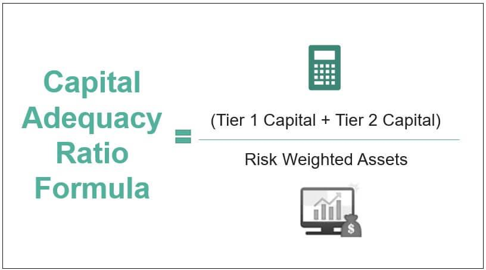

The intricate realms of banking, finance, and regulatory practices encompass a wide array of elements that collectively maintain the functionality and stability of financial systems globally. Banking metrics serve as fundamental indicators in assessing the financial health and operational efficiency of financial institutions. They provide vital insights into areas such as liquidity, profitability, and risk exposure.

Financial regulation, on the other hand, establishes legal frameworks and standards aimed at ensuring systemic stability, protecting consumers, and enhancing transparency among banks and financial entities. The interplay between robust banking metrics and comprehensive financial regulation is crucial for orderly markets. A critical component often monitored is the Capital Adequacy Ratio (CAR), which evaluates a bank's capital relative to its risk-weighted assets. This metric is essential in determining a bank's capability to absorb potential losses, thereby safeguarding depositor funds and contributing to overall financial stability.

The advent of algorithmic trading has introduced significant transformations within financial markets. Utilizing complex algorithms and high-speed computing, this trading form operates based on diverse criteria such as timing and pricing, influencing liquidity and volatility levels. While algorithmic trading presents clear advantages in efficiency and market depth, it also necessitates advanced regulatory oversight to mitigate associated risks and potential market disruptions.

Together, these components form the backbone of effective financial system management. Sound regulatory practices and the adoption of precise banking metrics enhance the resilience and efficacy of the banking sector, while innovations like algorithmic trading underscore the dynamic nature of financial markets. Understanding and integrating these elements are essential in navigating the complexities inherent in the global financial landscape.

## Table of Contents

## Banking Metrics and Financial Regulation

Banking metrics are crucial analytical tools utilized to assess the financial health and operational efficiency of banking institutions. These metrics provide insights into various aspects of a bank's performance, such as profitability, liquidity, asset quality, and risk management. Common metrics include return on assets (ROA), return on equity (ROE), net interest margin (NIM), and non-performing loan (NPL) ratios. For instance, ROA measures how efficiently a bank uses its assets to generate profits, calculated as:

$$
\text{ROA} = \frac{\text{Net Income}}{\text{Total Assets}}
$$

Similarly, ROE evaluates how effectively a bank uses shareholders' equity to generate income:

$$
\text{ROE} = \frac{\text{Net Income}}{\text{Shareholder's Equity}}
$$

Financial regulation encompasses the establishment and enforcement of legal frameworks and standards for banks to ensure systemic stability, consumer protection, and transparency. These regulations are vital to curbing excessive risk-taking behaviors that can lead to financial crises. Examples of such regulations include capital requirements, [liquidity](/wiki/liquidity-risk-premium) ratios, and stress testing, all designed to ensure that banks can withstand economic shocks.

The harmony between banking metrics and financial regulation is essential for maintaining orderly and reliable financial markets. Banking metrics provide the quantitative basis for regulatory frameworks, ensuring that regulations are grounded in an accurate assessment of banks' financial conditions. Regulators employ these metrics to monitor compliance with legal standards, identify potential risks, and take corrective actions where necessary. This synergy supports the dual objectives of sustaining the financial health of individual banks and preserving the overall stability of the financial system. 

By uniting quantitative analysis through banking metrics with qualitative oversight via regulatory frameworks, the financial industry can safeguard against systemic risks while promoting confidence and reliability among consumers and stakeholders. Through meticulous monitoring and adaptive regulatory measures, the banking sector aims to navigate the challenges of complex financial environments while optimizing performance and ensuring stability.

## Deep Dive into Capital Adequacy Ratio (CAR)

The Capital Adequacy Ratio (CAR) is a pivotal metric in banking regulation, aimed at ensuring that financial institutions maintain sufficient capital to cover their risk-weighted assets. Fundamentally, it measures a bank's capital in relation to its risks and is expressed as a percentage. The formula for CAR is:

$$

\text{CAR} = \frac{\text{Tier 1 Capital} + \text{Tier 2 Capital}}{\text{Risk-Weighted Assets}}
$$

Tier 1 capital refers to core capital, including common equity tier 1, which constitutes the most reliable form of capital, primarily composed of common shares and retained earnings. Tier 2 capital includes supplementary capital such as subordinated debt, loan-loss reserves, and hybrid instruments. These two tiers together provide a comprehensive view of a bank's capital base, making CAR a useful tool for regulators.

CAR plays a crucial role in maintaining the financial stability of banks. A higher CAR indicates a more substantial capital buffer, signifying that a bank is capable of absorbing financial shocks, thereby protecting depositors and sustaining the overall confidence in the financial system. This capital buffer acts as a safeguard that enables banks to handle unexpected losses, minimizing the risk of insolvency.

Regulators use CAR as a benchmark to enforce minimum capital requirements across financial institutions. Through these requirements, they aim to reduce the likelihood of banks failing in periods of financial distress, thus maintaining depositors' trust and overall market stability. Moreover, a robust CAR has a rippling effect, supporting the economy by assuring that banks remain solvent and can continue lending even during adverse economic conditions.

The importance of CAR has been highlighted in global standards set by agreements like the Basel Accords, which guide international banking regulations. These accords prescribe minimum CAR thresholds to harmonize banking practices worldwide, ensuring that banks operate safely and prudently, irrespective of economic fluctuations. By adhering to these standards, banks can better manage systemic risks and enhance the resilience of the financial sector.

## Importance and Implementation of CAR

The Capital Adequacy Ratio (CAR) is a critical metric in the banking industry, reflecting the resilience of financial institutions against economic shocks. Established through international regulatory frameworks such as the Basel Accords, CAR ensures that banks hold adequate capital to safeguard depositors and maintain financial system stability. Compliance with the Basel standards enhances cross-border comparability and trust in multinational banking operations.

CAR is calculated as the ratio of a bank’s capital to its risk-weighted assets (RWAs). This calculation comprises two main components: Tier 1 and Tier 2 capital. Tier 1 capital, often referred to as core capital, includes elements like common equity and disclosed reserves, forming the primary buffer against losses. It represents the most reliable and readily available financial resources, crucial for absorbing operational losses. Tier 2 capital, on the other hand, encompasses supplementary reserves such as subordinated debts and hybrid instruments. While not as resilient as Tier 1, Tier 2 capital offers additional layers of protection for banks.

The formula for calculating CAR is expressed as:

$$
\text{CAR} = \frac{\text{Tier 1 Capital} + \text{Tier 2 Capital}}{\text{Risk-Weighted Assets}} \times 100
$$

A robust CAR signifies a bank's ability to withstand financial stress, thus preventing failures and reducing systemic risks. By adhering to these capital requirements, banks maintain solvency and promote market confidence. Beyond ensuring they can cope with potential losses, a high CAR also enhances a bank's ability to expand its lending activities prudently. Consequently, CAR requirements play an essential role in fostering a sound economic environment by balancing financial stability and growth.

## Impact of Algorithmic Trading on Banking

Algorithmic trading employs sophisticated algorithms and high-speed computers to execute trades based on pre-established parameters such as price, timing, and [volume](/wiki/volume-trading-strategy). This automated approach serves to expedite trading processes and improve market efficiency. By leveraging algorithms, trades are executed at speeds unimaginable by human traders, significantly enhancing market liquidity and reducing transaction costs. Liquidity, indicated by a high volume of trades and narrow bid-ask spreads, is fundamental in ensuring the stability and fluidity of financial markets.

Despite its benefits, [algorithmic trading](/wiki/algorithmic-trading) can also introduce notable risks, prominently [volatility](/wiki/volatility-trading-strategies). The rapid pacing of trades can lead to significant price swings. For instance, the "Flash Crash" of May 6, 2010, saw the Dow Jones Industrial Average plunge about 1,000 points within minutes, largely attributed to automated trading systems reacting erratically. This incident highlights the potential for systemic risks when algorithms interact in unexpected ways.

To mitigate such risks, stringent regulatory oversight is imperative. Regulatory frameworks, such as the European Securities and Markets Authority's (ESMA) guidelines for automated trading, set out requirements for transparency, systems testing, and controls to manage algorithmic trading's impact on the markets. These regulations aim to ensure that financial institutions deploy robust risk-management strategies to oversee algorithmic operations effectively.

Banks harnessing algorithmic trading must balance these regulatory demands with the need for technological advancement. Compliance with financial regulations is non-negotiable, yet banks must stay agile in adopting cutting-edge technologies to maintain a competitive edge. Integrating advanced data analytics and [machine learning](/wiki/machine-learning), for instance, allows banks to refine their trading strategies and better predict market movements, offering a potential advantage over less technologically adept competitors.

The dynamic nature of financial markets necessitates continuous dialogue between regulators and financial institutions. Such interaction helps tailor regulations that safeguard financial stability without stifling innovation. By collaborating closely, regulators and banks can identify potential risks early and adapt strategies to address them, ensuring robust market environments in which algorithmic trading can thrive safely. Therefore, while algorithmic trading holds the promise of enhanced market efficiencies, it also underscores the need for vigilant oversight to safeguard financial stability.

## Challenges and Prospects in Financial Regulation

Financial regulation plays a crucial role in shaping a stable and efficient financial system. To meet the demands of an ever-evolving financial landscape, regulatory frameworks must be adaptive and forward-thinking. One of the prominent challenges faced by financial regulators today is the growing threat of cybersecurity. As banks increasingly adopt digital platforms, the risk of cyber-attacks and data breaches has escalated, necessitating robust cybersecurity measures. Regulators are called to formulate comprehensive guidelines that compel financial institutions to implement strong security practices, conduct regular risk assessments, and promptly report cybersecurity incidents.

Another pressing challenge is the integration of digital currencies into the financial system. Cryptocurrencies and Central Bank Digital Currencies (CBDCs) present unique regulatory challenges, primarily concerning anti-money laundering (AML), combatting the financing of terrorism (CFT), and consumer protection. Regulators must develop frameworks that balance innovation with the need for regulation, ensuring that the adoption of digital currencies does not compromise financial integrity or consumer rights.

Innovation, while being a catalyst for growth, introduces complexities that must be harmonized with regulatory compliance. Financial institutions are at the forefront of technological advancements, adopting [artificial intelligence](/wiki/ai-artificial-intelligence), machine learning, and blockchain technologies. These innovations can result in enhanced operational efficiencies and the delivery of new financial products and services. However, regulators must ensure that these advancements do not outpace the current regulatory frameworks. Achieving a balance between fostering innovation and ensuring regulatory compliance requires regulators to engage with financial institutions through an ongoing dialogue. This collaboration can lead to the development of adaptive regulations that cater to the unique aspects of new technologies.

The fast-paced evolution of banking technology demands constant communication between regulators and financial institutions. Effective collaboration enables regulators to understand the practical implications of innovations and devise regulations that support technological growth while safeguarding the financial system's stability and integrity. For this dialogue to be productive, both parties need to share insights, challenges, and potential opportunities in the adoption and regulation of technological advancements.

In conclusion, the financial regulation landscape is faced with the dual challenge of managing emerging risks like cybersecurity and digital currency integration while fostering a regulatory environment that supports innovation. A proactive approach that involves continuous engagement between regulators and financial institutions is key to navigating these challenges effectively, ensuring a resilient and dynamic financial ecosystem.

## Conclusion

Banking metrics, financial regulations, and capital adequacy are essential pillars that underpin the security and efficacy of the global financial system. These components provide the structural integrity required for maintaining systemic stability and protecting consumer interests. The Capital Adequacy Ratio (CAR), in particular, ensures that banks hold sufficient capital against their risk-weighted assets, safeguarding against potential insolvencies and promoting economic stability.

Algorithmic trading has emerged as a significant [factor](/wiki/factor-investing) influencing financial markets. By utilizing high-speed computing and sophisticated algorithms, this trading method offers enhanced market liquidity and efficiency. Nevertheless, it also introduces potential risks, such as increased volatility, which necessitates vigilant regulatory oversight. As banks continue to adopt algorithmic trading strategies, maintaining compliance with ever-evolving financial regulations becomes crucial to mitigate these risks.

Ongoing regulatory enhancements play a pivotal role in ensuring market stability amid rapid technological progressions. As new challenges such as cybersecurity threats and digital currencies emerge, regulators and financial institutions must collaborate dynamically to balance innovation and security. This continual adaptation is vital for fostering a secure and robust financial environment that can accommodate both contemporary advancements and future challenges.

## References & Further Reading

[1]: Bank for International Settlements. (2010). ["Basel III: A global regulatory framework for more resilient banks and banking systems."](https://www.bis.org/publ/bcbs189.pdf)

[2]: European Securities and Markets Authority (ESMA). (2021). ["Guidelines on trading algorithm deployment."](https://www.esma.europa.eu/)

[3]: Adrian, T., & Brunnermeier, M. K. (2016). ["CoVaR."](https://www.aeaweb.org/articles?id=10.1257/aer.20120555) American Economic Review, 106(7), 1705-1741.

[4]: Basel Committee on Banking Supervision. (2000). ["International convergence of capital measurement and capital standards."](https://www.bis.org/publ/bcbs128.pdf)

[5]: MacNeil, I., & O'Brien, J. (2009). ["The Future of Financial Regulation."](https://scholar.google.com/citations?user=T6q3KSwAAAAJ&hl=en) European Company and Financial Law Review, 6(2), 210-238.