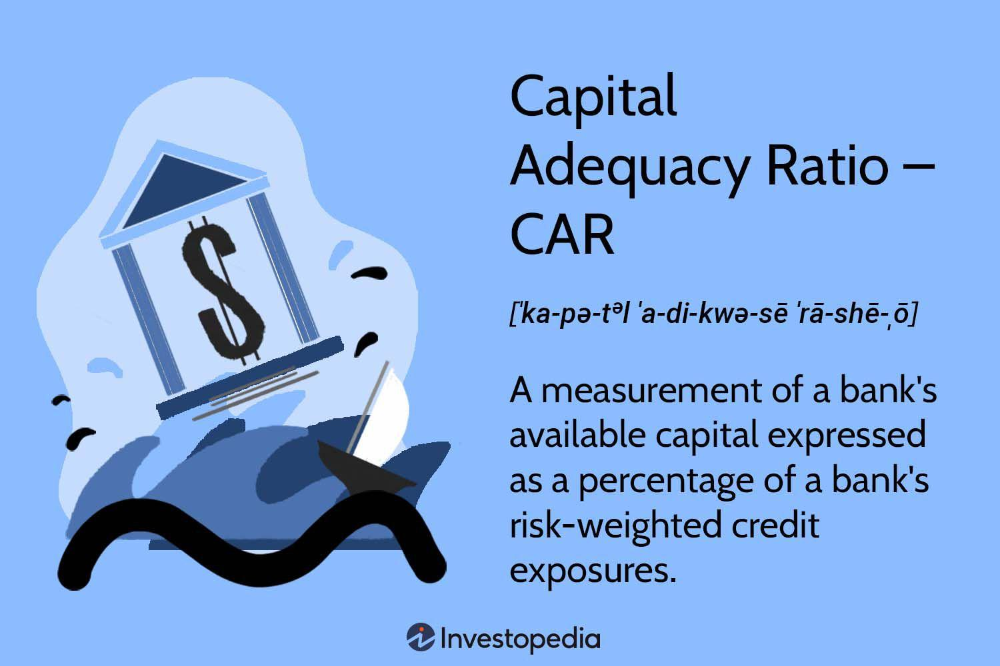

The financial landscape has witnessed profound transformations over the past few decades, particularly with advancements in banking regulation and maintaining financial stability. Central to this transformation is the concept of the Capital Adequacy Ratio (CAR), a crucial metric for ensuring that financial institutions remain solvent and robust against potential economic adversities. CAR acts as a buffer, allowing banks to absorb losses while protecting the interests of depositors and maintaining trust in the financial system.

Parallel to regulatory advancements, the evolution of algorithmic trading has significantly influenced market dynamics. By employing sophisticated algorithms and computer programs, trading can now occur at speeds and volumes unimaginable a few decades ago. This technological progress offers substantial opportunities in terms of market efficiency and liquidity but also presents challenges such as potential market manipulation and the risk of flash crashes.

The intricate connections between financial stability, banking regulations, CAR, and algorithmic trading highlight the underlying complexities of modern financial systems. A deeper understanding of how these components interact is essential to grasp how present-day financial markets aim to achieve stability amidst the rapid pace of technological innovation. As these changes continue to unfold, comprehensive regulatory frameworks and adaptive financial practices will play a pivotal role in maintaining a stable and reliable financial environment.

## Table of Contents

## Understanding Financial Stability

Financial stability is a critical component of the overall health and resilience of an economy, ensuring that the financial system can withstand and recover from economic shocks while continuing to provide essential services. At its core, financial stability involves maintaining the efficient functioning of various systems that underpin economic transactions. These systems include payment and settlement systems, financial markets, and financial institutions, each playing a pivotal role in facilitating the flow of funds within the economy.

A stable financial system is characterized by its ability to absorb shocks without significant disruptions to its core functions, such as credit intermediation, payment processing, and risk management. This robustness is essential for preventing the spillover of financial distress to the wider economy, which can lead to economic downturns or crises.

To safeguard financial stability, regulating agencies around the world implement a range of policies and frameworks. These are meticulously designed to address potential vulnerabilities and mitigate risks within the financial system. The policies focus on several key areas:

1. **Monitoring and Assessment:** Continuous monitoring of financial institutions and markets is crucial to identify emerging risks and vulnerabilities. Regulators use a variety of tools and indicators to assess the health and stability of the financial system.

2. **Prudential Regulation:** This involves setting standards and guidelines for financial institutions to manage risks effectively. Such regulations can include minimum capital and liquidity requirements, which ensure that institutions have adequate buffers to withstand financial stress.

3. **Crisis Management Frameworks:** Establishing mechanisms to manage and resolve financial crises is vital. This includes developing strategies for the orderly resolution of failing financial institutions to minimize systemic impact.

4. **Macroprudential Policies:** These are policies aimed at addressing systemic risks and ensuring the stability of the financial system as a whole. They may involve setting limits on leverage, credit growth, or other factors that could lead to excessive risk-taking.

International bodies, such as the Financial Stability Board (FSB) and the International Monetary Fund (IMF), play a significant role in promoting global financial stability through the coordination of national efforts and the development of international standards. Their work involves fostering cooperation among countries to oversee cross-border financial activities and manage global systemic risks.

Overall, understanding financial stability requires considering the complex interplay of institutions, markets, and regulatory frameworks that collectively work to maintain a resilient financial environment. The ability of the financial system to remain stable amidst both macroeconomic shocks and rapid technological advancements continues to be a focal point for policymakers and financial industry stakeholders alike.

## The Role of Banking Regulation

Banking regulation is the framework of laws, rules, and guidelines that governs the activities and practices of financial institutions. These regulations are crafted to ensure the safety and soundness of banks, protect consumer interests, and uphold the integrity of the financial system. By creating a robust regulatory environment, these rules aim to prevent situations where banks may engage in exorbitantly risky behavior that could jeopardize the financial system.

One of the primary functions of banking regulation is safeguarding the stability of the financial system. This is achieved through various means, including rigorous supervision and monitoring of financial institutions. Regulatory bodies, such as central banks or government-appointed agencies, oversee banks to ensure they are operating within established guidelines and not engaging in practices that might jeopardize their solvency or the broader financial ecosystem.

In the wake of financial crises, regulatory authorities often decide to tighten banking regulations to avert future economic instability. The global financial crisis of 2008 is a pertinent example, after which many regulatory agencies worldwide introduced more stringent regulations. This included measures like increasing capital reserve requirements to ensure that banks have enough equity to absorb potential losses, thus reducing the likelihood of a bank's failure affecting the broader financial system. 

Key components of banking regulation encompass supervision, risk management protocols, and compliance with regulatory standards. Supervision involves the continuous oversight of banks' operations to ensure adherence to banking laws and guidelines. Risk management protocols require banks to establish processes and techniques for identifying, assessing, and managing risks. Compliance, on the other hand, necessitates that banks conform to prescribed regulatory standards, which often entails submitting regular reports and audits.

The Capital Adequacy Ratio (CAR) is a significant aspect of these regulations, acting as a buffer to ensure that a bank can absorb financial stress without resorting to taxpayer funds for bailout [^1]. The Basel Committee on Banking Supervision plays an instrumental role in formulating global standards in bank regulation, ensuring that banks maintain sufficient capital to reduce the risk of insolvency.

Overall, banking regulations are essential for maintaining a stable, reliable, and resilient financial system. They mitigate potential risks posed by banks' financial practices, protect consumer interests, and preserve trust in financial institutions.

[^1]: Basel Committee on Banking Supervision, "Basel III: A global regulatory framework for more resilient banks and banking systems," https://www.bis.org/publ/bcbs189.pdf.

## Capital Adequacy Ratio (CAR): A Pillar of Stability

The Capital Adequacy Ratio (CAR) is a critical metric for assessing a bank's financial health and resilience. It is defined as the ratio of a bank's capital to its risk-weighted assets (RWA) and is expressed mathematically as:

$$

\text{CAR} = \frac{\text{Capital}}{\text{Risk-Weighted Assets}} 
$$

This ratio ensures that banks possess sufficient capital to manage potential losses, thus maintaining solvency and protecting depositors. A high CAR indicates that a bank is well-positioned to absorb financial shocks, supporting overall stability within the financial system.

Regulatory authorities, such as the Basel Committee on Banking Supervision, play a pivotal role in establishing the minimum CAR requirements. These regulations are designed to enforce a buffer of capital that financial institutions must maintain, promoting resilience against financial instability. The Basel III Accord, an international regulatory framework, stipulates a minimum CAR of 8%, with additional capital conservation buffers and countercyclical buffers depending on economic conditions and regional regulations.

Understanding the implications of CAR allows insights into bank behavior and regulatory impact. Banks are incentivized to manage their risk-weighted assets effectively and maintain adequate capital to comply with regulatory requirements. Non-compliance can lead to increased supervision, financial penalties, or limitations on operational capabilities.

CAR influences banks' decision-making processes, particularly concerning lending, risk management, and investment strategies. As such, it serves as a critical tool for regulators and financial institutions aiming to sustain a stable financial ecosystem. By ensuring adequate capitalization, banks not only protect themselves against adverse economic conditions but also contribute to the broader financial system's stability and confidence. This fundamental role underscores the necessity for ongoing monitoring and adjustment of CAR requirements in line with evolving financial landscapes and emerging market risks.

## Algorithmic Trading's Impact on Financial Markets

Algorithmic trading has transformed the speed and complexity of financial market transactions through the utilization of computer algorithms capable of executing trades at speeds and volumes that surpass human capabilities. This technological advancement enhances market [liquidity](/wiki/liquidity-risk-premium) by enabling faster transaction times and the ability to capitalize on microscopic price discrepancies, thus adding efficiencies that were not possible before. Furthermore, algorithms can process large datasets and historical trends, making it possible to identify and exploit trading opportunities that might be elusive to human traders.

However, the introduction of [algorithmic trading](/wiki/algorithmic-trading) has introduced a spectrum of risks, manifesting most prominently in occurrences like flash crashes. One notable example is the 2010 Flash Crash, where the Dow Jones Industrial Average plummeted about 1,000 points within minutes before rebounding, largely attributed to high-frequency trading algorithms that exacerbated market [volatility](/wiki/volatility-trading-strategies) in an already erratic trading environment. These algorithms, which operate without human judgment, can trigger significant sell-offs or buy orders based on preset conditions, leading to destabilizing rapid market movements.

Moreover, algorithmic trading can precipitate concerns over market manipulation. Algorithms designed to execute a high [volume](/wiki/volume-trading-strategy) of trades can be configured for practices such as spoofing, where large orders are placed and then canceled before execution to manipulate stock prices. The capability of algorithms to influence market conditions intentionally raises ethical and regulatory challenges.

Regulatory bodies are proactively implementing frameworks to mitigate these risks and ensure market stability. Regulations such as the European Union's Markets in Financial Instruments Directive (MiFID II) require firms engaging in algorithmic trading to have in place robust risk management controls and trading venues to implement circuit breakers to arrest runaway trading anomalies. These safeguards are intended to enhance transparency and maintain orderly market conditions.

Balancing innovation with regulation is essential for harnessing the advantages of algorithmic trading while minimizing its potential threats. Transparent regulatory frameworks and technological oversight strategies are necessary to maintain this equilibrium. Regulatory agencies must continually assess and adapt to advancements in trading technologies and methodologies to ensure that the overall integrity and stability of financial markets are not compromised.

Thus, algorithmic trading represents a double-edged sword, offering significant advancements and efficiencies in financial markets alongside challenges that necessitate ongoing regulatory vigilance and technological innovation.

## Interconnection of CAR and Algorithmic Trading

The interconnection between Capital Adequacy Ratio (CAR) and algorithmic trading underscores a crucial aspect of modern banking and finance. Regulatory shifts in CAR directly impact the risk-taking behaviors of banks, especially those engaging in algorithmic trading. As banks adjust their capital structures to comply with CAR regulations, they must also re-evaluate their trading strategies. Algorithmic trading strategies are typically reliant on executing large volumes of transactions at high speeds, a process considerably influenced by the bank’s capacity to absorb potential risks.

To ensure compliance, algorithmic strategies are designed to account for regulatory cap limits. This might involve adjusting the risk-weighted assets or modifying the algorithms to trade within the desired risk parameters. For instance, if a model is backtested and found to require excessive capital to cover potential losses, adjustments must be made to align with CAR constraints. This consideration is especially important since breaching capital requirements could lead to substantial penalties and affect the bank's operational capacity.

The interaction between CAR and algorithmic trading highlights the necessity for banks to integrate technological advancements with robust risk management practices. Algorithmic trading systems need to be equipped with dynamic risk assessment models capable of real-time analysis of market conditions and regulatory compliance. These systems must evaluate the financial standing and market positions, then adjust to ensure the bank remains within safe operational boundaries.

Financial technology innovations push regulatory frameworks to evolve continuously in step with advancements. As new trading technologies emerge, regulatory bodies must adjust capital adequacy standards to match the changing financial landscape. Traditional CAR, originally designed in a different technological era, may not fully anticipate the complexities introduced by high-frequency trading algorithms and other fintech innovations.

To maintain alignment between regulatory expectations and technological progress, regulators and financial institutions must engage in ongoing dialogue. This engagement allows rule-makers to understand the operational realities of algorithmic trading and sets clear guidelines that capture the underlying risks without stifling innovation. This dynamic process ensures that capital adequacy standards continue to reflect the true risk profile of banks in a technologically advanced financial ecosystem, thereby sustaining financial stability.

## Conclusion

The quest for financial stability is an ongoing process that necessitates a dynamic approach to both regulation and market operation. Capital adequacy and algorithmic trading exemplify two essential aspects of a complex financial ecosystem. Capital adequacy ensures that banks have sufficient capital to hedge against risks, safeguarding the overall system. Algorithmic trading, on the other hand, represents the forefront of technological advances in market operations, introducing both efficiencies and potential vulnerabilities.

In order to navigate the challenges of modern finance, stakeholders must comprehensively understand the intersection of banking regulation and technology. Regulations must evolve alongside technological innovations to maintain their relevance and effectiveness. This complexity is underscored by the interplay between banking regulations like the Capital Adequacy Ratio (CAR) and the operations of algorithmic trading systems. The CAR affects banks' risk-taking behavior, which in turn influences their trading strategies, including those executed through algorithms. Ensuring that algorithmic trading systems comply with regulatory capital requirements is crucial for stability.

A forward-looking perspective is essential for maintaining robust financial systems amid rapid technological advancements and evolving market paradigms. As technologies continue to reshape financial markets, regulators and market participants alike must remain agile, adapting to new risks and opportunities while upholding the stability and integrity of the financial system. This involves crafting policies that not only accommodate innovations but also preemptively address their potential impact on market dynamics. Through vigilant oversight and proactive adaptation, the financial community can strive to uphold a stable and resilient financial ecosystem.

## References & Further Reading

[1]: ["Basel III: A global regulatory framework for more resilient banks and banking systems"](https://www.bis.org/publ/bcbs189.pdf) by the Basel Committee on Banking Supervision.

[2]: Hendershott, T., Jones, C. M., & Menkveld, A. J. (2011). ["Does Algorithmic Trading Improve Liquidity?"](https://onlinelibrary.wiley.com/doi/full/10.1111/j.1540-6261.2010.01624.x) The Review of Financial Studies, Volume 24, Issue 8.

[3]: Aldridge, I. (2013). ["High-Frequency Trading: A Practical Guide to Algorithmic Strategies and Trading Systems"](https://www.amazon.com/High-Frequency-Trading-Practical-Algorithmic-Strategies/dp/1118343506).

[4]: Hull, J. (2018). ["Risk Management and Financial Institutions"](https://books.google.com/books/about/Risk_Management_and_Financial_Institutio.html?id=1J1QDwAAQBAJ) 5th Edition.

[5]: Cartea, A., Jaimungal, S., & Penalva, J. (2015). ["Algorithmic and High-Frequency Trading"](https://assets.cambridge.org/97811070/91146/frontmatter/9781107091146_frontmatter.pdf) Cambridge University Press.

[6]: "Global Financial Stability Report" by the International Monetary Fund (IMF), detailing insights into the stability of global financial systems and regulatory frameworks.

[7]: Duffie, D. (2010). ["Presidential Address: Asset Price Dynamics with Slow-Moving Capital"](https://www.darrellduffie.com/uploads/1/4/8/0/148007615/duffieafapresidentialaddress2010.pdf) American Economic Review.