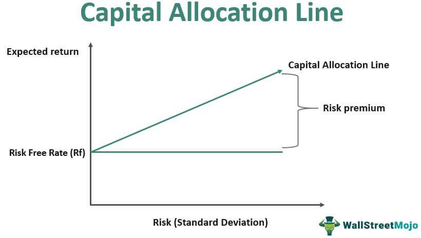

## Table of Contents

## What is the Capital Allocation Line (CAL)?

The Capital Allocation Line (CAL) is a line on a graph that shows how you can mix a risk-free investment, like a government bond, with a risky investment, like stocks, to get the best return for the level of risk you are willing to take. It helps investors decide how much of their money to put into safe investments and how much into riskier ones. The slope of the CAL represents the extra return you get for taking on more risk, and the point where the CAL touches the risky investment line is called the optimal risky portfolio.

In simple terms, the CAL helps you see the different ways you can balance risk and reward. If you want less risk, you put more money into the risk-free investment, and if you want more potential return, you put more into the risky investment. The CAL is important because it shows the best possible combinations of risk and return, helping you make smarter investment choices.

## How does the Capital Allocation Line relate to the efficient frontier?

The Capital Allocation Line (CAL) and the efficient frontier are both important ideas in investing, but they help in different ways. The efficient frontier is a curve that shows all the different portfolios of risky investments that give you the best return for the amount of risk you are taking. It's like a map that shows the best risky investment choices you can make. On the other hand, the CAL is a straight line that starts from a risk-free investment, like a government bond, and goes up to touch the efficient frontier. This line shows you how you can mix the risk-free investment with the best risky portfolio to get even better returns for the risk you are willing to take.

When you look at the efficient frontier, you see many possible portfolios of risky investments, but you don't know how to mix them with safe investments. That's where the CAL comes in. The point where the CAL touches the efficient frontier is called the optimal risky portfolio. This is the best mix of risky investments you can make. By drawing the CAL from the risk-free investment to this point, you can see all the ways you can combine the risk-free investment with the optimal risky portfolio. This helps you decide how much of your money to put into safe investments and how much into risky ones, depending on how much risk you are comfortable with.

## What is the significance of the Capital Allocation Line in portfolio management?

The Capital Allocation Line (CAL) is very important in portfolio management because it helps investors figure out the best way to mix safe and risky investments. Imagine you have some money to invest. You can put it all into a safe investment, like a government bond, which gives you a small but sure return. Or you can put it all into riskier investments, like stocks, which might give you a bigger return but also come with more risk. The CAL shows you how you can mix these two types of investments to get the best return for the level of risk you are willing to take. It's like a guide that helps you balance safety and potential rewards.

The CAL is a straight line on a graph that starts from the risk-free investment and goes up to touch the efficient frontier, which is a curve showing the best risky investment choices. The point where the CAL touches the efficient frontier is called the optimal risky portfolio. This is the best mix of risky investments you can make. By looking at the CAL, you can see all the different ways you can combine the risk-free investment with this optimal risky portfolio. This helps you decide how much of your money to put into safe investments and how much into risky ones, depending on how much risk you are comfortable with. So, the CAL is a key tool that helps you make smarter investment choices by showing you the best possible combinations of risk and return.

## How do you calculate the Capital Allocation Line?

To calculate the Capital Allocation Line (CAL), you start with two main things: the return and risk of a risk-free investment, like a government bond, and the return and risk of the best mix of risky investments, which is called the optimal risky portfolio. The return of the risk-free investment is easy to find because it's usually a fixed rate. The risk of the risk-free investment is zero because it's considered completely safe. The return and risk of the optimal risky portfolio come from looking at the efficient frontier, which shows all the possible risky investment mixes and their returns and risks. The optimal risky portfolio is the point on the efficient frontier that gives the best return for the risk you take.

Once you have these numbers, you can draw the CAL on a graph. The CAL is a straight line that starts at the risk-free investment and goes up to touch the efficient frontier at the optimal risky portfolio. The slope of this line is important because it tells you how much extra return you get for taking on more risk. To find the slope, you subtract the return of the risk-free investment from the return of the optimal risky portfolio and then divide that by the risk (or standard deviation) of the optimal risky portfolio. The equation for the CAL is: Return of the Portfolio = Risk-Free Rate + (Slope of CAL * Risk of the Portfolio). By using this equation, you can see all the different ways you can mix the risk-free investment with the optimal risky portfolio to get the best return for the level of risk you are willing to take.

## What role does the risk-free rate play in the Capital Allocation Line?

The risk-free rate is really important when you're figuring out the Capital Allocation Line (CAL). It's the starting point of the CAL on a graph. The risk-free rate is what you get from super safe investments, like government bonds, where you know exactly what you'll earn and there's no risk of losing your money. This rate is the base return that you can always count on, no matter what happens in the market.

When you draw the CAL, you start at the risk-free rate and draw a straight line up to the best mix of risky investments, called the optimal risky portfolio. This line shows you all the different ways you can mix safe and risky investments. The risk-free rate helps set the slope of the CAL, which tells you how much extra return you get for taking on more risk. So, the risk-free rate is key because it helps you see how to balance safety with the chance to earn more by taking risks.

## Can you explain the slope of the Capital Allocation Line and its importance?

The slope of the Capital Allocation Line (CAL) is really important because it shows you how much extra return you get for taking on more risk. Imagine you're climbing a hill. The steeper the hill, the more you have to work to go up it, but the better the view at the top. The slope of the CAL is like that hill. It tells you how much more return you can expect for every bit of extra risk you're willing to take. You find the slope by taking the return of the best mix of risky investments, called the optimal risky portfolio, and subtracting the return of the risk-free investment. Then, you divide that by the risk (or standard deviation) of the optimal risky portfolio.

This slope is super helpful because it helps you decide how to mix safe and risky investments. If the slope is really steep, it means you can get a lot more return for just a little more risk, which might make you want to put more money into risky investments. But if the slope is not so steep, it means you don't get much more return for the extra risk, so you might want to stick with safer investments. By understanding the slope of the CAL, you can make smarter choices about how to balance the safety of your money with the chance to earn more.

## How does the Capital Allocation Line help in determining the optimal portfolio?

The Capital Allocation Line (CAL) helps you find the best way to mix safe and risky investments to make the most money for the risk you're willing to take. It's like a map that shows you all the different ways you can combine a risk-free investment, like a government bond, with the best mix of risky investments, called the optimal risky portfolio. The CAL starts at the risk-free rate and goes up to touch the efficient frontier, which is a curve showing all the best risky investment choices. The point where the CAL touches the efficient frontier is the optimal risky portfolio. By looking at the CAL, you can see how much of your money to put into safe investments and how much into risky ones, depending on how much risk you're comfortable with.

The slope of the CAL is really important because it tells you how much more return you can get for taking on more risk. If the slope is steep, it means you can earn a lot more return for just a little more risk, so you might want to put more money into risky investments. But if the slope is not so steep, it means you don't get much more return for the extra risk, so you might want to stick with safer investments. By understanding the slope of the CAL, you can make smarter choices about how to balance the safety of your money with the chance to earn more. This helps you find the best portfolio that fits your risk level and gives you the best return possible.

## What is the difference between the Capital Allocation Line and the Capital Market Line?

The Capital Allocation Line (CAL) and the Capital Market Line (CML) are both important tools in investing, but they help in slightly different ways. The CAL is a line that shows how you can mix a risk-free investment, like a government bond, with any risky investment, like a portfolio of stocks. It starts at the risk-free rate and goes up to touch the efficient frontier, which is a curve showing all the best risky investment choices. The point where the CAL touches the efficient frontier is called the optimal risky portfolio. The CAL helps you see how to balance safe and risky investments to get the best return for the level of risk you're willing to take.

The Capital Market Line (CML), on the other hand, is a special case of the CAL. The CML only works with a specific type of risky investment called the market portfolio, which is a mix of all the investments in the market. Like the CAL, the CML starts at the risk-free rate, but it goes up to touch the efficient frontier at the market portfolio. The CML shows you the best way to mix the risk-free investment with the market portfolio to get the best return for the risk you're taking. So, while the CAL can be used with any risky investment, the CML is focused on using the market portfolio, making it a more specific tool for investors who believe in the market as a whole.

## How do changes in market conditions affect the Capital Allocation Line?

Changes in market conditions can move the Capital Allocation Line (CAL) around. If interest rates go up, the risk-free rate, which is where the CAL starts, goes up too. This makes the whole CAL move up a bit. If the market gets riskier, the best mix of risky investments, called the optimal risky portfolio, might change. This could make the CAL steeper or less steep, depending on how much more return you can get for the extra risk. So, the CAL can change its shape and position based on what's happening in the market.

When the economy is doing well, people might feel more confident and be willing to take more risks. This could make the optimal risky portfolio give higher returns, which would make the CAL steeper. But if the economy is doing badly, people might want to play it safe and put more money into risk-free investments. This could make the CAL less steep because the extra return you get for taking risks isn't as high. So, the CAL helps you see how to balance safe and risky investments no matter what's going on in the market.

## Can the Capital Allocation Line be used for individual asset allocation, and if so, how?

Yes, the Capital Allocation Line (CAL) can be used for individual asset allocation. It helps you decide how to split your money between safe investments, like government bonds, and riskier ones, like stocks. Imagine you have some money to invest. The CAL shows you a line on a graph that starts at the safe investment and goes up to the best mix of risky investments. By looking at this line, you can see how much to put into safe investments and how much into risky ones, based on how much risk you're okay with taking.

The slope of the CAL is important because it tells you how much more money you can make for taking on more risk. If the slope is steep, it means you can earn a lot more by taking just a little more risk, so you might want to put more money into risky investments. But if the slope is not so steep, it means you don't get much more money for the extra risk, so you might want to stick with safer investments. By understanding the CAL, you can make smarter choices about how to balance the safety of your money with the chance to earn more, no matter what's happening in the market.

## What are the limitations and criticisms of using the Capital Allocation Line in investment strategy?

The Capital Allocation Line (CAL) is a helpful tool, but it has some problems. One big problem is that it assumes you can always find a risk-free investment, like a government bond. But in real life, even these safe investments can lose value if interest rates change or if the government has money troubles. Another issue is that the CAL thinks the future will be just like the past. It uses old data to guess how risky investments will do, but the market can change in ways we don't expect. So, the CAL might not be as useful if the future is very different from the past.

Also, the CAL can be hard to use for people who don't have a lot of money to invest. It's made for big investors who can easily buy and sell lots of different investments. If you only have a little money, you might not be able to spread it out the way the CAL suggests. Plus, the CAL doesn't think about things like taxes or the costs of buying and selling investments, which can make a big difference in how much money you actually make. So, while the CAL is a good guide, it's not perfect and you need to think about these limits when you use it to plan your investments.

## How can advanced investors use the Capital Allocation Line to enhance portfolio performance?

Advanced investors can use the Capital Allocation Line (CAL) to enhance their portfolio performance by carefully adjusting the mix of safe and risky investments based on the slope of the CAL. The slope shows how much more return you can get for taking on more risk. If the slope is steep, it means you can earn a lot more by putting a bit more money into risky investments. So, an advanced investor might decide to shift more of their money into the optimal risky portfolio to take advantage of this opportunity. By regularly checking the CAL and understanding how it changes with market conditions, investors can make smart adjustments to their portfolios to get the best possible return for the level of risk they're willing to take.

Another way advanced investors use the CAL is by considering how different market conditions affect it. For example, if interest rates go up, the risk-free rate moves up, shifting the whole CAL. This might make the investor rethink their mix of safe and risky investments. Also, if the economy is doing well, the optimal risky portfolio might give higher returns, making the CAL steeper. An advanced investor can use this information to adjust their investments, maybe putting more into risky assets when the market looks good and pulling back when things seem risky. By understanding these shifts and using the CAL as a guide, advanced investors can fine-tune their portfolios to perform better over time.

## What is the Capital Allocation Line (CAL) and how can it be understood?

The Capital Allocation Line (CAL) is a fundamental concept in modern portfolio theory, providing a graphical representation of all possible combinations of risk-free and risky assets that an investor can achieve. Essentially, the CAL illustrates the trade-off between risk and return in a portfolio. The fundamental elements of the CAL are the risk-free rate and the risk premium, which represent the expected excess return over the risk-free rate.

Mathematically, the Capital Allocation Line is expressed as:

$$
E(R_p) = R_f + \frac{E(R_m) - R_f}{\sigma_m} \cdot \sigma_p
$$

where:
- $E(R_p)$ is the expected return on the portfolio.
- $R_f$ is the risk-free rate of return.
- $E(R_m)$ is the expected return on the market portfolio.
- $\sigma_m$ is the standard deviation of the market portfolio's return.
- $\sigma_p$ is the standard deviation of the portfolio's return.

The slope of the CAL, known as the Sharpe Ratio, represents the reward-to-[volatility](/wiki/volatility-trading-strategies) ratio and is given by $\frac{E(R_m) - R_f}{\sigma_m}$. This ratio aids investors by quantifying the additional return obtained per unit of risk.

One of the critical roles of the Capital Allocation Line in portfolio management is optimizing the risk-return trade-off. By adjusting the proportion of the risk-free asset and the market portfolio in their investments, investors can pinpoint their desired level of risk exposure. For risk-averse investors, a larger allocation to the risk-free asset would be preferable, resulting in a portfolio closer to the intercept of the CAL. Conversely, a risk-seeking investor might prefer a portfolio allocation further along the CAL involving a higher proportion of the risky asset, thus achieving a higher expected return for accepting greater risk.

In practical applications, investors leverage the CAL to determine the optimal portfolio mix that suits their risk appetite. For instance, a young investor with a long investment horizon might allocate most funds into risky assets, situated higher on the CAL, balancing potential short-term volatility for long-term gains. In contrast, retirees might focus on preserving wealth, allocating more towards risk-free assets.

An illustrative real-world example involves the use of Treasury bills as a proxy for the risk-free asset and a diversified equity index fund as the risky asset. Suppose the current risk-free rate is 2%, the expected return on the equity index fund is 8%, and its standard deviation is 15%. With these inputs, the CAL can be drawn, helping investors determine their optimal investment strategy based on their risk tolerance.

Thus, the Capital Allocation Line is not merely a theoretical construct but a practical tool in strategic portfolio allocation, assisting investors in making informed decisions that align with their financial goals and risk preferences.

## How can investment calculations be performed using CAL?

The Capital Allocation Line (CAL) is a crucial tool in portfolio management as it aids investors in optimizing their risk-return profile. The CAL represents the risk-return combinations achievable by varying the proportion of a risk-free asset and a risky portfolio. Understanding how to use CAL effectively facilitates precise investment calculations, impacting decision-making and strategy development in significant ways.

The first step in using CAL for investment calculations is to compute expected returns and standard deviation. The expected return of a portfolio on the CAL is calculated as:

$$
E(R_p) = R_f + \frac{\sigma_p}{\sigma_m} \times (E(R_m) - R_f)
$$

Where:
- $E(R_p)$ is the expected return of the portfolio.
- $R_f$ is the risk-free rate.
- $\sigma_p$ is the standard deviation of the portfolio.
- $\sigma_m$ is the standard deviation of the market portfolio.
- $E(R_m)$ is the expected return of the market portfolio.

For identifying the optimal point on the CAL, investors need to determine their risk appetite and subsequently adjust the proportion of assets accordingly. The optimal point, or the tangent portfolio, represents the maximum Sharpe ratio or the best risk-return trade-off. For risk-averse investors, higher allocation to the risk-free asset is preferable, whereas risk-tolerant investors may seek greater exposure to the risky portfolio.

Incorporating CAL into investment decision-making involves using the insights derived from the CAL data to inform strategic asset allocation. The goal is to achieve an ideal balance that aligns with investment goals and risk tolerance. This can be done by regularly assessing economic conditions and adjusting the risk-free and market returns.

Numerous tools and technologies streamline CAL-based calculations. Advanced statistical software and quantitative financial platforms can automate these calculations, offering real-time data analysis and modeling capabilities. Python, for instance, provides several libraries like NumPy and Pandas for financial data manipulation, enabling users to automate CAL-related calculations efficiently:

```python
import numpy as np

def calc_expected_return(rf, sigma_p, sigma_m, rm, weights):
    return rf + (sigma_p / sigma_m) * (rm - rf)

rf = 0.03  # risk-free rate
rm = 0.08  # market return
sigma_m = 0.15  # market standard deviation
sigma_p = 0.10  # portfolio standard deviation

expected_return = calc_expected_return(rf, sigma_p, sigma_m, rm, weights=0.5)
print("Expected Portfolio Return:", expected_return)
```

Challenges and considerations when using CAL include accurately estimating market variables such as the expected market return and its volatility, which can impact the precision of calculations. Furthermore, CAL assumes a static relationship between risky and risk-free assets, potentially complicating its application in highly volatile markets. Changes in economic indicators, monetary policies, and unforeseen market disruptions can necessitate frequent recalibration of CAL inputs to maintain investment accuracy.

Overall, the strategic use of CAL can enhance an investor’s ability to make informed choices, optimizing portfolio performance while mitigating inherent risks.

## What is Algorithmic Trading and CAL?

Algorithmic trading, or algo trading, refers to the use of automated and complex algorithms to make trading decisions in financial markets. These algorithms can execute trades at speeds and frequencies that humans cannot match. Key concepts in [algorithmic trading](/wiki/algorithmic-trading) include the automation of trading processes, the use of mathematical models to make data-driven decisions, and the deployment of strategies designed to capitalize on market inefficiencies. By leveraging algorithmic trading, investors aim to optimize their execution times, reduce transaction costs, and mitigate the emotional biases associated with manual trading processes.

The Capital Allocation Line (CAL) enhances algorithmic trading by optimizing investment strategies through the synergy between efficient risk management and automated decision-making processes. CAL defines the risk-return profile of a portfolio by plotting all possible combinations of risk-free assets and a portfolio of risky assets. This combination helps traders select the most efficient portfolio for a given level of risk, or conversely, the least risky portfolio for a desired level of return, aligning well with the primary objectives of algorithmic strategies.

To integrate CAL into algorithmic trading models, traders use CAL calculations as inputs for algorithmic strategies, such as Mean-Variance Optimization (MVO) and the Sharpe Ratio maximization. For instance, the optimal point on the CAL, known as the tangency portfolio, is calculated using:

$$

\text{Sharpe Ratio} = \frac{E(R_p) - R_f}{\sigma_p} 
$$

where $E(R_p)$ is the expected return of the portfolio, $R_f$ is the risk-free rate, and $\sigma_p$ is the standard deviation of the portfolio returns. Algorithmic models incorporate this ratio to adjust portfolios dynamically, reacting to changes in market conditions by recalibrating investments to maximize returns per unit of risk.

CAL offers substantial advantages in automated trading by providing precise frameworks for optimizing portfolio compositions, improving efficiency, and enhancing the overall return on investment. Algorithms leveraging CAL can quickly assess and rebalance portfolios to maintain optimal risk levels, ensuring consistent alignment with the investor’s risk tolerance and return expectations.

Case studies demonstrate CAL’s application in algorithmic trading strategies. Advanced trading systems incorporate CAL computations to manage and execute trades that consistently outperform the market benchmarks. For instance, quantitative hedge funds often employ algorithms utilizing CAL principles to maintain equilibrium in their asset allocations and mitigate risk exposure dynamically.

In summary, the integration of CAL in algorithmic trading supports the development of more robust, efficient, and responsive trading strategies. These strategies capitalize on precise risk management techniques, aligning well with the objectives of maximizing returns while controlling for risk.

## References & Further Reading

[1]: Bodie, Z., Kane, A., & Marcus, A.J. (2014). ["Investments"](https://www.mheducation.com/highered/product/Investments-Bodie.html) 10th Edition. McGraw Hill Education.

[2]: Markowitz, H. (1952). ["Portfolio Selection"](https://onlinelibrary.wiley.com/doi/abs/10.1111/j.1540-6261.1952.tb01525.x). The Journal of Finance, 7(1), 77-91.

[3]: Sharpe, W.F. (1966). ["Mutual Fund Performance"](https://www.jstor.org/stable/2351741). The Journal of Business, 39(1), 119-138.

[4]: De Prado, M.L. (2018). ["Advances in Financial Machine Learning"](https://www.amazon.com/Advances-Financial-Machine-Learning-Marcos/dp/1119482089). Wiley.

[5]: Aronson, D.R. (2011). ["Evidence-Based Technical Analysis: Applying the Scientific Method and Statistical Inference to Trading Signals"](https://www.amazon.com/Evidence-Based-Technical-Analysis-Scientific-Statistical/dp/0470008741). Wiley.

[6]: Jansen, S. (2020). ["Machine Learning for Algorithmic Trading: Predictive Models to Extract Signals From Market and Alternative Data for Systematic Trading Strategies with Python"](https://github.com/stefan-jansen/machine-learning-for-trading). Packt Publishing.

[7]: Chan, E.P. (2009). ["Quantitative Trading: How to Build Your Own Algorithmic Trading Business"](https://github.com/ftvision/quant_trading_echan_book). Wiley Trading.