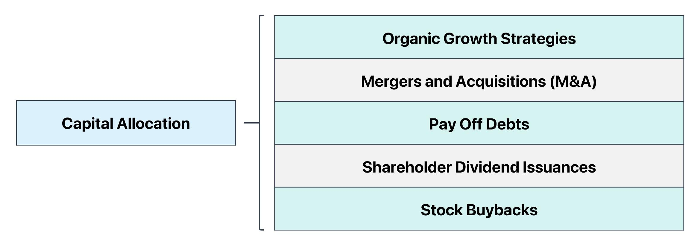

In the fast-evolving world of algorithmic trading, capital allocation stands as a cornerstone for success. In algorithmic trading, the process of allocating capital effectively is crucial for managing risk and maximizing returns. A well-thought-out capital allocation strategy can be the deciding factor between a thriving trading program and one that fails to meet its objectives. Capital allocation in algo trading involves distributing financial resources across various strategies, asset classes, or trading signals, with the aim of optimizing the risk-reward profile of the overall portfolio.

Understanding how capital is allocated within a trading strategy can make or break its success. A strategic approach to capital allocation not only amplifies potential profits but also limits exposure to adverse market movements. Proper allocation methods ensure that capital is efficiently utilized to maximize opportunities while mitigating potential losses. The allocation of capital in algo trading should be dynamic, reflecting ongoing assessments of market conditions, performance metrics, and risk tolerance levels. It encompasses both quantitative methods and qualitative judgments to balance the competing needs of diversification, leverage, and liquidity.



This guide will outline various techniques, weighing their pros and cons, to optimize risk-adjusted returns. By evaluating different capital allocation strategies, from traditional methods like equal weighting to more sophisticated approaches like volatility scaling and risk parity, traders can tailor their strategies to align with their specific goals and risk preferences. The article will also explore how advanced techniques, such as Kelly Criterion and scenario analysis, can further enhance the efficiency of capital allocation. Understanding these methods will empower traders to make informed decisions, ultimately driving the consistent performance and sustainability of their algorithmic trading operations.

## Table of Contents

## The Importance of Capital Allocation in Algo Trading

Capital allocation in [algorithmic trading](/wiki/algorithmic-trading) plays a pivotal role in striking the optimal balance between risk and reward. The primary aim of an effective capital allocation strategy is to ensure that no single position has the potential to undermine the overall viability of the trading strategy. This is particularly important in algorithmic trading, where numerous trades may be executed simultaneously, each requiring precise allocation to function effectively and efficiently.

An effective capital allocation strategy enhances risk management by strategically controlling potential losses. By distributing capital thoughtfully across various positions, traders can mitigate the impact of any adverse market movement on the overall portfolio. This involves determining the level of exposure or the percentage of total capital to allocate to individual trades or assets, which can be achieved through methods such as setting maximum capital at risk for each trade, or employing algorithms to dynamically adjust these percentages based on market conditions.

Comprehensive capital allocation strategies are crucial for ensuring the consistency and long-term success of trading operations. Strategies that are well-crafted and meticulously maintained help stabilize returns by minimizing the likelihood of large drawdowns, which can significantly affect both short-term results and long-term growth trajectories. Additionally, maintaining a diverse portfolio in terms of both asset types and allocation methods can lead to increased resilience against market [volatility](/wiki/volatility-trading-strategies), further contributing to the sustainability of trading activities.

Adopting the right capital allocation strategy involves careful consideration of the trading strategy's objectives, the risk tolerance of the trader or institution, and the characteristics of the market environment. By continuously evaluating and adjusting allocations, traders can safeguard their investments while striving to optimize returns.

## Common Capital Allocation Strategies

Common capital allocation strategies in algorithmic trading play a vital role in optimizing risk and returns. These strategies are employed by traders to determine how much capital to allocate to each trade based on various criteria. Here, we explore several widely-used methods that offer a range of complexities and benefits.

### Equally Weighted Position Sizing

Equally weighted position sizing is a straightforward strategy where each trade within a portfolio is allocated the same amount of capital. This method is particularly suitable for traders who have a consistent strategy edge and want to maintain a balanced exposure across all trades. While it simplifies the allocation process, it may not account for the varying risk levels associated with each position, potentially leading to suboptimal performance under different market conditions.

### Volatility-Scaled Positioning

Volatility-scaled positioning adjusts the size of positions inversely to their expected volatility. This approach aims to balance the risk each trade contributes to the overall portfolio. More volatile assets receive smaller allocations, while less volatile assets are allocated more capital. Calculating the position size involves estimating each asset's volatility and adjusting according to a target risk level. The formula used is:

$$
\text{Position Size} = \frac{\text{Target Risk}}{\text{Estimated Volatility}}
$$

This strategy is particularly useful in maintaining a consistent risk profile, although it requires continuous volatility estimation, which can be complex.

### Notional Target Positioning

Notional target positioning involves allocating fixed percentages of the Net Asset Value (NAV) to positions based on trading signals. This strategy allows traders to align their capital deployment with specific market forecasts or signals without exceeding predetermined exposure levels. By focusing on maintaining a constant allocation relative to NAV, traders can enforce discipline in position sizing and ensure that their capital is not overly concentrated in any single trade.

### Fixed Fractional Position Sizing

Fixed fractional position sizing is a method where a fixed percentage of total capital, known as the risk fraction, is allocated to each trade based on its risk profile. This approach contrasts with equally weighted strategies by allowing traders to adjust positions according to the perceived risk. The typical formula is:

$$
\text{Position Size} = \text{Risk Fraction} \times \text{Account Equity}
$$

This method maintains a steady risk exposure across multiple trades, providing a balance between capital preservation and growth potential.

### Risk Parity

Risk parity aims for equal risk contribution from each asset within a portfolio, focusing on balancing risk rather than capital. This approach estimates the risk contribution of each asset and adjusts the allocation until all assets contribute equally to the portfolio's overall risk. By seeking to minimize concentration risk, risk parity helps in achieving diversification. The complexity arises in the precise estimation of risk contributions and the dynamic adjustment of positions, which may require advanced mathematical models.

These strategies are foundational in structuring a robust capital allocation plan for algorithmic trading. Traders often combine or modify them to suit their trading styles, risk tolerance, and market conditions. Understanding and implementing these strategies can lead to more effective risk management and improved financial performance.

## Advanced Techniques for Capital Allocation

The Kelly Criterion is a mathematical formula used to determine the optimal size of a series of bets to maximize the logarithm of wealth over time. In the context of algorithmic trading, the Kelly Criterion helps optimize long-term capital growth by allocating risk based on the edge of a trading strategy and the variability of outcomes.

Mathematically, the Kelly Criterion is expressed as:

$$
f^* = \frac{bp - q}{b}
$$

where:

- $f^*$ is the fraction of the capital to wager,
- $b$ is the odds received on the wager,
- $p$ is the probability of winning,
- $q$ is the probability of losing (which is $1 - p$).

For traders, correctly estimating the probabilities ($p$) and the corresponding risk-to-reward ratio ($b$) is fundamental to applying this criterion successfully. A significant advantage of the Kelly Criterion is its emphasis on capital preservation and growth, deterring over-leverage and excessive risk-taking.

Maximum Drawdown Control is another sophisticated technique which focuses on managing risk by adjusting position sizes according to the drawdown levels of a portfolio. Maximum drawdown refers to the largest peak-to-trough decline in asset value before a new peak is attained. The strategy works by reducing position sizes during heavy drawdowns to prevent further capital erosion, thereby preserving investor wealth during adverse market phases.

Scenario Analysis and Stress Testing are critical for validating capital allocation strategies under various market conditions. Scenario analysis involves simulating hypothetical situations to assess the potential impact on portfolio performance. It aids traders in understanding how varying market factors can affect portfolio allocations. Stress testing, meanwhile, involves evaluating capital allocation strategies by applying extreme market conditions such as sharp economic downturns or financial crises. These tests help assess the robustness of a strategy and its ability to withstand periods of high volatility or market stress.

Together, these advanced techniques enhance the sophistication of capital allocation strategies, allowing traders to tailor their risk management practices better and improve long-term portfolio outcomes.

## Backtesting for Capital Allocation Strategies

Backtesting serves as a crucial mechanism in evaluating the effectiveness and robustness of capital allocation strategies within algorithmic trading. By simulating trading strategies on historical data, traders can assess how these strategies might perform under various market scenarios before deploying them in live markets. This simulation helps identify potential vulnerabilities in a strategy’s allocation model, thereby allowing traders to make necessary adjustments to enhance performance and mitigate risks.

Historical data analysis is key to uncovering weaknesses in a capital allocation strategy. For instance, a strategy might demonstrate profitable outcomes during certain market conditions but reveal significant losses under different circumstances. This analysis assists in understanding these vulnerabilities, enabling traders to refine their strategies to better handle adverse conditions.

Parameter optimization plays a significant role in maximizing risk-adjusted returns. This process involves adjusting the parameters of a trading strategy to find the optimal settings that produce the best performance. In practice, this could involve altering factors like position sizing, stop-loss levels, or asset allocation proportions to increase the strategy's Sharpe Ratio, a common measure of risk-adjusted returns.

Python provides several libraries for conducting effective [backtesting](/wiki/backtesting). For instance, the `Backtrader` library allows traders to implement historical data analysis and optimize trading strategy parameters. Below is a simple example to illustrate its use:

```python
import backtrader as bt

class MyStrategy(bt.Strategy):
    # Define parameters and logic for strategy

cerebro = bt.Cerebro()
cerebro.addstrategy(MyStrategy)
data = bt.feeds.YahooFinanceData(dataname='AAPL', fromdate=datetime(2020, 1, 1), todate=datetime(2021, 1, 1))
cerebro.adddata(data)
cerebro.run()
```

Stress testing complements backtesting by subjecting strategies to extreme market scenarios, such as sudden market crashes or spikes in volatility. This form of testing ensures that a strategy is not only effective in typical conditions but also resilient during market anomalies. Stress testing can simulate hypothetical scenarios, examining how different factors like rapid [interest rate](/wiki/interest-rate-trading-strategies) changes or geopolitical events might impact the trading strategy. This form of testing provides an additional layer of validation, helping fortify strategies against unpredictable market dynamics.

By combining historical data analysis, parameter optimization, and stress testing, traders can effectively assess and fortify their capital allocation strategies, thereby enhancing their likelihood of achieving consistent and favorable risk-adjusted returns in live trading environments.

## Conclusion

Capital allocation is a dynamic and continuous process that must be tailored to the unique characteristics of each market environment. This adaptability is essential for achieving and maintaining optimal risk-adjusted returns in algorithmic trading. By providing insights into various capital allocation strategies, this article equips traders with the knowledge necessary to make informed decisions that align with their trading goals and risk tolerance.

For beginners, it is advisable to start with straightforward methods, such as Equally Weighted Position Sizing or Fixed Fractional Position Sizing, before advancing to more complex strategies like the Kelly Criterion or Risk Parity. These fundamental techniques help traders establish a solid base for understanding how capital is distributed across trading positions.

Ultimately, the key to success in algorithmic trading lies in the continuous evaluation, testing, and fine-tuning of capital allocation strategies. The use of backtesting and stress testing can offer valuable insights into a strategy's robustness and help identify potential vulnerabilities. This iterative process not only enhances a trader's ability to navigate different market conditions but also strengthens the overall resilience of the trading portfolio.

Staying informed and adaptive, traders can ensure their capital allocation strategies consistently align with market dynamics, thereby optimizing their trading operations for sustained success.

## References & Further Reading

[1]: Bergstra, J., Bardenet, R., Bengio, Y., & Kégl, B. (2011). ["Algorithms for Hyper-Parameter Optimization."](https://papers.nips.cc/paper/4443-algorithms-for-hyper-parameter-optimization) Advances in Neural Information Processing Systems 24.

[2]: ["Advances in Financial Machine Learning"](https://www.amazon.com/Advances-Financial-Machine-Learning-Marcos/dp/1119482089) by Marcos Lopez de Prado

[3]: ["Evidence-Based Technical Analysis: Applying the Scientific Method and Statistical Inference to Trading Signals"](https://www.amazon.com/Evidence-Based-Technical-Analysis-Scientific-Statistical/dp/0470008741) by David Aronson

[4]: ["Machine Learning for Algorithmic Trading"](https://github.com/stefan-jansen/machine-learning-for-trading) by Stefan Jansen

[5]: ["Quantitative Trading: How to Build Your Own Algorithmic Trading Business"](https://books.google.com/books/about/Quantitative_Trading.html?id=j70yEAAAQBAJ) by Ernest P. Chan