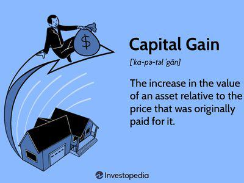

Understanding taxable profit and capital allowances is crucial for businesses aiming to optimize their tax liabilities. Capital allowances allow businesses to deduct certain expenditures related to fixed assets, such as machinery, vehicles, and equipment, from their taxable profits. This tax relief mechanism not only reduces taxable income but also influences the profit recorded in fiscal documents. Given the intricacies of tax legislation, staying informed about these allowances is pivotal for effective tax planning.

This article examines the relationship between capital allowances, taxable profit, tax deductions, and algorithmic trading. In the context of the modern financial landscape, algorithmic trading represents a significant development. Utilizing sophisticated algorithms to execute trading strategies rapidly and efficiently, it plays a substantial role in today's markets. Recognizing how capital expenditure in algorithmic trading systems can qualify for allowances is essential. This understanding can enable businesses to reduce their taxable profits, optimize cash flow, and improve overall tax efficiency.

With tax laws continually evolving, businesses must remain agile in adapting to changes and maximizing tax opportunities. By effectively claiming tax deductions and allowances, firms engaged in algorithmic trading can achieve favorable tax positions. This section provides an overview that sets the groundwork for understanding the mechanisms and implications of tax planning in today's complex trading environments.

## Table of Contents

## Understanding Capital Allowances

Capital allowances are a form of tax relief that businesses can claim to account for the depreciation of certain fixed assets. These allowances serve as deductions from taxable profits, enabling businesses to reclaim a portion of their capital expenditure. Essentially, capital allowances reduce the amount of taxable income a company declares, which can significantly lower its overall tax burden.

The primary fixed assets applicable for such allowances include machinery, vehicles, and equipment. These assets are crucial to business operations, and their depreciation reflects the reduction in value over time due to wear and tear or obsolescence. By claiming capital allowances, businesses can offset this depreciation against their taxable income.

Several types of capital allowances are available to cater to different asset categories and business needs. The Annual Investment Allowance (AIA) is one such type, providing 100% tax relief on qualifying purchases up to a specified limit within a financial year. This immediate deduction makes AIA particularly advantageous for businesses making significant capital investments, as it allows them to recover the costs rapidly.

Another type is the Writing Down Allowance (WDA), which spreads the tax relief over several years, reflecting the actual depreciation of assets. Unlike AIA, which offers immediate full deduction, WDA applies when the total expenditure exceeds the AIA limit or for assets that do not qualify for AIA. For instance, certain long-life assets or integral features of a building may be subject to WDA. The allowance provides a percentage of the remaining value of the assets each year as a deduction from taxable income.

By understanding these mechanisms, businesses can make informed decisions regarding asset investment and tax planning. Knowing the appropriate allowance to claim ensures effective cost management and maximizes fiscal benefits. For example, businesses can strategically time their asset acquisitions to fully utilize available allowances, thus optimizing their tax efficiency.

Overall, understanding capital allowances is critical for businesses aiming to manage their taxation effectively. By utilizing these deductions accurately, companies can improve their cash flow and support long-term financial planning. This strategy not only supports compliance with tax regulations but also enhances a company's ability to invest in vital growth-inducing assets.

## Taxable Profit and Tax Deductions

Taxable profit represents the amount of profit on which a business is obligated to pay tax, derived after applying all allowable deductions from its gross profit. The gross profit is calculated by subtracting the cost of goods sold (COGS) from total revenue. Allowable deductions include various expenses essential for accurately reflecting a company's financial health, one of the most significant being capital allowances.

Capital allowances play a crucial role in reducing taxable profit by accounting for the depreciation of fixed assets. Depreciation refers to the decline in value of an asset over time due to wear and tear or obsolescence. Instead of an outright deduction of a large expense, capital allowances enable businesses to spread the cost of an asset's depreciation over its useful life. This systematic approach adjusts profits to reflect these decreased values, subsequently lowering the taxable amount.

The optimization of taxable income through deductions enables companies to make strategic financial decisions and enhances cash flow management capabilities. For example, businesses can decide on the timing of asset purchases to coincide with fiscal years where tax savings could be maximized. By understanding which expenditures qualify as deductions, businesses can plan ahead to reduce taxable profits.

Accurate calculation and reporting of these deductions are paramount for compliance with tax regulations and to capitalize on cost savings. Failure to comply or an oversight in reporting could result in penalties or the loss of potential deductions. Therefore, businesses must maintain detailed and accurate records of all transactions, especially when claiming capital allowances.

An essential part of this process is distinguishing between taxable profit and gross profit. Gross profit is derived from total revenue minus the cost of goods sold, without considering deductions like operational expenses or capital allowances. Meanwhile, taxable profit is what remains after subtracting all permitted deductions from the gross profit. Properly distinguishing between these figures is critical for accurate financial reporting and ensures the business adheres to financial regulations.

In conclusion, effectively managing taxable profit through the application of allowable deductions is vital for businesses aiming to optimize their tax liabilities and ensure sound financial health.

## Algo Trading and Tax Implications

Algorithmic trading, often referred to as algo trading, relies on advanced computer algorithms to perform trading actions based on pre-set criteria. This technology-driven approach to trading has revolutionized the financial markets, providing increased speed, efficiency, and profitability. However, with the growing prominence of algo trading, understanding its tax implications becomes crucial for traders and businesses.

One of the primary tax considerations in [algorithmic trading](/wiki/algorithmic-trading) is the treatment of capital investments. Investments made into algorithmic trading systems—such as software, hardware, and other technological infrastructures—could qualify as capital expenditures. These capital expenditures can be substantial, and businesses may claim capital allowances on them to reduce their taxable profits. Capital allowances are deductions that account for the depreciation of these assets, effectively lowering tax liabilities.

For example, under various tax regimes, businesses may apply different types of allowances, such as the Annual Investment Allowance (AIA) or Writing Down Allowance (WDA), to deduct a portion of their capital expenditures over time. Such deductions are crucial as they directly affect the taxable profits by reducing the amount subject to taxation.

In addition to capital allowances, it is essential for traders to understand the tax treatment of profits and losses resulting from algo trading activities. Profits from trading are generally considered taxable income, whereas losses might be deductible, dependent on the jurisdiction's rules. The tax treatment can affect the net profitability of trading activities, thus influencing strategic decisions in algorithmic trading setups.

For financial optimization, traders must accurately record and categorize their capital expenditures related to algo trading. This thorough documentation ensures they can substantiate claims for capital allowances and comply with tax regulations. Furthermore, understanding the nuances of how trading gains and losses are accounted for in different jurisdictions can lead to more informed financial planning and potentially advantageous tax outcomes.

In summary, the tax implications of algorithmic trading necessitate careful consideration of both capital investments in trading infrastructure and the tax treatment of trading activities themselves. Proper management and understanding of these aspects can lead to significant tax advantages and optimized trading profitability.

## Maximizing Benefits: Combining Capital Allowances and Trading Gains

Maximizing the benefits from capital allowances can significantly enhance the profitability of algorithmic trading. Businesses can strategically acquire assets and recognize eligible deductions to improve cash flow and optimize tax efficiency. Capital allowances, such as the Annual Investment Allowance (AIA) and Writing Down Allowance (WDA), permit businesses to deduct a portion of the cost of qualifying assets from their taxable profits, providing financial relief and reducing tax liabilities. 

Timing asset acquisitions is crucial in this context. By scheduling purchases at the beginning of a fiscal year, businesses can claim the maximum allowable deduction earlier, thus impacting the current year's taxable profit. This careful timing aligns investment strategies with taxation, resulting in improved cash flows and reduced tax burdens. For instance, purchasing equipment eligible for the AIA towards the start of the fiscal year enables companies to maximize immediate deductions, releasing capital for reinvestment.

Moreover, understanding the eligibility criteria for capital allowances is essential. Qualifying expenditure generally includes a range of assets from machinery and equipment to software essential for algorithmic trading. Accurately calculating these deductions ensures businesses fully capitalize on entitlements and avoid errors that could prompt tax authority scrutiny.

Evaluating the impact of capital allowances on trading profitability involves a comprehensive assessment of both immediate tax savings and the long-term implications for business growth. This analysis aids in developing a strategic fiscal plan that supports sustainable expansion. By considering capital allowances in financial forecasts, businesses can craft a holistic view of their financial health, integrating potential tax benefits into broader trading strategies.

Additionally, an effective approach to leveraging capital allowances requires foresight into future legislative changes. Tax laws often evolve, influencing the available deductions. Staying informed about these changes allows businesses to adapt their financial strategies, ensuring they continue to benefit from available allowances.

Combining capital allowances with algorithmic trading gains presents a unique opportunity for businesses to optimize their tax position. By integrating these fiscal elements, companies can maintain compliance, enhance profitability, and strategically manage resources for sustained financial growth. A proactive financial management approach remains essential for navigating the complexities of tax deductions and securing a favorable business outlook.

## Conclusion: Navigating the Complexities of Tax Deductions

Effectively navigating capital allowances and understanding their tax deduction potential is crucial for financial strategy. For businesses engaged in algorithmic trading, integrating these elements can yield favorable tax positions, thereby enhancing overall profitability. The dynamic nature of algorithmic trading demands a comprehensive approach to financial planning, where capital allowances play a key role in reducing taxable income. By recognizing eligible deductions related to trading technologies and infrastructure, businesses can significantly impact their taxable profits and cash flow.

Staying informed of legislative changes in tax law is essential for businesses to fully capitalize on available allowances. As tax regulations evolve, so do the opportunities to optimize financial outcomes through strategic tax planning. Continuous monitoring of changes in tax policies ensures that businesses remain compliant and maintain access to beneficial allowances. Leveraging these allowances as soon as they are applicable can mean the difference between a substantial tax saving and a missed opportunity.

Strategic planning around capital allowances and trading profits is vital for sustainable business growth. By timing asset acquisitions and leveraging capital investments in trading systems, businesses can align their financial strategies with their growth objectives. Understanding the interplay between trading gains and capital allowances allows for optimized tax positions that can be sustained over the long term.

By taking a proactive approach to financial management, businesses can ensure compliance and financial optimization. This involves not only applying the current understanding of tax deductions but also anticipating future changes and adapting strategies accordingly. Such proactive management aids in achieving a balance between maximizing immediate benefits and maintaining long-term financial health. Ultimately, integrating capital allowances with advanced trading strategies can provide a robust framework for navigating the complexities of tax deductions, ensuring that businesses are well-positioned to thrive in an ever-changing financial landscape.

## References & Further Reading

[1]: Bergstra, J., Bardenet, R., Bengio, Y., & Kégl, B. (2011). ["Algorithms for Hyper-Parameter Optimization."](https://dl.acm.org/doi/10.5555/2986459.2986743) Advances in Neural Information Processing Systems.

[2]: ["Advances in Financial Machine Learning"](https://www.amazon.com/Advances-Financial-Machine-Learning-Marcos/dp/1119482089) by Marcos Lopez de Prado

[3]: ["Evidence-Based Technical Analysis: Applying the Scientific Method and Statistical Inference to Trading Signals"](https://www.amazon.com/Evidence-Based-Technical-Analysis-Scientific-Statistical/dp/0470008741) by David Aronson

[4]: ["Machine Learning for Algorithmic Trading"](https://github.com/stefan-jansen/machine-learning-for-trading) by Stefan Jansen

[5]: ["Quantitative Trading: How to Build Your Own Algorithmic Trading Business"](https://www.amazon.com/Quantitative-Trading-Build-Algorithmic-Business/dp/1119800064) by Ernest P. Chan

[6]: HM Revenue & Customs. ["Capital Allowances (CA): Tax Relief for Your Business."](https://www.gov.uk/government/collections/capital-allowances-detailed-information) UK Government.

[7]: Rohleder, M., & Scholz, H. (2004). ["Performance vs. Profitability: New Insights on the Impact of Taxation on Algorithmic Trading."](https://www.semanticscholar.org/paper/Does-Style-Shifting-Activity-Predict-Performance-Herrmann-Rohleder/05a9529afcc4843213fd710aa7835aef1463a51c) Springer.