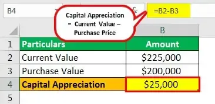

Investing in capital appreciation funds and engaging in algorithmic trading represent two prominent strategies for individuals and institutions seeking financial growth. Both methods offer unique paths toward capital enhancement, incorporating diverse risk factors and reward potential. This article investigates the intricacies of these strategies, emphasizing their risks and opportunities in the quest for financial prosperity.

Capital appreciation funds focus on increasing the value of investments by targeting high-growth equity stocks. These funds appeal to aggressive investors who prioritize capital growth over income generation, positioning themselves to achieve potentially superior market returns. Conversely, algorithmic trading utilizes advanced computer algorithms to execute high-speed trades based on predefined criteria. This approach aims to exploit short-term market fluctuations with a high level of precision and efficiency.



Understanding the mechanics of these strategies is crucial for investors to align their financial pursuits with their long-term goals. A comprehensive analysis of both capital appreciation funds and algorithmic trading provides insight into their strategic structures. By assessing their distinct risk-reward profiles, this article aids investors in determining which method aligns best with their financial objectives.

Overall, a meticulous examination of capital appreciation funds' strategic framework and the precision that characterizes algorithmic trading allows for informed investment decisions. By exploring these strategies, investors can make balanced choices that fit their risk tolerance and financial aspirations.

## Table of Contents

## Understanding Capital Appreciation Funds

Capital appreciation funds are investment vehicles designed to enhance the value of an investor's portfolio predominantly via high-growth equity stocks. The primary objective of these funds is to achieve capital gains by investing in stocks with the potential for substantial price appreciation. These funds are particularly appealing to investors with a higher risk tolerance who seek above-average market returns.

The key characteristic of capital appreciation funds is their focus on growth stocks. Growth stocks are shares in companies expected to grow at an above-average rate compared to others in the market. These companies typically reinvest earnings into expansion, acquisitions, or research and development, rather than paying dividends. As a result, they have the potential to increase significantly in value over time, contributing to the overall appreciation of the fund.

To mitigate risk and stabilize returns, capital appreciation funds often incorporate a strategy that balances [growth stocks](/wiki/growth-stocks) with value stocks. Value stocks are shares considered undervalued based on [fundamental analysis](/wiki/fundamental-analysis), which may involve metrics like the price-to-earnings (P/E) ratio, price-to-book (P/B) ratio, or dividend yield. By including value stocks, fund managers aim to provide a cushion against [volatility](/wiki/volatility-trading-strategies) and preserve capital, which is especially important during bearish market phases.

Investors in capital appreciation funds should be aware that these funds require active management. Fund managers must continually assess market conditions and company performance to ensure that the portfolio aligns with the investment goals. This active management can lead to higher expense ratios compared to passive investment funds, where these costs are lower due to the lack of frequent trading activities.

These funds are suitable for investors pursuing long-term capital growth rather than immediate income generation. Individuals aiming for a diversified portfolio that tilts toward aggressive growth may consider incorporating capital appreciation funds to potentially enhance their financial gains over the long term. The inherent volatility and lack of dividend income in these funds make them more suited for investors comfortable with market fluctuations and willing to invest for a prolonged period to realize capital appreciation.

## Risks of Capital Appreciation Funds

Capital appreciation funds are designed to maximize the potential for growth by focusing on high-growth equity stocks. However, this pursuit of higher returns comes with greater risks than investing in more conservative or passive index funds. These funds require a proactive management approach and thorough due diligence because of their broad mandates, which often include a mix of growth and value stocks to balance appreciation with capital preservation.

One primary risk is their dependence on active management to select stocks that will outperform the market. This active management strategy introduces the risk of human error in decision-making, as fund managers must continually analyze market conditions and adjust portfolios accordingly. Additionally, the active nature of these funds can lead to higher operating costs, which may detract from overall returns.

Another significant risk is market volatility. The value of equity investments in capital appreciation funds is subject to fluctuations due to various factors such as economic indicators, interest rates, and geopolitical events. For example, growth stocks, which are a significant component of these funds, tend to be more volatile compared to value stocks or income investments. This volatility increases the risk of losses, especially during market downturns when growth stocks can suffer sharp declines.

Moreover, investors in capital appreciation funds must consider the broader economic and market risks that could impact the performance of their investments. Equity markets are susceptible to systemic risks, including economic recessions, financial crises, and large-scale geopolitical events that can affect stock prices indiscriminately.

Therefore, while capital appreciation funds offer the potential for substantial returns, they necessitate a higher risk appetite and a proactive, well-informed investment strategy to manage the inherent uncertainties effectively.

 to Algorithmic Trading

Algorithmic trading utilizes complex computer algorithms to automate trading processes, enabling transactions to be executed faster and more efficiently than traditional manual methods. These algorithms make decisions on trading parameters such as timing, price, and quantity, based on predetermined criteria. This systematic approach allows traders to capitalize on market opportunities with speed and precision, effectively addressing short-term market inefficiencies.

The primary advantage of [algorithmic trading](/wiki/algorithmic-trading) is its ability to operate at a speed and frequency that is beyond human capabilities. Sophisticated algorithms can scan and analyze vast amounts of market data in milliseconds, identifying and reacting to price patterns and trends that might be invisible to human traders. This enables investors to capture fleeting opportunities that could result in significant profits.

Investors using algorithmic trading typically exhibit a high-risk tolerance, as the rapid nature of this method involves navigating volatile market events that can lead to swift gains or losses. These traders are often focused on immediate market activity and are prepared for the quick decision-making required by such an approach.

Here's a simple example illustrating an algorithmic trading strategy using Python and the popular library pandas alongside a fictional scenario of moving average crossover strategy:

```python
import pandas as pd

# Fetch historical stock price data (as an example)
data = pd.read_csv('historical_stock_prices.csv')

# Calculate moving averages
data['short_mavg'] = data['Close'].rolling(window=40, min_periods=1).mean()
data['long_mavg'] = data['Close'].rolling(window=100, min_periods=1).mean()

# Generate trading signals
data['signal'] = 0
data['signal'][40:] = np.where(data['short_mavg'][40:] > data['long_mavg'][40:], 1, 0)

# Create positions
data['positions'] = data['signal'].diff()

print(data[['Close', 'short_mavg', 'long_mavg', 'signal', 'positions']])
```

In this example, the algorithm computes two moving averages: a short-term and a long-term average. A buy signal is generated when the short-term moving average crosses above the long-term moving average, indicating a potential upward trend in stock prices. Conversely, a sell signal is generated when the short-term average crosses below the long-term average, suggesting a potential downward trend. This straightforward strategy demonstrates how algorithms can automate the process of identifying trading opportunities based on statistical indicators.

Algorithmic trading also provides the benefit of reducing human error, as it eliminates emotional decision-making, which can be detrimental during turbulent market conditions. However, successful implementation requires an in-depth understanding of both the market mechanics and the technical aspects of coding and data analysis. Proficient algorithmic traders must remain vigilant to the ever-changing market dynamics and diligently manage the perturbations caused by external factors that could impact trading outcomes.

In conclusion, algorithmic trading offers a profound advantage for market participants who can harness its capabilities to enhance trading efficiency and accuracy, provided they possess the requisite expertise and risk appetite.

## Benefits and Challenges of Algorithmic Trading

Algorithmic trading is known for its efficiency in executing trades by leveraging computer algorithms that minimize human intervention, thus reducing the potential for errors associated with manual trading processes. One of the primary advantages is its ability to process large volumes of data quickly, resulting in faster decision-making and the ability to capitalize on minute price differences in the market. This rapid execution speed is paramount in high-frequency trading environments where milliseconds can determine profitability.

A significant benefit of algorithmic trading is its capacity to adhere strictly to predefined trading strategies, eliminating emotional and psychological influences that can often lead to suboptimal decision-making. By executing trades based on quantitative models and predetermined criteria, algorithmic trading fosters a systematic approach that enhances the accuracy and consistency of trade execution.

Despite these advantages, algorithmic trading presents several challenges that require investors to have a comprehensive understanding of market data and the underlying technical aspects. Algorithms must be designed and calibrated to interpret complex market signals effectively, which necessitates profound expertise in quantitative analysis and financial engineering.

Furthermore, the high speed and [volume](/wiki/volume-trading-strategy) of trading activities inherent in algorithmic trading can contribute to market volatility. Investors employing algorithmic strategies must be prepared to navigate rapid fluctuations in market conditions. The potential for 'flash crashes'—sudden, significant market downturns triggered by automated trading—underscores the risks associated with this approach.

Participants must also remain vigilant about regulatory compliance, as financial authorities have stringent rules governing algorithmic trading to prevent market abuse. Implementing adequate risk management protocols and real-time monitoring systems is critical to swiftly addressing any anomalies in trading activities.

Moreover, market dynamics can change rapidly, necessitating constant evaluation and refinement of trading algorithms to ensure their continued effectiveness. Thus, maintaining a competitive edge in algorithmic trading requires robust infrastructure, access to high-quality data, and advanced technological resources.

In conclusion, while algorithmic trading offers significant advantages in terms of speed and accuracy, it demands a deep understanding of both market structures and technical capabilities to effectively manage its inherent challenges.

## Comparative Analysis: Capital Appreciation Funds vs. Algorithmic Trading

Both capital appreciation funds and algorithmic trading offer investors distinct methodologies for approaching market volatility, each with unique risk and reward structures. 

Capital appreciation funds primarily focus on long-term growth by investing in high-growth equity stocks. These funds often aim to deliver above-average market returns by balancing an investment portfolio with a mix of growth and value stocks. This strategy appeals to investors with a higher risk tolerance who are willing to endure short-term market volatility for the potential of substantial long-term gains. The structured nature of this investment approach relies on the fundamental analysis of companies, anticipating that their value will increase over time. The fund manager’s role is crucial in selecting stocks that fit the growth criteria, often seeking companies with robust earnings growth potential, strong market positions, and innovative management.

In contrast, algorithmic trading is a fast-paced strategy targeting short-term gains by executing trades based on pre-defined algorithms. This method is suitable for volatile market conditions, allowing for rapid response to market changes. It appeals to investors favoring agility and precision over the structured, longer-term focus of capital appreciation funds. Algorithmic trading hinges on the ability to process vast amounts of market data and execute orders at speeds beyond human capability. The algorithms are typically based on complex mathematical models and historical data analyses, allowing for the identification of patterns or market inefficiencies that can be exploited for profit.

The key difference between these strategies is their approach to time horizons and risk management. Capital appreciation funds are inherently more stable, leveraging time to mitigate risks and uncertainties inherent in stock investments. Algorithmic trading, however, operates on the principle of exploiting immediate opportunities, often assuming higher risks due to the unpredictability of short-term market movements. The choice between these strategies should align with an investor's financial goals, risk tolerance, and desired level of involvement in the investment process.

A Python snippet to simulate a simple algorithmic trading strategy might look like this:

```python
import numpy as np

def moving_average(prices, window_size):
    return np.convolve(prices, np.ones(window_size), 'valid') / window_size

def algorithmic_trading(prices, short_window=5, long_window=30):
    signals = np.zeros(len(prices))
    short_ma = moving_average(prices, short_window)
    long_ma = moving_average(prices, long_window)
    signals[short_window - 1:] = np.where(short_ma[short_window - 1:] > long_ma, 1.0, 0.0)
    return signals

# Example usage with historical price data
prices = [130, 131, 133, 136, 138, 140, 142, 145, 146, 145]
signals = algorithmic_trading(prices)

print(signals)
```

In this example, the trading strategy generates signals based on a short-term moving average crossing a long-term moving average, indicating potential buy (1.0) or hold/sell (0.0) positions. This simplistic illustration captures the essence of algorithmic trading, which can be significantly more complex in real-world applications.

Thus, while capital appreciation funds offer a strategic and systematic investment approach aimed at achieving growth over time, algorithmic trading provides the potential for immediate gains through rapid and precise market interaction. Each strategy holds merit depending on the investor's specific objectives.

## Practical Examples and Case Studies

### Practical Examples and Case Studies

#### Capital Appreciation Funds

A prominent example of capital appreciation funds is the BlackRock Capital Appreciation Fund, which epitomizes strategies aimed at maximizing capital growth. This fund primarily invests in large, growth-oriented companies, seeking to benefit from rising stock prices. For example, the portfolio may include technology giants and innovative enterprises expected to outperform the broader market. The BlackRock Capital Appreciation Fund is actively managed, which allows the fund managers to periodically adjust the portfolio based on changing market conditions and growth forecasts.

This dynamic management is illustrated by the fund's history of reallocating assets towards high-performing sectors. The fund's performance can be attributed to a rigorous analysis of growth opportunities, evaluating factors like earnings growth potential, market leadership, and competitive advantages within the industries. Diversification across various sectors also helps mitigate risks while aiming for superior long-term returns, which makes it appealing to investors seeking substantial growth over extended periods.

#### Algorithmic Trading

Algorithmic trading has been successfully implemented in various market conditions, proving its efficacy in capturing short-term market anomalies. A notable case study is the "Statistical Arbitrage" strategy employed by trading firms. This approach involves monitoring thousands of stocks simultaneously, identifying pricing inefficiencies, and executing trades to capitalize on temporary market imbalances.

For instance, assume that historical data shows two stocks, A and B, having a mean price ratio. When the actual price ratio deviates from the historical mean, algorithms can simultaneously buy stock A and sell stock B, expecting the ratio to revert to its mean and subsequently profit from the convergence.

In Python, such a strategy could be implemented using the following pseudo-code:

```python
import numpy as np

# Example historical data
historical_ratios = np.array([...])
current_ratio = get_current_price_ratio(stock_A, stock_B)

# Compute the mean and standard deviation of historical ratios
mean_ratio = np.mean(historical_ratios)
std_dev = np.std(historical_ratios)

# Define trading threshold
threshold = mean_ratio + 2 * std_dev

# Execute trades based on deviation
if current_ratio > threshold:
    sell(stock_A)
    buy(stock_B)
else:
    # No action if within threshold
    pass
```

Such algorithmic strategies require robust statistical models and real-time data analysis capabilities. The speed and precision of execution are crucial, often leveraging high-frequency trading technologies to minimize latency.

In summary, capital appreciation funds like the BlackRock Capital Appreciation Fund focus on long-term growth by investing in high-potential equities. In contrast, algorithmic trading strategies aim to exploit short-term market opportunities using advanced technologies and quantitative models. Both methods require a deep understanding of market dynamics to achieve consistent success.

## Choosing the Right Investment Strategy

When choosing the right investment strategy, investors need to consider three critical factors: risk tolerance, financial goals, and the desired level of involvement in managing their investments.

1. **Risk Tolerance**: Risk tolerance is a measure of the degree of variability in investment returns that an individual is willing to withstand. Investors should determine their risk tolerance by considering factors such as their age, income, time horizon for investments, and psychological comfort with risk. 

For example, younger investors might have a higher risk tolerance because they have more time to recover from potential losses, whereas older investors may prefer less volatile investments. One common approach to defining risk tolerance is by constructing a utility function, such as:

$$
U(x) = E(x) - \frac{1}{2} \cdot A \cdot \sigma^2
$$

Where $U(x)$ represents the utility of investment x, $E(x)$ is the expected return, $A$ is the risk aversion coefficient, and $\sigma^2$ is the variance of returns.

2. **Financial Goals**: Investors must also clearly outline their financial objectives. Short-term goals, like saving for a down payment on a house, might require more conservative investments, while long-term goals, such as retirement, may afford opportunities for higher risk investments with potentially higher returns. 

Additionally, setting measurable and time-bound financial goals can help in selecting the appropriate investment vehicles. For instance, leveraging a mix of capital appreciation funds for long-term growth and bonds for stability could provide a balanced approach to achieving a retirement goal over several decades.

3. **Desired Involvement Level**: The extent to which investors wish to be actively involved in their investment decisions is crucial. Some investors want a hands-off approach, preferring to rely on financial advisors and passive investment strategies. Others may enjoy engaging directly with their investments, favoring active fund management or utilizing algorithmic trading to make precise, short-term market moves.

For assistance in making these decisions, personal assessments in combination with consultations from financial advisors can yield tailored investment strategies. Advisors can offer insights into market trends, risk assessments, and optimal asset allocation strategies aligned with individual preferences and market conditions.

Balancing long-term stability with short-term growth is essential for achieving financial objectives. Investors should consider a diversified portfolio approach to mitigate risks while potentially enhancing returns. A well-diversified portfolio can include a mix of capital appreciation funds for continued growth and algorithmic trading to exploit short-term market fluctuations. By carefully considering these factors, investors can craft a strategy that aligns with their personal circumstances and goals, thus maximizing their chances of financial success.

## Conclusion

Incorporating capital appreciation funds and algorithmic trading into investment strategies necessitates a thorough comprehension of their risks and potential returns. Capital appreciation funds focus on long-term growth by investing in high-growth equity stocks. They cater to investors with a higher risk tolerance and an inclination towards potential above-average market returns. However, they also entail market risks due to fluctuations in equity investments and require diligent management.

Algorithmic trading, on the other hand, offers the advantage of executing trades with precision and speed, leveraging sophisticated algorithms designed to identify short-term market opportunities. While this method effectively minimizes human error, it introduces challenges related to understanding complex market data and technical systems. The potential for high volatility and rapid market shifts requires investors to have a sound risk management strategy.

The inclusion of both capital appreciation funds and algorithmic trading in a diversified portfolio can create a balance between long-term stability and short-term gains. The former can provide structured growth, while the latter can adapt to dynamic market conditions. The choice between these strategies should align with individual investment goals, risk tolerances, and the level of involvement each investor wishes to maintain.

Ultimately, personal assessments and professional consultations are invaluable in tailoring these investment approaches to meet specific financial objectives. With informed decisions, investors can optimize their portfolios to achieve desired outcomes while navigating both the opportunities and challenges presented by these investment strategies.

## References & Further Reading

[1]: Bergstra, J., Bardenet, R., Bengio, Y., & Kégl, B. (2011). ["Algorithms for Hyper-Parameter Optimization."](https://dl.acm.org/doi/10.5555/2986459.2986743) Advances in Neural Information Processing Systems 24.

[2]: ["Advances in Financial Machine Learning"](https://www.amazon.com/Advances-Financial-Machine-Learning-Marcos/dp/1119482089) by Marcos Lopez de Prado

[3]: ["Evidence-Based Technical Analysis: Applying the Scientific Method and Statistical Inference to Trading Signals"](https://www.amazon.com/Evidence-Based-Technical-Analysis-Scientific-Statistical/dp/0470008741) by David Aronson

[4]: ["Machine Learning for Algorithmic Trading"](https://github.com/stefan-jansen/machine-learning-for-trading) by Stefan Jansen

[5]: ["Quantitative Trading: How to Build Your Own Algorithmic Trading Business"](https://www.amazon.com/Quantitative-Trading-Build-Algorithmic-Business/dp/1119800064) by Ernest P. Chan