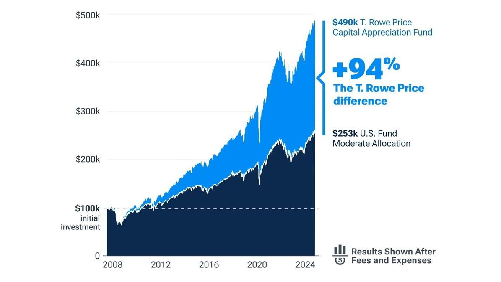

## Table of Contents

## What is a Capital Appreciation Fund?

A Capital Appreciation Fund is a type of mutual fund that aims to grow the value of your investment over time. It does this by investing in stocks and other assets that have the potential to increase in value. The main goal of these funds is not to provide regular income through dividends, but to increase the price of the fund's shares, which means your investment could be worth more in the future.

These funds often invest in companies that are expected to grow quickly. This can include smaller, newer companies or industries that are expanding. Because they focus on growth, Capital Appreciation Funds can be riskier than other types of funds. The value of your investment can go up and down a lot, but if the companies do well, your investment could grow significantly.

## How does a Capital Appreciation Fund differ from other types of funds?

A Capital Appreciation Fund is different from other types of funds because its main goal is to increase the value of your investment over time. It does this by investing in stocks and other assets that are expected to grow in value. Unlike funds that focus on giving you regular income through dividends, a Capital Appreciation Fund aims to make the price of its shares go up. This means you might not get regular payments, but your investment could be worth more in the future.

These funds often invest in companies that are smaller or in industries that are growing quickly. This makes them riskier than other funds, like those that invest in well-established companies or bonds. The value of your investment in a Capital Appreciation Fund can go up and down a lot, but if the companies do well, your investment could grow a lot. In contrast, other funds might focus on stability and regular income, which can be less risky but also might not grow as much over time.

## What are the primary investment goals of a Capital Appreciation Fund?

The main goal of a Capital Appreciation Fund is to make your investment grow in value over time. It does this by investing in stocks and other things that are expected to go up in price. This means the fund tries to increase the value of its shares, so if you own those shares, they could be worth more in the future.

Unlike some other funds that focus on giving you regular payments, like dividends, a Capital Appreciation Fund doesn't aim to provide steady income. Instead, it's all about growth. This can be riskier because the value of your investment can go up and down a lot, but if the companies the fund invests in do well, your investment could grow a lot.

## Who should consider investing in a Capital Appreciation Fund?

People who are okay with taking some risk and want their money to grow over time should think about investing in a Capital Appreciation Fund. These funds are good for folks who don't need to get regular payments from their investments. Instead, they are looking for their investment to be worth more in the future. If you have a long time before you need to use the money, like for retirement, a Capital Appreciation Fund could be a good choice.

These funds can be riskier because they invest in companies that might grow a lot but also might not do well. So, they are not the best for people who need their money to be safe or who might need to use it soon. If you can handle the ups and downs of the stock market and are looking for a way to grow your money over many years, then a Capital Appreciation Fund might be right for you.

## What types of assets are typically included in a Capital Appreciation Fund?

A Capital Appreciation Fund usually invests in stocks of companies that are expected to grow a lot. These are often smaller companies or ones in industries that are expanding quickly. The fund might also put money into stocks of bigger companies that are still growing, but the focus is on finding companies that can increase in value over time.

Besides stocks, these funds might also invest in other things that could go up in value. This could include things like real estate investment trusts (REITs) or even some types of bonds if they think those bonds will increase in price. The main goal is to pick assets that will grow and make the fund's shares worth more in the future.

## How is the performance of a Capital Appreciation Fund measured?

The performance of a Capital Appreciation Fund is measured by looking at how much the value of its shares has grown over time. This is usually shown as a percentage, which tells you how much the fund has increased in value. For example, if the fund's value went up by 10% in a year, that means your investment in the fund grew by 10% during that time. People also compare the fund's performance to other similar funds or to a stock market index, like the S&P 500, to see if it's doing better or worse than others.

Another way to measure the performance is by looking at the fund's total return, which includes any dividends or other income the fund might have received, even though Capital Appreciation Funds usually focus on growth rather than income. It's also important to consider the fund's risk, which is often measured by how much its value goes up and down. A fund that grows a lot but is very risky might not be as good as one that grows a bit less but is more stable. By looking at all these things, you can get a good idea of how well a Capital Appreciation Fund is doing.

## What are the common risks associated with investing in a Capital Appreciation Fund?

Investing in a Capital Appreciation Fund comes with some risks because these funds focus on growth. One big risk is that the value of the fund can go up and down a lot. This is because they often invest in smaller companies or new industries that might not do well. If these companies don't grow as expected, the value of your investment could drop a lot.

Another risk is that Capital Appreciation Funds are usually for the long term. If you need your money back soon, this might not be the best place to put it. The fund might not have grown enough by the time you need to take your money out. Also, since these funds don't give you regular payments like dividends, you won't have any income from them while you wait for the value to go up.

## How can market volatility affect a Capital Appreciation Fund?

Market [volatility](/wiki/volatility-trading-strategies) can really shake up a Capital Appreciation Fund. These funds invest in stocks that are expected to grow a lot, but when the market gets bumpy, the value of those stocks can swing wildly. If the market goes down, the value of the fund's shares can drop a lot, too. This is because the fund is often invested in smaller or newer companies that might not handle market ups and downs as well as bigger, more stable companies.

Because of this, if you're invested in a Capital Appreciation Fund during a time of high market volatility, you might see big changes in how much your investment is worth. It can be stressful to see your money go up and down a lot, but if you can wait it out, the fund might recover and grow again when the market calms down. Just remember, the more the market moves around, the riskier it can be for your investment in a Capital Appreciation Fund.

## What role does asset allocation play in the strategy of a Capital Appreciation Fund?

Asset allocation is really important for a Capital Appreciation Fund because it decides where the fund's money goes. The fund managers pick stocks and other things that they think will grow a lot. They might put most of the money into smaller companies or new industries that are growing fast. By choosing the right mix of assets, they try to make sure the fund's value goes up over time.

But, it's not just about [picking](/wiki/asset-class-picking) stocks that might grow. The fund managers also need to think about spreading the money around to lower the risk. If they put all the money into one kind of stock or industry, and that doesn't do well, the whole fund could lose value. So, they might mix in some other types of investments, like real estate or certain bonds, to balance things out. This way, even if some parts of the market go down, the fund might still do okay.

## How do fees and expenses impact the returns of a Capital Appreciation Fund?

Fees and expenses can eat into the returns of a Capital Appreciation Fund. Every time the fund charges you for managing your money or other costs, it's like taking a little bit away from what you could earn. If the fees are high, they can make a big difference over time, especially since these funds are all about growing your investment. So, the more you pay in fees, the less money you have left to grow.

It's important to look at the expense ratio of a Capital Appreciation Fund, which tells you how much it costs to run the fund each year as a percentage of your investment. A lower expense ratio means you keep more of your money working for you. Over many years, even small differences in fees can add up to a lot, so choosing a fund with lower fees can help your investment grow more.

## What are some advanced strategies used by managers of Capital Appreciation Funds to maximize returns?

Managers of Capital Appreciation Funds often use a strategy called active management to try and pick the best stocks that will grow a lot. They look at lots of information about companies, like how fast they are growing, who is leading them, and what new things they are working on. By choosing stocks that they think will do really well, they hope to make the fund's value go up more than if they just picked stocks randomly. They might also buy and sell stocks more often than other funds, trying to take advantage of short-term changes in the market.

Another strategy they might use is sector rotation, where they move the fund's money into different parts of the economy that they think will do better in the future. For example, if they think technology companies will grow a lot, they might put more money into tech stocks. They keep an eye on what's happening in the world and try to guess where the next big growth will come from. This can be risky because it's hard to predict the future, but if they get it right, it can help the fund grow a lot.

## How can investors mitigate the risks associated with Capital Appreciation Funds?

Investors can lower the risks of Capital Appreciation Funds by spreading their money around. Instead of putting all their money into one fund, they can invest in different types of funds or other investments like bonds. This way, if the Capital Appreciation Fund doesn't do well, they won't lose all their money. It's like not putting all your eggs in one basket. By having a mix of investments, they can balance out the ups and downs of the market and make their overall investment safer.

Another way to reduce risk is to keep a long-term view. Capital Appreciation Funds can go up and down a lot in the short term, but if investors can wait it out, they might see their money grow over many years. It's important not to panic and sell the fund when the market is down. Instead, sticking with the investment for a long time can help smooth out the bumps and give the fund a chance to recover and grow. By being patient and thinking about the future, investors can handle the risks better.

## What is the best way to choose the right investment strategy?

When choosing the right investment strategy, investors need to consider three critical factors: risk tolerance, financial goals, and the desired level of involvement in managing their investments.

1. **Risk Tolerance**: Risk tolerance is a measure of the degree of variability in investment returns that an individual is willing to withstand. Investors should determine their risk tolerance by considering factors such as their age, income, time horizon for investments, and psychological comfort with risk. 

For example, younger investors might have a higher risk tolerance because they have more time to recover from potential losses, whereas older investors may prefer less volatile investments. One common approach to defining risk tolerance is by constructing a utility function, such as:

$$
U(x) = E(x) - \frac{1}{2} \cdot A \cdot \sigma^2
$$

Where $U(x)$ represents the utility of investment x, $E(x)$ is the expected return, $A$ is the risk aversion coefficient, and $\sigma^2$ is the variance of returns.

2. **Financial Goals**: Investors must also clearly outline their financial objectives. Short-term goals, like saving for a down payment on a house, might require more conservative investments, while long-term goals, such as retirement, may afford opportunities for higher risk investments with potentially higher returns. 

Additionally, setting measurable and time-bound financial goals can help in selecting the appropriate investment vehicles. For instance, leveraging a mix of capital appreciation funds for long-term growth and bonds for stability could provide a balanced approach to achieving a retirement goal over several decades.

3. **Desired Involvement Level**: The extent to which investors wish to be actively involved in their investment decisions is crucial. Some investors want a hands-off approach, preferring to rely on financial advisors and passive investment strategies. Others may enjoy engaging directly with their investments, favoring active fund management or utilizing algorithmic trading to make precise, short-term market moves.

For assistance in making these decisions, personal assessments in combination with consultations from financial advisors can yield tailored investment strategies. Advisors can offer insights into market trends, risk assessments, and optimal asset allocation strategies aligned with individual preferences and market conditions.

Balancing long-term stability with short-term growth is essential for achieving financial objectives. Investors should consider a diversified portfolio approach to mitigate risks while potentially enhancing returns. A well-diversified portfolio can include a mix of capital appreciation funds for continued growth and [algorithmic trading](/wiki/algorithmic-trading) to exploit short-term market fluctuations. By carefully considering these factors, investors can craft a strategy that aligns with their personal circumstances and goals, thus maximizing their chances of financial success.

## References & Further Reading

[1]: Bergstra, J., Bardenet, R., Bengio, Y., & Kégl, B. (2011). ["Algorithms for Hyper-Parameter Optimization."](https://dl.acm.org/doi/10.5555/2986459.2986743) Advances in Neural Information Processing Systems 24.

[2]: ["Advances in Financial Machine Learning"](https://www.amazon.com/Advances-Financial-Machine-Learning-Marcos/dp/1119482089) by Marcos Lopez de Prado

[3]: ["Evidence-Based Technical Analysis: Applying the Scientific Method and Statistical Inference to Trading Signals"](https://www.amazon.com/Evidence-Based-Technical-Analysis-Scientific-Statistical/dp/0470008741) by David Aronson

[4]: ["Machine Learning for Algorithmic Trading"](https://github.com/stefan-jansen/machine-learning-for-trading) by Stefan Jansen

[5]: ["Quantitative Trading: How to Build Your Own Algorithmic Trading Business"](https://www.amazon.com/Quantitative-Trading-Build-Algorithmic-Business/dp/1119800064) by Ernest P. Chan