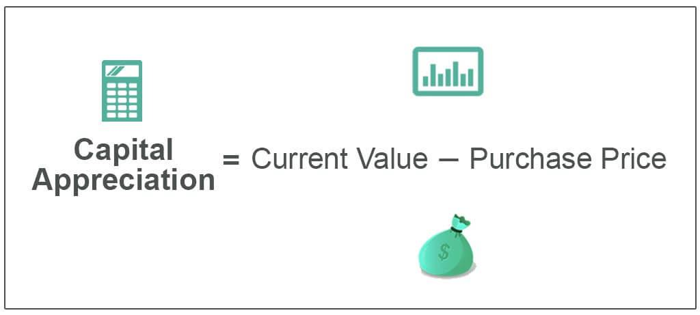

Investment growth has consistently been a primary objective for investors aiming to enhance their financial portfolios. At the core of this pursuit are several key concepts: asset valuation, capital appreciation, and algorithmic trading. These elements are crucial as they interact to form the foundation of successful investment strategies. Asset valuation helps investors determine the true worth of investments, serving as a guide for making informed buying and selling decisions. Capital appreciation, on the other hand, is the increase in the value of an asset and is a fundamental driver of portfolio growth, realized when assets are sold for a profit.

Algorithmic trading, a modern approach, uses computer programs to execute trades with precision and speed beyond human capability. This technology significantly transforms traditional investment techniques by incorporating data-driven decision-making, optimizing returns, and minimizing risks through advanced algorithms. The integration of machine learning and artificial intelligence into these algorithms represents a considerable advancement, providing real-time insights and predictive analytics.



This article thoroughly examines how these individual elements—asset valuation, capital appreciation, and algorithmic trading—interact to contribute to effective investment strategies. Moreover, we explore how technological innovations are redefining investment practices, offering both unprecedented opportunities and nuanced challenges. Our primary objective is to equip investors with a comprehensive understanding that empowers them to make informed decisions in a dynamic financial landscape. As such, this knowledge allows them to harness new tools and strategies to navigate and capitalize on market opportunities effectively.

## Table of Contents

## Understanding Capital Appreciation

Capital appreciation is the increase in the value of an investment asset over time. It represents a critical aspect of capital gains, which are only realized when the asset is sold at a higher price than its purchase cost. Understanding the factors that contribute to capital appreciation is essential for investors seeking to maximize their portfolio's potential.

One of the primary drivers of capital appreciation is market trends. In bullish markets, where investor confidence is high and demand exceeds supply, asset prices typically rise, leading to an increase in their value. Conversely, bearish markets might see a decline in asset value due to decreased demand. Therefore, staying informed about market sentiment and economic cycles can help investors anticipate potential appreciation or depreciation.

Economic indicators are another significant [factor](/wiki/factor-investing) influencing capital appreciation. Metrics such as interest rates, inflation, and gross domestic product (GDP) growth can impact the valuation of assets. For instance, lower interest rates often lead to higher asset prices as borrowing becomes cheaper, stimulating investment. In contrast, high inflation rates can erode purchasing power, potentially curbing capital appreciation unless an asset serves as an inflation hedge, such as real estate or commodities.

Different asset classes also exhibit varying potentials for capital appreciation. Stocks, for instance, offer considerable opportunities for growth, particularly in sectors experiencing innovation or expansion. Real estate can appreciate due to factors like location development and improvements in infrastructure. Commodities, on the other hand, may increase in value based on supply and demand dynamics, geopolitical influences, and currency fluctuations.

Timing is a crucial element in maximizing capital appreciation. Investors must gauge the optimal moments to enter or [exit](/wiki/exit-strategy) markets based on their assessments of current conditions and future projections. This requires a keen analysis of macroeconomic environments and a strategic approach to asset diversification.

In summary, capital appreciation hinges on a complex interplay of market trends, economic indicators, asset class characteristics, and timing. By maintaining a proactive stance and leveraging these insights, investors can enhance their ability to achieve favorable investment outcomes.

## Asset Valuation: Evaluating Investment Potential

Accurate asset valuation is integral to understanding an investment's true worth and is critical for effective investment decision-making. This process involves determining the current value of an asset or a company, guiding investors on whether to buy, hold, or sell an asset based on its perceived future potential. There are several methodologies for conducting asset valuations, each suited to different types of assets and investment strategies.

### Discounted Cash Flow (DCF) Analysis

Discounted Cash Flow (DCF) analysis is a widely used valuation method that estimates the value of an investment based on its expected future cash flows. This approach involves projecting the future cash flows that an asset will generate and then discounting them to their present value using a discount rate, which accounts for the time value of money and investment risk. The formula for DCF is:

$$
\text{DCF} = \sum_{t=1}^{n} \frac{CF_t}{(1 + r)^t}
$$

where:
- $CF_t$ is the cash flow in year $t$,
- $r$ is the discount rate,
- $n$ is the number of periods.

DCF is particularly effective for valuing businesses and investments with predictable cash flows but requires accurate project forecasting and selecting an appropriate discount rate.

### Comparative Market Analysis (CMA)

Comparative Market Analysis (CMA) is another essential method, particularly for real estate and some marketable securities. CMA involves comparing the asset in question with similar assets that have recently been sold within the same market. The core idea is that similar assets should sell for similar prices. This method is less reliant on projections and more focused on current market conditions, offering a snapshot of an asset's current market value based on recent transactions.

### Technological Advancements in Valuation

Recent technological advancements have significantly improved valuation accuracy, with data analytics playing a pivotal role. Machine learning algorithms and big data analytics enable investors to process vast amounts of information quickly and derive real-time insights, helping streamline the valuation process. These technologies allow for more precise adjustments in valuation models, reflecting real-time data inputs and market conditions, which enhances decision-making accuracy.

For example, Python libraries such as Pandas for data manipulation, Scikit-learn for [machine learning](/wiki/machine-learning), and NumPy for numerical computations can be combined to create powerful valuation models. A simple Python implementation might use historical stock data to predict future cash flows, enhancing the DCF analysis accuracy:

```python
import numpy as np
import pandas as pd
from sklearn.linear_model import LinearRegression

# Sample code outline for predicting future cash flows
def predict_cash_flows(historical_data):
    # Assuming historical_data is a DataFrame with columns 'Year' and 'CashFlow'
    X = historical_data['Year'].values.reshape(-1, 1)
    y = historical_data['CashFlow'].values

    model = LinearRegression()
    model.fit(X, y)
    future_years = np.array([2024, 2025, 2026]).reshape(-1, 1)
    predicted_cash_flows = model.predict(future_years)

    return predicted_cash_flows

# Example usage
historical_data = pd.DataFrame({'Year': [2020, 2021, 2022], 'CashFlow': [1000, 1100, 1200]})
predicted_cash_flows = predict_cash_flows(historical_data)

print(predicted_cash_flows)
```

### Best Practices for Asset Valuation

Conducting accurate asset valuations requires adherence to several best practices:
1. **Use multiple valuation methods:** Comparing results from different methodologies, like DCF and CMA, can help ensure a comprehensive evaluation.
2. **Stay updated on market conditions:** Continuous monitoring of market trends and economic indicators is vital for accurate valuations.
3. **Incorporate technology:** Utilize advanced data analytics and machine learning tools to enhance prediction accuracy and speed up the valuation process.
4. **Regularly revise assumptions:** Assumptions regarding discount rates, growth rates, and market conditions should be periodically revisited to reflect current realities.

By employing these practices, investors can make more informed decisions, optimize their portfolio's growth potential, and better manage risk within their investment strategies.

## Algorithmic Trading: A Modern Approach

Algorithmic trading, often referred to as algo trading, utilizes sophisticated computer algorithms to implement and manage trading strategies at speeds and frequencies beyond the capabilities of human traders. These algorithms use pre-defined criteria for executing orders, such as timing, price, or quantity, and can process vast amounts of data and perform trades within milliseconds. This method allows for the execution of high-frequency trades, which are essential in modern financial markets.

One of the fundamental benefits of [algorithmic trading](/wiki/algorithmic-trading) is its ability to execute trades with high precision and minimal human intervention. This level of automation eliminates the emotional biases that often affect investor decisions. Furthermore, algorithms can operate 24/7, taking advantage of trading opportunities in global markets that would otherwise be inaccessible to human traders.

Various strategies are employed in algorithmic trading, each tailored to specific market conditions and investment goals. Some popular strategies include:

1. **Market Making**: This strategy involves placing buy and sell orders to capitalize on the spread between bid and ask prices. By continuously buying and selling on both sides, the algorithm earns a profit from the spread, enhancing liquidity in the market.

2. **Trend Following**: Algorithms based on this strategy are designed to interpret trends in price movements and employ them to execute trades in the direction of the trend. This is achieved through technical indicators such as moving averages and momentum analysis.

3. **Arbitrage**: This strategy seeks to exploit price discrepancies of identical or similar financial instruments on different markets. Algorithms can quickly identify these price differences and execute trades to secure a risk-free profit.

Algorithmic systems optimize returns and mitigate risks using a data-driven approach to decision-making. By relying on large datasets and employing statistical models, algorithms can make informed predictions about future price movements and adjust trading strategies accordingly.

The incorporation of machine learning (ML) and [artificial intelligence](/wiki/ai-artificial-intelligence) (AI) has further revolutionized algorithmic trading. These technologies enable algorithms to adapt to new data patterns and refine their strategies over time without explicit programming. Machine learning models, such as [deep learning](/wiki/deep-learning) networks and [reinforcement learning](/wiki/reinforcement-learning) algorithms, are particularly effective at identifying complex patterns and correlations that traditional statistical models might miss.

For instance, a simple Python script using a popular machine learning library like scikit-learn can be employed to train a model on historical price data, allowing it to predict future trends:

```python
from sklearn.ensemble import RandomForestRegressor
import numpy as np

# Sample historical data
prices = np.array([110, 112, 115, 118, 120])

# Create input features and target label
X = np.arange(len(prices)).reshape(-1, 1)
y = prices

# Initialize and train model
model = RandomForestRegressor(n_estimators=100)
model.fit(X, y)

# Predict future prices
future_prices = model.predict(np.array([[5], [6]]))
print(future_prices)
```

For modern investors, understanding algorithmic trading is critical to maintaining a competitive edge. The ability to leverage technology and harness data insights allows for more informed and timely investment decisions. By integrating these advanced techniques, investors can achieve significant improvements in their trading performance, further enhancing their investment growth potential.

## Integrating Algo Trading with Capital Appreciation Strategies

Algorithmic trading has emerged as a powerful tool for achieving capital appreciation, primarily through its ability to swiftly analyze and respond to market conditions. By utilizing sophisticated algorithms, traders can systematically identify undervalued assets that present opportunities for price growth. This capability is invaluable for investors aiming to maximize returns through capital appreciation.

### Technology and Asset Identification

Algorithmic systems harness large datasets and advanced analytics to monitor and assess market variables. These systems can process vast amounts of financial data, far beyond what a human trader could handle in real time. For example, they may use machine learning models to predict asset price movements based on historical patterns. Consider a simplistic scenario where an algorithm uses linear regression to forecast stock prices:

```python
from sklearn.linear_model import LinearRegression
import numpy as np

# Sample historical price data (e.g., closing prices)
historical_prices = np.array([[1], [2], [3], [4], [5]])
future_days = np.array([5, 6, 7, 8, 9]).reshape(-1, 1)

# Linear regression model
model = LinearRegression()
model.fit(historical_prices, future_days)

# Predict future prices
predicted_prices = model.predict(future_days)
print(predicted_prices)
```

The algorithm can flag potential investments when predicted prices significantly exceed current market values, indicating undervaluation.

### Market Movement Prediction

Algorithms are also adept at predicting broader market trends, enabling traders to capitalize on overall growth. They employ statistical models and artificial intelligence to gauge sentiment and forecast movements. For instance, natural language processing can extract and analyze sentiment from news articles, social media, and financial reports:

```python
from textblob import TextBlob

# Sample news headline
news_headline = "Company X sees significant growth potential in emerging markets."
analysis = TextBlob(news_headline)

# Sentiment analysis
sentiment_score = analysis.sentiment.polarity
print(sentiment_score)
```

Positive sentiment scores from multiple sources might suggest impending price growth, prompting strategic positions in related assets.

### Enhancing Decision-Making Processes

Integrating these algorithmic techniques with traditional investment strategies enriches decision-making processes. While conventional methods rely on economic indicators and company fundamentals, algorithmic tools offer additional layers of data-driven insights. This blend ensures a comprehensive evaluation of potential investments, balancing qualitative assessments with quantitative precision.

### Precision in Execution

The ultimate advantage of combining algorithmic trading with capital appreciation strategies is precision in execution. Algorithms can automatically execute trades based on predefined criteria, ensuring optimal entry and exit points without human error or emotional bias. This is particularly beneficial in volatile markets where rapid responses are critical to securing desired returns.

In conclusion, the integration of algorithmic trading within capital appreciation strategies empowers investors with cutting-edge tools to identify, predict, and capitalize on investment opportunities. This synergy enhances both the scope and accuracy of investment activities, fostering robust growth prospects.

## Challenges and Considerations in Algo Trading

Algorithmic trading, while offering remarkable speed and efficiency, is not devoid of its own set of challenges. One primary concern is the susceptibility to technical failures. The reliance on technological infrastructure means that unforeseen glitches or outages can result in significant financial losses. Furthermore, regulatory compliance is an ever-present consideration. Algo trading must adhere to the guidelines set by financial authorities, which can vary across different jurisdictions, ensuring that trading algorithms do not disrupt market fairness or stability.

A critical aspect of successful algorithmic trading is understanding the [volatility](/wiki/volatility-trading-strategies) and risk intricately associated with these automated systems. Algorithms can amplify market movements, particularly in high-frequency trading settings, leading to increased market volatility. A well-known example is the "flash crash" of May 6, 2010, where the Dow Jones Industrial Average plummeted about 1,000 points within minutes, largely due to algorithmic trading mechanisms. This phenomenon underscores the need for algorithms that can effectively manage risk through adaptive strategies.

Potential pitfalls in algo trading also include model overfitting, where a trading algorithm performs well on historical data but poorly in live trading environments. This risk can be mitigated by employing robust back-testing methods and stress testing across various market conditions. Incorporating machine learning techniques like cross-validation can help ensure that algorithms generalize well to new, unseen data.

Continuous monitoring and adaptation of trading algorithms are vital for maintaining system efficacy. Markets are dynamic and constantly evolving, necessitating the regular updating of algorithms to respond to new trends and data. Real-time monitoring systems can provide immediate alerts for abnormal behavior, enabling timely interventions to prevent substantial losses.

Balancing the precision of automated systems with human judgment is crucial for effective risk management. While algorithms can process and act upon vast amounts of data swiftly, they lack the qualitative insight that experienced traders bring. A combination of algorithmic precision for execution and human oversight for strategic decision-making creates a resilient trading framework. 

In summary, while algorithmic trading offers significant advantages in speed and data processing, it requires careful consideration of technical, regulatory, and strategic challenges. By maintaining continuous oversight, adapting algorithms in response to changing market conditions, and integrating human insight, traders can harness the full potential of algorithmic systems while minimizing associated risks.

## Conclusion

The combination of traditional investment methodologies with modern algorithmic tools is significantly transforming the investment landscape. These changes offer new dimensions for maximizing financial growth and enable investors to harness the full potential of market opportunities. Asset valuation, capital appreciation, and algorithmic trading collectively form a powerful triad that can enhance returns while managing risk.

Asset valuation remains foundational, serving as the starting point for any investment decision. By accurately assessing an investment's worth, investors can better judge opportunities for capital appreciation. Capital appreciation, the increase in an asset's value over time, is driven by market developments and economic indicators. Understanding these dynamics allows investors to make informed predictions about future asset performance.

Algorithmic trading further complements this strategy with its ability to execute trades at high speeds and volumes. These systems incorporate sophisticated algorithms and data-driven insights to identify market trends, optimize entry and exit points, and minimize human error. For investors, the use of algorithmic trading can mean more precise execution of strategies aimed at capital appreciation.

Yet, investors must remain adaptable, as rapid technological changes and market volatility present both opportunities and challenges. Staying informed about the latest advancements in technology while being aware of inherent risks is crucial. Algorithmic systems, while powerful, require continuous monitoring to ensure they align with evolving market conditions. 

Strategic foresight is another essential component, allowing investors to anticipate future trends and position their portfolios accordingly. The fusion of well-established investment principles with cutting-edge technology provides a comprehensive framework for navigating the intricacies of modern markets.

In summary, the integration of traditional and modern strategies equips investors with the tools necessary to successfully manage and grow their portfolios. By staying adaptable and informed, they can effectively capitalize on emerging market opportunities, achieving sustained investment success.

## References & Further Reading

[1]: ["Advances in Financial Machine Learning"](https://www.amazon.com/Advances-Financial-Machine-Learning-Marcos/dp/1119482089) by Marcos Lopez de Prado

[2]: Bergstra, J., Bardenet, R., Bengio, Y., & Kégl, B. (2011). ["Algorithms for Hyper-Parameter Optimization."](https://dl.acm.org/doi/10.5555/2986459.2986743) Advances in Neural Information Processing Systems 24.

[3]: ["Evidence-Based Technical Analysis: Applying the Scientific Method and Statistical Inference to Trading Signals"](https://www.amazon.com/Evidence-Based-Technical-Analysis-Scientific-Statistical/dp/0470008741) by David Aronson

[4]: ["Machine Learning for Algorithmic Trading"](https://github.com/stefan-jansen/machine-learning-for-trading) by Stefan Jansen

[5]: ["Quantitative Trading: How to Build Your Own Algorithmic Trading Business"](https://github.com/LucindaYa/quant-resources/blob/master/Quantitative%20Trading%20How%20to%20Build%20Your%20Own%20Algorithmic%20Trading%20Business.pdf) by Ernest P. Chan