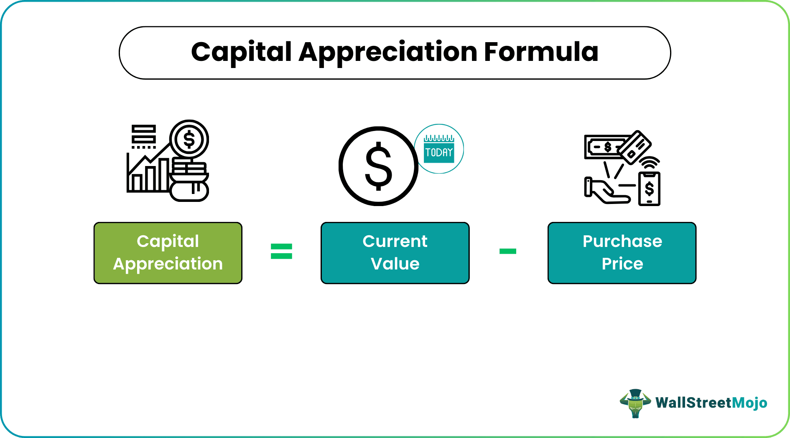

## Table of Contents

## What is capital appreciation?

Capital appreciation is when the value of an investment goes up over time. For example, if you buy a stock for $100 and later it's worth $150, that $50 increase is capital appreciation. It's a way for people to make money without selling their investment. They just hold onto it and wait for its value to grow.

This concept is important for things like stocks, real estate, and other assets. People often look for investments that they think will appreciate in value. But it's not guaranteed. The value can go down too, which is called depreciation. So, it's a bit of a risk, but if it works out, you can end up with more money than you started with.

## How does capital appreciation differ from other types of investment returns?

Capital appreciation is different from other types of investment returns because it's about the increase in the value of your investment over time. When you buy something like a stock or a piece of real estate, you hope that it will be worth more later than when you bought it. If you bought a stock for $100 and it's now worth $150, that $50 increase is your capital appreciation. You don't get this money until you sell the investment, so it's like a potential gain that you're waiting to cash in.

Other types of investment returns, like dividends or interest, give you money more directly. Dividends are payments that companies make to their shareholders, usually from their profits. If you own a stock that pays dividends, you get regular payments without having to sell your stock. Interest is what you earn from things like savings accounts or bonds. It's money that's added to your account over time, based on the amount you've invested. So, while capital appreciation is about the growth in value, dividends and interest are more like regular income from your investments.

## What are the main factors that contribute to capital appreciation?

The main factors that contribute to capital appreciation are demand and supply, as well as the overall performance and growth of the investment. For example, if more people want to buy a stock or a piece of real estate, its price can go up because there aren't enough of them to go around. This is called an increase in demand. On the other hand, if a company is doing well and making more money, its stock price might go up because people believe it's a good investment. The same goes for real estate; if an area becomes popular or gets new developments, property values can rise.

Another [factor](/wiki/factor-investing) is the general state of the economy. When the economy is doing well, people feel confident and are more likely to spend money on investments, which can push up their value. But if the economy is struggling, people might be more cautious and the value of investments could go down. Economic factors like inflation rates, interest rates, and employment levels can all affect how much people are willing to pay for investments, and therefore influence capital appreciation.

Lastly, changes in the market and industry trends can also play a big role. For instance, if a new technology becomes popular, companies that make or use that technology might see their stock prices rise. Or if there's a shift in consumer preferences, like a trend toward sustainable products, companies that fit that trend might see their value go up. These trends can be hard to predict, but they can have a big impact on whether an investment appreciates in value.

## Can you provide examples of assets that typically experience capital appreciation?

Stocks are a common type of asset that can experience capital appreciation. When you buy a stock, you're buying a small piece of a company. If the company does well and makes more money, or if more people want to buy its stock, the price of the stock can go up. For example, if you bought a stock for $50 and it grows to be worth $75, that $25 increase is capital appreciation. You don't get that money until you sell the stock, but it shows how much the value of your investment has grown.

Real estate is another asset that often sees capital appreciation. When you buy a house or a piece of land, its value can go up over time. This can happen if the area becomes more popular, if new businesses or amenities are built nearby, or if there's just more demand for homes in that area. For instance, if you bought a house for $200,000 and a few years later it's worth $250,000, that $50,000 increase is capital appreciation. Like with stocks, you don't get this money until you sell the property, but it shows how the value of your investment has increased.

Art and collectibles can also experience capital appreciation. If you buy a painting or a rare coin, its value might go up over time. This can happen if the artist becomes more famous, if the item becomes rarer, or if more people want to own it. For example, if you bought a painting for $1,000 and later it's worth $5,000, that $4,000 increase is capital appreciation. Again, you don't get this money until you sell the item, but it shows how the value of your investment has grown.

## How can an investor measure capital appreciation?

To measure capital appreciation, an investor needs to look at the difference between the price they paid for an asset and its current market value. For example, if you bought a stock for $100 and it's now worth $150, the capital appreciation is $50. You can find the current market value by checking the latest price of the stock, the estimated value of a piece of real estate, or the auction price of an artwork. This difference shows how much the value of your investment has grown over time.

It's important to remember that capital appreciation is only realized when you sell the asset. Until then, it's just a potential gain. If you keep track of the value of your investments regularly, you can see how they're doing and decide if it's a good time to sell or hold onto them. By comparing the original purchase price to the current value, you can measure the capital appreciation and make informed decisions about your investments.

## What are the risks associated with investing for capital appreciation?

Investing for capital appreciation can be risky because the value of your investment might go down instead of up. This is called depreciation. If you need to sell your investment when its value is low, you could lose money. For example, if you bought a stock for $100 and it drops to $80, selling it at that price means you lose $20. The stock market can be unpredictable, and even good companies can see their stock prices fall due to things like bad news or economic downturns.

Another risk is that you might not be able to sell your investment at the right time. If you're hoping for the value to keep going up, you might wait too long and miss out on selling at a high price. Or, if you need money quickly, you might have to sell when the value is low. This is especially true for assets like real estate, where it can take a long time to find a buyer. Also, some investments, like art or collectibles, can be hard to value accurately, making it tricky to know if you're making a good decision.

## How does inflation impact capital appreciation?

Inflation can make capital appreciation seem smaller than it really is. When prices go up because of inflation, the money you get from selling your investment might not buy as much as it used to. For example, if you bought a stock for $100 and it goes up to $110, that looks like a $10 gain. But if inflation was 5% during that time, the real value of that $110 is less than it seems. So, even though your investment grew, inflation ate away at the value of your gain.

On the other hand, inflation can also help some investments appreciate in value. For things like real estate, inflation can push up the price of homes and land because it costs more to build new ones. If you own a house and its value goes up because of inflation, you could sell it for more money than you paid for it. But you have to be careful because the cost of everything else goes up too, so you need to think about how inflation affects all your money, not just your investments.

## What strategies can investors use to maximize capital appreciation?

To maximize capital appreciation, investors can focus on buying assets that have the potential to grow in value over time. This often means looking for stocks of companies that are growing and doing well. For example, a company that's coming up with new products or entering new markets might see its stock price go up. Another strategy is to invest in real estate in areas that are becoming more popular or are expected to grow. By doing research and [picking](/wiki/asset-class-picking) investments that are likely to increase in value, investors can increase their chances of seeing big gains.

Another way to maximize capital appreciation is to hold onto investments for a long time. This gives them more time to grow in value. For example, if you buy a stock and hold it for many years, it might go up a lot more than if you sold it after just a few months. It's also important to keep an eye on the market and be ready to sell when the time is right. If an investment has grown a lot and you think it might not go up much more, selling it at a high price can lock in your gains. By being patient and making smart decisions about when to buy and sell, investors can make the most of capital appreciation.

## How does the concept of capital appreciation apply to real estate investments?

Capital appreciation in real estate happens when the value of a property goes up over time. If you buy a house for $200,000 and a few years later it's worth $250,000, that $50,000 increase is your capital appreciation. This can happen because more people want to live in that area, or because new businesses and amenities are built nearby, making the area more attractive. Real estate investors look for properties in places where they think the value will go up, hoping to sell them later for a profit.

But real estate isn't always a sure thing. The value of a property can go down if the neighborhood becomes less popular, or if the economy takes a turn for the worse. Also, real estate can be hard to sell quickly, so if you need money fast, you might have to sell at a lower price than you hoped. That's why it's important to do a lot of research and think carefully before buying a property, to make sure it's likely to appreciate in value over time.

## What role does market timing play in achieving capital appreciation?

Market timing is all about trying to buy and sell investments at the right times to make the most money. When you're hoping for capital appreciation, it means you want to buy an asset when its price is low and sell it when the price is high. If you can guess when the market is going to go up or down, you might be able to buy a stock or a house at a good price and then sell it later for a lot more. But guessing the market is really hard, and a lot of people get it wrong.

Even though it's tough, some investors try to time the market by keeping an eye on news and trends. They might buy a stock when they hear good news about a company, thinking the price will go up. Or they might sell a property when they see a lot of people moving into an area, hoping to get a high price. But it's risky because if you guess wrong, you could end up losing money instead of making it. So, while market timing can help with capital appreciation, it's not something everyone can do well, and it's not the only way to make money from investments.

## How do tax considerations affect capital appreciation strategies?

When you're trying to make money from capital appreciation, taxes can make a big difference. If you sell an investment that has gone up in value, you might have to pay capital gains tax on the profit. This tax can take away some of the money you made from the investment growing. Different countries have different rules about how much tax you have to pay, and sometimes it depends on how long you held the investment. If you held it for a long time, you might pay less tax than if you sold it quickly. So, when you're planning your investments, it's smart to think about how taxes will affect your profits.

Another thing to consider is how you can use tax strategies to help with capital appreciation. For example, in some places, you can put money into special accounts like retirement funds where you don't have to pay taxes on the growth of your investments right away. This can let your investments grow more over time because you're not losing money to taxes each year. Also, some investments, like real estate, might have tax benefits like being able to deduct certain expenses. By understanding these tax rules, you can make better choices about when to buy and sell, and how to keep more of the money you make from capital appreciation.

## What are some advanced financial instruments used to leverage capital appreciation?

One advanced financial instrument used to leverage capital appreciation is options. Options give you the right, but not the obligation, to buy or sell an asset at a certain price before a certain time. If you think a stock is going to go up in value, you can buy a call option. This lets you buy the stock at a lower price later, even if the market price goes up a lot. It's like a bet that the stock will appreciate, and if you're right, you can make a lot more money than if you just bought the stock itself. But it's risky because if the stock doesn't go up, you could lose the money you spent on the option.

Another tool is margin trading. This is when you borrow money from your broker to buy more stocks than you could with just your own money. If the stocks go up in value, you can sell them and pay back the loan, keeping the profit. This can make your gains from capital appreciation much bigger because you're using borrowed money to buy more. But it's also very risky because if the stocks go down, you still have to pay back the loan, and you could end up losing more money than you started with. So, while these advanced instruments can help you leverage capital appreciation, they come with a lot of risk and should be used carefully.

## What is Asset Valuation and How Do You Evaluate Investment Potential?

Accurate asset valuation is integral to understanding an investment's true worth and is critical for effective investment decision-making. This process involves determining the current value of an asset or a company, guiding investors on whether to buy, hold, or sell an asset based on its perceived future potential. There are several methodologies for conducting asset valuations, each suited to different types of assets and investment strategies.

### Discounted Cash Flow (DCF) Analysis

Discounted Cash Flow (DCF) analysis is a widely used valuation method that estimates the value of an investment based on its expected future cash flows. This approach involves projecting the future cash flows that an asset will generate and then discounting them to their present value using a discount rate, which accounts for the time value of money and investment risk. The formula for DCF is:

$$
\text{DCF} = \sum_{t=1}^{n} \frac{CF_t}{(1 + r)^t}
$$

where:
- $CF_t$ is the cash flow in year $t$,
- $r$ is the discount rate,
- $n$ is the number of periods.

DCF is particularly effective for valuing businesses and investments with predictable cash flows but requires accurate project forecasting and selecting an appropriate discount rate.

### Comparative Market Analysis (CMA)

Comparative Market Analysis (CMA) is another essential method, particularly for real estate and some marketable securities. CMA involves comparing the asset in question with similar assets that have recently been sold within the same market. The core idea is that similar assets should sell for similar prices. This method is less reliant on projections and more focused on current market conditions, offering a snapshot of an asset's current market value based on recent transactions.

### Technological Advancements in Valuation

Recent technological advancements have significantly improved valuation accuracy, with data analytics playing a pivotal role. Machine learning algorithms and big data analytics enable investors to process vast amounts of information quickly and derive real-time insights, helping streamline the valuation process. These technologies allow for more precise adjustments in valuation models, reflecting real-time data inputs and market conditions, which enhances decision-making accuracy.

For example, Python libraries such as Pandas for data manipulation, Scikit-learn for [machine learning](/wiki/machine-learning), and NumPy for numerical computations can be combined to create powerful valuation models. A simple Python implementation might use historical stock data to predict future cash flows, enhancing the DCF analysis accuracy:

```python
import numpy as np
import pandas as pd
from sklearn.linear_model import LinearRegression

# Sample code outline for predicting future cash flows
def predict_cash_flows(historical_data):
    # Assuming historical_data is a DataFrame with columns 'Year' and 'CashFlow'
    X = historical_data['Year'].values.reshape(-1, 1)
    y = historical_data['CashFlow'].values

    model = LinearRegression()
    model.fit(X, y)
    future_years = np.array([2024, 2025, 2026]).reshape(-1, 1)
    predicted_cash_flows = model.predict(future_years)

    return predicted_cash_flows

# Example usage
historical_data = pd.DataFrame({'Year': [2020, 2021, 2022], 'CashFlow': [1000, 1100, 1200]})
predicted_cash_flows = predict_cash_flows(historical_data)

print(predicted_cash_flows)
```

### Best Practices for Asset Valuation

Conducting accurate asset valuations requires adherence to several best practices:
1. **Use multiple valuation methods:** Comparing results from different methodologies, like DCF and CMA, can help ensure a comprehensive evaluation.
2. **Stay updated on market conditions:** Continuous monitoring of market trends and economic indicators is vital for accurate valuations.
3. **Incorporate technology:** Utilize advanced data analytics and machine learning tools to enhance prediction accuracy and speed up the valuation process.
4. **Regularly revise assumptions:** Assumptions regarding discount rates, growth rates, and market conditions should be periodically revisited to reflect current realities.

By employing these practices, investors can make more informed decisions, optimize their portfolio's growth potential, and better manage risk within their investment strategies.

## References & Further Reading

[1]: ["Advances in Financial Machine Learning"](https://www.amazon.com/Advances-Financial-Machine-Learning-Marcos/dp/1119482089) by Marcos Lopez de Prado

[2]: Bergstra, J., Bardenet, R., Bengio, Y., & Kégl, B. (2011). ["Algorithms for Hyper-Parameter Optimization."](https://dl.acm.org/doi/10.5555/2986459.2986743) Advances in Neural Information Processing Systems 24.

[3]: ["Evidence-Based Technical Analysis: Applying the Scientific Method and Statistical Inference to Trading Signals"](https://www.amazon.com/Evidence-Based-Technical-Analysis-Scientific-Statistical/dp/0470008741) by David Aronson

[4]: ["Machine Learning for Algorithmic Trading"](https://github.com/stefan-jansen/machine-learning-for-trading) by Stefan Jansen

[5]: ["Quantitative Trading: How to Build Your Own Algorithmic Trading Business"](https://github.com/LucindaYa/quant-resources/blob/master/Quantitative%20Trading%20How%20to%20Build%20Your%20Own%20Algorithmic%20Trading%20Business.pdf) by Ernest P. Chan