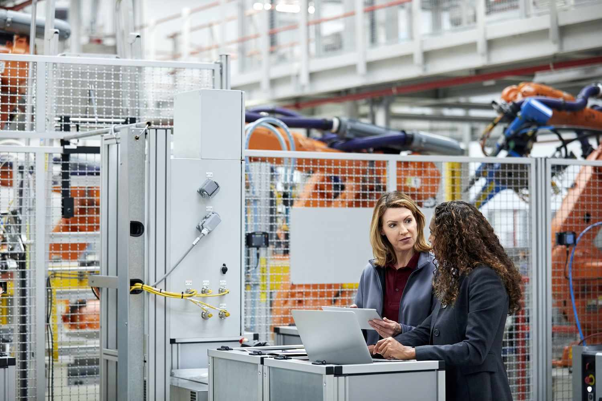

In the modern economy, the intersection of capital, production resources, and economic factors plays a critical role in shaping business outcomes. Algorithmic trading, commonly known as algo trading, is a sophisticated approach to executing trades by leveraging these fundamental economic components. A comprehensive understanding of each of these elements—capital, production resources, and economic factors—is essential for grasping how they collectively influence market dynamics and trading strategies.

Capital, encompassing financial and physical assets, is fundamental to production capabilities across industries. It includes investments in technology, infrastructure, and human expertise—all essential for leveraging advanced trading systems. In algo trading, capital investment underpins the technological infrastructure required for data processing, algorithm development, and execution speed. 

Production resources, including labor, technology, and data, are integral to generating goods and services. In the context of algo trading, these resources are optimized to enhance decision-making and trade execution. Advanced algorithms process vast datasets to identify patterns and opportunities, thereby optimizing the utilization of resources such as computing power and data analytics.

Economic factors, such as market demand, regulatory environments, and macroeconomic trends, critically impact production strategies. Algo trading employs economic indicators to anticipate market movements and adjust trading algorithms accordingly. Variables such as inflation, interest rates, and currency exchange rates are analyzed to fine-tune strategies that align with economic conditions.

Algo trading exemplifies how the integration of economic insights and technological capabilities can yield substantial advantages in decision-making and resource management. By harnessing the interplay between capital, production resources, and economic factors, algo trading enables businesses to execute trades with precision and adapt swiftly to market changes. This convergence underscores the potential of algorithmic systems to enhance production efficiency and maximize financial returns in an ever-evolving economic landscape.

## Table of Contents

## Understanding Capital in Production

Capital plays a pivotal role in the production process, constituting both the financial and physical resources essential for the creation of goods and services. Understanding the multifaceted nature of capital is crucial as it represents various categories that are fundamental at different stages of production.

**Human Capital**: This form of capital refers to the skills, knowledge, and experience possessed by individuals, which are vital for enhancing productivity and innovation. Investment in human capital through education and training is significant, as it not only equips the workforce with necessary competencies but also increases their potential to adapt to technological advancements.

**Physical Capital**: Encompassing tangible assets such as machinery, buildings, and equipment, physical capital is indispensable for manufacturing and service delivery. Its availability and quality are directly related to productivity levels. Advances in technology, particularly automation and artificial intelligence, have transformed how physical capital is utilized. Businesses continuously seek to upgrade their physical capital to maintain competitiveness and meet the demands of modern production environments.

**Financial Capital**: This form of capital includes funds that businesses use for investment and operations. It is crucial for acquiring other types of capital and for fueling expansion plans. The efficiency of financial capital deployment can significantly impact a company's ability to scale production and achieve economies of scale. In the context of algo trading, financial capital is deployed strategically to invest in cutting-edge technology and trading assets, which in turn enhances a firm’s ability to carry out high-frequency trades with precision and speed.

Technological advancements have been instrumental in modifying traditional perceptions of capital. Industries that rely heavily on technology have witnessed a shift towards using advanced analytics, [machine learning](/wiki/machine-learning), and AI, thereby reshaping traditional labor and capital dynamics. This shift is particularly evident in sectors adopting algo trading, where technological infrastructure requires substantial capital investment yet can deliver superior returns.

Reflecting these changes, capital allocation strategies must be adaptive, with considerations for both tangible and intangible assets. Companies are incentivized to invest not only in physical apparatus but also in building robust technological platforms and human capital development. Through effective capital management, organizations can enhance efficiency and scalability of their production efforts, thereby positioning themselves competitively in the marketplace.

## The Role of Production Resources

Production resources are integral to the creation of goods and services, encompassing natural resources, labor, and technology. These elements are the building blocks of any production process and are crucial for achieving efficiency and competitive advantage in the marketplace.

Efficient management of production resources is vital. Proper allocation and optimization can lead to improved outputs and cost savings, thereby enhancing competitiveness. For instance, in manufacturing industries, the use of lean production techniques aims to minimize waste, maximize productivity, and improve product quality by efficiently managing inputs such as raw materials and human capital.

In sectors that rely heavily on automation, technology and data play significant roles in production efficiency. Technological advancements, such as robotics and [artificial intelligence](/wiki/ai-artificial-intelligence), have transformed traditional production processes. Automation reduces the dependency on manual labor, increases precision, and speeds up production cycles. Data, as a resource, is essential in this context. It provides insights for optimizing operations and improving decision-making processes. For example, predictive maintenance algorithms can analyze data from machinery to foresee equipment failures before they occur, thereby preventing costly downtimes.

Algo trading is a prime example of utilizing data as a resource. In such trading systems, vast amounts of market data are processed rapidly to inform trading decisions. Integration of advanced data analytics in algo trading allows for the swift analysis of market conditions, identification of trends, and the execution of strategies that are aligned with predefined criteria. This computational approach enhances the decision-making process, delivering trades with a speed and accuracy beyond the capacity of human traders.

Resource allocation, especially within the digital context, necessitates strategic investment and thoughtful management. Companies must prioritize the development of technological infrastructure and the acquisition of skilled talent to fully exploit production potential. Investment in cloud computing, big data analytics, and cybersecurity are examples of such strategic initiatives that ensure the efficient use of digital resources.

Moreover, the dynamic nature of technology and global markets requires continuous adaptation. Businesses must stay agile, revisiting their strategies to account for technological innovations and shifting economic conditions. By doing so, they can capitalize on emerging opportunities and navigate challenges effectively, ultimately leading to sustained growth and success in a competitive environment.

## Economic Factors Influencing Production

Economic factors such as market demand, regulation, and macroeconomic trends significantly impact production strategies. These elements shape the way businesses plan, execute, and optimize their production processes to meet both immediate and future challenges. Understanding these factors is crucial for businesses seeking to form effective production strategies and maintain competitiveness in fluctuating market conditions.

Inflation rates, interest rates, and exchange rates are critical variables that influence both domestic and international production. Inflation rate, which measures how prices of goods and services rise over time, affects purchasing power and production costs. Higher inflation can lead businesses to increase prices or adjust their production levels to maintain profit margins. For instance, an increase in inflation may result in rising raw material costs, prompting companies to either find ways to cut costs or increase product prices to maintain profitability.

Interest rates, determined by central banks, influence the cost of borrowing capital. When interest rates are low, businesses find it cheaper to finance their operations and invest in new projects or expand existing production facilities. Conversely, high interest rates increase the cost of capital, often resulting in restrained business expenditures and scaling back production initiatives.

Exchange rates, the value of one currency compared to another, affect the competitiveness of exports and the cost of imports. A strong local currency makes imports cheaper but can make exports less attractive on the global market. Businesses need to strategically manage foreign exchange exposure to mitigate risks and capitalize on opportunities presented by currency fluctuations.

Businesses continuously analyze these economic parameters to align their production goals with prevailing economic conditions. Advanced data analytics and forecasting models allow companies to predict changes in these variables and adjust their production strategies accordingly. By integrating these insights into decision-making processes, businesses can better manage resources, optimize production schedules, and enhance their market positioning.

In algo trading, economic indicators are systematically used to predict market behaviors and inform trading algorithms. Traders use algorithms to parse data related to macroeconomic trends, interest rates, and other financial indicators to make informed decisions about buying and selling assets. Algorithms can analyze vast amounts of data significantly faster than human traders, allowing them to react to economic changes almost instantaneously. This capability provides a strategic advantage in rapidly changing markets, where timely decisions are crucial for maximizing returns.

An accurate interpretation of economic data can provide a competitive edge in aligning production with market opportunities. For example, by understanding and predicting consumer demand growth, businesses can scale their production capacity to meet market needs, reducing the risk of overproduction or stockouts. Similarly, by anticipating regulatory changes, companies can adapt operational processes in advance, ensuring compliance and minimizing potential disruptions.

Overall, economic factors are integral to determining production strategies, influencing decisions from cost management to market entry and expansion. By leveraging financial data and economic insights, businesses can navigate complex economic landscapes and drive strategic advantages in their production capabilities.

## Integrating Algo Trading into Production Strategy

Algo trading utilizes algorithmic systems to seamlessly connect financial markets with production strategies, enabling trades at speeds unattainable by human traders. This integration capitalizes on vast amounts of data, employing complex mathematical models to discern lucrative trading opportunities. By processing enormous datasets, algorithmic systems identify trends, correlations, and patterns that inform strategic decisions.

Advanced technologies play a crucial role in this process. They allow businesses to make faster, informed decisions regarding resource allocation and capital investment. For instance, using machine learning algorithms, companies can predict market movements and adjust their production strategies accordingly. This adaptability is key to navigating economic uncertainties and reacting swiftly to market dynamics.

The success of algo trading in production strategy hinges on understanding both financial and production market mechanisms. This dual understanding ensures that the algorithms can align trading activities with production goals, optimizing the allocation of resources and capital. Such integration not only enhances operational efficiency but also maximizes returns by aligning trading activities with strategic production objectives.

In conclusion, the convergence of [algorithmic trading](/wiki/algorithmic-trading) and production strategy provides businesses with sophisticated tools to navigate complex markets. By leveraging algorithms to enhance decision-making processes, companies can effectively manage risks, optimize resource use, and improve their competitive position in dynamic economic landscapes.

## Conclusion

Capital, production resources, and economic factors are fundamental pillars that support efficient production systems. In the context of algo trading, incorporating these elements can facilitate strategic business advantages and enhance execution processes. Algorithmic trading leverages these economic fundamentals to execute trading strategies at speeds and efficiencies unattainable by manual means, thus optimizing market participation.

The integration of economic insights with technological advancements in algorithmic systems enables businesses to scale production and maximize returns significantly. This synthesis allows for data-driven decision-making, enhancing the ability to assess market trends, predict changes, and react to economic indicators swiftly. As algorithmic models become more sophisticated, they provide robust frameworks for evaluating risk and opportunity, allowing firms to allocate resources and capital more effectively.

As market environments continue to evolve, the expansion of algorithmic systems in both production and financial industries is foreseeable. These systems provide the adaptability required to navigate economic uncertainties, ensuring that businesses can maintain competitiveness and responsiveness in dynamic markets. The continual evolution of technology and data analytics underpins the growth of these systems, positioning them as pivotal tools for future operational strategies.

Building an informed strategy that considers these dynamics is crucial for businesses aiming to excel in complex economic landscapes. By understanding the interplay between capital, production resources, and economic factors, businesses can harness algorithmic trading to drive innovation, efficiency, and profitability. The successful implementation of these strategies will position firms to thrive amid the challenges and opportunities presented by ever-changing economic conditions.

## References & Further Reading

[1]: ["Advances in Financial Machine Learning"](https://www.amazon.com/Advances-Financial-Machine-Learning-Marcos/dp/1119482089) by Marcos Lopez de Prado

[2]: ["Evidence-Based Technical Analysis: Applying the Scientific Method and Statistical Inference to Trading Signals"](https://www.amazon.com/Evidence-Based-Technical-Analysis-Scientific-Statistical/dp/0470008741) by David Aronson

[3]: ["Machine Learning for Algorithmic Trading"](https://github.com/stefan-jansen/machine-learning-for-trading) by Stefan Jansen

[4]: ["Quantitative Trading: How to Build Your Own Algorithmic Trading Business"](https://github.com/LucindaYa/quant-resources/blob/master/Quantitative%20Trading%20How%20to%20Build%20Your%20Own%20Algorithmic%20Trading%20Business.pdf) by Ernest P. Chan

[5]: Bergstra, J., Bardenet, R., Bengio, Y., & Kégl, B. (2011). ["Algorithms for Hyper-Parameter Optimization."](https://dl.acm.org/doi/10.5555/2986459.2986743) Advances in Neural Information Processing Systems 24.