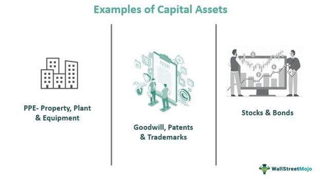

## Table of Contents

## What is a capital asset?

A capital asset is something you own that has value and can be used to make money or grow in value over time. This can include things like houses, cars, stocks, and even artwork. These assets are important because they can help you build wealth and provide financial security.

When you own a capital asset, you might be able to sell it for more money than you paid for it, which is called a capital gain. For example, if you buy a stock for $100 and later sell it for $150, you have a capital gain of $50. On the other hand, if you sell it for less than you paid, you have a capital loss. Understanding how capital assets work can help you make smart financial decisions.

## Can you provide examples of common capital assets?

Common capital assets include things like houses and real estate. When you own a house, it can go up in value over time. You can also rent it out to others and earn money from it. Another example is land. If you buy a piece of land, you might be able to sell it later for more money or use it to build something that can make money.

Stocks and bonds are also common capital assets. When you buy stocks, you own a small part of a company. If the company does well, the value of your stocks can go up. Bonds are like loans you give to a company or government, and they pay you back with interest. Both stocks and bonds can help you earn money over time.

Other examples include vehicles like cars and trucks, especially if they are used for business. Artwork and collectibles can also be capital assets. If you buy a painting or a rare coin, its value might increase over time, and you can sell it for a profit. These are all ways that capital assets can help you build wealth.

## How do capital assets differ from other types of assets?

Capital assets are different from other types of assets because they are usually things that you own for a long time and that can grow in value. They are often used to make money or to help you build wealth over time. For example, if you buy a house, it's a capital asset because you can live in it, rent it out, or sell it later for more money. Other types of assets, like cash or inventory in a store, are used more for day-to-day needs and don't usually grow in value over time.

Another way capital assets differ is how they are treated for taxes. When you sell a capital asset, you might have to pay a special tax called a capital gains tax if you make a profit. This is different from other assets, like your salary or the money you earn from a regular job, which are taxed as income. Understanding the difference between capital assets and other types of assets can help you make better financial decisions and plan for your future.

## Why are capital assets important for businesses?

Capital assets are important for businesses because they help the business make money and grow. When a business buys things like machines, buildings, or vehicles, these are capital assets. They can use these assets to make their products, deliver them to customers, or even rent them out for extra income. For example, a bakery might buy an oven as a capital asset. This oven helps the bakery make more cakes and bread, which means more sales and more money for the business.

Capital assets also help businesses plan for the future. Because these assets can grow in value over time, they can be sold later for more money than the business paid for them. This can give the business extra cash to invest in new projects or to help it through tough times. Plus, when businesses show they own valuable capital assets, it can make them look more stable and attractive to investors, which can help them get more money to grow even bigger.

## How are capital assets recorded in accounting?

In accounting, capital assets are recorded on a company's balance sheet. When a business buys a capital asset, like a machine or a building, it doesn't count it as an expense right away. Instead, it lists the asset at its cost on the balance sheet under a section called "Property, Plant, and Equipment" or "Fixed Assets." This shows how much the business spent to get the asset.

Over time, capital assets wear out or get used up. This is called depreciation. Businesses spread out the cost of the asset over its useful life. Each year, they record a part of the asset's cost as an expense on the income statement. This helps show how the asset is being used to make money for the business. At the same time, they also keep track of how much the asset is worth on the balance sheet, which goes down a little bit each year because of depreciation.

## What is depreciation and how does it apply to capital assets?

Depreciation is a way to spread out the cost of a capital asset over the time it's used. When a business buys something big like a machine or a building, it doesn't count the whole cost as an expense right away. Instead, it divides the cost over the years the asset will be useful. This helps show how the asset is helping the business make money little by little.

Each year, a part of the asset's cost is recorded as an expense on the income statement. This is called depreciation expense. At the same time, the value of the asset on the balance sheet goes down a bit each year. This way, the business can see how much the asset is worth now and how much it has already helped the business.

## How do tax regulations affect the management of capital assets?

Tax regulations can really change how businesses handle their capital assets. When a business buys a capital asset, it can't just write off the whole cost right away for taxes. Instead, they have to spread it out over time, which is called depreciation. The tax rules decide how fast or slow this happens, and this can affect how much tax a business has to pay each year. If the rules let them write off the cost faster, they can save on taxes sooner, which can help them have more money to use for other things.

Also, when a business sells a capital asset, they might have to pay a special tax called capital gains tax if they make a profit. The tax rules decide how much this tax will be, and this can make a big difference in whether selling the asset is a good idea. Sometimes, businesses might hold onto an asset longer than they need to, just to avoid paying a big tax bill. Understanding these tax rules helps businesses plan better and make smarter choices about buying, using, and selling their capital assets.

## What is the difference between tangible and intangible capital assets?

Tangible capital assets are things you can touch and see, like buildings, machines, and vehicles. These are physical items that a business uses to make money. For example, a bakery's oven is a tangible asset because it's used to bake goods and it's something you can see and touch. Tangible assets often lose value over time through wear and tear, and businesses can spread out the cost of these assets over their useful life through a process called depreciation.

Intangible capital assets, on the other hand, are things you can't touch or see, like patents, trademarks, and goodwill. These are non-physical assets that still have value and can help a business make money. For instance, a company's brand name is an intangible asset because it can attract customers and increase sales, even though you can't touch it. Unlike tangible assets, intangible assets don't usually wear out physically, but they can lose value if they become less useful or if the business loses its reputation.

## How can the value of capital assets be appraised?

The value of capital assets can be appraised in different ways, depending on what kind of asset it is. For tangible assets like buildings or machines, an appraiser might look at the asset's condition, how old it is, and what similar assets are selling for in the market. They might also think about how much it would cost to replace the asset if it were new. This helps them figure out how much the asset is worth right now.

For intangible assets like patents or trademarks, appraising their value can be trickier. An appraiser might look at how much money the asset helps the business make, or how much it might cost to create a similar asset from scratch. They could also check if other businesses have bought similar intangible assets and for how much. This gives them an idea of the asset's value, even though it's not something you can touch or see.

## What strategies can businesses use to manage and optimize their capital assets?

Businesses can manage and optimize their capital assets by keeping track of them carefully. They should know what assets they have, how old they are, and how well they are working. Regular check-ups and maintenance can help keep the assets in good shape and working well. If an asset is not being used much, the business might think about selling it or using it for something else. This way, they can make sure their money is being used in the best way possible.

Another strategy is to plan for the future. Businesses should think about when they might need to replace their assets and start saving money for that. They can also look for ways to use their assets to make more money, like renting out extra space in a building or using a machine for more than one job. By thinking ahead and using their assets smartly, businesses can make the most out of what they own and keep growing.

## How do capital asset pricing models work and what are their limitations?

Capital asset pricing models help figure out how much return, or profit, an investor should expect from an investment like a stock. These models look at how risky the investment is and compare it to a safe investment like a government bond. The idea is that if an investment is riskier, it should offer a higher return to make up for that risk. The most common model is called the Capital Asset Pricing Model (CAPM), which uses something called the "beta" to measure how much the price of a stock goes up and down compared to the whole market. If a stock's price moves a lot more than the market, it's considered riskier and should offer a bigger return.

These models are useful for making decisions about where to invest money, but they have some limits. One big problem is that they assume everyone thinks about risk and return in the same way, which isn't true. People have different ideas about what's too risky or not risky enough. Also, these models can be hard to use because they need a lot of information that's not always easy to get. For example, figuring out the right "beta" for a stock can be tricky, and small changes in the numbers can make a big difference in the results. So, while capital asset pricing models can be helpful, they're not perfect and should be used carefully.

## What role do capital assets play in long-term investment and financial planning?

Capital assets are really important for long-term investment and financial planning. They are things like houses, stocks, and even artwork that can grow in value over time. When you own these assets, you can use them to make money or sell them later for more than you paid. This helps you build wealth slowly but surely. For example, if you buy a house and its value goes up, you can sell it later and use that money to buy another house or invest in other things. This way, your money keeps working for you and growing over the years.

In financial planning, capital assets help you plan for the future. They can give you a steady income if you rent them out, like a house or a piece of land. They also help you save for big goals, like retirement, because they can be worth a lot more later. By thinking about which capital assets to buy and when to sell them, you can make smart choices that help you reach your financial goals. It's all about using these assets wisely to make your money grow and keep you financially secure in the long run.

## What is the understanding of capital assets?

Capital assets are integral components of both personal and business finance, representing tangible and intangible properties utilized to generate long-term income. Such assets include real estate, machinery, and financial investments like stocks and bonds. In corporate contexts, capital assets are pivotal for operational longevity, enabling firms to strengthen their financial standing over time. 

In business operations, capital assets undergo procurement and management processes that account for depreciation and appreciation to assess their value over time. Depreciation, typically applied to tangible capital assets such as machinery or buildings, is an allocation of the asset's cost over its useful life. This allocation is calculated using methods like straight-line depreciation or reducing balance. For instance, the straight-line method is expressed by the formula:

$$
\text{Depreciation Expense} = \frac{\text{Cost} - \text{Salvage Value}}{\text{Useful Life}}
$$

where the cost is the purchase price of the asset, salvage value is the estimated residual value at the end of its useful life, and useful life is the expected time period over which the asset will generate revenue.

Capital assets also include financial instruments like stocks and bonds. Stocks represent ownership in a corporation and can yield revenue through dividends and appreciation. Bonds are debt instruments that provide periodic interest income and return of principal upon maturity.

A key distinction between capital and ordinary assets lies in their longevity and strategic business role. Capital assets have a longer useful life and contribute to strategic business goals, such as growth and expansion, while ordinary assets are typically held for short-term gain or utilization.

Understanding these differences is crucial for proper asset classification in financial statements. Capital assets are typically recorded on the balance sheet and are subject to different tax treatments compared to ordinary assets. For example, capital gains, resulting from the sale of capital assets for more than their purchase price, are taxed differently from ordinary income.

The multifaceted nature of capital assets requires keen management and strategic planning. Businesses must assess both tangible and intangible assets' performance and align them with long-term corporate objectives. This holistic approach ensures that capital assets effectively support sustained revenue generation and contribute to the entity's financial health.

## References & Further Reading

[1]: ["Advances in Financial Machine Learning"](https://www.amazon.com/Advances-Financial-Machine-Learning-Marcos/dp/1119482089) by Marcos Lopez de Prado

[2]: ["Evidence-Based Technical Analysis: Applying the Scientific Method and Statistical Inference to Trading Signals"](https://www.amazon.com/Evidence-Based-Technical-Analysis-Scientific-Statistical/dp/0470008741) by David Aronson

[3]: ["Machine Learning for Algorithmic Trading"](https://github.com/stefan-jansen/machine-learning-for-trading) by Stefan Jansen

[4]: Bergstra, J., Bardenet, R., Bengio, Y., & Kégl, B. (2011). ["Algorithms for Hyper-Parameter Optimization."](https://dl.acm.org/doi/10.5555/2986459.2986743) Advances in Neural Information Processing Systems 24.

[5]: ["Quantitative Trading: How to Build Your Own Algorithmic Trading Business"](https://www.amazon.com/Quantitative-Trading-Build-Algorithmic-Business/dp/1119800064) by Ernest P. Chan