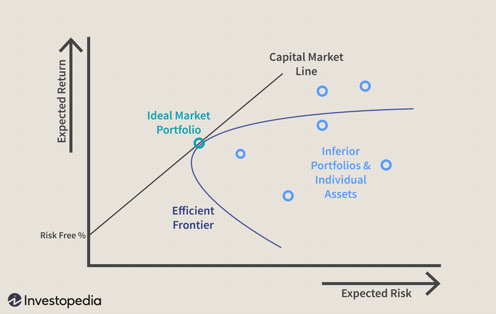

## Table of Contents

## What is the Capital Asset Pricing Model (CAPM)?

The Capital Asset Pricing Model, or CAPM, is a way to figure out how much risk and reward come with investing in a certain asset, like a stock. It helps investors understand if the expected return on an investment is worth the risk. CAPM uses a formula that looks at the risk-free rate of return, which is what you'd get from a very safe investment like a government bond, and compares it to the expected return of the market as a whole. It also considers how much the specific asset moves with the market, which is called the asset's beta.

In simple terms, CAPM helps answer the question: "Is this investment worth it?" If an investment has a high risk but the expected return isn't much higher than the risk-free rate, it might not be a good choice. On the other hand, if the expected return is significantly higher and justifies the risk, it could be a good investment. By using CAPM, investors can make smarter decisions about where to put their money, balancing the potential rewards against the risks involved.

## What is the Security Market Line (SML) and how is it related to CAPM?

The Security Market Line, or SML, is a line on a graph that shows the relationship between the risk of an investment and its expected return. It's a tool that helps investors see if an investment is a good deal or not. The SML starts at the risk-free rate, which is the return you get from super safe investments like government bonds, and it goes up as the risk, measured by beta, increases. The slope of the SML represents the market risk premium, which is the extra return investors expect for taking on more risk.

The SML is closely related to the Capital Asset Pricing Model (CAPM) because it's actually a visual representation of the CAPM formula. In CAPM, you calculate the expected return of an asset using the risk-free rate, the asset's beta, and the market risk premium. The SML shows this calculation on a graph, where each point on the line represents the expected return for a given level of risk. If an investment lies above the SML, it's considered undervalued because its expected return is higher than what the CAPM predicts for its level of risk. If it's below the line, it's overvalued. So, the SML helps investors use CAPM to make quick judgments about the value of different investments.

## How do you calculate the expected return of an asset using CAPM?

To calculate the expected return of an asset using the Capital Asset Pricing Model (CAPM), you need three pieces of information: the risk-free rate, the asset's beta, and the market risk premium. The risk-free rate is the return you get from a very safe investment, like a government bond. The asset's beta tells you how much the asset's price moves compared to the market. A beta of 1 means the asset moves just like the market, while a beta greater than 1 means it's more sensitive to market changes, and less than 1 means it's less sensitive. The market risk premium is the extra return investors expect for taking on the risk of investing in the market instead of a risk-free asset.

Once you have these three pieces, you can use the CAPM formula to find the expected return. The formula is: Expected Return = Risk-Free Rate + (Beta x Market Risk Premium). For example, if the risk-free rate is 2%, the asset's beta is 1.5, and the market risk premium is 5%, the expected return would be 2% + (1.5 x 5%) = 2% + 7.5% = 9.5%. This means, according to CAPM, you should expect a 9.5% return from this asset to make it worth the risk you're taking.

## What is beta in the context of CAPM and how is it used?

Beta in the context of the Capital Asset Pricing Model (CAPM) is a number that shows how much an investment moves up or down compared to the whole market. If an investment has a beta of 1, it moves exactly the same as the market. If the beta is more than 1, like 1.5, the investment goes up or down more than the market does. If the beta is less than 1, like 0.5, the investment moves less than the market. A beta of 0 means the investment doesn't move with the market at all, and a negative beta means the investment moves in the opposite direction of the market.

In CAPM, beta is used to figure out how much extra return you should expect from an investment because of its risk. The formula for CAPM takes the risk-free rate, which is what you'd get from a super safe investment like a government bond, and adds to it the product of the investment's beta and the market risk premium, which is the extra return you expect from the market. So, if an investment has a high beta, you'll expect a higher return to make it worth the extra risk. This helps investors decide if the potential reward of an investment is worth the risk they're taking.

## Can you explain the risk-free rate and market risk premium in CAPM?

The risk-free rate in CAPM is the return you get from an investment that's considered super safe, like a government bond. It's the starting point for figuring out how much return you should expect from other investments. The idea is that if you're going to take on more risk with a different investment, you should expect to get more return than you would from this safe investment. So, the risk-free rate is like a benchmark that helps you see if other investments are worth the extra risk.

The market risk premium in CAPM is the extra return you expect to get from investing in the market instead of sticking with the risk-free investment. It's the reward you get for taking on the risk of the market. To find it, you take the expected return of the whole market and subtract the risk-free rate. This number shows how much more return you should expect for the risk you're taking by investing in the market. Together with the risk-free rate and an investment's beta, the market risk premium helps you figure out if an investment is a good deal or not.

## How does CAPM help in making investment decisions?

CAPM helps investors make smart choices about where to put their money by showing them if an investment is worth the risk. It does this by figuring out the expected return of an investment, which is how much money you might make from it. CAPM uses a formula that looks at the risk-free rate, which is what you'd get from a very safe investment like a government bond, and compares it to the expected return of the whole market. It also considers how much the specific investment moves with the market, which is called the investment's beta. By using these pieces of information, CAPM tells you if the expected return of an investment is high enough to make the risk worth it.

For example, if an investment has a high risk but the expected return isn't much higher than the risk-free rate, it might not be a good choice. On the other hand, if the expected return is significantly higher and justifies the risk, it could be a good investment. By using CAPM, investors can compare different investments and see which ones offer the best balance of risk and reward. This helps them make better decisions about where to invest their money, making sure they're not taking on too much risk for too little reward.

## What are the assumptions underlying the CAPM?

CAPM is based on some key ideas that help it work. One big idea is that investors want to get the most return for the least amount of risk. This means they'll pick investments that give them the best balance between how much they might make and how much they might lose. Another idea is that all investors can borrow and lend money at the same risk-free rate, like the rate you'd get from a government bond. This helps keep things fair when comparing different investments.

Another important assumption is that everyone can buy and sell investments easily without affecting their price. This means the market is super efficient and everyone has the same information about investments. Also, CAPM assumes that all investors think about risk and return in the same way, using the same time period to make their decisions. These ideas help CAPM work by making sure everyone is on the same page when they're figuring out if an investment is worth the risk.

## What are the limitations and criticisms of CAPM?

CAPM has some problems that people point out. One big problem is that it's hard to find the right numbers to use in the formula. The risk-free rate and the market risk premium can change a lot, and it's tough to know what they'll be in the future. Also, figuring out an investment's beta can be tricky because it depends on past data, which might not tell us much about what will happen next. This makes it hard to trust the expected return that CAPM gives us.

Another criticism is that CAPM assumes everyone thinks about risk and return the same way, which isn't true in real life. People have different ideas about what's risky and what's not, and they might not all agree on what the market return will be. Plus, CAPM doesn't take into account other kinds of risk, like the risk that comes from a company's specific problems, not just how it moves with the market. This means CAPM might not give a full picture of an investment's risk and reward.

## How does CAPM differ from other asset pricing models like the Arbitrage Pricing Theory (APT)?

CAPM and Arbitrage Pricing Theory (APT) are both ways to figure out how much return you should expect from an investment, but they do it differently. CAPM says that the expected return of an investment depends on how risky it is compared to the whole market. It uses the risk-free rate, which is what you'd get from a super safe investment like a government bond, and adds to it the extra return you expect from the market based on the investment's beta. Beta tells you how much the investment moves up or down with the market. So, CAPM is pretty simple because it only looks at one kind of risk, which is how the investment moves with the market.

APT, on the other hand, is a bit more complicated. It says that the expected return of an investment can be affected by lots of different things, not just how it moves with the market. These things are called factors, and they could be anything from inflation to changes in oil prices. APT uses a formula that looks at how sensitive the investment is to each of these factors. This means APT can give you a more detailed picture of an investment's risk and return, but it's also harder to use because you need to know what all these factors are and how they affect the investment. So, while CAPM is simpler and easier to use, APT might give you a better understanding of an investment's risks.

## How can CAPM be applied in portfolio management?

CAPM can be really helpful for people who manage a bunch of investments, like in a portfolio. It helps them figure out if the expected return from each investment is worth the risk they're taking. By using CAPM, portfolio managers can look at each investment's beta, which tells them how much that investment moves with the market. If an investment has a high beta, it means it's riskier, and the manager will expect a higher return to make it worth the risk. This way, they can choose investments that offer the best balance of risk and reward, making sure the whole portfolio is set up to do well.

Portfolio managers can also use CAPM to compare different investments and see which ones are undervalued or overvalued. If an investment's expected return is higher than what CAPM says it should be for its level of risk, it might be a good deal. On the other hand, if the expected return is lower than what CAPM predicts, it might not be worth the risk. By using CAPM, managers can make smarter choices about which investments to keep, which to sell, and which new ones to buy, helping them build a portfolio that's more likely to meet their goals.

## What are some real-world examples of CAPM application in financial markets?

In the financial world, CAPM is often used by investment analysts and portfolio managers to make decisions about stocks. For example, a financial analyst at a big investment firm might use CAPM to figure out if a certain stock is a good investment. They would look at the stock's beta, which shows how much the stock's price moves with the market. If the stock has a high beta, the analyst would expect a higher return to make up for the extra risk. By comparing the stock's expected return to what CAPM predicts, the analyst can decide if the stock is undervalued or overvalued, helping them advise clients on whether to buy or sell the stock.

Another real-world example is how mutual fund managers use CAPM to manage their funds. A fund manager might use CAPM to build a portfolio that balances risk and reward. They would look at the betas of different stocks and other investments in their fund, and use CAPM to calculate the expected return for each one. If a stock's expected return is higher than what CAPM suggests it should be for its level of risk, the manager might decide to keep or buy more of that stock. On the other hand, if a stock's expected return is lower than what CAPM predicts, the manager might sell it to improve the overall performance of the fund. This way, CAPM helps fund managers make informed decisions to maximize returns for their investors.

## How do changes in macroeconomic factors affect the parameters of CAPM?

Changes in macroeconomic factors can really shake up the parameters of the Capital Asset Pricing Model (CAPM). The risk-free rate, which is what you get from super safe investments like government bonds, can go up or down depending on what's happening with the economy. For example, if inflation goes up, the government might raise interest rates to cool things down, which would make the risk-free rate higher. Also, if the economy is doing well, the expected return of the market might go up, which would change the market risk premium, the extra return you expect for taking on market risk. These changes mean that the expected return you calculate with CAPM could be different from one time to another.

Another way macroeconomic factors can affect CAPM is by changing the beta of investments. Beta tells you how much an investment moves with the market, and it can be influenced by things like economic growth, interest rates, and even global events. For instance, if the economy is going through a rough patch, a company's stock might become more sensitive to market changes, making its beta higher. This would mean you'd expect a higher return from that stock to make up for the extra risk. So, keeping an eye on macroeconomic factors is important because they can change the numbers you use in CAPM, affecting how you see the risk and reward of different investments.

## What is the understanding of CAPM?

The Capital Asset Pricing Model (CAPM) establishes a foundational principle in finance, elucidating the correlation between systematic risk and expected return for securities or portfolios. Systematic risk, often referred to as market risk, is non-diversifiable and affects the entire market, contrasting with unsystematic risk, which is specific to individual securities.

The essence of CAPM lies in its formula, which calculates the expected return of an asset based on its level of systematic risk, as represented by beta. The formula is expressed as follows:

$$
\text{Required Return} = \text{Risk-Free Rate} + \beta \times (\text{Market Return} - \text{Risk-Free Rate})
$$

In this equation, the risk-free rate often represents the yield on government bonds, reflecting a theoretical return with zero risk. The market return is the anticipated return of the market as a whole, typically gauged by a benchmark index such as the S&P 500. Beta ($\beta$) is a metric quantifying an asset's [volatility](/wiki/volatility-trading-strategies) relative to the overall market. For example, a beta greater than 1 indicates higher volatility than the market, whereas a beta less than 1 implies lower volatility.

Beta plays a crucial role in the CAPM equation as it determines how market movements affect a security's performance. A beta value of 1 denotes that the security's price will likely move in tandem with the market. Conversely, a beta of 1.2 suggests the security is 20% more volatile than the market, which, according to CAPM, warrants a higher expected return to compensate for the extra risk.

The CAPM model thus serves as a vital tool in the assessment of risk and return, enabling investors to gauge whether securities offer adequate compensation for risk in comparison to the risk-free rate. Furthermore, by balancing beta values across a portfolio, investors can strive to optimize returns relative to the assumed risk level. Despite its theoretical assumptions, such as market efficiency and rational investor behavior, CAPM remains instrumental in risk management and financial decision-making.

## What are the applications in algorithmic trading?

Algorithmic trading uses the Capital Asset Pricing Model (CAPM) and the Security Market Line (SML) to automate investment decisions by evaluating securities for appropriate risk-adjusted returns. CAPM provides a framework to assess the expected return on an asset by considering its systematic risk quantified by its beta in relation to the market. This enables algorithms to calculate potential returns and risks for various securities efficiently.

The CAPM formula:

$$
\text{Required Return} = \text{Risk-Free Rate} + \beta \times (\text{Market Return} - \text{Risk-Free Rate})
$$

can be programmed into trading algorithms to evaluate whether a security offers a return commensurate with its risk. This systematic approach allows for quick adaptation to market changes by dynamically adjusting portfolios.

For example, an algorithm could be programmed in Python as follows:

```python
def compute_required_return(beta, risk_free_rate, market_return):
    return risk_free_rate + beta * (market_return - risk_free_rate)

# Example parameters
beta = 1.2
risk_free_rate = 0.02
market_return = 0.08

required_return = compute_required_return(beta, risk_free_rate, market_return)
print("Required Return:", required_return)
```

Additionally, algorithms leverage the Security Market Line, which graphically represents CAPM, to determine if securities are mispriced. By plotting securities on the SML, these algorithms can automatically identify undervalued securities (those above the SML) and overvalued ones (those below the SML) and make trading decisions accordingly.

Beyond individual security assessment, CAPM and SML are instrumental in devising strategies that balance risk across multiple asset classes, optimizing portfolios in an automated environment. Algorithms can reallocate assets based on continuously updated data, maintaining the desired risk-return profile even as market conditions change. This ability to react swiftly and accurately to market dynamics is crucial for maximizing returns while managing risk in an automated trading strategy.

## What is the conclusion?

The Capital Asset Pricing Model (CAPM) remains a foundational concept in finance, primarily due to its ability to elucidate the tradeoff between risk and return, which is central to financial decision-making. Despite criticism of its assumptions and limitations, such as the notion of perfectly efficient markets and rational investors, CAPM continues to offer valuable insights for investment valuation. Its core principle, encapsulated in the formula: 

$$
\text{Required Return} = \text{Risk-Free Rate} + \beta (\text{Market Return} - \text{Risk-Free Rate})
$$

enables the calculation of expected returns based on systematic risk, facilitating informed investment decisions across different asset classes. Additionally, the model’s graphical counterpart, the Security Market Line (SML), offers a visual mechanism for assessing whether securities are aligned with their perceived risk level, thus aiding in the identification of mispriced assets.

As financial markets evolve, CAPM and its derivatives maintain their relevance by guiding both traditional investment strategies and modern [algorithmic trading](/wiki/algorithmic-trading) systems. The introduction of more sophisticated models, such as the Fama-French three-factor model, builds on CAPM’s foundation, addressing its shortcomings and refining risk assessment techniques. In algorithmic trading, CAPM serves as an integral part of programming strategies that strive for balanced portfolios and optimal risk-adjusted returns.

Ultimately, CAPM’s enduring utility in finance underscores its critical role in simplifying complex investment analyses, supporting risk management, and enhancing strategic asset allocation. Consequently, it remains an indispensable tool for financial analysts and investors, even as the financial landscape becomes increasingly complex and technology-driven.

## References & Further Reading

[1]: Black, F., Jensen, M. C., & Scholes, M. (1972). ["The Capital Asset Pricing Model: Some Empirical Tests."](https://papers.ssrn.com/sol3/papers.cfm?abstract_id=908569) In Michael C. Jensen (Ed.), Studies in the Theory of Capital Markets. Praeger.

[2]: Fama, E. F., & French, K. R. (1993). ["Common Risk Factors in the Returns on Stocks and Bonds."](https://www.sciencedirect.com/science/article/pii/0304405X93900235) Journal of Financial Economics, 33(1), 3-56. 

[3]: Roll, R. (1977). ["A Critique of the Asset Pricing Theory's Tests: Part I: On Past and Potential Testability of the Theory."](https://www.sciencedirect.com/science/article/pii/0304405X77900095) Journal of Financial Economics, 4(2), 129-176.

[4]: Sharpe, W. F. (1964). ["Capital Asset Prices: A Theory of Market Equilibrium under Conditions of Risk."](https://onlinelibrary.wiley.com/doi/full/10.1111/j.1540-6261.1964.tb02865.x) The Journal of Finance, 19(3), 425-442.

[5]: Bodie, Z., Kane, A., & Marcus, A. J. (2014). "Investments." McGraw-Hill Education.