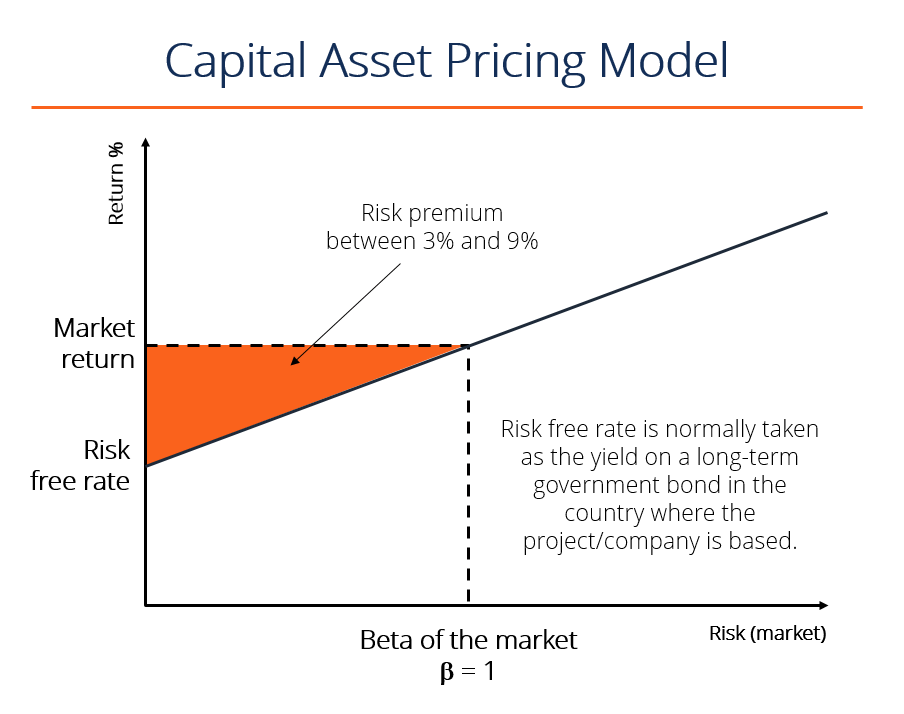

## Table of Contents

## What is the Capital Asset Pricing Model (CAPM)?

The Capital Asset Pricing Model, or CAPM, is a way to figure out how much return, or profit, an investment should give you based on how risky it is. It helps investors decide if an investment is worth it by comparing the expected return to the risk involved. The main idea behind CAPM is that investors need to be paid more for taking on more risk. The model uses something called the "risk-free rate," which is the return you would get from a very safe investment, like a government bond. Then, it adds a "risk premium," which is extra return for taking on more risk.

CAPM also uses a measure called "beta" to show how much an investment's price moves compared to the overall market. If an investment has a high beta, it means it's more sensitive to market changes and is riskier. On the other hand, a low beta means the investment is less affected by market swings and is less risky. By using the risk-free rate, the market's expected return, and the investment's beta, CAPM helps investors see if the expected return is enough for the risk they are taking.

## Who developed the CAPM and when was it introduced?

The Capital Asset Pricing Model, or CAPM, was developed by William F. Sharpe, along with help from other researchers like John Lintner and Jan Mossin. Sharpe first introduced the basic ideas of CAPM in his paper published in 1964. His work built on earlier research by Harry Markowitz about how to balance risk and return in a portfolio of investments.

CAPM became very popular in the world of finance because it offered a simple way to think about the relationship between risk and expected return. It helped investors and financial analysts make better decisions about which investments to choose. Over time, the model has been refined and discussed a lot, but Sharpe's original work remains a key part of how people understand and use CAPM today.

## What are the key assumptions of the CAPM?

The Capital Asset Pricing Model, or CAPM, relies on some important assumptions to work. One big assumption is that all investors are rational and want to avoid risk as much as possible while still getting good returns. This means they all make decisions based on the same information and expect the same returns from the market. Another assumption is that investors can borrow and lend money at a risk-free rate, which is usually thought of as the return from a safe government bond. CAPM also assumes that all investments can be bought and sold easily without affecting their prices, and there are no taxes or other costs to worry about.

Another key assumption is that all investors have the same one-year time frame for their investments. This means they all look at returns over the same period. CAPM also assumes that everyone can borrow and lend unlimited amounts of money at the risk-free rate, which is not very realistic in the real world. Finally, the model assumes that the returns of securities follow a normal distribution, meaning they are predictable in a certain way. These assumptions help simplify the model, but they also mean that CAPM might not always perfectly match what happens in real financial markets.

## How is the CAPM formula structured?

The CAPM formula helps figure out the expected return of an investment by looking at its risk. The formula is: Expected Return = Risk-Free Rate + Beta * (Market Return - Risk-Free Rate). Here, the "Expected Return" is what you hope to get from the investment. The "Risk-Free Rate" is the return from a very safe investment, like a government bond. "Beta" shows how much the investment's price moves compared to the overall market. The "Market Return" is the return you expect from the whole market. The part in parentheses, "Market Return - Risk-Free Rate," is called the "market risk premium," which is the extra return you get for taking on more risk.

To use the CAPM formula, you first find the risk-free rate, which could be the [interest rate](/wiki/interest-rate-trading-strategies) on a government bond. Then, you need the beta of the investment, which you can look up or calculate. Next, you need an estimate of the market return, which might be based on historical data or future predictions. You then plug these numbers into the formula. For example, if the risk-free rate is 2%, the beta is 1.2, and the market return is 8%, the expected return would be 2% + 1.2 * (8% - 2%) = 2% + 1.2 * 6% = 2% + 7.2% = 9.2%. This tells you that, according to CAPM, you should expect a 9.2% return from this investment given its risk.

## What does the term 'beta' represent in the CAPM?

In the Capital Asset Pricing Model, or CAPM, 'beta' is a number that shows how much an investment's price moves compared to the overall market. If an investment has a beta of 1, it means it moves the same way as the market. If the beta is more than 1, like 1.5, the investment is more sensitive to market changes and is riskier. On the other hand, if the beta is less than 1, like 0.5, the investment is less affected by market swings and is less risky.

Beta helps investors understand the risk of an investment. For example, if the market goes up by 10%, an investment with a beta of 1.2 might go up by 12%. But if the market goes down by 10%, that same investment could go down by 12%. By knowing the beta, investors can see if the expected return of an investment is worth the risk they are taking.

## How can the CAPM be used to calculate the expected return of an asset?

The Capital Asset Pricing Model, or CAPM, helps figure out the expected return of an investment by looking at its risk. To use CAPM, you start with the risk-free rate, which is the return you get from a very safe investment like a government bond. Then, you need the beta of the investment, which tells you how much the investment's price moves compared to the whole market. You also need to know the expected return of the market itself. Once you have these numbers, you can plug them into the CAPM formula: Expected Return = Risk-Free Rate + Beta * (Market Return - Risk-Free Rate). This formula calculates the expected return by adding a risk premium to the risk-free rate, where the risk premium is the extra return you get for taking on more risk.

For example, if the risk-free rate is 2%, the beta of the investment is 1.2, and the expected market return is 8%, you can use the CAPM formula to find the expected return. You would calculate it like this: Expected Return = 2% + 1.2 * (8% - 2%). First, you find the market risk premium, which is 8% - 2% = 6%. Then, you multiply the beta by the market risk premium: 1.2 * 6% = 7.2%. Finally, you add this to the risk-free rate: 2% + 7.2% = 9.2%. So, according to CAPM, you should expect a 9.2% return from this investment given its risk. This helps investors decide if the expected return is worth the risk they are taking.

## What is the difference between systematic and unsystematic risk in the context of CAPM?

In the world of investing, there are two types of risk: systematic risk and unsystematic risk. Systematic risk, also known as market risk, is the risk that affects the whole market and cannot be avoided by just [picking](/wiki/asset-class-picking) different investments. This kind of risk comes from things like changes in the economy, interest rates, or big events that impact all investments. In the Capital Asset Pricing Model, or CAPM, systematic risk is measured by something called beta. If an investment has a high beta, it means it's more sensitive to these market changes and is riskier.

Unsystematic risk, on the other hand, is the risk that is specific to one company or industry. It can be reduced by having a mix of different investments in your portfolio. For example, if you own stock in a company and that company has a problem, like a factory burning down, that's unsystematic risk. CAPM focuses on systematic risk because it believes that unsystematic risk can be managed by diversification. So, when you use CAPM to figure out the expected return of an investment, you're looking at how much extra return you should get for taking on the market risk that you can't get rid of.

## How does the CAPM help in portfolio management?

The Capital Asset Pricing Model, or CAPM, helps in portfolio management by giving investors a way to figure out if the expected return of an investment is worth the risk they are taking. It does this by using a formula that takes into account the risk-free rate, the expected market return, and the investment's beta. By knowing these numbers, investors can see if an investment's expected return is high enough for its level of risk. This helps them make better choices about which investments to include in their portfolio.

In portfolio management, CAPM also helps investors understand how to balance their investments to get the best return for the least amount of risk. By looking at the beta of different investments, investors can see how each one might move with the market. They can then choose a mix of investments that have different betas to spread out their risk. This way, even if one investment does badly because of market changes, other investments in the portfolio might do well, making the whole portfolio more stable. CAPM helps investors see how to do this balancing act, making it easier to manage their portfolio effectively.

## What are the limitations and criticisms of the CAPM?

The Capital Asset Pricing Model, or CAPM, has some limitations and criticisms that people often talk about. One big problem is that CAPM makes a lot of assumptions that don't really match the real world. For example, it assumes everyone has the same information and expects the same returns from the market, which is not true. It also thinks that investors can borrow and lend unlimited amounts of money at the risk-free rate, which is not possible in reality. These assumptions make the model simpler, but they also mean it might not always give accurate predictions about investment returns.

Another criticism is that CAPM only looks at systematic risk, which is the risk that affects the whole market. It ignores unsystematic risk, which is the risk specific to one company or industry. Some people think that unsystematic risk can also affect how much return an investment gives. Also, studies have shown that the model doesn't always do a good job at predicting returns. This is because real markets are more complicated than the model assumes. So, while CAPM can be a helpful tool for investors, it's important to know its limits and not rely on it too much when making investment decisions.

## How does the CAPM relate to the concept of the efficient frontier?

The Capital Asset Pricing Model, or CAPM, and the concept of the efficient frontier both help investors make better choices about their investments. The efficient frontier is a way to show all the possible portfolios that give you the best return for the amount of risk you're willing to take. It's like a line on a graph where each point on the line represents a portfolio that has the highest expected return for its level of risk. CAPM helps you figure out where a specific investment might fit on this line by telling you what return you should expect based on its risk.

CAPM does this by using a measure called beta, which shows how much an investment's price moves with the whole market. If an investment has a high beta, it means it's riskier and should give you a higher return to be worth it. The efficient frontier helps you see how adding this investment to your portfolio might change your overall risk and return. By understanding both CAPM and the efficient frontier, investors can pick investments that help them move closer to the best possible mix of risk and return for their portfolio.

## Can you explain the empirical tests and findings related to the CAPM?

Researchers have done many tests to see if the Capital Asset Pricing Model, or CAPM, really works in the real world. They look at how well the model predicts investment returns based on risk. Some of the earliest tests were done by people like Fischer Black, Michael Jensen, and Myron Scholes in the 1970s. They found that CAPM did a pretty good job at explaining the average returns of stocks, but it wasn't perfect. Other tests have shown that CAPM sometimes struggles to predict returns for individual stocks because the real world is more complicated than the model assumes. For example, some studies found that small company stocks and stocks with high book-to-market ratios often did better than CAPM predicted.

More recent tests have tried to see if there are other factors, besides just market risk, that affect stock returns. Researchers like Eugene Fama and Kenneth French looked at things like the size of a company and its book-to-market ratio. They found that these factors could explain stock returns better than CAPM alone. This led to new models, like the Fama-French three-[factor](/wiki/factor-investing) model, that add these extra factors to CAPM. Overall, while CAPM is a helpful tool for understanding the relationship between risk and return, many studies show that it doesn't always match what happens in real markets. This means investors should use it carefully and consider other factors too.

## What are some alternative models to the CAPM used in finance?

One alternative to the Capital Asset Pricing Model, or CAPM, is the Fama-French three-factor model. This model was created by Eugene Fama and Kenneth French to better explain how stock returns work. They added two more factors to CAPM: the size of a company and its book-to-market ratio. The size factor looks at how small or big a company is, and the book-to-market ratio compares a company's book value to its market value. Fama and French found that these extra factors helped explain stock returns better than CAPM alone. This model is popular because it gives investors more information to think about when choosing investments.

Another alternative is the Arbitrage Pricing Theory, or APT, which was developed by Stephen Ross. APT says that stock returns are affected by many different factors, not just the market risk that CAPM focuses on. These factors could be things like inflation rates, interest rates, or even how much oil costs. APT is more flexible than CAPM because it lets investors pick the factors that they think are most important for their investments. While APT can be more complicated to use, it gives investors a way to look at many different things that might affect their returns. Both the Fama-French model and APT help investors see a bigger picture of what might affect their investments, beyond just the market risk that CAPM looks at.

## References & Further Reading

[1]: ["Advances in Financial Machine Learning"](https://www.amazon.com/Advances-Financial-Machine-Learning-Marcos/dp/1119482089) by Marcos Lopez de Prado

[2]: ["Machine Learning for Algorithmic Trading"](https://github.com/PacktPublishing/Machine-Learning-for-Algorithmic-Trading-Second-Edition) by Stefan Jansen

[3]: Bergstra, J., Bardenet, R., Bengio, Y., & Kégl, B. (2011). ["Algorithms for Hyper-Parameter Optimization."](https://proceedings.neurips.cc/paper/2011/file/86e8f7ab32cfd12577bc2619bc635690-Paper.pdf) Advances in Neural Information Processing Systems 24.

[4]: Aldridge, I. (2009). ["High-Frequency Trading: A Practical Guide to Algorithmic Strategies and Trading Systems"](https://books.google.com/books/about/High_Frequency_Trading.html?id=8QpIsVUMhmEC). Wiley.

[5]: Chan, E. P. (2009). ["Quantitative Trading: How to Build Your Own Algorithmic Trading Business"](https://github.com/ftvision/quant_trading_echan_book). Wiley.