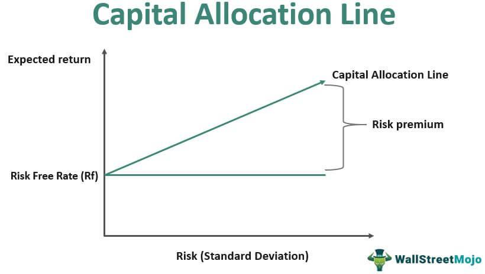

Algorithmic trading, commonly known as algo trading, has transformed the landscape of financial markets by leveraging technology for executing trades with increased speed and precision. This form of trading relies on pre-programmed algorithms to make decisions, effectively eliminating emotional biases and human errors. Central to the success of algorithmic trading is the availability of capital. Without sufficient capital, the potential for implementing diversified trading strategies and mitigating market risks is significantly hampered. In this article, we will examine the crucial role of capital in algo trading and its effects on trading strategies.

Furthermore, the challenges and opportunities associated with acquiring and managing capital for algo trading will be explored. Navigating obstacles such as stringent regulatory requirements and market entry barriers is essential for both seasoned traders and new entrants looking to secure institutional capital. We'll emphasize the importance of transparency and a solid track record to attract investors, which can be particularly daunting for retail traders facing limited financing options and high interest rates.

The article will also provide a comprehensive overview of capital dynamics from the perspective of industry regulations and expert opinions. Understanding the intricacies of compliance not only ensures fair market access but also helps prevent systemic risks, enhancing both credibility and investor confidence. Finally, insights into how technology aids in optimizing capital usage will be discussed, emphasizing the role of advanced algorithms and real-time analytics in refining trading strategies. By examining these aspects, this article aims to deliver an informed perspective on the interplay between capital and algorithmic trading dynamics.

## Table of Contents

## Defining Algorithmic Trading

Algorithmic trading, often referred to as algo trading, involves the use of computer algorithms to automatically execute trades based on predefined criteria, such as timing, price, or [volume](/wiki/volume-trading-strategy). These algorithms are designed to follow specific strategies and execute trades without human intervention, thus removing emotional biases that can affect decision-making in trading.

One of the core advantages of [algorithmic trading](/wiki/algorithmic-trading) is its ability to systematically and efficiently process large volumes of trades. This speed and efficiency are significant because they can lead to tighter spreads and better pricing for traders, especially in high-frequency trading scenarios where executing orders a fraction of a second faster can lead to substantial profits or prevent significant losses.

Algorithmic trading has a rich history, beginning with the introduction of computerized systems to assist in trading decisions in the late 20th century. Over time, these systems have evolved to execute trades at lightning speed, leveraging advancements in computing technology and data analytics. The rise of electronic markets and the availability of real-time data have further propelled the adoption of algorithmic trading strategies.

Several major players dominate the algorithmic trading landscape, primarily due to the substantial resources required to develop and maintain sophisticated trading systems. Hedge funds, with their focus on maximizing investment returns through various strategies, are significant participants in the algorithmic trading sector. Investment banks also utilize algorithms to optimize execution and manage large portfolios. Proprietary trading firms, which trade with their own capital to generate profits, heavily rely on algorithms due to the advantages they provide in terms of speed and decision-making precision.

In summary, algorithmic trading represents a transformative approach to trading financial instruments. Its reliance on computer algorithms enables a level of efficiency and discipline that manual trading cannot match, making it an essential tool for a variety of financial market participants.

## Importance of Capital in Algo Trading

Capital is a pivotal element in algorithmic trading, profoundly influencing the breadth and execution of trading strategies. Primarily, it dictates the extent to which traders can engage in various strategies and react to market changes. With more capital, traders are not only able to diversify their strategies across multiple assets and markets but can also internalize fluctuations, reducing the risk of adverse financial impacts.

Diversification is one of the fundamental principles of risk management in trading. By spreading investments across different instruments, traders reduce their exposure to any single asset's [volatility](/wiki/volatility-trading-strategies). This approach necessitates substantial capital, as greater funds allow traders to allocate portions of their portfolio into various strategies without overly concentrating resources in one area. This also enables traders to trade in larger volumes, benefiting from economies of scale and ensuring that they can withstand periods of market instability without severe financial repercussions.

In contrast, inadequate capitalization can lead to heightened risks, primarily due to leverage and the potential for margin calls. Leverage, while amplifying potential returns, similarly increases exposure to losses. Insufficient capital means traders must borrow more to meet desired position sizes, thereby increasing the leverage ratio. A high leverage ratio exacerbates risks, as even minor market movements can result in significant losses, potentially triggering margin calls. Margin calls require the trader to either deposit additional capital or reduce positions to maintain the required margin, potentially leading to forced liquidations and significant financial loss.

For those seeking to execute high-frequency trading ([HFT](/wiki/high-frequency-trading-strategies)), access to sufficient capital is even more critical. HFT relies on executing a large number of trades in short time frames and usually targets small price differences. The sheer volume of transactions incurs substantial transaction costs, including exchange fees and the bid-ask spread. Therefore, considerable capital reserves are necessary to cover these costs while maintaining profitability. The speed and efficiency of HFT also mean that traders need to minimize transaction costs to preserve gains, emphasizing the requirement for substantial upfront capital. 

In summary, capital availability is a cornerstone of successful algorithmic trading, crucial for implementing diverse strategies and effectively managing market risks. Whether diversifying to mitigate risk or engaging in capital-intensive strategies like HFT, the amount of capital available can significantly impact the effectiveness and safety of algorithmic trading activities.

## Challenges in Capital Acquisition

Obtaining sufficient capital for algorithmic trading is a significant challenge, particularly for those new to the field. The landscape is marked by several hurdles that must be navigated to secure the necessary financial resources.

For institutional traders, regulatory challenges are prevalent. Regulations are designed to ensure market stability, but they also impose stringent requirements on access to institutional capital. For instance, meeting the capital adequacy standards set by financial authorities can be complex and demanding. These standards are often built around maintaining a certain level of capital reserves, calculated using risk-based models. Traders must demonstrate the ability to absorb potential losses and manage systemic risk, often requiring sophisticated risk assessment methodologies and robust financial backing.

Retail traders face their own set of obstacles in acquiring capital. Limited financing options can restrict their ability to participate in algo trading. Traditional lending institutions may be hesitant to offer loans for trading activities due to perceived risks, and interest rates on available options are often high. This creates a financial barrier that is difficult for many retail traders to overcome, particularly when they are starting with smaller portfolios.

Another crucial aspect of capital acquisition is the need for transparency and a demonstrable track record. Investors, particularly institutional ones, are typically risk-averse and require assurance that their investments will be managed prudently. A transparent operational framework and a strong historical performance record are essential in gaining their confidence. Sharing detailed reports and audits can help convey transparency, while achieving consistent returns over time builds a credible track record.

In summary, while access to capital is indispensable for engaging in algorithmic trading, it is fraught with challenges that range from navigating complex regulatory requirements to addressing investor concerns about transparency and performance. Each of these elements plays a vital role in determining the success of capital acquisition efforts.

## Strategies for Managing Capital

Proper risk management is an essential aspect of algo trading that aids in protecting capital and ensuring long-term sustainability. Establishing a robust risk management framework is crucial for mitigating potential losses and optimizing trading outcomes.

Continuous assessment of market risks is paramount in preserving trading capital. Market conditions can change rapidly, influenced by a myriad of factors such as economic indicators, geopolitical events, and sudden shifts in investor sentiment. Algorithmic traders must implement dynamic risk assessment strategies that can swiftly respond to these changes. Utilizing statistical tools and models, such as Value at Risk (VaR) or Conditional Value at Risk (CVaR), can be effective in quantifying potential losses and adjusting positions accordingly.

Developing a diversified portfolio is another strategic approach to managing capital in algo trading. Diversification reduces reliance on a single strategy or asset and spreads investment risks across various markets and instruments. This can be achieved by allocating capital to a range of asset classes, such as equities, bonds, and commodities, which often have low or negative correlations. By doing so, traders can stabilize returns and buffer against adverse movements in any single market segment.

Automated monitoring systems play a pivotal role in ensuring efficient capital allocation and utilization. These systems provide real-time analytics and alerts, allowing traders to monitor performance metrics and market conditions continuously. Advanced monitoring tools, powered by [machine learning](/wiki/machine-learning) algorithms, can detect anomalies and predict potential risks, enabling timely intervention. Moreover, automated systems facilitate the implementation of risk management protocols, such as stop-loss orders and trailing stops, which can dynamically adjust based on market volatility and predefined risk thresholds.

In conclusion, managing capital effectively in algorithmic trading involves deploying comprehensive risk management frameworks, conducting regular market risk assessments, diversifying portfolios, and leveraging automated monitoring systems. These strategies not only safeguard capital but also position traders for sustained success in an ever-evolving market landscape.

## Regulatory Aspects of Capital in Algo Trading

Regulatory requirements play a crucial role in maintaining the integrity of financial markets and ensuring that algorithmic trading operates within a framework that safeguards both market participants and the broader economic system. These regulations are designed to foster fair access, mitigate systemic risks, and uphold investor confidence.

The U.S. Securities and Exchange Commission (SEC) is a key regulatory body that formulates guidelines for capital requirements applicable to market participants engaged in algorithmic trading. These guidelines are intended to ensure that firms maintain sufficient capital reserves to handle trading activities and potential market shocks. The SEC's regulations help prevent scenarios where a [liquidity](/wiki/liquidity-risk-premium) shortfall could lead to market instability.

Privacy and security policies are also essential for automated trading platforms, which must adhere to robust compliance measures to protect sensitive financial data. Automated systems used in algorithmic trading collect and process vast amounts of data, making them targets for cyber threats. Therefore, firms must implement stringent security protocols to comply with regulations and protect client information, thereby maintaining trust and reliability in the trading process.

Successful adherence to these regulations not only prevents legal repercussions but also enhances the credibility of trading entities. Compliance demonstrates a commitment to ethical trading practices and risk management, reassuring investors and stakeholders. This credibility is essential for attracting and retaining investment, as it reduces concerns about potential financial malpractice or instability caused by non-compliant activities. Overall, by fostering transparency and operational integrity, regulatory adherence strengthens the attractiveness of algorithmic trading ventures in the financial market landscape.

## The Role of Technology in Capital Optimization

Advanced algorithms and high-performance computing power are pivotal in optimizing capital utilization in algorithmic trading. These technologies enable traders to process vast amounts of data rapidly and execute trades with precision, thereby maximizing the efficiency of capital deployment. 

Machine learning (ML) and [artificial intelligence](/wiki/ai-artificial-intelligence) (AI) significantly enhance capital allocation strategies. By analyzing historical data and identifying patterns, ML algorithms can predict market movements and make informed decisions about where and when to allocate capital. This predictive capability ensures that capital is allocated not only effectively but also strategically, adjusting to market dynamics in near real-time. For example, [reinforcement learning](/wiki/reinforcement-learning), a subset of ML, allows trading systems to learn and adapt by analyzing the outcomes of their trading decisions, thus optimizing capital allocation over time.

Technology also plays a crucial role in reducing transaction costs, which are a significant consideration in capital optimization. Through optimized execution strategies such as order slicing—where large orders are broken into smaller ones to minimize market impact—technology reduces costs significantly. Algorithmic strategies like VWAP (Volume Weighted Average Price) and TWAP (Time Weighted Average Price) are employed to synchronize trades with market volume or time, further minimizing transaction costs.

The integration of real-time analytics into trading platforms provides continuous insights into capital strategy performance. These systems offer traders and firms real-time monitoring and analytics capabilities, allowing for dynamic adjustments to capital allocation strategies. For instance, dashboards that display key performance indicators (KPIs) in real-time enable immediate strategic pivots based on current market conditions and capital performance metrics.

Moreover, the advent of cloud computing and high-performance computing (HPC) has democratized access to computational resources, facilitating sophisticated algorithmic trading strategies even for smaller firms. The scalability and flexibility of cloud solutions allow for the efficient processing of complex algorithms and large datasets, which are critical for high-frequency trading.

In conclusion, the role of technology in capital optimization within algorithmic trading is multifaceted—ranging from advanced data processing and machine learning-driven insights to cost-minimization strategies and real-time analytics. These technological advancements not only enhance capital efficiency but also provide firms with a strategic edge in the highly competitive landscape of algorithmic trading.

## Conclusion

Capital availability remains a cornerstone of successful algorithmic trading. The efficient management and strategic acquisition of capital are critical elements that help mitigate the various risks inherent in trading activities. Effective capital management involves not just securing adequate funding but also implementing robust risk management frameworks that can safeguard against adverse market conditions. For instance, a diversified portfolio approach allows traders to minimize reliance on a single strategy, thereby protecting against sector-specific downturns.

As regulatory landscapes evolve, staying informed and compliant is of utmost importance. Financial regulatory bodies, such as the U.S. Securities and Exchange Commission (SEC), impose guidelines that ensure fair access to markets and protect against systemic risks. Adherence to these guidelines is essential, as non-compliance can result in severe penalties and a loss of investor confidence. Therefore, continuous assessment of regulatory changes and integrating them into trading practices is indispensable for maintaining credibility and ensuring the sustainability of trading operations.

Embracing technological advancements plays a crucial role in the future optimization of capital in algorithmic trading. Technologies such as machine learning and artificial intelligence offer enhanced capabilities for making intelligent capital allocation decisions. Advanced algorithms can optimize execution strategies to minimize transaction costs, thus maximizing returns. High-performance computing enables real-time analytics, assisting traders in making well-informed capital strategy adjustments quickly. Consequently, incorporating state-of-the-art technological solutions not only optimizes the utilization of available capital but also enhances competitive advantage in the rapidly evolving landscape of algorithmic trading.

## References & Further Reading

[1]: Bergstra, J., Bardenet, R., Bengio, Y., & Kégl, B. (2011). ["Algorithms for Hyper-Parameter Optimization."](https://papers.nips.cc/paper/4443-algorithms-for-hyper-parameter-optimization) Advances in Neural Information Processing Systems 24.

[2]: ["Advances in Financial Machine Learning"](https://www.amazon.com/Advances-Financial-Machine-Learning-Marcos/dp/1119482089) by Marcos Lopez de Prado

[3]: ["Evidence-Based Technical Analysis: Applying the Scientific Method and Statistical Inference to Trading Signals"](https://www.amazon.com/Evidence-Based-Technical-Analysis-Scientific-Statistical/dp/0470008741) by David Aronson

[4]: ["Machine Learning for Algorithmic Trading"](https://github.com/stefan-jansen/machine-learning-for-trading) by Stefan Jansen

[5]: ["Quantitative Trading: How to Build Your Own Algorithmic Trading Business"](https://books.google.com/books/about/Quantitative_Trading.html?id=j70yEAAAQBAJ) by Ernest P. Chan