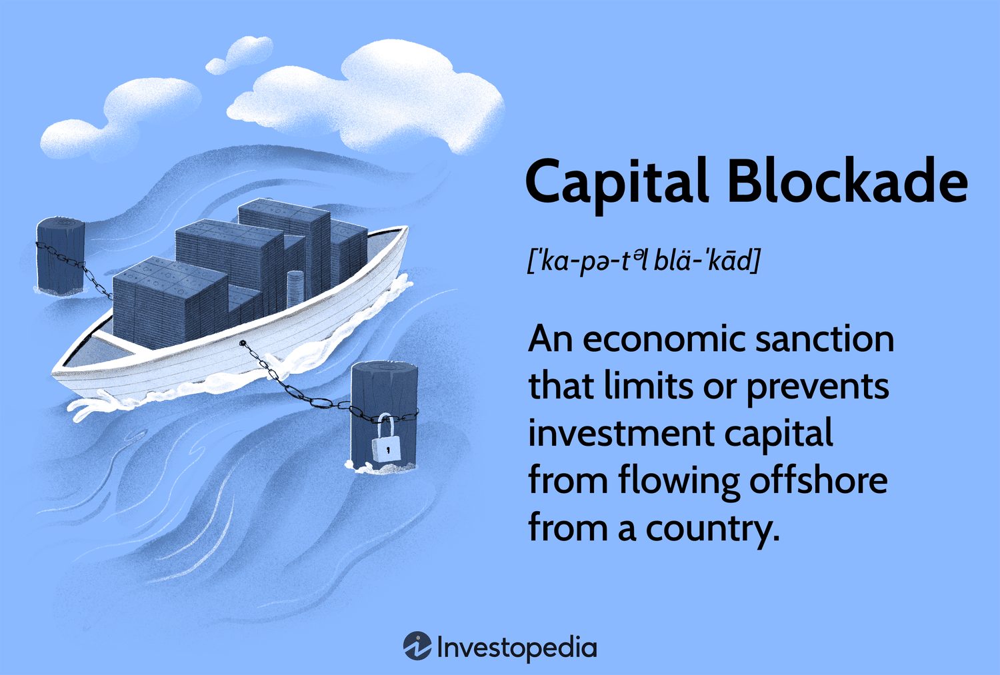

## Table of Contents

## What is a capital blockade?

A capital blockade is when a country or group stops another country from getting money or important things it needs. This can happen during a war or when countries are fighting over something important. The idea is to make the other country weaker by cutting off its supplies and money, so it has a harder time doing what it wants to do.

For example, if Country A wants to stop Country B from building more weapons, it might block Country B's money and stop ships carrying important materials from reaching its ports. This can make it very hard for Country B to keep going with its plans. Capital blockades can be very powerful but can also cause a lot of problems for the people living in the blocked country.

## What are the historical examples of capital blockades?

One famous example of a capital blockade happened during the American Civil War. From 1861 to 1865, the Union, which was the North, set up a blockade around the Confederate states, which was the South. They did this to stop the South from getting supplies and money from other countries. This made it very hard for the South to keep fighting because they couldn't get the things they needed. The blockade was called the Anaconda Plan, and it played a big part in helping the North win the war.

Another example is the blockade of Germany during World War I. From 1914 to 1919, the Allied powers, which included countries like Britain and France, blocked Germany from getting food and other important supplies. This was meant to weaken Germany and force it to stop fighting. The blockade made life very hard for people in Germany, and many of them went hungry. It's thought that the blockade helped end the war because Germany couldn't keep going without the supplies it needed.

A more recent example is the blockade of Cuba by the United States, which started in 1962 and is still going on today. The U.S. put this blockade in place because it didn't like Cuba's government and wanted to stop it from getting money and supplies. The blockade has made it very hard for Cuba to grow its economy and has caused a lot of problems for the people living there. Even though many countries think the blockade is unfair, the U.S. has kept it in place for a long time.

## How does a capital blockade affect the economy of a country?

A capital blockade can hurt a country's economy a lot. When a country can't get money or important things it needs, it can't make or sell as many goods. This means factories might have to close, and people might lose their jobs. Without money coming in, the country's businesses can't grow, and the economy starts to shrink. This can make life very hard for people because they have less money to buy food and other things they need.

The effects of a capital blockade can last a long time, even after the blockade is over. When a country's economy is weak for a long time, it can be hard to fix everything that went wrong. People might leave the country to find work somewhere else, which makes it even harder for the economy to get better. Also, other countries might not want to do business with a country that has been through a blockade because they think it's too risky. This can make it very hard for the country to start growing its economy again.

## What are the legal implications of imposing a capital blockade?

When a country decides to impose a capital blockade, it has to think about the rules set by international law. The United Nations Charter says that countries should not use force against each other, except in self-defense or with the UN's permission. A capital blockade can be seen as a kind of force, so it needs to follow these rules. If a blockade is used during a war, it might be allowed under the laws of war, but it still has to be done in a way that doesn't hurt civilians too much.

There are also other laws, like those from the World Trade Organization, that say countries should trade freely with each other. A capital blockade goes against these rules because it stops trade. Countries that use blockades can face legal challenges from other countries or from international courts. These challenges can lead to fines or other punishments. Because of all these rules, countries have to be very careful when they decide to use a capital blockade, and they need to make sure they have a good reason for doing it.

## What are the political motivations behind a capital blockade?

Countries might use a capital blockade to make another country do what they want. If a country is doing something that others don't like, like building weapons or supporting groups that cause trouble, other countries might block its money and supplies. The idea is to make life so hard for the blocked country that it has to change its behavior. For example, if a country is helping terrorists, other countries might use a blockade to stop it from getting the money and weapons it needs to keep helping them.

Another reason for a capital blockade is to weaken an enemy during a war. If a country is fighting another country, it might block the enemy's money and supplies to make it harder for them to keep fighting. This can help the country win the war faster. For example, during World War I, the Allies blocked Germany's supplies to weaken its military and force it to stop fighting. Blockades can be a powerful tool in war, but they can also hurt civilians a lot, so countries have to think carefully before using them.

## How do capital blockades impact international relations?

Capital blockades can make international relations very tense. When one country blocks another country's money and supplies, it can make other countries angry. They might think the blockade is unfair or too harsh. This can lead to arguments at the United Nations or in other international groups. Countries that are friends with the blocked country might try to help it, which can make the situation even more complicated. Sometimes, the blockade can make countries split into different groups, with some supporting the blockade and others against it.

The long-term effects of a capital blockade on international relations can be serious. If a blockade lasts a long time, it can make the blocked country very angry. This can lead to long-lasting bad feelings between countries. Even after the blockade is over, the blocked country might not trust the country that blocked it. This can make it hard for them to work together in the future. Also, other countries might be scared that they could be blocked next, so they might change their behavior to avoid the same thing happening to them.

## What measures can a country take to mitigate the effects of a capital blockade?

A country facing a capital blockade can try to find new ways to get the money and supplies it needs. It might look for new friends who can help it get around the blockade. For example, if the usual trade routes are blocked, the country could try to trade with other countries that are not part of the blockade. It could also try to make more things at home instead of buying them from other places. This might mean starting new factories or farms to make sure there is enough food and other important things for people.

Another way to deal with a capital blockade is to ask for help from international groups like the United Nations. The country can explain its situation and ask for support to ease the effects of the blockade. Sometimes, these groups can put pressure on the countries that are blocking to lift the blockade or at least make it less strict. The country can also try to change its laws or policies to make it easier to get help from other countries or international groups. By working together with others and finding new ways to get what it needs, a country can better handle the challenges of a capital blockade.

## How do capital blockades influence global trade?

Capital blockades can mess up global trade a lot. When one country blocks another country's money and supplies, it can stop goods from moving around the world. This can make it hard for businesses in other countries to get the things they need to make their products. If a big country is blocked, it can affect the whole world because many countries trade with it. The prices of goods can go up because there are fewer of them available, and this can make life harder for people everywhere.

The effects of a capital blockade can last a long time, even after it's over. When trade is messed up, it can take a while for things to get back to normal. Other countries might be scared that they could be blocked next, so they might change how they trade to avoid the same thing happening to them. This can make global trade more complicated and less predictable. Overall, capital blockades can make the world's economy less stable and cause problems for a lot of people.

## What role do international organizations play in addressing capital blockades?

International organizations like the United Nations (UN) and the World Trade Organization (WTO) have important roles in dealing with capital blockades. When a country is blocked, it can go to these groups for help. The UN can talk to the countries involved and try to make them stop the blockade or at least make it less strict. They can also send food and medicine to the blocked country to help the people who are suffering. The WTO can look at whether the blockade goes against trade rules and can tell the countries to stop it if it does.

These organizations also help keep the peace and make sure countries follow the rules. If a capital blockade is causing big problems, the UN might hold meetings where countries can talk about what to do. They can vote on resolutions that ask the countries to end the blockade. The WTO can start legal actions against countries that break trade rules with blockades. By working together, these groups try to make sure that capital blockades don't cause too much harm and that countries can find ways to solve their problems without hurting each other too much.

## How can technology be used to circumvent a capital blockade?

Technology can help a country get around a capital blockade by making it easier to trade with other countries without being noticed. For example, a country can use the internet to buy and sell things from other places without going through the usual trade routes that are being blocked. They can use special software to hide where the money is coming from and going to, so the country blocking them can't see it. This can help the blocked country keep getting the money and supplies it needs to keep going.

Another way technology can help is by making it easier to find new ways to get goods into the country. Drones and other new kinds of transportation can be used to bring in supplies without being stopped at the usual borders. Also, 3D printing technology can be used to make things at home instead of buying them from other countries. This can help the blocked country make more of what it needs on its own, so it doesn't have to rely on others as much. By using technology smartly, a country can find ways to keep its economy going even when it's being blocked.

## What are the long-term economic consequences of a prolonged capital blockade?

A long capital blockade can hurt a country's economy a lot over time. When a country can't get money or things it needs for a long time, its businesses can't grow. Factories might close, and people might lose their jobs. This means the country's economy gets smaller and smaller. People have less money to spend on food and other important things, so life gets harder for them. It can also make other countries not want to trade with the blocked country because they think it's too risky. This can make it very hard for the country to start growing its economy again, even after the blockade is over.

The effects of a long blockade can last for many years. When a country's economy is weak for a long time, it can be hard to fix everything that went wrong. People might leave the country to find work somewhere else, which makes it even harder for the economy to get better. The country might need a lot of help from other countries or international groups to start growing again. Also, the blocked country might be angry at the country that blocked it for a long time, which can make it hard for them to work together in the future. Overall, a long capital blockade can cause big problems that take a long time to fix.

## How do capital blockades affect different sectors of the economy differently?

A capital blockade can hurt different parts of a country's economy in different ways. For example, the manufacturing sector might be hit hard because it needs raw materials and parts from other countries to make things. If these can't get through the blockade, factories might have to close, and people who work there could lose their jobs. The agriculture sector might also suffer because it might not be able to get the seeds, fertilizers, and machines it needs to grow food. This can lead to less food being produced, which can make prices go up and make it harder for people to eat well.

The service sector, like banks and stores, can also be affected by a capital blockade. Banks might not be able to get money from other countries, which can make it hard for them to lend money to businesses and people. Stores might not be able to get the things they need to sell, so they might have to close or sell less. The tourism sector can be hit too because fewer people might want to visit a country that's having economic problems. All these effects can make life harder for people in the blocked country and can take a long time to fix, even after the blockade is over.

## What are the challenges and strategies for investors?

Investors operate in a volatile environment where capital blockades and economic sanctions can sharply alter the accessibility and dynamics of financial markets. These geopolitical risks necessitate a strategic and informed approach to safeguard investments amid uncertainties.

Understanding geopolitical risks is pivotal for investors in assessing the probability and potential impact of sanctions. This involves analyzing a country's political stability, international relationships, and economic policies. Investors often rely on geopolitical risk indices, which quantify these elements, to guide their investment choices. For instance, tools like the Geopolitical Risk Index (GPR) provide historical patterns and projected trends that assist in forecasting potential market disruptions.

Risk assessment forms the cornerstone of an investor’s strategy. A systematic approach to risk assessment includes identifying, evaluating, and prioritizing risks. This is often achieved using statistical models and financial simulations. For example, Value at Risk (VaR) can quantify the potential loss in an investment over a specified period, under normal market conditions. Stress testing further supplements this by modeling extreme scenarios, such as heightened sanctions or political turmoil, to evaluate an investment portfolio's resilience.

Diversification is a fundamental strategy to mitigate risks associated with economic sanctions and capital blockades. By allocating investments across various geographies, asset classes, and sectors, investors can reduce the impact of a localized economic downturn. Diversification follows the principle of spreading risk, which can be mathematically expressed as reducing the overall portfolio variance, $\sigma^2_p$, derived from:

$$
\sigma^2_p = \sum_{i=1}^{n} w_i^2 \sigma_i^2 + \sum_{i=1}^{n-1} \sum_{j=i+1}^{n} 2w_iw_j\sigma_i\sigma_j\rho_{ij}
$$

where $w_i$ and $w_j$ are the weights of the assets, $\sigma_i$ and $\sigma_j$ their respective standard deviations, and $\rho_{ij}$ the correlation coefficient between assets $i$ and $j$.

Compliance with international sanction laws is critical to ensure that investment activities are lawful and ethical. Investors must remain informed about current sanctions and restrictions imposed by various governments and international bodies, such as the United Nations. Compliance officers and legal consultants can provide guidance, helping investors navigate the complexities of such regulations.

In conclusion, navigating a landscape punctuated by unpredictability requires investors to combine geopolitical insight, robust risk assessment methodologies, strategic diversification, and rigorous compliance with international laws. By adopting these strategies, investors can better protect their portfolios against the adverse effects of economic sanctions and capital blockades, ultimately positioning themselves for stable and sustainable financial growth.

## References & Further Reading

[1]: Hufbauer, G. C., Schott, J. J., Elliott, K. A., & Oegg, B. (2007). ["Economic Sanctions Reconsidered."](https://www.sciencedirect.com/science/article/abs/pii/S0022199608000597) Peterson Institute for International Economics.

[2]: Drezner, D. W. (2011). ["Sanctions Sometimes Smart: Targeted Sanctions in Theory and Practice."](https://academic.oup.com/isr/article-abstract/13/1/96/1807429) International Studies Review.

[3]: Lopez de Prado, M. (2018). ["Advances in Financial Machine Learning."](https://www.amazon.com/Advances-Financial-Machine-Learning-Marcos/dp/1119482089) Wiley.

[4]: Chan, E. (2009). ["Quantitative Trading: How to Build Your Own Algorithmic Trading Business."](https://github.com/ftvision/quant_trading_echan_book) Wiley.

[5]: Hanke, M., & Hauser, F. (2008). ["On the Effects of Stock Splits and Related Phenomena on Swiss Blue-Chip Stocks."](https://www.sciencedirect.com/science/article/pii/S1386418107000365) Review of Managerial Science.

[6]: Aronson, D. R. (2007). ["Evidence-Based Technical Analysis: Applying the Scientific Method and Statistical Inference to Trading Signals."](https://onlinelibrary.wiley.com/doi/book/10.1002/9781118268315) Wiley.

[7]: Jansen, S. (2020). ["Machine Learning for Algorithmic Trading."](https://github.com/stefan-jansen/machine-learning-for-trading) Packt Publishing.