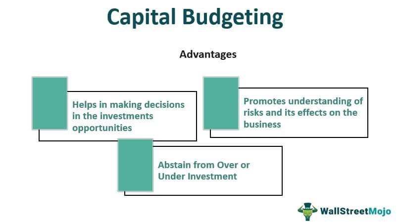

## Table of Contents

## What is capital budgeting?

Capital budgeting is the process that businesses use to decide which big projects or investments to spend money on. These decisions are important because they involve large amounts of money and can affect the company's future. The goal is to choose projects that will bring in more money than they cost, over time. This helps the company grow and be more profitable.

To do capital budgeting, companies look at different ways to measure if a project is a good idea. They might use methods like calculating the return on investment, or figuring out how long it will take to get back the money they spent. They also think about risks and how the project fits with the company's overall plans. By carefully analyzing these factors, businesses can make smarter choices about where to invest their money.

## Why is capital budgeting important for businesses?

Capital budgeting is really important for businesses because it helps them decide where to spend their money on big projects. These projects can be things like buying new machines, building a new factory, or starting a new product line. By choosing the right projects, a business can make more money in the future. If they pick the wrong projects, they might lose money and have a hard time growing. So, capital budgeting helps businesses use their money wisely and make smart choices about their future.

Another reason capital budgeting is important is that it helps businesses plan for the long term. When a company spends a lot of money on a project, it usually takes a while to see if it was a good idea. Capital budgeting helps them think about the future and see if a project will be profitable over many years, not just right away. This kind of planning is key for a business to stay strong and keep growing. It also helps them manage risks better, because they can think about what might go wrong and plan for it.

## What are the main types of capital budgeting techniques?

There are several main types of capital budgeting techniques that businesses use to decide if a project is worth the investment. One common method is the Payback Period, which looks at how long it will take to get back the money spent on the project. If a project has a short payback period, it might be seen as a good choice. Another technique is the Net Present Value (NPV), which calculates the difference between the present value of cash inflows and the present value of cash outflows over time. If the NPV is positive, it means the project is expected to be profitable.

Another popular method is the Internal Rate of Return (IRR), which finds the [interest rate](/wiki/interest-rate-trading-strategies) that makes the NPV of all cash flows from a project equal to zero. If the IRR is higher than the company's cost of capital, the project is considered a good investment. The Profitability Index (PI) is also used, which is the ratio of the present value of future cash flows to the initial investment. A PI greater than 1 suggests that the project's benefits outweigh its costs. These techniques help businesses make informed decisions by considering different aspects of a project's financial impact.

## How does the payback period method work in capital budgeting?

The payback period method is a simple way for businesses to figure out how long it will take to get back the money they spent on a project. To use this method, you add up all the money coming in from the project each year until the total equals the amount of money spent at the start. For example, if a company spends $100,000 on a new machine, and the machine brings in $25,000 each year, the payback period would be 4 years because that's how long it takes to get back the $100,000.

This method is easy to understand and use, which is why many businesses like it. It helps them see quickly if a project will start making money back soon. However, the payback period method has some downsides. It doesn't consider the money coming in after the payback period, and it doesn't take into account the time value of money, which means that a dollar today is worth more than a dollar in the future. So, while it's a good first look at a project, businesses often use other methods too to get a fuller picture.

## What is the net present value (NPV) method and how is it calculated?

The net present value (NPV) method is a way to figure out if a project is a good investment by looking at the money it will bring in over time. It works by comparing the money you spend on the project now to the money you expect to get back in the future, but it takes into account that money today is worth more than money in the future. This is called the time value of money. If the NPV is positive, it means the project is expected to make more money than it costs, so it's a good investment. If it's negative, the project might lose money, so it's not a good choice.

To calculate the NPV, you start by figuring out all the cash flows for the project, including the initial cost and the money you expect to get back each year. Then, you use a discount rate, which is usually the cost of capital for the company, to bring all those future cash flows back to today's dollars. You add up all these present values, including the initial cost (which is a negative number). If the total is more than zero, the NPV is positive, and the project is worth doing. If it's less than zero, the NPV is negative, and you might want to look for a better project.

## Can you explain the internal rate of return (IRR) and its significance in capital budgeting?

The internal rate of return (IRR) is a way to figure out if a project is worth doing by finding the interest rate that makes the net present value (NPV) of all the money coming in and going out of the project equal to zero. It's like trying to find out what rate of return you would get if you invested in the project. If the IRR is higher than the cost of capital, which is the rate the company has to pay to get money for the project, then the project is a good investment. For example, if a company's cost of capital is 10% and the IRR of a project is 15%, the project is worth doing because it's expected to make more money than it costs.

The significance of the IRR in capital budgeting is that it helps businesses compare different projects easily. It gives a single number that shows how profitable a project might be, which makes it easier to decide between several options. However, IRR has some limitations. For instance, it can be hard to calculate for projects with irregular cash flows, and it might not work well for projects that have multiple IRRs. Despite these challenges, IRR is a popular tool because it helps businesses make decisions about where to invest their money in a way that's easy to understand and compare.

## How does the profitability index help in making capital budgeting decisions?

The profitability index (PI) is a tool that helps businesses decide if a project is worth doing. It does this by comparing the money a project will bring in over time to the money needed to start it. The PI is calculated by dividing the present value of all future cash flows by the initial investment. If the PI is more than 1, it means the project will make more money than it costs, so it's a good investment. If it's less than 1, the project might lose money, and it's probably not a good choice.

Using the profitability index helps businesses when they need to choose between different projects. It's especially useful when they have a limited amount of money to spend and need to decide which projects will give them the most bang for their buck. By looking at the PI, a company can see which projects will be the most profitable compared to their costs. This makes it easier to pick the projects that will help the business grow and make more money in the long run.

## What role does the discounted cash flow (DCF) analysis play in capital budgeting?

Discounted cash flow (DCF) analysis is a key part of capital budgeting because it helps businesses figure out if a project is a good investment. DCF looks at all the money coming in and going out of a project over time and adjusts it to today's value. This is important because money today is worth more than money in the future. By using DCF, a company can see if the money they will get back from a project is more than what they spend on it, after accounting for the time value of money. If the present value of the future cash flows is higher than the initial cost, the project is likely a good choice.

DCF analysis is also useful because it helps businesses compare different projects fairly. When a company is deciding where to spend its money, it needs to look at all its options. DCF makes it easier to compare projects that might have different sizes, lengths, and cash flow patterns. By turning all future cash flows into today's dollars, DCF gives a clear picture of which projects will bring in the most value. This helps businesses make smarter choices about where to invest their money, leading to better growth and profitability in the long run.

## How do businesses handle risk and uncertainty in capital budgeting?

Businesses handle risk and uncertainty in capital budgeting by using different methods to understand and manage these challenges. One common way is by doing sensitivity analysis, which means they look at how changes in things like sales, costs, or interest rates might affect a project's success. This helps them see which parts of the project are most risky and plan for different possible outcomes. Another method is scenario analysis, where they think about different "what if" situations, like what would happen if the economy gets worse or better. By planning for these different scenarios, businesses can be ready for whatever might happen.

Another way businesses deal with risk is by using simulations, like Monte Carlo simulations. These use computers to run many different versions of a project to see how it might turn out under different conditions. This gives them a better idea of the range of possible results and helps them make more informed decisions. Businesses also use risk-adjusted discount rates, which means they might use a higher discount rate for riskier projects to make sure they are really worth the risk. By using these methods, businesses can make smarter choices about where to invest their money, even when the future is uncertain.

## What are some advanced capital budgeting techniques used by experts?

Experts use some advanced capital budgeting techniques to make better decisions about big projects. One of these is real options analysis, which looks at a project like it's a series of choices, similar to options in the stock market. This method helps businesses see the value of being able to change their plans as they learn more about how the project is going. For example, a company might decide to start a project but keep the option open to expand it later if it's doing well. This way, they can make the most of good opportunities and avoid big losses if things don't go as planned.

Another advanced technique is the use of decision trees, which help businesses map out different paths a project might take. A decision tree shows all the possible choices and outcomes, making it easier to see which path is likely to be the best. This method is great for projects where there are a lot of unknowns and the business needs to make decisions at different points. By using decision trees, experts can plan for different scenarios and choose the best way forward, even when the future is uncertain.

## How does capital budgeting integrate with a company's overall strategic planning?

Capital budgeting is a big part of a company's overall strategic planning because it helps them decide where to spend their money on big projects. These projects are important for the company's future, like building new factories, buying new machines, or starting new products. When a company makes these big decisions, it needs to think about its long-term goals. For example, if a company wants to grow in a new market, it might spend money on a project that will help it do that. By using capital budgeting, the company can make sure the money it spends fits with its overall plan and helps it reach its goals.

Capital budgeting also helps a company stay on track with its strategy by looking at different ways to measure if a project is a good idea. For example, they might use methods like figuring out how long it will take to get back the money they spent or calculating the return on investment. These methods help the company see if a project will really help them reach their strategic goals. By carefully choosing projects that match their strategy, a company can use its money wisely and keep moving forward in the direction it wants to go.

## What are the common pitfalls and challenges in implementing capital budgeting decisions?

One common challenge in implementing capital budgeting decisions is dealing with uncertainty. Businesses often have to guess about future sales, costs, and economic conditions, which can be hard to predict. If these guesses are wrong, a project that looked good at first might not turn out well. Another pitfall is focusing too much on short-term results. Sometimes, a project might take a while to start making money, but it could be really good in the long run. If a business only looks at the short term, they might miss out on great opportunities.

Another challenge is the difficulty in comparing different projects. Some projects might have different sizes, lengths, and risks, making it tough to decide which one is the best. Businesses also need to be careful about using the right methods to measure a project's value. For example, using the wrong discount rate can make a project look better or worse than it really is. By understanding these pitfalls and challenges, businesses can make better decisions and avoid common mistakes in capital budgeting.

## What is the role of capital budgeting in investment strategy?

Capital budgeting remains a cornerstone of financial management, as it involves evaluating and selecting investment projects that align with an organization’s strategic objectives and financial constraints. The core of capital budgeting lies in determining the value and potential return of significant investments, such as new projects, equipment, or ventures, which can considerably impact a company’s financial health.

### Net Present Value (NPV)

Net Present Value is one of the most comprehensive techniques used in capital budgeting. It calculates the present value of expected cash flows generated by a project, minus the initial investment cost. The formula is expressed as:

$$
NPV = \sum \frac{R_t}{(1 + i)^t} - C_0
$$

Where:
- $R_t$ = net cash inflow during the period t
- $i$ = discount rate or required rate of return
- $t$ = number of time periods
- $C_0$ = initial investment cost

A positive NPV indicates that the projected earnings (in present dollars) exceed the anticipated costs, suggesting that the investment is likely to be profitable.

### Internal Rate of Return (IRR)

Internal Rate of Return is a metric used to assess the profitability of potential investments. It is essentially the discount rate at which the NPV of a project becomes zero. The formula is complex and often solved using iterative methods or financial calculators:

$$
0 = \sum \frac{R_t}{(1 + IRR)^t} - C_0
$$

A project is considered acceptable if its IRR exceeds the company’s required rate of return, as it suggests the project is capable of generating the desired level of profitability.

### Payback Period

The Payback Period is a simple method that calculates the time required for an investment to generate cash flows sufficient to recover its initial cost. This measure does not consider the time value of money, making it less sophisticated than NPV or IRR. However, it provides a straightforward approach to assessing an investment's [liquidity](/wiki/liquidity-risk-premium) risks.

$$
\text{Payback Period} = \frac{\text{Initial Investment}}{\text{Annual Cash Inflow}}
$$

An organization may prioritize projects with shorter payback periods, reflecting a quicker recovery of invested capital.

### Influence on Capital Structure and Financial Health

Capital budgeting decisions profoundly impact an organization’s capital structure and long-term financial health. Strategic investment in profitable projects can lead to enhanced revenue streams, strengthening a company’s market position and financial resilience. Conversely, poor investment choices can increase financial liabilities and risk exposure, potentially undermining economic stability.

In conclusion, a nuanced understanding and application of capital budgeting techniques are crucial for financial managers seeking to optimize investment outcomes and promote sustainable growth. By carefully analyzing expected returns and associated risks, organizations can allocate resources effectively and secure a competitive advantage in the marketplace.

## What are Investment Appraisal Techniques?

Investment appraisal techniques are crucial for assessing the viability and potential profitability of investment projects. These methods enable investors and financial managers to make informed decisions by analyzing the financial implications and aligning investments with strategic goals.

One of the most widely used methods is Discounted Cash Flow (DCF) analysis. This technique calculates the present value of expected future cash flows, providing insights into the potential return on investment. The formula for DCF is:

$$
\text{DCF} = \sum \left( \frac{C_t}{(1 + r)^t} \right)
$$

where $C_t$ is the cash flow at time t, and $r$ is the discount rate. By comparing the present value of cash flows to the initial investment, investors can determine whether the project is financially worthwhile.

The profitability index (PI) is another valuable appraisal technique. It is calculated as the ratio of the present value of future cash flows to the initial investment. A PI greater than 1 indicates that the project's present value exceeds its cost, suggesting it is a good investment:

$$
\text{PI} = \frac{\text{Present Value of Future Cash Flows}}{\text{Initial Investment}}
$$

Sensitivity analysis is employed to understand how changes in key variables impact the investment's outcomes. By altering assumptions about costs, revenues, or discount rates, investors can assess the robustness of a project under varying conditions. This helps identify risks and potential issues before committing capital.

These techniques collectively offer a comprehensive view of potential financial outcomes, enhancing decision-making. They assist in identifying investment projects that promise the best return, ensuring alignment with strategic objectives and risk tolerance. Accurate use of these methods can significantly improve the financial performance and sustainability of investments.

## References & Further Reading

[1]: Brealey, R. A., Myers, S. C., & Allen, F. (2019). ["Principles of Corporate Finance"](https://www.mheducation.com/highered/product/principles-corporate-finance-brealey-myers/M9781264080946.html). McGraw-Hill Education.

[2]: Damodaran, A. (2012). ["Investment Valuation: Tools and Techniques for Determining the Value of Any Asset"](https://www.wiley.com/en-us/Investment+Valuation%3A+Tools+and+Techniques+for+Determining+the+Value+of+Any+Asset%2C+3rd+Edition-p-9781118011522). Wiley Finance.

[3]: Cuthbertson, K., & Nitzsche, D. (2004). ["Quantitative Financial Economics: Stocks, Bonds and Foreign Exchange."](https://www.amazon.com/Quantitative-Financial-Economics-Foreign-Exchange/dp/0470091711) Wiley.

[4]: Harrell, F. E. (2015). ["Regression Modeling Strategies"](https://link.springer.com/book/10.1007/978-3-319-19425-7). Springer.

[5]: De Prado, M. L. (2018). ["Advances in Financial Machine Learning"](https://www.amazon.com/Advances-Financial-Machine-Learning-Marcos/dp/1119482089). Wiley. 

[6]: Chan, E. (2009). ["Quantitative Trading: How to Build Your Own Algorithmic Trading Business"](https://github.com/ftvision/quant_trading_echan_book). Wiley Trading.

[7]: Aronson, D. R. (2006). ["Evidence-Based Technical Analysis: Applying the Scientific Method and Statistical Inference to Trading Signals"](https://www.amazon.com/Evidence-Based-Technical-Analysis-Scientific-Statistical/dp/0470008741). Wiley.