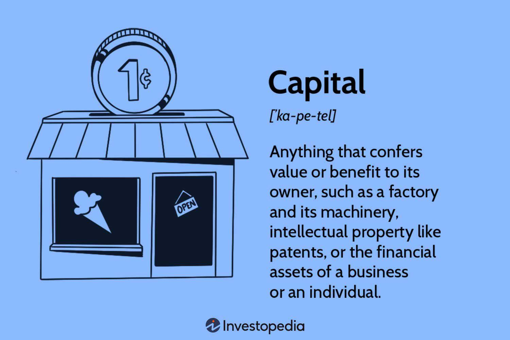

## Table of Contents

## What is capital in the context of business?

In business, capital refers to the money or resources that a company uses to start and run its operations. This can include cash, machinery, buildings, and even the skills of the people working in the company. Capital is important because it helps a business grow and make more money. Without enough capital, a business might struggle to buy the things it needs or hire the right people.

There are different types of capital, such as financial capital, which is the money used to buy assets or pay for expenses, and human capital, which is the skills and knowledge of the employees. Another type is physical capital, which includes things like buildings and equipment. Businesses often need to find ways to increase their capital, like getting loans or attracting investors, to keep growing and staying competitive.

## Why is capital important for a business?

Capital is very important for a business because it helps the business start and keep running. When a business begins, it needs money to buy things like equipment, rent a space, and pay workers. Without enough capital, a business might not be able to get started or might have to stop because it runs out of money.

As a business grows, it needs more capital to buy bigger equipment, hire more workers, or open new locations. Having enough capital helps a business take advantage of new opportunities and stay ahead of other businesses. If a business doesn't have enough capital, it might miss out on chances to grow and make more money.

## What are the different types of capital in business?

In business, there are several types of capital, and each one helps the business in different ways. One type is financial capital, which is the money a business uses to buy things or pay for expenses. This can come from loans, investments, or the money the owners put into the business. Another type is physical capital, which includes things like buildings, machines, and vehicles that a business uses to make its products or provide its services.

Human capital is another important type of capital. It refers to the skills, knowledge, and experience of the people working in the business. Good human capital can help a business be more successful because the workers know how to do their jobs well. Finally, there is social capital, which is about the relationships and networks a business has with other people and organizations. These connections can help a business find new customers, partners, or even new ideas.

## How does financial capital differ from human capital?

Financial capital is the money that a business uses to buy things or pay for things. It can come from different places like loans from a bank, money from investors, or even money that the owners of the business put in. This money is really important because it helps the business start up and keep going. Without enough financial capital, a business might not be able to buy the equipment it needs or pay its workers.

Human capital, on the other hand, is about the people who work for the business. It includes their skills, knowledge, and experience. When a business has good human capital, it means the workers know how to do their jobs well and can help the business succeed. Even if a business has a lot of financial capital, it still needs good human capital to make the most of that money and grow.

## What is working capital and how is it calculated?

Working capital is the money a business has to use for its day-to-day operations. It's what's left after you take away the money the business owes to others from the money it has right now. This money is important because it helps the business pay for things like buying supplies, paying workers, and other regular costs.

To calculate working capital, you start with the business's current assets. These are things like cash, money people owe the business, and supplies the business has. Then, you subtract the current liabilities, which are the bills and debts the business needs to pay soon. The formula is simple: Working Capital = Current Assets - Current Liabilities. If the number is positive, the business has enough money to cover its short-term needs. If it's negative, the business might have trouble paying its bills on time.

## What is the role of equity capital in business?

Equity capital is the money that comes from the owners or shareholders of a business. When people buy shares in a company, they are giving the company equity capital. This money is important because it helps the business start up, grow, and do things like buy new equipment or open new stores. Unlike loans, equity capital doesn't have to be paid back, which can be a big help for a business that's just starting out or trying to grow.

The owners or shareholders who provide equity capital get a piece of the business in return. This means they might get a share of the profits if the business does well, and they can have a say in how the business is run. But, it also means they share the risk. If the business doesn't do well, they might not get any money back. So, equity capital is a way for businesses to get the money they need, but it also means sharing the business with others.

## How do businesses raise capital through debt?

Businesses can raise capital through debt by borrowing money. This can be done by taking out loans from banks or other financial institutions. When a business gets a loan, it agrees to pay back the money over time, usually with interest. This interest is the cost of borrowing the money. Businesses might also issue bonds, which are like IOUs to investors. People buy these bonds and the business promises to pay them back with interest after a certain time.

Using debt to raise capital can help a business grow without giving up ownership. The business can use the borrowed money to buy new equipment, expand, or cover other costs. But, it's important for the business to be able to pay back the debt. If it can't, it might have to pay extra fees or even go bankrupt. So, while debt can be a useful way to get capital, it also comes with risks that the business needs to manage carefully.

## What are the common sources of capital for startups?

Startups often get their money from a few common places. One big source is the founders' own money, called personal savings. They might also get money from friends and family who believe in their idea. Another way is through angel investors, who are rich people that give money to new businesses in exchange for a piece of the company. These investors not only give money but can also share advice and connections.

Another source of capital for startups is venture capital. Venture capitalists are firms that invest in startups they think will grow a lot. They give money in return for part of the business and often help the startup grow. Startups can also get loans from banks, but this can be hard because banks might see new businesses as risky. Sometimes, startups use crowdfunding, where lots of people give small amounts of money online to help the business start. Each of these ways has its own pros and cons, so startups need to pick the best one for them.

## How does capital structure affect a company's financial health?

Capital structure is how a company mixes different types of money it uses to run and grow its business. It can be money from loans, which is called debt, or money from selling parts of the company to investors, which is called equity. The way a company decides to balance debt and equity can really change how healthy its finances are. If a company uses too much debt, it might have trouble paying back the money it owes, especially if things like interest rates go up or if the company doesn't make as much money as expected. This can make the company risky and might scare away investors.

On the other hand, using more equity can make the company's finances more stable because there's less pressure to pay back money quickly. But, it also means the original owners might own less of the company because they've sold parts of it to new investors. A good capital structure tries to find a balance that lets the company grow and be safe at the same time. It's important for the company to think about its goals, how much risk it can handle, and what the money markets are doing when deciding on its capital structure.

## What are the strategies for optimizing capital allocation?

Optimizing capital allocation means making smart choices about where to spend money to help a business grow and do well. One way to do this is by looking at all the different parts of the business and figuring out which ones make the most money or have the best chance to grow. For example, if a business finds that one of its products is really popular and makes a lot of profit, it might decide to put more money into making and selling that product. Another strategy is to use data and numbers to make decisions. By looking at things like how much money different projects make and how much they cost, a business can choose to spend money on the projects that will give the best return.

Another important strategy is to keep the balance right between spending money on new things and saving money for the future. Sometimes, it's a good idea to put money into new ideas or projects that might take a while to start making money. But, it's also important to have enough money saved up to handle any problems that might come up. A business might also decide to pay back some of its debts or buy back its own shares to make the company more valuable. By thinking carefully about where to put money and making sure to keep some in reserve, a business can use its capital in the best way possible to grow and stay healthy.

## How do businesses manage capital during economic downturns?

During economic downturns, businesses need to be very careful with their money. They might see less money coming in because people are not buying as much. To handle this, businesses often look at all their costs and try to cut down on things that are not really needed. They might stop hiring new people, delay big projects, or even close some parts of the business that are not making money. The goal is to keep enough money to keep the business going until things get better.

Another way businesses manage capital during tough times is by making sure they have enough cash saved up. They might use this cash to pay for things like rent and salaries when sales are down. Sometimes, businesses also talk to their banks about changing the terms of their loans, so they don't have to pay back as much money right away. By being smart about how they use their money and planning ahead, businesses can survive and even come out stronger after an economic downturn.

## What advanced financial models are used to assess capital needs and risks?

Businesses use advanced financial models to figure out how much money they need and what risks they might face. One common model is the Discounted Cash Flow (DCF) model. This model helps businesses predict how much money they will make in the future and figure out what that money is worth today. By looking at these numbers, a business can decide if it should spend money on new projects or if it needs to borrow money. Another model is the Monte Carlo simulation, which uses lots of different scenarios to see how things might turn out. This helps businesses understand the risks they might face and plan for different possibilities.

Another important model is the Capital Asset Pricing Model (CAPM). This model helps businesses figure out how much return they should expect from their investments compared to the risks they are taking. It's useful for deciding if an investment is worth the risk. Businesses also use scenario analysis to look at what might happen if things go well or if they go badly. This helps them plan for different situations and make sure they have enough money to handle whatever comes their way. By using these models, businesses can make smarter choices about their money and be better prepared for the future.

## What are the types of capital?

Business capital is primarily divided into four categories: working, debt, equity, and trading capital. Each type plays a significant role in sustaining and expanding business operations, contributing uniquely to a company’s financial strategy and market presence.

Working capital is essential for managing the daily operational expenses of a business. It is calculated as the difference between current assets and current liabilities, represented by the formula: 

$$
\text{Working Capital} = \text{Current Assets} - \text{Current Liabilities}
$$

This financial metric measures the firm's short-term [liquidity](/wiki/liquidity-risk-premium) and its ability to cover day-to-day expenses. It includes cash, inventory, accounts receivable, and other assets expected to be liquidated within a year and is crucial for maintaining business operations without interruptions.

Debt capital, on the other hand, involves funds borrowed by the business, typically from financial institutions or bond issuance. This type of capital must be repaid over time, usually with interest, making it a key component of a company's liabilities. Debt capital enables companies to undertake significant capital investments or expansions without diluting ownership and is frequently employed in situations where raising equity might not be feasible or desirable.

Equity capital is collected from shareholders who invest in the company in exchange for ownership shares. This capital does not require repayment like debt and carries no interest charge, minimizing financial risk in debt service. However, it requires sharing future profits with investors through dividends, or they expect an appreciation of their shares' value. Equity capital is crucial for businesses seeking to expand, invest in new projects, or restructure operations without the encumbrance of additional debt.

Trading capital is specifically allocated by financial institutions to engage in market-related activities. Unlike other forms of capital, trading capital is used by traders to buy and sell securities, commodities, or other financial instruments. These activities are designed to generate profit from market movements, often involving sophisticated strategies such as high-frequency trading or [algorithmic trading](/wiki/algorithmic-trading). Financial institutions precisely manage trading capital to enhance returns while controlling exposure to market risks.

In conclusion, understanding and effectively managing these distinct types of capital allows businesses to tailor financial strategies to their specific needs, optimize operational efficiency, and maintain competitiveness in dynamic market environments.

## References & Further Reading

[1]: ["Advances in Financial Machine Learning"](https://www.amazon.com/Advances-Financial-Machine-Learning-Marcos/dp/1119482089) by Marcos Lopez de Prado

[2]: ["Algorithmic Trading: Winning Strategies and Their Rationale"](https://www.wiley.com/en-us/Algorithmic+Trading%3A+Winning+Strategies+and+Their+Rationale-p-9781118460146) by Ernest P. Chan

[3]: ["Quantitative Trading: How to Build Your Own Algorithmic Trading Business"](https://www.amazon.com/Quantitative-Trading-Build-Algorithmic-Business/dp/1119800064) by Ernest P. Chan

[4]: ["Machine Learning for Algorithmic Trading"](https://github.com/PacktPublishing/Machine-Learning-for-Algorithmic-Trading-Second-Edition) by Stefan Jansen

[5]: ["Evidence-Based Technical Analysis: Applying the Scientific Method and Statistical Inference to Trading Signals"](https://www.amazon.com/Evidence-Based-Technical-Analysis-Scientific-Statistical/dp/0470008741) by David Aronson