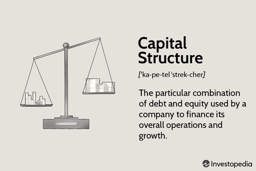

In today's rapidly evolving landscape of business and finance, a firm grasp of capital types is crucial for both sustainable growth and strategic planning. Recognizing and effectively managing different forms of business capital is key to navigating complex economic activities. This article examines various categories of business capital and highlights their vital role in financial markets, particularly through the lens of algorithmic trading. 

Capital serves as the backbone of any business operation. Different forms such as working capital, debt capital, equity capital, and trading capital are pivotal in ensuring daily functionality and future expansion. Advances in technology, especially in finance, have transformed traditional approaches to capital utilization. A standout example of this transformation is algorithmic trading—a sophisticated form of trading that utilizes computer algorithms to execute trades with unparalleled speed and accuracy.

Algorithmic trading illustrates the fusion of finance and technology, showing how businesses are leveraging these advancements to optimize their capital use. This innovative method underscores the broader trend where technology plays an integral role in modern financial strategies, thus impacting global economic development.

By understanding these interconnections, stakeholders can gain valuable insights into efficient capital management, enhancing their ability to adapt and thrive amidst the ongoing evolution of global markets. The strategic application of capital types, supported by technological innovations like algorithmic trading, remains essential for achieving economic development and competitive advantage in today's financial world.

## Table of Contents

## Understanding Capital in Business

Capital is a fundamental element in ensuring the smooth operations and sustained growth of businesses. Companies typically employ various forms of capital, each serving distinct purposes in their financial strategy. Among the primary forms are working capital, debt capital, equity capital, and trading capital. 

Working capital is essential for covering the day-to-day expenses needed to maintain business operations. It represents the difference between a company's current assets and current liabilities, ensuring a firm has enough liquidity to cover its short-term obligations. 

Debt capital involves borrowing funds, usually from financial institutions, where the borrowed amount must be repaid with interest over time. This form of capital can enable companies to make significant investments without immediately impacting their equity positions. For instance, a loan or bond issuance is a common method for acquiring debt capital. 

Equity capital is obtained through the sale of shares, allowing businesses to raise funds without incurring debt. Investors who purchase shares are essentially buying ownership in the company, and equity capital provides essential funding for business expansion projects. This capital form does not [carry](/wiki/carry-trading) an obligation of repayment, but it does involve sharing future profits with shareholders through dividends.

In managing these various forms of capital, businesses often focus on capital structure, which refers to the proportional combination of debt and equity used to finance the firm’s operations and growth. An optimal capital structure balances the cost of capital with the potential returns, influencing the overall valuation and financial stability of the company.

## Types of Capital

Business capital is primarily divided into four categories: working, debt, equity, and trading capital. Each type plays a significant role in sustaining and expanding business operations, contributing uniquely to a company’s financial strategy and market presence.

Working capital is essential for managing the daily operational expenses of a business. It is calculated as the difference between current assets and current liabilities, represented by the formula: 

$$
\text{Working Capital} = \text{Current Assets} - \text{Current Liabilities}
$$

This financial metric measures the firm's short-term [liquidity](/wiki/liquidity-risk-premium) and its ability to cover day-to-day expenses. It includes cash, inventory, accounts receivable, and other assets expected to be liquidated within a year and is crucial for maintaining business operations without interruptions.

Debt capital, on the other hand, involves funds borrowed by the business, typically from financial institutions or bond issuance. This type of capital must be repaid over time, usually with interest, making it a key component of a company's liabilities. Debt capital enables companies to undertake significant capital investments or expansions without diluting ownership and is frequently employed in situations where raising equity might not be feasible or desirable.

Equity capital is collected from shareholders who invest in the company in exchange for ownership shares. This capital does not require repayment like debt and carries no interest charge, minimizing financial risk in debt service. However, it requires sharing future profits with investors through dividends, or they expect an appreciation of their shares' value. Equity capital is crucial for businesses seeking to expand, invest in new projects, or restructure operations without the encumbrance of additional debt.

Trading capital is specifically allocated by financial institutions to engage in market-related activities. Unlike other forms of capital, trading capital is used by traders to buy and sell securities, commodities, or other financial instruments. These activities are designed to generate profit from market movements, often involving sophisticated strategies such as high-frequency trading or [algorithmic trading](/wiki/algorithmic-trading). Financial institutions precisely manage trading capital to enhance returns while controlling exposure to market risks.

In conclusion, understanding and effectively managing these distinct types of capital allows businesses to tailor financial strategies to their specific needs, optimize operational efficiency, and maintain competitiveness in dynamic market environments.

## Algorithmic Trading: A Modern Use of Capital

Algorithmic trading employs advanced automation and complex algorithms to execute trades with remarkable speed and precision, transforming traditional trading practices. This innovative approach allows financial institutions to make use of capital efficiently by deploying sophisticated strategies that optimize financial returns. One prominent methodology within algorithmic trading is high-frequency trading ([HFT](/wiki/high-frequency-trading-strategies)), where trading firms execute a large number of orders at extremely high speeds, often utilizing powerful computer systems and network infrastructures to gain competitive advantages.

The implementation of algorithmic trading involves significant technological investments, including advanced IT infrastructure capable of handling high-speed data processing and transmission. Additionally, firms must invest in skilled human capital with expertise in both finance and computer science to develop, monitor, and refine trading algorithms. This dual expertise ensures that trading models are both robust and adaptable to ever-changing market conditions.

Algorithmic trading also allows firms to respond quickly to market dynamics. By integrating predictive models and real-time data analysis, financial institutions can make informed trading decisions in milliseconds, capturing opportunities that may be missed in manual trading environments. This efficiency in capital utilization not only increases potential returns but also enhances market liquidity and price discovery processes.

However, the rapid nature of algorithmic trading requires continuous monitoring to mitigate risks such as technological errors or unexpected market [volatility](/wiki/volatility-trading-strategies). Effective risk management strategies and regulatory compliance are crucial to ensure stable trading operations. Through optimizing the use of capital and employing rigorous technology, algorithmic trading continues to revolutionize how financial markets operate, offering novel avenues for capital deployment and competitive growth.

## Advantages and Risks in Capital and Algorithmic Trading

Utilizing different forms of capital is essential for businesses to maintain liquidity and strategically expand within financial markets. This capital, which includes working, debt, equity, and trading capital, provides businesses with the necessary resources to operate efficiently and pursue growth opportunities. Effective capital management ensures that resources are allocated appropriately, balancing the need for immediate operational funding and long-term investments.

Algorithmic trading, a modern application of trading capital, enhances trade execution by utilizing sophisticated computer algorithms. This approach offers significant advantages such as increased efficiency, reduced transaction costs, and enhanced speed in executing trades. By eliminating human error, algorithmic trading can increase accuracy and transparency in market transactions.

However, the reliance on technology and algorithms introduces certain risks. Market volatility can be exacerbated by algorithmic trading, as rapid automated transactions may lead to large price movements. Technical failures, such as system crashes or incorrect algorithm configurations, can result in significant financial losses. Moreover, the complexity of the algorithms may contribute to systemic risks in financial markets, potentially leading to broader economic repercussions.

To mitigate these risks, effective capital management is critical. Businesses need to conduct thorough risk assessments to understand and anticipate potential challenges associated with algorithmic trading. Strategic investment in advanced technologies, such as robust IT infrastructure and cybersecurity measures, is necessary to limit the impact of technical failures. Additionally, employing skilled human capital for monitoring and optimizing algorithmic systems can help maintain competitive advantages.

Prudent management of capital and technology enables businesses to increase resilience against market fluctuations and other external challenges. By leveraging capital effectively, companies can achieve sustainable growth and strengthen their position in the financial markets. This strategic approach not only prepares businesses for current demands but also positions them for future economic development and expansion.

## The Future of Capital Utilization in Economic Development

Capital, in its various forms, remains a pivotal element in spurring economic growth and innovation. As the landscape of global finance evolves, technological advancements, particularly in algorithmic trading and [artificial intelligence](/wiki/ai-artificial-intelligence), are fundamentally transforming how capital is applied. These technologies enhance decision-making by analyzing vast datasets with precision, enabling businesses to make more informed strategic and investment choices. Algorithmic trading, for example, leverages sophisticated algorithms to execute trades with speed and accuracy, optimizing the utilization of financial capital and potentially increasing returns on investment.

Moreover, the integration of sustainable and green technologies into capital investments is becoming increasingly significant. As environmental considerations become paramount, businesses are compelled to incorporate sustainable practices in their financial strategies. Investments in green technology not only align with regulatory requirements and societal expectations but also present new opportunities for growth and innovation in sectors such as renewable energy, waste management, and sustainable agriculture.

To thrive in this dynamic environment, businesses must adapt their strategies to seamlessly incorporate technological and environmental considerations. This involves re-evaluating traditional capital allocation methods and embracing innovative solutions that foster economic advancement while minimizing environmental impact. 

Understanding the evolving dynamics of capital will enable businesses to optimize decision-making and enhance strategic planning. This involves a thorough analysis of market trends, potential technological disruptions, and the environmental impact of capital investments. By aligning capital utilization strategies with these evolving trends, businesses can enhance their resilience, maintain competitiveness, and drive sustainable growth in the global economy. 

In conclusion, capital utilization is at the forefront of driving economic development. Leveraging advancements in technology and embracing sustainable practices will define the future trajectory of businesses in an ever-changing economic landscape.

## Conclusion

Capital, whether financial, human, or physical, is an essential element in the domains of business finance and algorithmic trading. The strategic application of these various types of capital can substantially improve both the market position and operational efficiency of a business. This underscores the importance of carefully structured approaches where businesses optimize the combination of different capital resources to maximize their growth potential.

In the ever-evolving landscape of modern financial markets, continuous innovation and adaptability are crucial. The rapid development of technology, particularly in areas like algorithmic trading, requires businesses to remain agile and forward-thinking. This involves not only incorporating new technologies but also re-evaluating strategies to ensure alignment with current market dynamics and emerging trends.

A critical aspect of achieving business growth, sustainability, and a competitive edge lies in the effective understanding and leveraging of capital. Businesses that proficiently manage different capital forms can enhance their resilience against market fluctuations and position themselves advantageously against competitors. This management includes optimizing the debt-equity ratio, efficiently deploying working capital, and strategically investing in technology and human resources.

Effective capital management is foundational to securing long-term success. As the economic landscape continues to shift, businesses must be vigilant in assessing their capital strategies, ensuring they are positioned for sustainable success. This involves balancing risk with opportunity, maintaining liquidity, and strategically investing in innovations that can drive future growth.

In conclusion, the dynamic interplay between various forms of capital and the strategic decisions businesses make around their use is integral to thriving in today's complex economic environment. The ability to effectively manage and innovate around capital resources not only enhances immediate financial outcomes but also lays the groundwork for enduring success.

## References & Further Reading

[1]: ["Advances in Financial Machine Learning"](https://www.amazon.com/Advances-Financial-Machine-Learning-Marcos/dp/1119482089) by Marcos Lopez de Prado

[2]: ["Algorithmic Trading: Winning Strategies and Their Rationale"](https://www.wiley.com/en-us/Algorithmic+Trading%3A+Winning+Strategies+and+Their+Rationale-p-9781118460146) by Ernest P. Chan

[3]: ["Quantitative Trading: How to Build Your Own Algorithmic Trading Business"](https://www.amazon.com/Quantitative-Trading-Build-Algorithmic-Business/dp/1119800064) by Ernest P. Chan

[4]: ["Machine Learning for Algorithmic Trading"](https://github.com/PacktPublishing/Machine-Learning-for-Algorithmic-Trading-Second-Edition) by Stefan Jansen

[5]: ["Evidence-Based Technical Analysis: Applying the Scientific Method and Statistical Inference to Trading Signals"](https://www.amazon.com/Evidence-Based-Technical-Analysis-Scientific-Statistical/dp/0470008741) by David Aronson