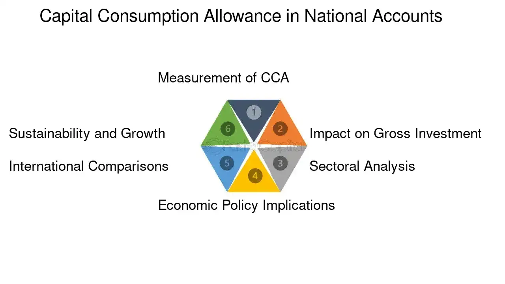

## Table of Contents

## What is Capital Consumption Allowance (CCA)?

Capital Consumption Allowance (CCA) is a term used in economics to describe the amount of money a business needs to set aside to replace its assets over time. These assets, like machinery or buildings, wear out or become outdated, and the CCA helps the business keep track of how much it needs to spend to keep everything running smoothly.

Think of CCA as a savings plan for a company's future. Instead of spending all their money on new things right away, businesses use CCA to spread out the cost of replacing their assets over many years. This way, they can plan better and make sure they have enough money when it's time to buy new equipment or fix old buildings.

## Why is Capital Consumption Allowance important for businesses?

Capital Consumption Allowance (CCA) is really important for businesses because it helps them plan for the future. When a company buys things like machines or buildings, these things don't last forever. They wear out or get old. CCA helps the business figure out how much money they need to save each year to replace these things when they need to. This way, the business can keep running smoothly without any big surprises.

By using CCA, businesses can also make sure they are not spending too much money all at once. Instead of buying everything new right away, they can spread out the cost over time. This makes it easier to manage their money and keep their finances healthy. It's like having a savings plan that helps the business stay strong and ready for whatever comes next.

## How does Capital Consumption Allowance affect a company's financial statements?

Capital Consumption Allowance (CCA) shows up on a company's financial statements as a way to keep track of how much money they need to save for replacing their old stuff. On the income statement, CCA is taken away from the company's earnings. This makes the company's profit look smaller, but it's not really a loss. It's just money set aside for future use, like saving for a rainy day.

On the balance sheet, CCA affects the value of the company's assets. As the company uses up its machines or buildings, their value goes down. The CCA helps show this decrease in value over time. This way, the balance sheet gives a more honest picture of what the company's stuff is really worth, not just what it cost when it was new.

By including CCA in financial statements, a company can show that it's planning ahead and being smart with its money. It helps everyone who looks at the financial statements, like investors or banks, understand that the company is taking care of its future needs. This can make the company look more reliable and well-managed.

## What is the difference between Capital Consumption Allowance and depreciation?

Capital Consumption Allowance (CCA) and depreciation are similar because they both deal with how the value of a company's assets goes down over time. But they are used in different ways. CCA is an economic concept that helps businesses figure out how much money they need to save each year to replace their assets when they wear out. It's like a savings plan for the future. On the other hand, depreciation is an accounting method that shows how the value of an asset decreases over time on a company's financial statements.

Depreciation is used to spread out the cost of an asset over its useful life. For example, if a company buys a machine that will last 10 years, they might use depreciation to show that the machine loses a bit of its value each year. This helps the company match the cost of the machine with the income it helps generate. CCA, however, focuses on the total amount of money needed to keep the business's assets in good shape, not just how to spread out the cost on paper. So while depreciation is more about accounting rules, CCA is about planning for real future expenses.

## How is Capital Consumption Allowance calculated?

Capital Consumption Allowance (CCA) is calculated by figuring out how much money a business needs to set aside each year to replace its assets when they wear out or become outdated. To do this, the business first needs to know the cost of their assets and how long they expect those assets to last. For example, if a company buys a machine for $10,000 and expects it to last 10 years, they would need to save $1,000 each year to replace it at the end of its life.

Once the business knows the cost and useful life of its assets, it can use different methods to calculate the CCA. One common way is the straight-line method, where the total cost of the asset is divided by its useful life. Another method is the declining balance method, where a fixed percentage of the asset's value is set aside each year, and this percentage is applied to the remaining value of the asset each year. The method chosen can depend on the type of asset and the business's financial planning needs.

## Can you provide an example of how Capital Consumption Allowance is applied in a real-world scenario?

Imagine a small bakery that bought an oven for $5,000. The bakery expects the oven to last for 5 years before it needs to be replaced. To make sure they can afford a new oven when the time comes, the bakery decides to use Capital Consumption Allowance (CCA). They calculate that they need to save $1,000 each year ($5,000 divided by 5 years). So, every year, the bakery sets aside $1,000 from their earnings into a special fund. This way, by the end of 5 years, they'll have enough money to buy a new oven without any financial stress.

Now, let's say the bakery also bought a mixer for $2,000 that they expect to last for 4 years. They use the same CCA method and figure out they need to save $500 each year ($2,000 divided by 4 years). So, they add another $500 to their yearly savings plan. By doing this, the bakery makes sure they have the money to replace both the oven and the mixer when needed. This planning helps the bakery keep running smoothly and avoid big expenses all at once.

## What are the tax implications of Capital Consumption Allowance for a business?

Capital Consumption Allowance (CCA) can help businesses with their taxes. When a business sets aside money for CCA, it can lower their taxable income. This is because CCA is seen as an expense on the income statement. By reducing their taxable income, businesses can pay less in taxes each year. This can be really helpful, especially for small businesses that need to save every penny they can.

However, the way CCA affects taxes can be different depending on the country and its tax laws. In some places, the government might have special rules about how businesses can claim CCA for tax purposes. It's important for businesses to know these rules so they can use CCA in the best way possible. Talking to a tax advisor can help make sure a business is doing everything right and getting the most out of their CCA.

## How does Capital Consumption Allowance impact national economic statistics like GDP?

Capital Consumption Allowance (CCA) plays a big role in figuring out a country's Gross Domestic Product (GDP). GDP is the total value of all the goods and services made in a country in a year. When businesses set aside money for CCA, this amount is taken away from their earnings. But, even though it's taken away from their earnings, CCA is still counted as part of the country's GDP. This is because CCA shows how much money is being used to keep the country's machines and buildings working, which is important for making more goods and services.

Think of it this way: if a business saves money to buy a new machine, that money is helping the economy because it will be spent on something that helps make more things. So, CCA is like a way to show that even the money set aside for future needs is still helping the country's economy right now. By including CCA in GDP, we get a better idea of how much money is really being used to keep the economy going strong.

## What are the criticisms or limitations of using Capital Consumption Allowance?

One big criticism of Capital Consumption Allowance (CCA) is that it can be hard to guess right. Businesses have to guess how long their machines or buildings will last and how much they will cost to replace. If they guess wrong, they might save too much or too little money. Saving too much means they could be using that money for other things, like growing their business. Saving too little means they might not have enough money when they need to buy new stuff, which can cause big problems.

Another limitation is that different businesses might use different ways to calculate CCA. Some might use the straight-line method, while others might use the declining balance method. This makes it hard to compare one business to another because their CCA numbers might look different even if they are in the same industry. It can also make it tricky for people outside the business, like investors or the government, to understand how well the business is really doing.

## How do different accounting standards treat Capital Consumption Allowance?

Different accounting standards handle Capital Consumption Allowance (CCA) in their own way, which can make things a bit confusing. For example, under the Generally Accepted Accounting Principles (GAAP) used in the United States, CCA is similar to what they call depreciation. GAAP has strict rules about how businesses should calculate and report depreciation, and these rules can affect how much money a business sets aside for CCA. On the other hand, the International Financial Reporting Standards (IFRS), used in many other countries, also talk about depreciation but might let businesses have a bit more freedom in how they do it. This means that a business in the U.S. might calculate CCA differently than a business in Europe, even if they are doing the same kind of work.

These differences in accounting standards can make it hard to compare businesses from different countries. If one business uses GAAP and another uses IFRS, their financial statements might look different, even if they are both setting aside money for the same reason. It's important for people who look at these financial statements, like investors or banks, to understand these differences so they can make fair comparisons. Talking to an accountant who knows about both GAAP and IFRS can help make sense of it all.

## What role does Capital Consumption Allowance play in long-term business planning and investment?

Capital Consumption Allowance (CCA) is super important for long-term business planning and investment. It helps businesses figure out how much money they need to save each year to replace their old stuff, like machines or buildings, when they wear out. By setting aside this money, businesses can make sure they have enough cash to keep everything running smoothly in the future. This planning is key because it helps businesses avoid big surprises and keep their finances healthy. Instead of spending a lot of money all at once to replace an asset, they can spread out the cost over many years, which makes it easier to manage their money.

When businesses use CCA for long-term planning, it also helps them decide where to invest their money. If they know they need to save a certain amount each year for CCA, they can plan their investments around that. For example, they might decide to invest in new technology or expand their business, knowing they have already set aside money for future replacements. This careful planning with CCA helps businesses stay strong and grow over time. It's like having a roadmap that guides them to make smart choices about their money and future investments.

## How has the concept and application of Capital Consumption Allowance evolved over time?

The idea of Capital Consumption Allowance (CCA) has changed a lot over the years. At first, businesses didn't really think about saving money for the future. They just bought new things when the old ones broke. But as businesses got bigger and more complicated, they realized they needed a better way to plan for replacing their machines and buildings. That's when CCA started to become important. It helped businesses figure out how much money they needed to save each year to keep everything running smoothly. This way of thinking helped businesses plan better and avoid big surprises.

Over time, the way businesses calculate and use CCA has also changed. In the beginning, they used simple methods like the straight-line method, where they just divided the cost of an asset by how long it would last. But as accounting got more detailed, new methods like the declining balance method came along. This method lets businesses set aside more money in the early years when an asset is new and less as it gets older. Also, different countries started using different accounting rules, which made things a bit more complicated. Now, businesses have to think about these rules when they plan their CCA, but it still helps them a lot with long-term planning and staying financially healthy.

## What is Understanding Economic Accounting?

Economic accounting serves as a critical tool for assessing the economic health and financial performance of a nation or a business. It provides a framework for systematically measuring and analyzing economic activity, which is essential for understanding the state of an economy and making informed policy and business decisions.

A core component of economic accounting is the computation of Gross Domestic Product (GDP), which quantifies the value of all goods and services produced within a country during a specific period. GDP is a vital indicator of economic activity and helps policymakers and businesses evaluate the overall performance of an economy. It can be calculated using three approaches: the production approach, which sums up the value added at each stage of production; the income approach, which aggregates the incomes earned by factors of production; and the expenditure approach, which sums up all expenditures made in the economy. The relationship among these approaches can be expressed with the following formula:

$$
\text{GDP} = C + I + G + (X - M)
$$

where $C$ is consumption, $I$ is investment, $G$ is government spending, $X$ is exports, and $M$ is imports.

Another essential concept in economic accounting is the net domestic product (NDP), which adjusts GDP by accounting for the depreciation of capital assets. NDP provides a more precise measure of the sustainable production capacity of an economy by subtracting the capital consumption allowance (CCA) from GDP. The formula is:

$$
\text{NDP} = \text{GDP} - \text{CCA}
$$

NDP is valuable for understanding the net value of goods and services produced in an economy after accounting for the wear and tear on capital assets.

National wealth is another significant indicator derived from economic accounting. It encapsulates the total value of a nation's assets, including physical assets like buildings and machinery, natural resources, and financial assets. Assessing national wealth is crucial for long-term economic planning and sustainability.

Economic accounting aids businesses and governments in making informed decisions by examining production levels and capital stock usage. By evaluating these metrics, stakeholders can identify investment opportunities, assess economic vulnerabilities, and devise policies that promote sustainable economic growth.

In conclusion, economic accounting provides a systematic approach to measuring and analyzing the economic activity that is vital for both macroeconomic policy frameworks and microeconomic business strategies. Through accurate economic accounting, nations and businesses can effectively navigate and adapt to changing economic conditions.

## What is the relationship between Capital Consumption Allowance and Depreciation?

Capital Consumption Allowance (CCA), synonymous with depreciation in national accounting, is a concept that reflects the diminishing value of capital assets over time due to physical wear, technological obsolescence, and market changes. It serves as a foundational component in the calculation of Gross Domestic Product (GDP), specifically in the measurement of Net Domestic Product (NDP), which is derived from GDP by accounting for capital depreciation:

$$
\text{NDP} = \text{GDP} - \text{CCA}
$$

The recognition of CCA as a metric in economic calculations allows for a more nuanced understanding of an economy's true productive capacity. While GDP provides an overview of total economic activity, subtracting CCA provides insights into the net production capacity by excluding the portion of goods and services that merely compensates for depreciated assets.

Understanding CCA is crucial for making informed strategic investment decisions. By recognizing the rate at which capital assets lose value, businesses and policymakers can better assess economic sustainability and the productive efficiency of capital stock. For instance, a high CCA relative to GDP may indicate that a large proportion of the economy's output is used to replace depreciated capital, signaling potential constraints on economic growth unless there is significant investment in new capital goods.

Moreover, acknowledging CCA in economic evaluations enables a forward-looking approach to resource allocation. By understanding depreciation trends, businesses can allocate reserves for capital replenishment, ensure continued operational efficiency, and pursue investments in innovation to remain competitive. This understanding also supports infrastructure spending and technological advancements, promoting sustainability and long-term economic stability.

In summary, Capital Consumption Allowance and its role as a measure of depreciation provide essential insight into economic health. It allows for a deeper analysis of production capacities and informs strategic investment, ultimately fostering economic sustainability and growth.

## What is the importance of depreciation in economic growth?

Depreciation serves as a critical [factor](/wiki/factor-investing) in both corporate accounting and the broader macroeconomic landscape, influencing key indicators such as Gross Domestic Product (GDP) and Net National Product (NNP). In corporate accounting, depreciation accounts for the diminution of asset value over time, allowing businesses to align their balance sheets more closely with actual asset worth and adjust their tax liabilities accordingly. When a company purchases an asset, such as machinery, its immediate expense is capitalized, meaning its cost is spread across the asset's useful life instead of being recorded as an immediate expense. This spreading of cost is depicted through depreciation, thereby impacting financial strategies and tax planning.

For instance, the formula to determine depreciation expense using the straight-line method is:

$$
\text{Depreciation Expense} = \frac{\text{Cost of Asset} - \text{Residual Value}}{\text{Useful Life of Asset}}
$$

This formula helps businesses allocate funds effectively over time, ensuring that tax calculations reflect the true decline in asset value. Accurate accounting for depreciation not only aids in financial reporting but also impacts cash flows and investment decisions, making it a cornerstone for strategic planning.

On a macroeconomic level, the Capital Consumption Allowance (CCA) component—encompassing depreciation—provides insight into an economy's net production capacity by adjusting GDP to reflect asset wear and tear. A high ratio of CCA to GDP can indicate sluggish economic growth and insufficient investment in new capital goods, pointing to potentially outdated infrastructure and technology. This scenario might suggest that businesses are not rejuvenating their capital stock, opting instead to prolong the lifespan of aging assets.

An economy's ability to sustain growth is often linked to its investment in new capital goods. When depreciation outpaces investment, it signifies inadequate reinvestment into the economy's core productive assets, potentially leading to reduced capacity for growth. In summary, while depreciation may initially appear as a conservative accounting measure, its implications reach far into economic performance, influencing both individual business strategies and national economic policies.

## References & Further Reading

[1]: ["National Income and Product Accounts"](https://www.bea.gov/products/national-income-and-product-accounts) - U.S. Bureau of Economic Analysis. Discusses GDP and related economic accounting measures.

[2]: ["Depreciation and Amortization"](https://www.investopedia.com/ask/answers/06/amortizationvsdepreciation.asp) - Investopedia. Explains the concept of depreciation and its role in accounting.

[3]: ["Algorithmic Trading: Winning Strategies and Their Rationale"](https://books.google.com/books/about/Algorithmic_Trading.html?id=WAlFDwAAQBAJ) by Ernest P. Chan. Offers insights into the strategies and mechanisms behind algorithmic trading.

[4]: ["Trading and Exchanges: Market Microstructure for Practitioners"](https://academic.oup.com/book/52292) by Larry Harris. Provides an overview of how financial markets operate, including modern algorithmic trading practices.

[5]: Solow, R. M. (1956). ["A Contribution to the Theory of Economic Growth."](https://pages.nyu.edu/debraj/Courses/Readings/Solow.pdf) The Quarterly Journal of Economics. Discusses economic growth theories relevant to investment and capital consumption.