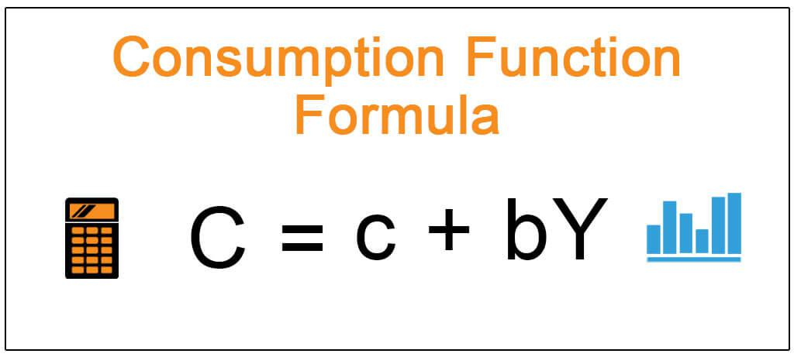

The modern economic landscape is continually evolving, influenced by a mix of traditional financial concepts and emerging technologies. A deeper understanding of this evolution can be gained by examining the interplay among four critical topics: economic accounting, capital consumption allowance (CCA), depreciation, and algorithmic trading. These elements are pivotal in comprehending business operations and the broader economy's adaptability and growth.

Economic accounting serves as the foundation for assessing an entity's or country's financial and economic health. By calculating essential indicators such as Gross Domestic Product (GDP), net domestic product, and national wealth, economic accounting provides insights into production levels and how capital stock is leveraged. It is an indispensable tool for businesses and governments striving to make informed decisions in an ever-changing economic environment.

Capital consumption allowance, also referred to as depreciation, is integral to understanding an economy's production capacity. It accounts for the declining value of capital assets due to wear, tear, and obsolescence, presenting a more accurate picture of a nation's net production capacity. Grasping the concept of CCA is essential for guiding strategic investment decisions and evaluating an economy's long-term sustainability.

Depreciation, while related to CCA, specifically affects corporate accounting practices and macroeconomic indicators, such as GDP and Net National Product (NNP). It enables businesses to manage the devaluation of assets over time, influencing tax liabilities and financial planning. Recognizing high levels of CCA in relation to GDP can be an indicator of inadequate investment in new capital goods, potentially signaling sluggish economic growth.

Algorithmic trading represents a new frontier in financial markets, where sophisticated algorithms execute trades at unparalleled speed and efficiency. This technological advancement significantly impacts market liquidity, pricing mechanisms, and overall dynamics. When integrated with traditional financial metrics like CCA, algorithmic trading unveils new opportunities for enhancing economic performance.

The convergence of economic accounting and algorithmic trading techniques signals a transformative shift in financial management practices. A comprehensive understanding of CCA and depreciation can enhance algorithmic trading strategies by refining risk management and optimizing investment returns. This synthesis empowers businesses to maximize asset utilization and align trading strategies with prevailing economic trends.

In sum, blending economic accounting, CCA, depreciation, and algorithmic trading is crucial for achieving financial stability and growth. Companies and economies that adeptly leverage these concepts can attain sustainable progress and maintain a competitive edge. As technology continues to advance, the integration of traditional financial principles and modern trading strategies will inevitably shape the future of the economic landscape.

## Table of Contents

## Understanding Economic Accounting

Economic accounting serves as a critical tool for assessing the economic health and financial performance of a nation or a business. It provides a framework for systematically measuring and analyzing economic activity, which is essential for understanding the state of an economy and making informed policy and business decisions.

A core component of economic accounting is the computation of Gross Domestic Product (GDP), which quantifies the value of all goods and services produced within a country during a specific period. GDP is a vital indicator of economic activity and helps policymakers and businesses evaluate the overall performance of an economy. It can be calculated using three approaches: the production approach, which sums up the value added at each stage of production; the income approach, which aggregates the incomes earned by factors of production; and the expenditure approach, which sums up all expenditures made in the economy. The relationship among these approaches can be expressed with the following formula:

$$
\text{GDP} = C + I + G + (X - M)
$$

where $C$ is consumption, $I$ is investment, $G$ is government spending, $X$ is exports, and $M$ is imports.

Another essential concept in economic accounting is the net domestic product (NDP), which adjusts GDP by accounting for the depreciation of capital assets. NDP provides a more precise measure of the sustainable production capacity of an economy by subtracting the capital consumption allowance (CCA) from GDP. The formula is:

$$
\text{NDP} = \text{GDP} - \text{CCA}
$$

NDP is valuable for understanding the net value of goods and services produced in an economy after accounting for the wear and tear on capital assets.

National wealth is another significant indicator derived from economic accounting. It encapsulates the total value of a nation's assets, including physical assets like buildings and machinery, natural resources, and financial assets. Assessing national wealth is crucial for long-term economic planning and sustainability.

Economic accounting aids businesses and governments in making informed decisions by examining production levels and capital stock usage. By evaluating these metrics, stakeholders can identify investment opportunities, assess economic vulnerabilities, and devise policies that promote sustainable economic growth.

In conclusion, economic accounting provides a systematic approach to measuring and analyzing the economic activity that is vital for both macroeconomic policy frameworks and microeconomic business strategies. Through accurate economic accounting, nations and businesses can effectively navigate and adapt to changing economic conditions.

## Capital Consumption Allowance and Depreciation

Capital Consumption Allowance (CCA), synonymous with depreciation in national accounting, is a concept that reflects the diminishing value of capital assets over time due to physical wear, technological obsolescence, and market changes. It serves as a foundational component in the calculation of Gross Domestic Product (GDP), specifically in the measurement of Net Domestic Product (NDP), which is derived from GDP by accounting for capital depreciation:

$$
\text{NDP} = \text{GDP} - \text{CCA}
$$

The recognition of CCA as a metric in economic calculations allows for a more nuanced understanding of an economy's true productive capacity. While GDP provides an overview of total economic activity, subtracting CCA provides insights into the net production capacity by excluding the portion of goods and services that merely compensates for depreciated assets.

Understanding CCA is crucial for making informed strategic investment decisions. By recognizing the rate at which capital assets lose value, businesses and policymakers can better assess economic sustainability and the productive efficiency of capital stock. For instance, a high CCA relative to GDP may indicate that a large proportion of the economy's output is used to replace depreciated capital, signaling potential constraints on economic growth unless there is significant investment in new capital goods.

Moreover, acknowledging CCA in economic evaluations enables a forward-looking approach to resource allocation. By understanding depreciation trends, businesses can allocate reserves for capital replenishment, ensure continued operational efficiency, and pursue investments in innovation to remain competitive. This understanding also supports infrastructure spending and technological advancements, promoting sustainability and long-term economic stability.

In summary, Capital Consumption Allowance and its role as a measure of depreciation provide essential insight into economic health. It allows for a deeper analysis of production capacities and informs strategic investment, ultimately fostering economic sustainability and growth.

## The Importance of Depreciation in Economic Growth

Depreciation serves as a critical [factor](/wiki/factor-investing) in both corporate accounting and the broader macroeconomic landscape, influencing key indicators such as Gross Domestic Product (GDP) and Net National Product (NNP). In corporate accounting, depreciation accounts for the diminution of asset value over time, allowing businesses to align their balance sheets more closely with actual asset worth and adjust their tax liabilities accordingly. When a company purchases an asset, such as machinery, its immediate expense is capitalized, meaning its cost is spread across the asset's useful life instead of being recorded as an immediate expense. This spreading of cost is depicted through depreciation, thereby impacting financial strategies and tax planning.

For instance, the formula to determine depreciation expense using the straight-line method is:

$$
\text{Depreciation Expense} = \frac{\text{Cost of Asset} - \text{Residual Value}}{\text{Useful Life of Asset}}
$$

This formula helps businesses allocate funds effectively over time, ensuring that tax calculations reflect the true decline in asset value. Accurate accounting for depreciation not only aids in financial reporting but also impacts cash flows and investment decisions, making it a cornerstone for strategic planning.

On a macroeconomic level, the Capital Consumption Allowance (CCA) component—encompassing depreciation—provides insight into an economy's net production capacity by adjusting GDP to reflect asset wear and tear. A high ratio of CCA to GDP can indicate sluggish economic growth and insufficient investment in new capital goods, pointing to potentially outdated infrastructure and technology. This scenario might suggest that businesses are not rejuvenating their capital stock, opting instead to prolong the lifespan of aging assets.

An economy's ability to sustain growth is often linked to its investment in new capital goods. When depreciation outpaces investment, it signifies inadequate reinvestment into the economy's core productive assets, potentially leading to reduced capacity for growth. In summary, while depreciation may initially appear as a conservative accounting measure, its implications reach far into economic performance, influencing both individual business strategies and national economic policies.

## Algorithmic Trading: A New Frontier

Algorithmic trading employs advanced computational algorithms to execute financial transactions at unprecedented speeds and precision levels that surpass human capabilities. This technology has become foundational within modern financial markets, fundamentally transforming how trading is conducted and influencing critical aspects such as [liquidity](/wiki/liquidity-risk-premium), pricing structures, and overall market dynamics.

The core strength of [algorithmic trading](/wiki/algorithmic-trading) lies in its ability to process vast quantities of market data in real-time, enabling traders to quickly identify and exploit market inefficiencies. Algorithms can analyze price movements, trading volumes, and statistical patterns to make split-second decisions, effectively reducing human errors and emotional biases associated with manual trading.

Algorithmic trading can be categorized into several strategies, including high-frequency trading ([HFT](/wiki/high-frequency-trading-strategies)), statistical [arbitrage](/wiki/arbitrage), and market-making. High-frequency trading involves executing a large number of orders at exceptionally high speeds, often leveraging minimal price discrepancies to secure profits. Statistical arbitrage uses mathematical and statistical models to exploit price differentials across different securities, while market-making involves providing liquidity to the market by simultaneously offering to buy and sell securities.

The integration of algorithmic trading with traditional financial metrics, such as the Capital Consumption Allowance (CCA), presents innovative possibilities for optimizing economic performance. Algorithms can utilize CCA data to assess depreciating capital assets, aligning trading strategies with economic trends and ensuring more informed investment decisions. For instance, an algorithm could adjust investment portfolios based on anticipated changes in asset value due to capital consumption, thereby enhancing economic sustainability and growth.

Furthermore, algorithmic trading contributes to improved market efficiency by narrowing bid-ask spreads and increasing trading volumes, which in turn boosts market liquidity. This heightened liquidity benefits all market participants, ensuring smoother and more consistent price discovery processes.

The fusion of algorithmic trading techniques with the analysis of traditional financial indicators represents a significant advancement in financial management. As technology continues to evolve, the potential for leveraging algorithmic trading to achieve optimized economic outcomes will expand, reinforcing its status as a new frontier in the financial sector.

## The Interplay Between Economic Accounting and Algorithmic Trading

The convergence of economic accounting principles and algorithmic trading strategies has emerged as a transformative force in financial management. This integration offers enhanced capabilities for risk management and investment optimization by leveraging insights from Capital Consumption Allowance (CCA) and depreciation within algorithmic trading models. 

The core concept of CCA involves accounting for the depreciation of capital assets, providing a clear picture of their declining value over time. This aspect of economic accounting yields critical data about an asset's lifecycle and its implications for future performance. When algorithmic trading systems incorporate such depreciation data, they can more accurately predict potential asset value changes and make informed trading decisions. Improved risk assessment arises from recognizing when an asset might no longer yield expected returns due to depreciation, thereby refining algorithmic strategies.

Moreover, the strategic use of CCA data enables optimization of asset utilization. Businesses can align their trading strategies with economic trends, deciding when to reinvest in new capital goods or continue utilizing existing assets. These informed decisions foster not only effective resource allocation but also adaptive investment strategies that enhance portfolio performance in fluctuating markets.

Algorithmic trading, characterized by its speed, precision, and data-driven nature, benefits greatly when supplemented with comprehensive economic accounting data. The seamless integration between these domains supports businesses in keeping pace with economic shifts and emerging market opportunities, ultimately driving financial success. As technology continues to evolve, the synergy between economic accounting and algorithmic trading solidifies its role in defining modern financial strategies.

## Conclusion

Balancing economic accounting, Capital Consumption Allowance (CCA), depreciation, and algorithmic trading is crucial for achieving financial stability and growth in both businesses and economies. Economic accounting provides a foundational understanding of financial health by evaluating key indicators such as Gross Domestic Product (GDP) and national wealth. It allows for informed decision-making through the analysis of production levels and capital usage.

CCA and depreciation are integral to these processes as they represent the method by which asset value decline is accounted for, reflecting wear, tear, and obsolescence. This is not only important for accurate GDP calculations but also essential for strategic investment decisions and assessing economic sustainability. The interplay between high levels of CCA and GDP can highlight potential growth challenges, indicating where investments in new capital goods may be required.

Algorithmic trading, by employing sophisticated algorithms to execute trades, has transformed financial markets with improved liquidity and pricing efficiency. The integration of algorithmic trading with traditional economic accounting and financial metrics, such as CCA, offers new pathways for optimizing economic performance. By leveraging these advanced trading mechanisms, businesses can enhance risk management and investment returns.

As technology progresses, the convergence of these diverse financial principles and modern trading techniques continues to evolve. The synthesis of traditional accounting methods with algorithmic strategies not only aids in asset optimization and aligning financial operations with economic trends but also plays a significant role in shaping future economic landscapes. Economies and businesses that can effectively integrate these components will likely achieve sustainable growth and maintain a competitive edge in the global market.

## References & Further Reading

[1]: ["National Income and Product Accounts"](https://www.bea.gov/products/national-income-and-product-accounts) - U.S. Bureau of Economic Analysis. Discusses GDP and related economic accounting measures.

[2]: ["Depreciation and Amortization"](https://www.investopedia.com/ask/answers/06/amortizationvsdepreciation.asp) - Investopedia. Explains the concept of depreciation and its role in accounting.

[3]: ["Algorithmic Trading: Winning Strategies and Their Rationale"](https://books.google.com/books/about/Algorithmic_Trading.html?id=WAlFDwAAQBAJ) by Ernest P. Chan. Offers insights into the strategies and mechanisms behind algorithmic trading.

[4]: ["Trading and Exchanges: Market Microstructure for Practitioners"](https://academic.oup.com/book/52292) by Larry Harris. Provides an overview of how financial markets operate, including modern algorithmic trading practices.

[5]: Solow, R. M. (1956). ["A Contribution to the Theory of Economic Growth."](https://pages.nyu.edu/debraj/Courses/Readings/Solow.pdf) The Quarterly Journal of Economics. Discusses economic growth theories relevant to investment and capital consumption.