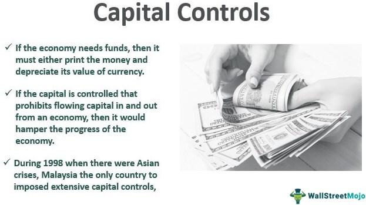

The contemporary financial landscape is intricately shaped by a myriad of economic policies and regulations, all of which significantly influence global capital movements. Central to this configuration are capital controls, a set of policies implemented by governments and regulatory bodies to manage the flow of foreign capital into and out of the domestic economy. These measures include a range of instruments such as taxes, tariffs, or restrictions on financial transactions, and they are pivotal in stabilizing economies, especially in developing regions that are more vulnerable to rapid capital flight and currency volatility.

Financial stability is further underpinned by comprehensive economic policies and pertinent financial regulations. Economic policies guide the strategic economic objectives of a country, directing its paths towards sustainable growth and development. Meanwhile, financial regulations are crafted to mitigate systemic risks and ensure the integrity of financial institutions and markets. Together, they erect a safeguard against economic crises, endeavoring to protect both investors and the broader economic framework. However, the perpetual challenge remains to strike a balance between stringent regulation and the freedoms necessary for market operations.

In recent years, the rise of algorithmic trading has introduced a new dimension to financial markets. This technological advancement involves the use of complex algorithms to automate trading, characterized by speed and efficiency that no human trader can match. Algorithmic trading now constitutes a significant portion of trading volumes in global markets. While it revolutionizes trading strategies, it also presents challenges such as heightened market volatility and the occurrence of flash crashes—a rapid and deep fall in security prices.

This article aims to explore the interplay between capital controls, economic policies, financial regulations, and algorithmic trading, examining how these elements collectively impact the global economy. Understanding their interrelation is crucial for developing adaptive policy frameworks that can sustain the dynamism of modern financial systems while maintaining economic stability.

## Table of Contents

## Understanding Capital Controls

Capital controls are government-imposed measures designed to regulate and manage the flow of foreign capital into and out of a country's economy. These controls can take various forms, including taxes, tariffs, and restrictions on foreign exchange transactions. The primary objective of capital controls is to stabilize economies, especially those in developing regions that are particularly vulnerable to rapid capital flight and significant currency volatility.

### Forms of Capital Controls

1. **Taxes and Tariffs**: Governments may impose taxes on foreign investments or tariffs on certain financial transactions to control the volume of capital moving across borders.

2. **Foreign Exchange Restrictions**: These include limits on buying or selling foreign currencies, aimed at maintaining exchange rate stability and managing foreign exchange reserves. 

3. **Quantitative Restrictions**: These may involve limits on the amount of money that can flow in or out of a country, either in total or through specific channels.

### Objectives of Capital Controls

The primary purpose of capital controls is to provide economic stability. By managing capital flows, countries can moderate exchange rate fluctuations and prevent excessive short-term capital movements that could lead to economic disruption. This is crucial for developing nations with less sophisticated financial systems, which can be overwhelmed by sudden shifts in capital flows.

Capital controls also serve as a tool for macroeconomic management, allowing governments to implement independent monetary policies without external constraints. By controlling the amount of foreign capital, a country can protect its financial system from external shocks and reduce the likelihood of financial crises.

### Advantages and Disadvantages

#### Advantages:
- **Economic Stability**: Capital controls can provide greater economic stability by mitigating the risks of volatile capital flows and currency speculation.
- **Policy Autonomy**: They allow for more autonomy in domestic economic policy, as governments can prioritize their economic goals over adhering strictly to international capital market dynamics.
- **Crisis Management**: In times of financial crises, capital controls can be instrumental in preventing capital flight and stabilizing the economy.

#### Disadvantages:
- **Investment Deterrence**: Imposing capital controls can deter foreign investors, reducing the flow of potential investment capital needed for economic growth.
- **Market Distortion**: They can create distortions in the financial markets by not reflecting true supply and demand conditions.
- **Inefficiency**: Over-reliance on capital controls can lead to inefficiencies in allocation of resources and slow down economic progress.

The debate over the effectiveness of capital controls is ongoing among economists and policymakers. Critics argue that while they may provide short-term relief, the long-term consequences can include reduced investment and slower economic growth. Proponents, however, highlight their utility in maintaining economic stability, particularly in emerging markets facing turbulent capital movements. 

Understanding the dynamic between capital controls and economic stability remains a significant focus for policymakers seeking to harness their benefits while minimizing adverse effects. This balance is essential to fostering a resilient global financial environment.

## Economic Policies and Financial Regulations

Economic policies constitute the structured frameworks that policymakers employ to direct a nation's economic objectives and strategies. These policies are essential in influencing various economic activities such as inflation control, employment rates, and economic growth. Typically, economic policies are categorized into fiscal policy, which involves government revenue and expenditure decisions, and monetary policy, which is concerned with the regulation of money supply and interest rates.

Financial regulations, on the other hand, are crafted to mitigate risks within the financial system and ensure the integrity and stability of financial markets. These regulations are vital for preventing malpractice and fraud, thus protecting investors and maintaining trust in the financial system. Key regulatory measures include capital adequacy requirements, disclosure norms, and market conduct rules.

The prevention of economic crises is one of the primary goals of economic policies and financial regulations. History has shown that lax regulations can lead to financial instability, exemplified by events such as the 2008 financial crisis. Consequently, regulations have become more stringent, with bodies like the Basel Committee on Banking Supervision establishing regulatory standards to fortify banking systems globally.

Despite their importance, achieving the right balance between regulation and market freedom continues to be a challenge for many economies. Over-regulation can stifle innovation and slow economic growth, while under-regulation can lead to financial turmoil. Policymakers strive to find a middle ground where regulations provide adequate oversight without hindering economic dynamism. Adaptive regulatory frameworks that can evolve with changing economic landscapes are essential for managing this balance effectively.

In summary, economic policies and financial regulations are critical instruments for managing and stabilizing economies. By guiding economic objectives and safeguarding market integrity, they play a fundamental role in fostering sustainable economic environments while protecting against crises.

## The Rise of Algorithmic Trading

Algorithmic trading refers to the use of computer algorithms to automate and refine the trading process, a technological innovation that has transformed the functioning of financial markets. At its core, [algorithmic trading](/wiki/algorithmic-trading) seeks to exploit the speed and accuracy of modern computing to execute orders almost instantaneously, beyond the capabilities of human traders. This form of trading is primarily driven by the quest for efficiency and speed, with algorithms processing vast amounts of market data to identify trading opportunities and execute them in real-time.

The impact of algorithmic trading on market volumes is substantial, as automated systems account for a significant portion of the trades executed worldwide. For instance, in stock markets such as the New York Stock Exchange and NASDAQ, algorithmic trading is estimated to represent over half of the total trading [volume](/wiki/volume-trading-strategy). This dominance highlights the critical role algorithms play in defining market dynamics today.

While the efficiency brought by algorithmic trading offers numerous benefits, it also poses challenges. One significant concern is market [volatility](/wiki/volatility-trading-strategies), as the high speed of trading can exacerbate price fluctuations. This was notably observed during events like the 2010 Flash Crash, where algorithmic trading was implicated in creating rapid and severe market disruptions. During such incidents, the automated nature of trading can lead to cascading effects as algorithms react to each market move in milliseconds.

Moreover, the complexity of these algorithms requires stringent oversight to mitigate risks associated with their deployment. Such complexity is underlined by an emergent behavior often not predicted by their designers, necessitating robust monitoring and regulatory frameworks to prevent destabilizing the financial markets.

Understanding the role of algorithms in trading is vital for ensuring market stability and securing investor confidence. This includes not just advancements in the algorithms themselves but also the development of supportive regulatory environments that address the unique challenges posed by algorithmic trading. As these technologies continue to evolve, comprehensively grasping their influence on trading strategies and market operations will be essential for sustaining financial market integrity and innovation.

This intersection of technology and finance is a critical area of study, requiring continued collaboration between policymakers, financial institutions, and technology developers to create harmonious and resilient financial ecosystems.

## The Interplay Between Policies and Algorithmic Trading

Financial regulations are crucial in addressing the complexities introduced by algorithmic trading. As algorithmic trading, or algo trading, becomes increasingly prevalent in financial markets, it raises significant challenges for existing regulatory frameworks. These challenges arise primarily due to the speed and volume of transactions facilitated by advanced algorithms, which traditional regulatory measures may not effectively manage.

Algorithmic trading strategies can lead to rapid price movements and increased market volatility, sometimes resulting in phenomena like flash crashes. Flash crashes are characterized by extremely rapid price declines followed by an equally swift recovery, often exacerbated by high-frequency trading algorithms. Such events underscore the importance of developing adaptive regulatory measures that can anticipate and mitigate potential disruptions caused by algo trading.

Economic policies and capital controls may also be influenced by automated trading strategies. For instance, the rapid movement of capital across borders, facilitated by algorithmic trading, can impact exchange rates and financial stability, particularly in emerging markets. This necessitates a reevaluation of capital controls to ensure they remain effective in a rapidly evolving financial environment.

A potential approach to managing the challenges posed by algorithmic trading is the implementation of real-time surveillance systems. These systems use advanced analytics and [machine learning](/wiki/machine-learning) techniques to monitor trading activities and detect suspicious patterns indicative of market manipulation or excessive volatility. By employing these technologies, regulators can respond more swiftly to irregular market conditions, minimizing potential risks.

Additionally, regulators may consider introducing measures such as circuit breakers, which temporarily halt trading in response to significant price movements. Circuit breakers can provide a buffer against panic-inducing volatility, allowing markets to stabilize before trading resumes. Moreover, setting standards for algorithm testing and risk controls can help ensure that trading algorithms operate within safe parameters, reducing the likelihood of unintended market disruptions.

The development of a robust regulatory framework requires international cooperation to address the global nature of algorithmic trading. A coordinated approach can help harmonize regulations across borders, reducing regulatory [arbitrage](/wiki/arbitrage) opportunities and ensuring a level playing field for market participants.

In conclusion, the increasing prevalence of algorithmic trading necessitates a reevaluation of existing financial regulations and economic policies. By adopting adaptive regulatory measures and leveraging technological solutions, policymakers can effectively manage the challenges posed by algo trading, ensuring the stability and integrity of global financial markets.

## Case Study: Capital Controls in Crisis Situations

The European debt crisis, which began in 2009, posed significant challenges to the economic stability of several European nations, particularly Greece. As Greece grappled with an escalating fiscal deficit and mounting debt levels, the government implemented a series of capital controls as a last-resort mechanism to stabilize the economy and prevent a total financial collapse. 

One of the primary measures introduced was the limitation on cash withdrawals. To avert a bank run—a situation where mass withdrawal of deposits could drain banks of liquid cash resources—Greek authorities imposed a daily withdrawal limit. Initially set at €60 per day, this cap was later adjusted as the situation evolved. Such restrictions were essential to maintain a modicum of [liquidity](/wiki/liquidity-risk-premium) in banks and keep the financial system from imploding under the pressure of a sudden cash exodus.

Additionally, the Greek government imposed severe restrictions on financial transactions. Transfers of funds to foreign banks were restricted, requiring individuals and businesses to acquire special permissions for such transactions. This measure was crucial to control capital flight, which could have severely undermined Greece's already fragile economic structure. By keeping money within domestic borders, the government aimed to stabilize the exchange rate and preserve foreign exchange reserves.

These capital controls, while controversial, underscored their importance in stabilizing Greece's economy during a period of financial crisis. By implementing these stringent measures, Greece managed to buy critical time, allowing negotiation with international creditors and the implementation of necessary economic reforms. 

The Greek experience with capital controls during the European debt crisis offers several lessons for policymakers worldwide. One key insight is the necessity of acting swiftly and decisively to curb capital flight during economic turmoil. Moreover, the Greek case demonstrates that while capital controls can lead to short-term economic discomfort, they can also provide breathing room necessary for implementing broader, more sustainable economic reforms. 

Future policy decisions in similar economic contexts can leverage these insights, recognizing capital controls as a potential tool for stabilizing economies in crisis while acknowledging their limitations. A well-balanced approach, considering both short-term needs and long-term economic health, remains vital in navigating through financial emergencies.

## Conclusion

The complexity of modern financial systems is significantly shaped by the dynamic interplay between capital controls, economic policies, and algorithmic trading. Capital controls serve as critical mechanisms for governments to manage economic stability, particularly in times of crisis, by restricting the volatile flows of foreign capital. These measures, though sometimes contentious, have proven essential in maintaining economic equilibrium under specific circumstances. Concurrently, economic policies and financial regulations are established to guide broader economic objectives and safeguard market integrity. They play a pivotal role in mitigating risks and preventing systemic crises.

However, the landscape of financial markets is continually evolving with advances in technology, notably through the rise of algorithmic trading. This technological innovation brings about significant changes in trading strategies, characterized by automation and optimization that enhance efficiency but also introduce risks such as increased market volatility and flash crashes.

The challenge for policymakers is to craft regulations that can adapt to these technological advancements while still maintaining economic stability. This requires a delicate balance between fostering growth and ensuring stability within rapidly changing economic environments. The success of future policy frameworks will hinge on their ability to be flexible and adaptive, addressing both traditional financial market challenges and those arising from new technologies like algorithmic trading.

Policymakers must consider multifaceted approaches that integrate technological insights with robust regulatory measures. Striking a balance between regulating the rapid flow of capital facilitated by algorithmic trading and maintaining market integrity is essential. Thus, the development of innovative policy measures that can effectively govern these diverse elements will be crucial in sustaining the health and stability of global financial systems.

## References

- Investopedia articles on capital controls, economic policy, and financial regulations provide foundational insights into the mechanisms, benefits, and limitations of these economic tools. These articles serve as a primer for understanding the complexities involved in financial governance and regulatory practices.

- The Federal Reserve Bank of St. Louis Review on capital controls offers a comprehensive analysis of their utility and impact on economic stability, highlighting empirical data and economic theories to elucidate their function in safeguarding economies, especially during periods of financial turbulence.

- Case studies on Greece's financial crisis focus on the critical role of capital controls during the European debt crisis. These studies provide a detailed examination of the measures such as restrictions on cash withdrawals and cross-border transactions, showcasing their effectiveness in arresting capital outflows and stabilizing the financial system during crisis periods.

- Research papers on the impacts of algorithmic trading on financial markets explore the intersection of technology and finance, discussing how algorithmic trading systems affect market dynamics, liquidity, and volatility. These studies also consider the implications for regulatory frameworks aiming to address the rapidly evolving trading environments driven by computational efficiency and speed.

## References & Further Reading

[1]: Ghosh, R., Kim, J. (2018). ["Capital Controls: A Review of the Literature"](https://www.nber.org/papers/w16782). International Monetary Fund Working Paper.

[2]: Lopez de Prado, M. (2018). ["Advances in Financial Machine Learning"](https://www.amazon.com/Advances-Financial-Machine-Learning-Marcos/dp/1119482089). Wiley.

[3]: Aronson, D. R. (2006). ["Evidence-Based Technical Analysis: Applying the Scientific Method and Statistical Inference to Trading Signals"](https://www.amazon.com/Evidence-Based-Technical-Analysis-Scientific-Statistical/dp/0470008741). Wiley.

[4]: Jansen, S. (2018). ["Machine Learning for Algorithmic Trading"](https://github.com/stefan-jansen/machine-learning-for-trading). Packt Publishing.

[5]: Claessens, S., & Ghosh, S. R. (2013). ["Capital Flow Volatility and Systemic Risk in Emerging Markets: The Policy Toolkit"](https://www.worldbank.org/content/dam/Worldbank/document/Poverty%20documents/EMERGING_WB_CH03_91-118.pdf). National Bureau of Economic Research.

[6]: Chan, E. P. (2009). ["Quantitative Trading: How to Build Your Own Algorithmic Trading Business"](https://github.com/ftvision/quant_trading_echan_book). Wiley. 

[7]: Federal Reserve Bank of St. Louis. ["On Capital Controls and Transaction Taxes"](https://www.stlouisfed.org/). 

[8]: "Review of Financial Studies" - Various issues covering algorithmic trading and market impact analysis.