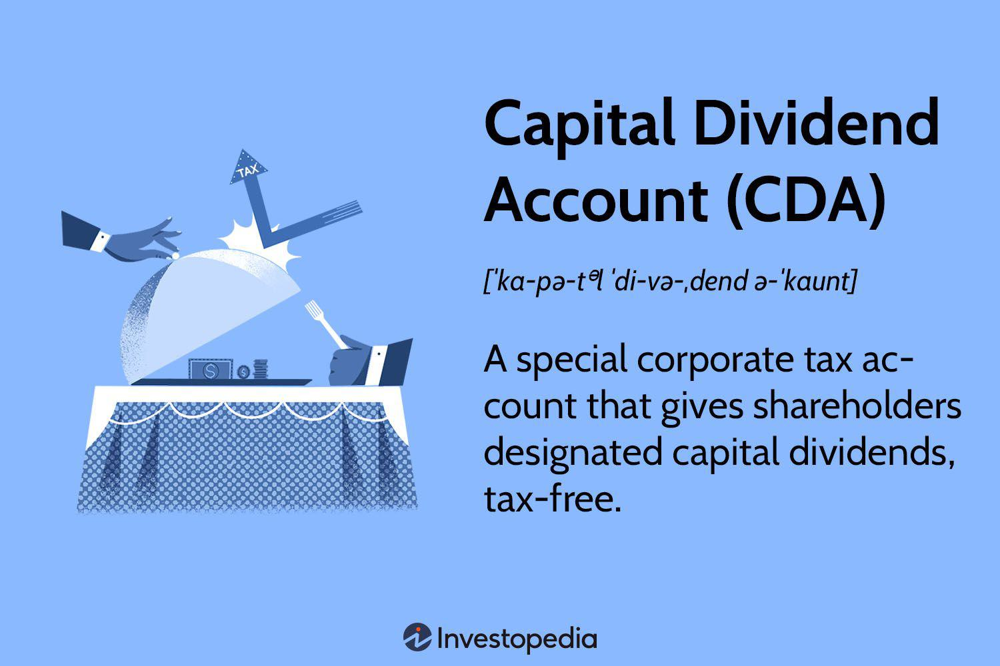

The financial landscape often intertwines with complex tax rules and investment strategies. This article explores the Capital Dividend Account (CDA), its tax treatment, and its intersection with algorithmic trading. Understanding the Capital Dividend Account (CDA) is vital for Canadian firms aiming to maximize tax efficiency while rewarding shareholders through capital dividends. CDAs provide a mechanism for corporations to distribute certain types of income to shareholders tax-free, which can significantly enhance after-tax returns. This distribution method is critical for enterprises looking to streamline internal financial processes and minimize the tax burden.

In exploring the mechanisms behind a CDA, it's important to consider the tax implications involved and how these affect shareholders. The nuances of how CDAs are calculated and the conditions under which they can be utilized provide a complex landscape for corporate financial planning. Capital dividends, when appropriately managed, represent a powerful tool for augmenting shareholder value.



Additionally, the world of algorithmic trading introduces a layer of sophistication that can influence these financial decisions, optimizing financial outcomes through data-driven strategies. In the fast-paced trading environment, algorithmic systems can enhance the ability to capitalize on market inefficiencies, potentially increasing capital gains that contribute to CDA balances. This integration of technology and tax strategy could provide a competitive edge in financial markets.

This guide is designed to serve as a resource for business owners, accountants, and investors interested in leveraging CDAs and comprehending their role in modern trading strategies. As the financial landscape evolves, a comprehensive understanding of CDAs and their interplay with algorithmic trading can yield significant advantages.

## Table of Contents

## What is a Capital Dividend Account (CDA)?

A Capital Dividend Account (CDA) is a specialized tax mechanism in Canada, crafted to allow corporations to distribute tax-free dividends to shareholders. This strategic tool primarily focuses on disseminating dividends derived from capital gains and other qualifying sources without subjecting them to personal income tax for the recipients.

### Notional Account for Tax Purposes

The CDA is distinct in its nature as it does not appear in conventional financial statements. It serves as a notional account, formulated solely for tax calculations, allowing corporations to track eligible dividend funds. When corporations realize capital gains, an integration process within the tax framework determines how these gains enhance the CDA balance. Specifically, 50% of realized capital gains are typically directed to this account, aligning with Canada's corporate tax structure designed to improve shareholder returns.

### Purpose and Functionality

The core purpose of a CDA is to augment shareholder value by permitting companies to issue non-taxable dividends. By facilitating this tax-free distribution, businesses can effectively reward their investors without imposing additional tax burdens. This mechanism not only helps in maximizing investor satisfaction but also stands as a testament to Canada's supportive tax policies for corporate growth.

### Management Under Canadian Tax Frameworks

Canadian corporations manage their CDAs within strict compliance guidelines prescribed by tax authorities. This involves accurately calculating and maintaining records of additions to the CDA, which are primarily influenced by capital events such as life insurance proceeds, capital dividends received from other corporations, and capital gains. The iterative process ensures that only eligible amounts contribute to the CDA, ready to be issued as tax-exempt dividends.

In conclusion, the Capital Dividend Account remains a pivotal element for Canadian corporations aimed at leveraging tax-free dividends to enhance shareholder wealth efficiently. Understanding its operational mechanics and tax implications is crucial for effective corporate financial strategies. This framework, unique to Canada, exemplifies how targeted tax strategies can align corporate objectives with shareholder interests.

## Tax Treatment of CDAs

The tax treatment of Capital Dividend Accounts (CDAs) in Canada offers corporations a unique mechanism to distribute non-taxable capital dividends to their shareholders, enhancing overall tax efficiency. Fundamentally, a CDA allows for the designation and tracking of specific components of a corporation's capital transactions that qualify for tax-free distribution.

### Understanding the Allocation in CDAs

When a Canadian corporation realizes capital gains, the tax treatment requires that only 50% of these gains are taxable at the corporate level. The remaining non-taxable portion, often referred to as the capital dividend strip, is allocated to the CDA. This division serves as a key advantage for corporations aiming to distribute capital dividends to their shareholders without incurring additional personal tax liabilities. For instance, if a corporation realizes a $100,000 capital gain, $50,000 would be taxable as corporate income, while the remaining $50,000 could be added to the CDA. 

### Calculating CDA Balances

The CDA balance reflects the cumulative non-taxable capital gains available for distribution. To calculate the balance, corporations should accumulate the tax-free part of capital gains, along with other qualifying transactions, such as the non-taxable portion of life insurance proceeds and certain capital losses. It's essential for corporations to accurately maintain records of these entries to ensure precise CDA calculations and legitimate distributions.

### Accounting Entries for CDA

Proper accounting entries are crucial when managing CDAs. Upon realizing capital gains, the corporation records the taxable portion as corporate income and credits the non-taxable part to the CDA. Compliance with Canadian tax laws requires corporations to accurately document these transactions, using journal entries to update the CDA balance appropriately.

### Compliance and Declaration

When it comes time to declare capital dividends from the CDA, corporations must comply with specific regulatory requirements set forth by the Canada Revenue Agency (CRA). These include notifying the CRA in advance of the dividend declaration through the prescribed forms and providing shareholders with necessary documentation. It is imperative for companies to adhere to these guidelines to avoid penalties or disallowed distributions.

By distributing non-taxable capital dividends, CDAs provide a strategic tool for optimizing shareholder value. Corporations leveraging these accounts must engage in careful planning to maintain compliance and maximize the benefits of this tax-efficient strategy.

## Algorithmic Trading: Enhancing Financial Strategies

Algorithmic trading, a cornerstone of modern financial markets, utilizes advanced mathematical models and sophisticated software systems to execute high-speed trading decisions. These decisions are based on pre-defined rules or strategies that consider various market signals and quantitative analysis.

An essential advantage of [algorithmic trading](/wiki/algorithmic-trading) is its capacity to leverage substantial amounts of data and execute trades with precision and speed, which human traders are unable to match. This capability significantly impacts financial outcomes for corporations, particularly when considering the synergies with Capital Dividend Accounts (CDAs). By exploiting market inefficiencies, algorithmic trading can result in increased capital gains, which in turn can enhance the contributions and utility of CDAs. 

Algorithmic trading strategies can be diversified and include approaches such as statistical [arbitrage](/wiki/arbitrage), [trend following](/wiki/trend-following), and market-making. 

1. **Statistical Arbitrage**: This involves identifying pricing inefficiencies between correlated securities and executing simultaneous buy and sell orders to capture this discrepancy. For instance, if two equities typically move in unison but diverge, an algorithm might buy the undervalued and sell the overvalued one, expecting a reversion to the mean.

2. **Trend Following**: Algorithms within this strategy identify and track market trends. By capitalizing on stocks that are rising or shorting those declining, traders can align with general market movements. This strategy can be particularly beneficial within a CDA context by systematically achieving capital gains that can later be distributed tax-free to shareholders.

3. **Market Making**: This strategy involves placing buy and sell orders to profit from the spread between these two prices, thus providing liquidity to the markets. Effective market-making requires a rapid execution typically achieved through sophisticated algorithms, again potentially enhancing gains that augment CDA balances.

Python, widely used in algorithmic trading, offers various libraries such as NumPy, pandas, and scikit-learn for data analysis and [machine learning](/wiki/machine-learning) to develop these strategies. Here is a simple Python example for a moving average crossover strategy, a type of trend following:

```python
import pandas as pd

# Assume we have a DataFrame `data` with stock prices
data['short_mavg'] = data['close'].rolling(window=40).mean()
data['long_mavg'] = data['close'].rolling(window=100).mean()

# Create signals
data['signal'] = 0
data['signal'][40:] = np.where(data['short_mavg'][40:] > data['long_mavg'][40:], 1, 0)
data['positions'] = data['signal'].diff()

# Print buy signals
buy_signals = data[data['positions'] == 1]
print(buy_signals)
```

In this strategy, buy signals are generated when a short-term moving average crosses above a long-term moving average, indicating a potential upward trend.

Incorporating algorithmic trading into corporate financial strategies, particularly concerning CDAs, requires precise planning and execution. Properly managed, such synergies can realize tax efficiencies and maximize shareholder returns by optimizing the timing and magnitude of capital gains.

## Integrating CDAs and Algorithmic Trading

Integrating Capital Dividend Accounts (CDAs) with algorithmic trading offers a potent combination for enhancing shareholder value and corporate growth. By adopting advanced trading algorithms, companies can optimize returns and subsequently increase contributions to their CDAs through higher realized capital gains. This integration taps into the potential of algorithmic trading to exploit market inefficiencies rapidly and effectively, thereby generating substantial gains which feed into the CDA mechanism.

A successful strategy involves meticulous tax planning and a deep understanding of both the CDA framework and algorithmic trading principles. Companies need to ensure that all realized gains and accompanying tax implications are correctly accounted for in their CDA calculations. Proper tax planning not only safeguards compliance but also maximizes the tax-free benefits CDA distributions can offer to shareholders. 

Advanced algorithmic trading strategies, such as [statistical arbitrage](/wiki/statistical-arbitrage) or machine learning-based models, can be powerful in identifying profitable trading opportunities. For instance, firms can utilize regression or classification algorithms to predict price movements, while [reinforcement learning](/wiki/reinforcement-learning) can aid in developing adaptive trading strategies based on market conditions. This could be implemented in Python, leveraging libraries such as NumPy, pandas, and scikit-learn to process and analyze market data efficiently. 

Here is a simplified example in Python:

```python
import numpy as np
from sklearn.linear_model import LinearRegression

# Sample market data: input features and price movements
features = np.array([[1, 2], [2, 3], [3, 4], [4, 5]])
prices = np.array([1.4, 1.9, 3.1, 4.2])

# Train a simple linear regression model
model = LinearRegression().fit(features, prices)

# Predict future price movements
predicted_price = model.predict(np.array([[5, 6]]))
print("Predicted Price:", predicted_price)
```

This script illustrates leveraging linear regression to predict future prices based on historical data. In practice, more sophisticated models and data preprocessing methods would be applied to capture the complexity of financial markets.

To effectively merge the mechanisms of CDAs and algorithmic trading, companies must focus on integrating robust risk management frameworks and compliance checks. This may involve regular audits of transactions, continuous monitoring of tax obligations, and the use of advanced software solutions for tracking and managing trades and dividends. Employing expert insights from tax advisors and financial analysts can further refine strategies to align economic outcomes with corporate growth objectives.

In conclusion, the synergy between CDAs and algorithmic trading presents a compelling case for businesses. By combining precise trading algorithms with strategic tax planning, firms can achieve superior financial results and deliver significant tax-free benefits to shareholders, ultimately driving both investor satisfaction and corporate success.

## Conclusion

The interplay between Capital Dividend Accounts (CDAs) and algorithmic trading presents a formidable opportunity for corporations keen on leveraging financial advancements and tax efficiencies. CDAs, designed primarily to offer Canadian companies a mechanism for distributing tax-free capital dividends, find a natural complement in algorithmic trading, which promises enhanced financial outcomes through data-driven strategies.

In a rapidly evolving investment landscape, the ability to integrate sophisticated trading algorithms with the tax benefits inherent in CDAs can provide a substantial competitive advantage. Algorithmic trading, by virtue of its precision and speed, can help realize higher capital gains. When effectively aligned with CDAs, this allows corporations to maximize their tax-free distributions to shareholders, fostering both corporate growth and shareholder satisfaction.

The proper management and alignment of these two components cannot be overstated. The complexity of navigating international markets, compounded by ever-changing tax regulations, necessitates a thorough understanding and strategic implementation of both CDAs and algorithmic trading. For businesses engaged in these activities, rigorous tax planning and compliance are not just important but crucial to fully harness the potential benefits offered by the integration of these financial tools.

This guide has aimed to shed light on these opportunities, offering a resource for those endeavoring to grasp and implement these modern financial strategies. Through strategic alignment, businesses can augment shareholder value and enhance corporate success, transforming complex financial landscapes into rewarding ventures.

## References & Further Reading

[1]: Cheung, H., & Goffret, T. (2004). ["Canadian Corporate Taxation."](https://www.researchgate.net/publication/23524133_Corporate_Income_Taxation_in_Canada) Carswell Annual Review of Law & Practice.

[2]: Maldeis, R. A. (2014). ["Capital Dividends: A Valuable Tax Planning Tool for Canadian Controlled Private Corporations."](https://fastercapital.com/content/Capital-Dividend--Capital-Dividend-Account-and-Its-Benefits-for-Canadian-Corporations-and-Shareholders.html) Canadian Tax Foundation.

[3]: Chan, E. P. (2009). ["Quantitative Trading: How to Build Your Own Algorithmic Trading Business."](https://github.com/ftvision/quant_trading_echan_book) Wiley.

[4]: Jansen, S. (2020). ["Machine Learning for Algorithmic Trading."](https://github.com/stefan-jansen/machine-learning-for-trading) Packt Publishing.

[5]: Lopez de Prado, M. (2018). ["Advances in Financial Machine Learning."](https://www.amazon.com/Advances-Financial-Machine-Learning-Marcos/dp/1119482089) Wiley.