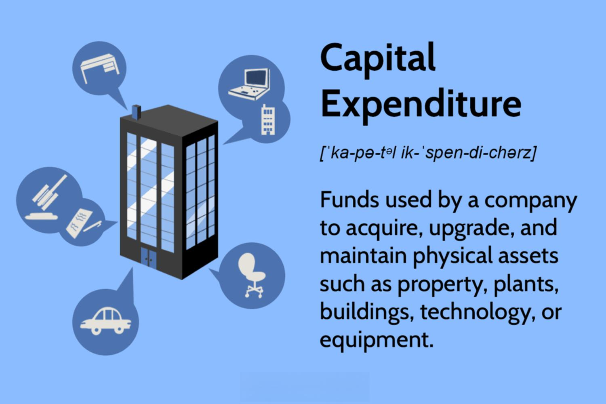

In today's dynamic business environment, companies are constantly striving to improve their operations through strategic financial planning and investment. Central to this effort are capital expenditures (CapEx), which play a pivotal role in company budgeting and financial planning, particularly in industries reliant on substantial asset acquisition and upgrades. CapEx involves the allocation of resources towards long-term assets such as property, industrial equipment, and technology infrastructure, which are essential for the growth and operational efficiency of a company. These investments are recorded on the balance sheet and depreciated over time, signifying their enduring value and impact on future business operations.

Simultaneously, the advent of algorithmic trading has introduced new dimensions to financial strategies, necessitating a comprehensive understanding of budgeting and expenditure management. Algorithmic trading employs sophisticated algorithms to automate trading decisions, maximizing speed and efficiency in financial markets. The integration of technology within trading strategies requires significant capital investment in high-performance computing systems and advanced software solutions, thereby categorizing these expenditures as CapEx due to their strategic importance and long-term utility.



This article explores the interplay between capital expenditures, company budgeting, and financial planning, with a specific focus on the role of algorithmic trading. Understanding these areas is crucial for companies aiming to achieve sustainable growth and maintain a competitive edge in rapidly changing markets. Effective financial planning not only supports the optimal allocation of resources between CapEx and operational expenditures (OpEx) but also ensures that a company can adapt to technological advancements and market fluctuations. Such adaptability is essential for driving innovation, increasing market share, and securing long-term success in the competitive business landscape.

## Table of Contents

## Understanding Capital Expenditures

Capital expenditures (CapEx) represent the funds that companies allocate to acquire, upgrade, and maintain physical assets. These assets typically include property, industrial buildings, equipment, and technology infrastructure. CapEx is fundamental to a company's growth strategy as it supports the expansion of physical capacity and the enhancement of operational efficiency.

When a company incurs capital expenditures, these costs are capitalized on the balance sheet rather than expensed immediately. This treatment is due to the long-term benefits that CapEx investments provide, which often extend over several years. The cost of these capital assets is then depreciated over their useful life, distributing the expense across multiple accounting periods. For example, if a company purchases a piece of machinery for $100,000 with a useful life of 10 years, it may depreciate the asset by $10,000 annually over the decade.

In contrast to operational expenditures (OpEx), which cover day-to-day expenses such as salaries and utilities and are fully expensed in the fiscal period they are incurred, CapEx investments have implications that stretch beyond the short term. This distinction is crucial for budgeting purposes and financial reporting, impacting how resources are allocated within a company.

Key to effective CapEx management is accurate budgeting and forecasting. Given the significant financial commitment often required for CapEx, careful evaluation of such expenditures is paramount. This process involves analyzing the necessity of the investment, its potential return, and alignment with strategic business goals. For example, a company may use tools like the Net Present Value (NPV) or Internal Rate of Return (IRR) to assess the financial viability of a CapEx project. These metrics help in comparing the expected returns with the cost of investment, ultimately guiding decision-making for capital allocation.

Moreover, CapEx budgeting is not isolated from the overall financial strategy of a company. It must be integrated into the broader financial planning process, ensuring that capital-intensive projects do not strain the company’s [liquidity](/wiki/liquidity-risk-premium) or hinder its ability to fund other critical operations. The alignment of CapEx with corporate strategy allows companies to leverage asset investments for competitive advantage, contributing to long-term success.

## The Role of Financial Planning and Budgeting in CapEx

Capital expenditures (CapEx) are a fundamental aspect of strategic financial planning, distinguishing from operational expenditures (OpEx) to effectively allocate resources and optimize fiscal strategies within an organization. The distinction between CapEx and OpEx is crucial, as it not only affects budgeting but also plays a significant role in financial reporting and tax treatment. 

CapEx refers to investments made to acquire, upgrade, or maintain physical assets which are capitalized on the balance sheet and depreciated over time, demonstrating their long-term value. In contrast, OpEx encompasses routine operational costs necessary for the daily functioning of the company, such as salaries, utilities, and rent, that are fully deducted in the fiscal period they occur. This separation aids in precise budgeting, as companies typically maintain individual budgets for CapEx and OpEx, ensuring accurate financial reporting and tax advantages.

Effective CapEx budgeting involves several key steps to support strategic alignment and operational efficiency:

1. **Strategic Alignment**: Aligning CapEx with organizational goals is essential in driving business growth and achieving broader strategic objectives. Firms must ensure that capital investments support long-term aims, contributing to competitive advantage and innovation.

2. **Information Gathering**: Collecting comprehensive data is critical in the initial stages of CapEx planning. This involves analyzing historical data, market trends, and technological advancements that might influence investment decisions.

3. **Forecasting**: Accurate forecasting involves predicting future financial conditions affecting CapEx. Methods such as discounted cash flow (DCF) analysis, which calculates the present value of expected future cash flows, are commonly used to evaluate the potential success of capital projects.

   ```python
   # Example of a simple DCF calculation in Python
   def dcf(cash_flows, discount_rate):
       return sum(cf / (1 + discount_rate) ** i for i, cf in enumerate(cash_flows, 1))

   cash_flows = [1000, 1500, 2000, 2500]
   discount_rate = 0.08
   net_present_value = dcf(cash_flows, discount_rate)
   ```

4. **Decision-Making**: Decision-making in CapEx budgeting involves assessing the potential return on investment (ROI). Tools like net present value (NPV) and internal rate of return (IRR) are vital for evaluating financial viability. IRR calculations determine the break-even discount rate for a series of cash flows.

5. **Post-Implementation Evaluation**: Post-implementation evaluation assesses the actual outcomes against projected goals. This step is essential in refining future CapEx processes and ensuring strategic objectives are met effectively.

Incorporating insights from various departments enhances the precision of CapEx budgeting by providing a holistic perspective on investment needs and opportunities. Cross-departmental collaboration allows for a more comprehensive assessment of the necessity, feasibility, and potential ROI of CapEx projects, ensuring that financial resources are allocated to areas with the highest strategic benefit. 

Through these structured processes, companies can optimize their approach to capital expenditures, ensuring both short-term tactical operations and long-term strategic growth are balanced and well-supported.

## Algorithmic Trading and Financial Strategies

Algorithmic trading has transformed the financial landscape by employing sophisticated algorithms to execute trading decisions with unprecedented speed and precision. This automation has shifted the focus from human-based trading to machine-driven strategies, optimizing both transaction execution and market research processes. The transition to [algorithmic trading](/wiki/algorithmic-trading) necessitates substantial capital investment in technology infrastructure, thus positioning it within the sphere of capital expenditures (CapEx). High-performance computing systems, data storage solutions, and specialized software that support these trading algorithms represent long-term assets vital to maintaining competitive advantage and efficiency in execution.

Investments in algorithmic trading technologies are classified under CapEx due to their enduring nature and strategic significance. These systems require substantial upfront costs but offer benefits that extend over multiple years, thus aligning with the criteria for capital expenditures. Companies need to ensure the seamless integration of these technologies into their existing frameworks, necessitating careful financial planning and budgeting. Balancing CapEx associated with technology investments against operational expenditures (OpEx) involves assessing the ongoing expenses related to algorithmic trading, such as system maintenance, software updates, and electricity costs for data centers.

Effective financial planning in algorithmic trading entails a strategic approach that integrates technological investments with broader organizational goals. This demands alignment between financial and technical teams to evaluate the necessity and potential returns of these investments. Companies must conduct cost-benefit analyses, considering metrics like return on investment (ROI) and total cost of ownership (TCO) to make informed decisions. Additionally, understanding the impact of these expenditures on overall company performance is crucial, requiring continuous monitoring and evaluation to adapt to market dynamics.

By optimizing the allocation between CapEx and OpEx, companies can sustain the technological edge necessary for successful algorithmic trading. This requires periodic reassessment of technological assets and their alignment with the evolving market landscape. Companies leveraging these strategies gain competitive market positions through improved trade execution, minimized errors, and increased operational efficiency. As technology and markets evolve, the ability to adapt financial strategies in tandem ensures long-term success and sustainability in the fast-paced environment of algorithmic trading.

## Strategic Financial Planning for Sustainable Growth

Strategic financial planning is a comprehensive process that transcends traditional budgeting by focusing on the optimal allocation of capital expenditures (CapEx) and operational expenditures (OpEx) to ensure sustained growth and operational efficiency for companies. This form of planning is critical for organizations aiming to maintain competitiveness in a fast-evolving market landscape.

One of the fundamental aspects of strategic financial planning is the evaluation of potential investments through capital budgeting metrics. These metrics, such as net present value (NPV), internal rate of return (IRR), and payback periods, provide quantitative insights into the expected profitability and feasibility of investment projects. 

Net present value (NPV) measures the value of future cash flows generated by an investment, discounted back to their present value, using an appropriate discount rate. The formula for NPV is:

$$
NPV = \sum \left( \frac{C_t}{(1+r)^t} \right) - C_0
$$

where $C_t$ represents cash inflows, $r$ is the discount rate, $t$ is the time period, and $C_0$ is the initial investment.

The internal rate of return (IRR) is the discount rate that makes the NPV of all cash flows from an investment equal to zero. It is a valuable measure for comparing the profitability of various projects:

$$
0 = \sum \left( \frac{C_t}{(1+IRR)^t} \right) - C_0
$$

Payback periods calculate the time required for an investment to generate an amount of cash equivalent to its initial cost. Shorter payback periods are generally preferable, indicating quicker recovery of investment costs.

Effective management of CapEx investments can provide a competitive edge by fostering innovation and expanding market share. Companies that strategically allocate resources to capital projects that enhance operational capabilities and product offerings are more likely to outpace their competitors.

Furthermore, aligning financial planning with overarching business goals enables firms to nimbly respond to market changes and technological advancements. This alignment helps ensure that investments are purposeful and contribute directly to the enterprise's strategic objectives, facilitating long-term success.

In summary, strategic financial planning plays a pivotal role in guiding companies toward sustainable growth. By meticulously assessing investment prospects through established financial metrics and integrating these investments with business goals, companies are better positioned to navigate market dynamics and capitalize on technological opportunities.

## Conclusion

The interplay between capital expenditures, company budgeting, and financial planning plays a crucial role in determining a company's long-term success. Effective financial strategies that incorporate these elements ensure not only operational efficiency but also the ability to adapt to market changes and leverage emerging technologies.

Incorporating algorithmic trading strategies into financial plans allows companies to optimize their operational capabilities and strategic initiatives. Algorithmic trading, which relies on sophisticated computational techniques to make trading decisions, can significantly enhance a company's agility and responsiveness in financial markets. By investing in algorithmic trading technology, categorized under capital expenditures (CapEx), firms can achieve faster trade execution and improved market analysis capabilities. This investment can lead to better financial outcomes and increased competitiveness.

Balancing CapEx with day-to-day operational expenditures (OpEx) requires precision in budgeting practices. While CapEx entails investments in long-term assets such as technology upgrades and infrastructure developments, OpEx covers the regular, ongoing expenses necessary to maintain daily operations. Precision in budgeting involves distinguishing between these two types of expenditures to allocate resources effectively and ensure tax compliance. By maintaining a balance, companies can achieve sustainable growth, ensuring sufficient resources are available for both immediate operational needs and long-term strategic investments.

In an era characterized by rapid technological and market changes, employing robust financial strategies is essential to maintain a competitive edge and drive future success. Organizations must assess potential investments using capital budgeting metrics, such as net present value (NPV) and internal rate of return (IRR), to ensure alignment with business objectives and evaluate potential returns. Strategic financial planning involves not only managing current financial resources but also anticipating future needs and challenges. By aligning financial planning with business goals, companies can ensure that they are well-equipped to respond to changes in the market, capitalize on technological advancements, and secure a competitive advantage. 

In conclusion, the coordinated management of capital expenditures, company budgeting, and financial planning is vital for fostering sustainable growth and achieving long-term business success.

## References & Further Reading

[1]: Bergstra, J., & Bengio, Y. (2012). ["Random Search for Hyper-Parameter Optimization."](https://dl.acm.org/doi/10.5555/2188385.2188395) Journal of Machine Learning Research, 13(1), 281-305.

[2]: Jorion, P. (2007). ["Value at Risk: The New Benchmark for Managing Financial Risk."](https://link.springer.com/article/10.1007/s11408-007-0057-3) McGraw-Hill Education.

[3]: ["Advances in Financial Machine Learning"](https://www.amazon.com/Advances-Financial-Machine-Learning-Marcos/dp/1119482089) by Marcos Lopez de Prado

[4]: ["Machine Learning for Algorithmic Trading"](https://github.com/stefan-jansen/machine-learning-for-trading) by Stefan Jansen

[5]: Damodaran, A. (2012). ["Investment Valuation: Tools and Techniques for Determining the Value of Any Asset."](https://books.google.com/books/about/Investment_Valuation.html?id=5SRHAAAAQBAJ) Wiley Finance.