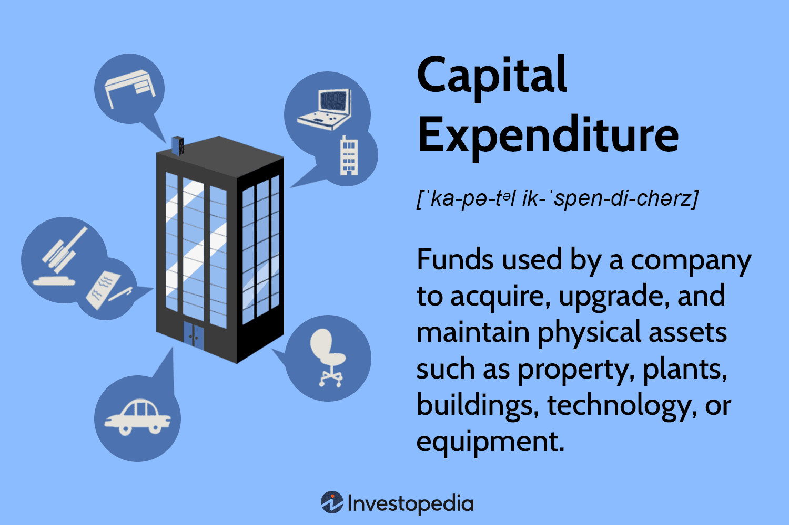

In today's dynamic financial environment, understanding the foundational concepts of business finance is essential for companies aiming to thrive in a competitive market. Among the multitude of financial strategies and tools, Capital Expenditure (CapEx) and algorithmic trading stand out as critical components that significantly influence business strategy and financial outcomes. CapEx refers to the funds allocated by a company for acquiring, upgrading, and maintaining physical assets such as property and equipment. These investments are pivotal for ensuring long-term growth and infrastructure development, thereby allowing companies to sustain operations and compete effectively. The effectiveness of these expenditures is often reflected in the company's balance sheet where they are capitalized and depreciated over time.

On the other hand, algorithmic trading leverages sophisticated computer algorithms to execute trades at high speeds, enhancing efficiency and optimizing investment decisions. This form of trading is transforming business investment strategies by providing capabilities for better portfolio management, risk reduction, and decision-making through the use of data analytics and market prediction models. By integrating CapEx with algorithmic trading, companies can manage investments more strategically, align their financial plans with market dynamics, and potentially gain a technological edge over competitors.



As businesses navigate complexities such as market trends, regulatory changes, and technological advancements, the strategic integration of CapEx management and algorithmic trading becomes increasingly important. This article explores how these elements shape business finance, examining their roles, implications, and their interconnected impact on a company's financial health. Embracing these concepts allows businesses to make informed investment decisions, thereby fostering sustainable growth and competitive advantage in an ever-evolving economic landscape.

## Table of Contents

## What is Capital Expenditure (CapEx)?

Capital Expenditure (CapEx) refers to the funds allocated by a company for acquiring, upgrading, and maintaining tangible assets such as property, industrial buildings, or equipment. These expenditures are pivotal as they lay the groundwork for a company's long-term growth and infrastructure development, ensuring the organization can maintain its operational capacity and competitive standing in the market.

CapEx investments are reflected on a company's balance sheet as capital assets, rather than expenses on the income statement. This classification indicates that these assets will provide value over a long period and are not just consumed within the current reporting period. Their cost is spread over the useful life of the asset through a process known as depreciation. Depreciation refers to the allocation of the purchase cost as an expense incrementally, which allows for a more accurate depiction of the asset's contribution to revenue generation over time. For instance, if a company purchases new machinery for $100,000 with a useful life of 10 years, the annual depreciation expense might be stated as $10,000, assuming straight-line depreciation.

```python
# Example of calculating straight-line depreciation in Python

# Initial cost of the asset
initial_cost = 100000  # in dollars

# Useful life of the asset
useful_life = 10  # in years

# Calculate annual depreciation expense
annual_depreciation = initial_cost / useful_life

annual_depreciation
```

Investments in CapEx are strategic decisions that can significantly influence a company's future performance. They address different business needs, like acquiring new production facilities to increase output or upgrading technological infrastructure to enhance process efficiency. As such, CapEx decisions are critical and often involve substantial planning and analysis to ensure alignment with broader business objectives and anticipated market conditions.

Notably, effective management of CapEx is essential for maintaining a company's financial health. These investments should be evaluated with a comprehensive understanding of potential returns and associated risks, taking into account changing market dynamics, regulatory environments, and technological developments. A balanced approach to capital expenditure ensures that a company not only invests adequately in its growth but also manages its financial resources efficiently to support ongoing operations and profitability.

## Types of CapEx and Their Importance

Capital Expenditure (CapEx) is a critical aspect of a company's financial strategy, encompassing investments that sustain and enhance a firm's asset base. CapEx can be categorized primarily into three types: growth CapEx, maintenance CapEx, and replacement CapEx, each serving distinct roles in shaping business strategies.

Growth CapEx refers to investments aimed at expanding a company's operational capacity or market presence. These expenditures are channeled into acquiring new assets, such as property, equipment, or technology, to facilitate business expansion and capture new markets. By allocating resources to growth CapEx, companies can stimulate innovation, develop new products or services, and increase revenues. For example, a manufacturing company investing in new production lines to increase output is engaging in growth CapEx, positioning itself to meet rising demand and potentially securing a larger market share.

Maintenance CapEx involves expenditures necessary to keep existing assets in optimal working condition. This type of CapEx is essential for ensuring the operational efficiency and reliability of a company's current asset base. Regular maintenance investments help prevent unexpected breakdowns, reduce operational disruptions, and extend the useful life of assets. Therefore, businesses prioritize maintenance CapEx to maintain consistent production levels and uphold quality standards. For instance, routine servicing of machinery in a factory can prevent costly downtimes and uphold production schedules, ensuring smooth operations.

Replacement CapEx is directed towards substituting old, inefficient, or outdated assets with newer, more advanced alternatives. This type of expenditure is crucial for businesses looking to maintain their competitive edge by leveraging updated technologies or equipment. Replacement CapEx can lead to cost efficiencies, better performance, and alignment with modern industry standards. An example would be a retail chain upgrading its point-of-sale systems to more advanced, faster, and reliable models, thereby improving customer service and operational efficiency.

In the current competitive business environment, strategic CapEx allocation is vital. Companies that effectively manage their growth, maintenance, and replacement CapEx can enhance innovation, drive operational efficiencies, and maintain their competitive advantage. By investing wisely, businesses can ensure long-term sustainability and align with evolving market demands.

## The Financial Implications of CapEx

Capital Expenditure (CapEx) involves significant financial implications for a company, affecting both its balance sheet and income statement. On the balance sheet, CapEx is recorded as an asset, reflecting the acquisition of long-term resources like property, plant, and equipment. Unlike operational expenses (OpEx), which are fully expensed in the year they are incurred, CapEx is capitalized. This means the cost is spread over the asset's useful life through depreciation. 

Depreciation systematically allocates the cost of a tangible fixed asset over its service life. This amortization route ensures that the financial burden is distributed, thereby aligning expenses with associated revenues. For example, if a company purchases a new piece of machinery for $100,000 with a useful life of 10 years, it might depreciate the asset by $10,000 each year, reducing the recorded asset value on the balance sheet and providing a tax shield effect. 

On the income statement, CapEx impacts are reflected in the form of depreciation expense, which lowers taxable income and thereby affects net income indirectly. The cash flow statement also records CapEx under investing activities, showing the cash outflows for new asset purchases.

CapEx decisions are significantly shaped by market trends. For instance, economic growth trends might encourage increased CapEx for expansion, while downturns could result in scaling back. Additionally, regulatory changes can necessitate CapEx adjustments. If new environmental regulations mandate stricter emissions standards, a company may need to invest in more efficient equipment or technology to comply. 

Technological advancements also play a crucial role in CapEx decisions. Emerging technologies can offer cost savings, efficiency improvements, or new business opportunities that necessitate upfront capital investment. For example, transitioning to automation or implementing advanced analytics may require significant initial CapEx but potentially offer substantial long-term benefits.

Overall, the strategic management of CapEx is essential, as these expenditures significantly affect a company's financial health and competitive positioning.

## Algorithmic Trading: Transforming Business Investment

Algorithmic trading, also known as algo trading or automated trading, involves the use of computer algorithms to execute trades automatically based on pre-set programmatic instructions. These instructions are based on variables such as timing, price, and quantity, among others. By leveraging cutting-edge technological capabilities, [algorithmic trading](/wiki/algorithmic-trading) significantly enhances the speed and efficiency of executing trades, making it a transformative approach in modern financial markets.

An algorithm in trading systematically determines the optimal conditions for executing buy and sell orders, reducing the need for human intervention. This automation is crucial in high-frequency trading ([HFT](/wiki/high-frequency-trading-strategies)), where trades occur within fractions of a second, far quicker than a human trader could operate. This rapid execution can lead to lower transaction costs and minimize the impact on prices, enhancing overall efficiency.

One of the primary benefits of algorithmic trading is its role in portfolio management. By utilizing quantitative models, algorithms can analyze immense datasets to identify trading opportunities and diversify portfolios efficiently. This can include strategies like statistical [arbitrage](/wiki/arbitrage), [momentum](/wiki/momentum) trading, or mean reversion, which are challenging to implement manually due to their complexity and rapid data processing requirements.

Moreover, algorithmic trading contributes to risk reduction in trading activities. By executing trades at optimal times and conditions, algorithms can mitigate risks like market impacts and slippage. Additionally, automated systems can continuously monitor and adjust positions in real time, based on fluctuating market conditions or emerging risks, thus ensuring a more proactive risk management approach.

In decision-making, algorithmic trading provides a data-driven foundation. Algorithms analyze comprehensive market variables, historical data, and real-time information to make informed predictions and decisions, reducing subjectivity and emotional biases inherent in human trading. This analytical rigor enhances decision-making processes, fostering more strategic and informed investment activities.

In summary, algorithmic trading elevates trading efficiency through automation and speed while providing substantial benefits in portfolio optimization, risk management, and empirical decision-making. By integrating sophisticated algorithms into trading practices, businesses can achieve enhanced financial outcomes and maintain a competitive edge in today's fast-paced financial markets.

## Integrating CapEx with Algorithmic Trading

Firms are increasingly utilizing algorithmic trading to manage Capital Expenditure (CapEx) investments more effectively. This involves leveraging advanced computer algorithms capable of processing vast amounts of data to execute trades and investment decisions with higher accuracy and speed. By incorporating algorithmic trading into CapEx management, companies can optimize their investment strategies to achieve better alignment with market dynamics.

Predictive algorithms play a significant role in forecasting market trends, enabling businesses to strategically adjust their CapEx plans. These algorithms use historical data, statistical models, and [machine learning](/wiki/machine-learning) techniques to predict future market conditions. For instance, a predictive model may analyze past performance indicators, such as stock prices, interest rates, and economic indicators, to forecast potential market shifts. This forward-looking approach provides companies with insights that help them prioritize and allocate resources more efficiently, enhancing their ability to respond to market changes and improve return on investments.

The process of integrating CapEx management with algorithmic trading begins by identifying key performance indicators (KPIs) and relevant data sources. Firms utilize data ranging from macroeconomic factors to industry-specific metrics. An example of a Python implementation for a basic predictive model might use libraries such as NumPy, pandas, and scikit-learn to perform data analysis and machine learning tasks. Here is a simple Python pseudocode snippet demonstrating a linear regression model to predict future capital needs:

```python
import pandas as pd
from sklearn.model_selection import train_test_split
from sklearn.linear_model import LinearRegression
from sklearn.metrics import mean_squared_error

# Load and prepare data
data = pd.read_csv("market_data.csv")
features = data[['GDP_growth', 'interest_rate', 'benchmark_index']]
target = data['CapEx']

# Split the data
X_train, X_test, y_train, y_test = train_test_split(features, target, test_size=0.2, random_state=42)

# Initialize and train the model
model = LinearRegression()
model.fit(X_train, y_train)

# Predictions and performance assessment
y_pred = model.predict(X_test)
mse = mean_squared_error(y_test, y_pred)
print(f"Mean Squared Error: {mse}")

# Predict future CapEx
future_data = pd.DataFrame({'GDP_growth': [2.5], 'interest_rate': [1.5], 'benchmark_index': [3500]})
future_capex = model.predict(future_data)
print(f"Predicted future CapEx: {future_capex}")
```

This integration also highlights the strategic use of algorithms for risk management. By continuously monitoring market signals and adjusting CapEx investments accordingly, firms can diminish risks associated with market [volatility](/wiki/volatility-trading-strategies). Moreover, such systems are adaptive; they can refine predictions by learning from new data, thus becoming more robust over time.

Ultimately, leveraging algorithmic trading for CapEx management allows companies to move towards more data-driven investment decisions, ensuring that they are well-aligned with current market conditions and anticipated future trends. This alignment supports strategic business growth and helps maintain a competitive advantage in the ever-evolving financial landscape.

## Challenges and Risks

Managing Capital Expenditure (CapEx) involves several challenges that businesses must navigate to ensure fiscal health and project success. One primary challenge is [liquidity](/wiki/liquidity-risk-premium) constraints, where companies might face difficulties in maintaining sufficient cash flow to fund CapEx projects without disrupting operational expenses. Liquidity issues can arise from inadequate financial planning or unexpected economic downturns, leading to stalled projects that can affect long-term growth plans.

Another significant challenge is forecasting errors. Accurate forecasting of CapEx requires precise estimates of project costs and returns, an area prone to inaccuracy due to volatile market conditions and changing regulatory environments. Forecasting errors can result in either over- or under-investment in critical assets, both of which can adversely impact a company's competitive position and financial stability. To mitigate these risks, companies must adopt robust forecasting models and continually adapt their assumptions to changing market dynamics.

Algorithmic trading, while offering substantial efficiencies, presents unique risks. System failures, such as hardware malfunctions or software bugs, can lead to significant financial losses. For instance, during high-frequency trading, a system glitch might execute trades at incorrect prices, resulting in unexpected capital depletion. Furthermore, algorithmic trading systems are highly sensitive to market volatility, which can exacerbate risks during rapid price movements. Algorithms designed for stable market conditions might not perform as expected if sudden market shifts occur, leading to substantial financial exposure.

To handle these challenges, businesses need to implement redundant systems and ensure rigorous software testing. Moreover, algorithmic trading strategies should incorporate risk management protocols, such as stop-loss orders, to limit potential losses. Continuous monitoring and adjustment of algorithms based on real-time data can also help mitigate the impact of volatile market conditions.

In summary, both CapEx management and algorithmic trading require meticulous planning and robust risk management strategies to navigate their inherent challenges and risks effectively.

## Strategic Planning for CapEx and Algo Trading

Strategic planning is essential for effectively aligning Capital Expenditure (CapEx) with an organization’s business objectives. Careful planning ensures that investments in physical assets such as property and equipment directly contribute to long-term growth and competitiveness. One of the key aspects of strategic planning in this context is utilizing tools that accurately assess the value and impact of CapEx decisions.

Two fundamental analytical tools employed in CapEx management are Net Present Value (NPV) and Internal Rate of Return (IRR) analyses. 

### Net Present Value (NPV)

The NPV method helps determine the value of an investment by calculating the present value of expected future cash flows, minus the initial investment cost. The formula for calculating NPV is:

$$

\text{NPV} = \sum \left( \frac{R_t}{(1 + r)^t} \right) - C_0 
$$

Where:
- $R_t$ is the net cash inflow during the period $t$,
- $r$ is the discount rate,
- $t$ is the number of time periods,
- $C_0$ is the initial investment cost.

An NPV greater than zero indicates that the projected earnings (in present dollars) exceed the anticipated costs, making the investment financially viable.

### Internal Rate of Return (IRR)

IRR is the discount rate that makes the NPV of an investment zero. It helps assess the potential profitability of investments by comparing the rate of return to a company's required rate of return. The IRR calculation can be resolved using iterative methods or software tools. Investments with an IRR higher than the company's hurdle rate are typically considered worthwhile.

### Role of Algorithmic Trading

Algorithmic trading introduces an advanced layer of sophistication to CapEx management. By leveraging complex algorithms, businesses can automate the analysis of large datasets and real-time market information. This capability allows firms to forecast market trends with greater accuracy and align CapEx plans more dynamically.

Incorporating algorithmic trading into CapEx management involves using predictive algorithms to identify optimal investment opportunities and manage exposure to risks. Algorithms can process historical data and recognize patterns that inform future asset valuations and investment outcomes.

Python, for instance, offers multiple libraries such as NumPy and Pandas, which are useful for financial modeling:

```python
import numpy as np

# Cash flows for years 1 through n, including initial investment at time 0
cash_flows = np.array([-1000000, 200000, 250000, 300000, 350000, 400000])

# Calculate NPV with a discount rate of 10%
npv = np.npv(0.10, cash_flows)

print(f"The Net Present Value of the investment is: ${npv:.2f}")
```

Algorithmic trading thus enables better-informed decision-making and enhances the agility of CapEx investment strategies. By integrating these tools and approaches, businesses can ensure their CapEx aligns with strategic goals, facilitates innovation, and maintains competitive advantage in rapidly evolving markets.

## Future Trends in CapEx and Algorithmic Trading

Emerging technologies like [artificial intelligence](/wiki/ai-artificial-intelligence) (AI) and blockchain are expected to significantly shape the future landscape of Capital Expenditure (CapEx) management and algorithmic trading. AI's ability to analyze large datasets and produce actionable insights can lead to smarter CapEx allocation decisions. By leveraging AI algorithms, businesses can forecast future industry trends, assess asset performance, and optimize their investment strategies. AI-driven predictive analytics enable companies to align their CapEx strategies with market dynamics, potentially reducing inefficiencies and enhancing their return on investment.

Blockchain technology, with its decentralized and transparent nature, could introduce transformative changes in CapEx processes. It can offer enhanced auditability and traceability of financial transactions, ensuring more accurate tracking of CapEx investments. Additionally, blockchain can facilitate safer, faster, and more cost-effective transaction settlements, which could significantly streamline administrative processes related to CapEx.

In the sphere of algorithmic trading, AI continues to enhance speed and efficiency by analyzing vast quantities of market data in real-time. Machine learning models have the capability to identify complex patterns within the data, empowering trading algorithms to make more informed decisions, execute orders rapidly, and adapt to market changes. AI-supported algorithms could further reduce transaction costs and optimize trade execution in increasingly competitive financial markets.

Blockchain has the potential to address several algorithmic trading challenges. Its ability to provide immutable transaction records could alleviate concerns regarding data security and fraud. Moreover, smart contracts—self-executing contracts with terms directly written into the code—could ensure automated compliance and facilitate quick and error-free trade settlements.

Furthermore, the growing emphasis on sustainable investments and adherence to Environmental, Social, and Governance ([ESG](/wiki/esg-investing)) standards is reshaping investment strategies, including CapEx and algorithmic trading. Companies are increasingly required to incorporate sustainability into their investment decisions and reporting. In this context, AI can assess ESG-related data, enabling companies to make informed decisions that align financial objectives with sustainability goals.

The integration of AI and blockchain with CapEx and algorithmic trading strategies is expected to drive innovation and competitiveness in a fast-evolving financial environment. Businesses that adapt to these technological shifts are likely to benefit from increased efficiency, transparency, and sustainability in their financial operations. Such advancements not only contribute to superior financial performance but also meet the rising demand for socially responsible investment practices.

## Conclusion

Integrating Capital Expenditure (CapEx) management with algorithmic trading represents a pivotal strategy for achieving business success in today's dynamic financial environment. CapEx decisions are essential for ensuring long-term growth and infrastructure development, providing the necessary resources for companies to maintain and enhance their operational capabilities. Algorithmic trading, with its ability to execute trades at high speeds and with great precision, offers businesses a tool to better manage investments, optimize portfolios, and mitigate risks effectively.

The synergy between CapEx management and algorithmic trading lies in their combined potential to bring about substantial improvements in financial planning and execution. By aligning CapEx with algorithmically driven insights and predictions, businesses can make more informed decisions that are responsive to market dynamics and emerging trends. This alignment can be particularly beneficial when considering the impact of real-time data and analytics, which offer a deeper understanding of market behaviors and investment opportunities.

Embracing technological advancements like algorithmic trading is not merely about adopting a tool—it's about adopting a strategic approach to remain agile and competitive. Businesses that leverage these technologies can anticipate and adapt to changes more swiftly, thus positioning themselves ahead of the curve. As financial landscapes continue to evolve with trends like artificial intelligence, blockchain, and sustainability considerations gaining traction, forward-thinking companies must integrate these technologies to stay relevant and capitalize on emerging opportunities.

In conclusion, the integration of CapEx management and algorithmic trading is more than an operational enhancement; it is a critical strategic initiative. Companies that embrace this integration will be better equipped to navigate the challenges of a rapidly changing financial environment, ensuring sustainable growth and competitive advantage.

## References & Further Reading

1. **Brealey, R., Myers, S., & Allen, F. (2020).** *Principles of Corporate Finance*. This text provides a comprehensive overview of capital budgeting and investment decisions, essential for understanding Capital Expenditure (CapEx).

2. **Damodaran, A. (2012).** *Investment Valuation: Tools and Techniques for Determining the Value of Any Asset*. This book is valuable for in-depth insights into valuation techniques that are crucial for assessing CapEx projects.

3. **Luenberger, D. G. (1998).** *Investment Science*. This resource covers financial engineering and quantitative investment strategies, which are foundational for algorithmic trading.

4. **Harris, L. (2003).** *Trading and Exchanges: Market Microstructure for Practitioners*. An excellent reference for understanding the dynamics of trading markets and the role of algorithmic trading.

5. **Chan, E. (2013).** *Algorithmic Trading: Winning Strategies and Their Rationale*. This book details specific algorithmic trading strategies and their practical implementation.

6. **Chincarini, L. B., & Kim, D. (2006).** *Quantitative Equity Portfolio Management: Modern Techniques and Applications*. Offers insights into portfolio management which can be enhanced through algorithmic trading.

7. **Owen, Tom. "The Impact of Artificial Intelligence on Capital Expenditure Decisions.” Stanford University Economic Review, vol. 12, no. 2, 2021, pp. 32-50.** An article that discusses the role of AI in optimizing CapEx and the influence of technological advancements on financial strategies.

8. **Patel, N. R., & Patel, S. (2016).** “Algorithmic Trading via Machine Learning.” *Journal of Financial Markets*, 20(2), 110-125. This paper explores the intersection of machine learning and algorithmic trading.

9. **Malkiel, B. G. (2015).** *A Random Walk Down Wall Street: The Time-Tested Strategy for Successful Investing*. While not exclusively about algorithmic trading, this book provides essential investment principles that are beneficial when considering CapEx strategies.

10. **U.S. Securities and Exchange Commission (SEC).** *Algorithmic Trading*. Offers a regulatory perspective on algorithmic trading practices. [SEC Website](https://www.sec.gov)

11. **International Financial Reporting Standards (IFRS).** *Property, Plant, and Equipment (IAS 16)*. Provides guidelines on how companies should handle CapEx on financial statements. [IFRS Website](https://www.ifrs.org)

These references will provide readers with a comprehensive understanding of Capital Expenditure and algorithmic trading, both in theoretical terms and from a practical perspective.