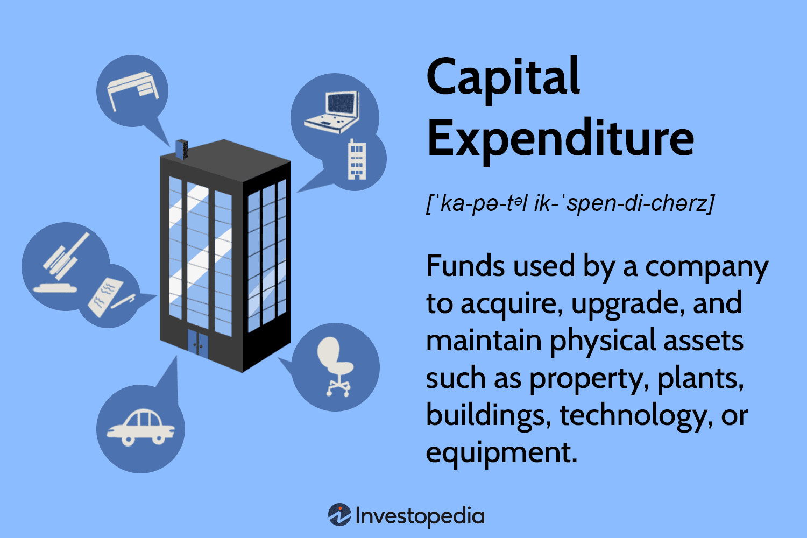

## Table of Contents

## What is capital expenditure?

Capital expenditure, often called capex, is the money a company spends on big, long-term items that help the business grow or keep running smoothly. These items are things like buildings, machinery, or new technology that the company will use for a long time. Unlike regular expenses that a company pays for things like office supplies or monthly bills, capital expenditures are investments in the future of the business.

When a company decides to spend on capital expenditure, it's usually because they want to expand their operations, improve their efficiency, or replace old equipment. For example, a factory might buy a new machine that makes their production faster and more efficient. These purchases are important because they can help the company make more money in the long run, even though they require a big investment upfront.

## How does capital expenditure differ from operational expenditure?

Capital expenditure and operational expenditure are two different ways a company spends money. Capital expenditure, or capex, is when a company buys big things that will last a long time, like buildings or machines. These things help the company grow or work better in the future. For example, if a company buys a new factory, that's capital expenditure because the factory will be used for many years.

Operational expenditure, or opex, is different. This is the money a company spends on everyday things that keep the business running, like paying for electricity, office supplies, or employee salaries. These costs are necessary for the company to operate day-to-day, but they don't last long and need to be paid regularly. For example, the monthly electric bill is an operational expenditure because it's something the company needs to pay every month to keep the lights on.

In simple terms, capital expenditure is about investing in the future with big, long-lasting purchases, while operational expenditure is about the costs of running the business day-to-day. Both are important, but they serve different purposes and are treated differently in the company's financial planning and accounting.

## What are some examples of capital expenditure in a business?

Capital expenditure includes big purchases that a business makes to grow or improve over time. For example, if a company decides to build a new office building, that's capital expenditure. The building will be used for many years and helps the company expand. Another example is when a business buys new machines for its factory. These machines can make the production process faster and more efficient, which is good for the company's future.

Other examples of capital expenditure are when a company invests in new technology, like computers or software, that will be used for a long time. For instance, if a business buys a new computer system to manage its inventory, that's capital expenditure because it helps the company work better and last for years. Also, if a company decides to buy vehicles, like trucks for delivery, those are considered capital expenditure because they are used over a long period to help the business operate.

## Why is capital expenditure important for a company's growth?

Capital expenditure is important for a company's growth because it allows the business to invest in things that will help it get bigger and better over time. When a company spends money on big things like new buildings, machines, or technology, it's making an investment in its future. These purchases can help the company make more products, reach more customers, or work more efficiently. For example, if a company buys a new factory, it can produce more goods and grow its business.

These investments also help a company stay competitive. If a business doesn't spend money on new equipment or technology, it might fall behind other companies that are investing in their growth. By making smart capital expenditures, a company can keep up with changes in the market and continue to grow. For instance, if a company invests in new software that makes its operations smoother, it can serve its customers better and stay ahead of its competitors.

## How is capital expenditure recorded in financial statements?

Capital expenditure is recorded in a company's financial statements in a few different ways. When a company buys something big like a building or a machine, it doesn't count as an expense right away. Instead, it's recorded as an asset on the balance sheet. This is because the company will use it for a long time. The value of the asset is then slowly reduced over time through a process called depreciation. This means the cost of the asset is spread out over its useful life, which helps show how the asset helps the company over time.

The other place you'll see capital expenditure is in the cash flow statement. This statement shows how money comes in and goes out of the company. Capital expenditures are listed under the investing activities section because they are investments in the company's future. This helps people looking at the financial statements see how much the company is spending on things that will help it grow. By understanding where capital expenditure shows up in the financial statements, you can get a better picture of how the company is planning for its future growth.

## What are the tax implications of capital expenditure?

When a company spends money on capital expenditure, like buying a new machine or building, it can affect the company's taxes. Instead of counting the whole cost as an expense right away, the company can spread out the cost over time through something called depreciation. Depreciation allows the company to deduct a part of the cost each year over the life of the asset. This means the company can lower its taxable income a little bit each year, which can help reduce the amount of taxes it has to pay.

There are also special tax rules that can make capital expenditure more attractive. For example, some countries allow businesses to take a bigger deduction in the first year through what's called bonus depreciation or immediate expensing. This can help the company save more on taxes right away. It's important for businesses to understand these tax rules because they can make a big difference in how much the company has to pay in taxes and how it plans its investments in the future.

## How do companies finance capital expenditure?

Companies can finance capital expenditure in different ways. One common way is by using money they already have, which is called internal financing. This means the company uses its profits or savings to pay for big purchases like new machines or buildings. This is good because it doesn't create any debt, but it can be hard if the company doesn't have enough money saved up.

Another way is by borrowing money, which is called external financing. Companies can take out loans from banks or issue bonds to investors. This lets them get the money they need right away, but they have to pay it back with interest over time. Another option is to sell shares of the company to investors, which is called equity financing. This gives the company money to spend on capital expenditure, but it also means sharing ownership with new investors.

Choosing the right way to finance capital expenditure depends on the company's situation. Some companies might use a mix of internal and external financing to spread out the risk. The important thing is to make sure the company can afford the big purchases and still keep running smoothly.

## What is the process of evaluating capital expenditure projects?

When a company thinks about spending a lot of money on something big, like a new machine or building, they need to figure out if it's a good idea. This is called evaluating capital expenditure projects. The first thing they do is look at how much the project will cost and how much money it might make in the future. They use tools like payback period, net present value (NPV), and internal rate of return (IRR) to help them decide. The payback period tells them how long it will take to earn back the money they spent. NPV looks at the value of future money in today's terms, and IRR shows the expected profit rate of the project.

After figuring out the numbers, the company also thinks about other things. They look at how the project fits with their long-term plans and if it will help them grow or stay competitive. They might also think about risks, like if the new machine could break down or if the building project might take longer than expected. They talk to experts and sometimes even do a test run to see if the project will really work out. By looking at all these things, the company can decide if the capital expenditure is worth it and will help them in the future.

## How does capital expenditure impact cash flow?

When a company spends money on capital expenditure, like buying a new machine or building, it affects its cash flow right away. This is because the company has to pay for these big purchases upfront, which means a lot of money goes out of the company's bank account all at once. For example, if a company buys a new factory, it might have to use a big chunk of its savings or take out a loan to pay for it. This can make the company's cash flow tight because it has less money to use for other things like paying bills or buying supplies.

Over time, though, capital expenditure can help improve cash flow. If the new machine or building helps the company make more products or work more efficiently, it can start bringing in more money. For instance, a new factory might let the company produce more goods and sell them, which means more cash coming in. Also, even though the company has to pay for the big purchase upfront, it can spread out the cost over time through depreciation, which helps with taxes and can make the company's cash flow look better in the long run. So, while capital expenditure can make cash flow tight at first, it can lead to more cash coming in if the investment pays off.

## What are the risks associated with high levels of capital expenditure?

When a company spends a lot of money on big things like new buildings or machines, it can be risky. One big risk is that it might use up all its money or have to borrow a lot, which can make it hard to pay for other things it needs, like bills or supplies. If something goes wrong, like the new machine breaks down or the building project takes longer than expected, the company might not have enough money to fix the problem. This can make it hard for the company to keep running smoothly.

Another risk is that the company might not get the money back that it spent on the big purchase. If the new machine or building doesn't help the company make more money or work better, the investment might not be worth it. This can hurt the company's profits and make it harder to grow in the future. So, while spending a lot on capital expenditure can help a company grow, it's important to be careful and think about the risks before making big decisions.

## How can capital expenditure be optimized for better returns?

To get the best returns from capital expenditure, a company needs to be smart about what it spends money on. They should look at different projects and see which ones will make the most money in the future. This means using tools like payback period, net present value, and internal rate of return to figure out which projects are worth it. The company should also think about how the project fits with their long-term plans and if it will help them grow or stay ahead of other companies. By choosing the right projects and making sure they fit with the company's goals, they can make sure their big purchases will pay off.

Another way to optimize capital expenditure is to keep an eye on costs and make sure the money is being spent wisely. This means planning carefully and maybe even doing a test run to see if the project will work out. It's also important to think about risks and have a backup plan in case something goes wrong. By being careful with how they spend money and making smart choices, a company can make sure their capital expenditure helps them grow and make more money in the long run.

## What are the latest trends in capital expenditure management?

One of the latest trends in capital expenditure management is the use of technology to make better decisions. Companies are using special software and tools to help them plan and keep track of their big purchases. This software can show them how much money they might make from a project and help them choose the best ones. It also helps them see how their money is being spent and make changes if they need to. By using technology, companies can make smarter choices about where to spend their money and make sure they get the best returns.

Another trend is focusing on sustainable and environmentally friendly projects. More and more companies are spending money on things that are good for the environment, like renewable energy or energy-efficient buildings. This is because customers and investors care about the environment and want companies to be responsible. By investing in sustainable projects, companies can save money in the long run and also make their customers and investors happy. This trend shows that capital expenditure is not just about making money, but also about being good to the planet.

## How can strategic planning align CapEx with business objectives?

Strategic planning plays a vital role in aligning capital expenditures (CapEx) with organizational goals to ensure that corporate investments are systematically directed towards achieving efficient and desirable outcomes. The key is to develop a comprehensive CapEx budgeting process that requires businesses to forecast financial needs accurately, allocate resources efficiently, and make informed decisions about which projects to pursue.

One essential component of this process is prioritizing projects based on strategic importance, potential return on investment, and alignment with long-term business objectives. Prioritization criteria may include factors such as the expected impact on market share, cost savings, revenue growth, and compliance with regulatory requirements. Employing a robust decision-making framework helps ensure that resources are allocated to projects that contribute most effectively to the company's strategic aims.

Monitoring the financial health of CapEx investments is equally crucial. This involves regularly reviewing project performance against predefined metrics and timelines to ensure that initiatives remain on track and deliver the intended benefits. Businesses can employ various tools, such as key performance indicators (KPIs), balanced scorecards, and financial dashboards, to track and analyze cost-efficiency, project timelines, and overall impact on the organization's financial statements.

Strategic frameworks and tools available to businesses include methods like the Net Present Value (NPV) and Internal Rate of Return (IRR) analyses, which are financial metrics used to evaluate the profitability of potential investments. NPV calculates the expected monetary value of a project by discounting future cash flows to their present value using a required rate of return. The formula for NPV is:

$$
\text{NPV} = \sum \frac{R_t}{(1 + i)^t} - C_0
$$

where $R_t$ is the net cash inflow during the period $t$, $i$ is the discount rate, and $C_0$ is the initial investment cost.

On the other hand, IRR is the discount rate at which the NPV of all cash flows from a project equals zero, effectively providing a break-even rate of return.

Case studies across various industries illustrate successful CapEx management practices. For instance, in the technology sector, companies like IBM have employed detailed project evaluation frameworks and continuous performance monitoring to guide capital investments in research and development. In the utility industry, firms such as Duke Energy implement strategic planning to steer investments in sustainable energy solutions, ensuring optimal resource allocation towards projects aligned with evolving environmental regulations and consumer demand trends.

By strategically planning and aligning CapEx with business objectives, companies can achieve heightened efficiency, innovation, and competitiveness in their respective markets. Through effective budgeting, prioritization, and financial monitoring, businesses are better positioned to navigate financial challenges while seizing opportunities for growth and improvement.

## References & Further Reading

[1]: Bergstra, J., Bardenet, R., Bengio, Y., & Kégl, B. (2011). ["Algorithms for Hyper-Parameter Optimization."](https://papers.nips.cc/paper/4443-algorithms-for-hyper-parameter-optimization) Advances in Neural Information Processing Systems 24.

[2]: ["Advances in Financial Machine Learning"](https://www.amazon.com/Advances-Financial-Machine-Learning-Marcos/dp/1119482089) by Marcos Lopez de Prado

[3]: ["Evidence-Based Technical Analysis: Applying the Scientific Method and Statistical Inference to Trading Signals"](https://www.amazon.com/Evidence-Based-Technical-Analysis-Scientific-Statistical/dp/0470008741) by David Aronson

[4]: ["Machine Learning for Algorithmic Trading"](https://github.com/PacktPublishing/Machine-Learning-for-Algorithmic-Trading-Second-Edition) by Stefan Jansen

[5]: ["Quantitative Trading: How to Build Your Own Algorithmic Trading Business"](https://books.google.com/books/about/Quantitative_Trading.html?id=j70yEAAAQBAJ) by Ernest P. Chan