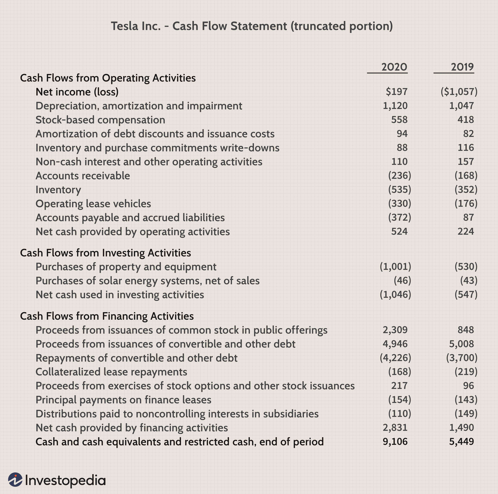

In the complex world of financial accounting, comprehending the different types of expenditures is a fundamental aspect of effective financial planning. Two critical forms of expenditures, capital expenditures (CapEx) and revenue expenditures (OpEx), serve as cornerstones in a business's financial blueprint. CapEx involves significant investments dedicated to acquiring or upgrading a company's long-term assets, such as property, equipment, or technology infrastructure. These investments are pivotal for expansion efforts and enhancing long-term revenue generation.

In contrast, revenue expenditures comprise the operational expenses necessary for maintaining the day-to-day functioning of a business. These expenses include regular costs like salaries, utilities, and maintenance—in essence, the expenditures vital for the consistent operation of a company. Immediate recognition of these expenses occurs in the income statement, directly impacting net income and thereby affecting profitability.



The relevance of these concepts extends beyond traditional business environments, particularly with the rise of algorithmic trading. As an advanced trading strategy reshaping modern financial markets, algorithmic trading relies heavily on both CapEx and OpEx. Investments in high-performance computing systems and software—considered CapEx—equip firms with the tools necessary for executing trades at unprecedented speeds and accuracy. Meanwhile, the operational costs involved in sustaining these technologically advanced systems classify as OpEx, reflecting ongoing expenses crucial for maintaining trading efficacy.

Businesses that effectively leverage an understanding of CapEx and OpEx can optimize their financial strategies, thereby enhancing economic standing and ensuring competitive viability. Familiarity with these financial intricacies equips businesses with the capability to smartly allocate resources, foster growth, and capitalize on emerging opportunities. Thus, understanding CapEx and OpEx not only aids in sharpening financial tactics but also bolsters a company's ability to navigate the complexities of contemporary financial landscapes. This introduction sets the foundation for a more detailed examination of the financial dynamics associated with capital and revenue expenditures.

## Table of Contents

## Understanding Capital Expenditures

Capital expenditures (CapEx) represent substantial organizational investments directed towards acquiring, upgrading, or maintaining physical assets. Such expenditures are typically aimed at bolstering the long-term operational capacity and efficiency of a business. Unlike operational expenses, CapEx is characterized by its long-term horizon, being capitalized on the balance sheet and gradually expensed through depreciation over the useful life of the asset acquired or improved.

These expenditures are critical for business expansion and revenue generation, encompassing a wide range of investments, such as new factory facilities, manufacturing equipment, vehicles, and cutting-edge technology infrastructures. For instance, a company might invest in state-of-the-art machinery to enhance production capabilities or acquire new office buildings to accommodate an expanding workforce.

From an accounting perspective, CapEx is not immediately reflected in the income statement as an expense due to its capitalized nature. Instead, the cost of the asset is recorded on the balance sheet, with periodic depreciation entries impacting the income statement over time. This treatment aligns with the matching principle in accounting, which ensures costs are recognized in the same period as the revenues they help generate.

Financing these significant outlays often necessitates external capital, either through equity or debt financing. Companies may opt for equity financing, raising capital through the sale of shares, or they might pursue debt financing, securing loans or issuing bonds. The choice between these financing methods can significantly affect a company's capital structure and overall financial strategy.

A comprehensive understanding of CapEx is indispensable for strategic financial planning. By analyzing potential projects' return on investment (ROI) and net present value (NPV), organizations can prioritize capital investments that promise substantial long-term profitability. Experienced financial managers leverage these metrics to make informed decisions, ensuring optimal allocation of resources towards projects that align with the company's growth objectives.

In summary, capital expenditures are pivotal for sustaining and enhancing a company's physical and technological infrastructure. Through careful financing and strategic planning, businesses can harness CapEx to support their expansion initiatives and secure a competitive edge in their respective markets.

## Revenue Expenditures Explained

Revenue expenditures are short-term operational expenses that a business incurs within the same accounting period in which they are recorded. These expenditures encompass the essential costs necessary to maintain daily business operations, including wages, utilities, and maintenance expenses. Unlike capital expenditures, which are capitalized and depreciated over time, revenue expenditures are immediately recognized in the income statement. The immediate recognition of these expenses directly impacts profit margins, thereby influencing the financial performance reflected in financial statements.

Revenue expenditures are integral to the smooth operation of a business, representing the recurring costs necessary for effective management and continuity of operations. These operational expenses ensure that a business remains functional and competitive in its day-to-day activities. Effective management of revenue expenditures is crucial; prudent control and allocation of these costs can optimize operating efficiency and contribute to short-term financial stability. By ensuring these expenses are kept in check, businesses can prevent unnecessary financial strain on their operations, thus maintaining a healthy cash flow and ensuring that profits are maximized.

It is also crucial for businesses to accurately forecast and plan for revenue expenditures to align with their financial strategies. This planning enables companies to allocate resources effectively, addressing immediate operational needs without sacrificing future financial goals. The strategic management of revenue expenditures ensures that businesses can meet their short-term obligations while positioning themselves for sustained long-term growth.

## Accounting Treatments for Expenditures

Capital expenditures (CapEx) and revenue expenditures play distinct roles in financial accounting, each with unique accounting treatments that impact a company's financial statements and tax liabilities. Understanding the accounting treatment of CapEx and revenue expenditures is critical for financial transparency and strategic decision-making.

### Capital Expenditures (CapEx)

Capital expenditures are recorded as long-term assets on the balance sheet. These investments, made to acquire or enhance physical assets such as property, equipment, or technology, are not immediately expensed. Instead, they are capitalized and gradually expensed through depreciation over the asset's useful life.

1. **Capitalization and Depreciation**: 
   - The capitalization of CapEx involves adding the expenditure to the asset side of the balance sheet. Various depreciation methods, such as straight-line or declining balance, can be employed to allocate the asset's cost over its useful life.
   - **Straight-Line Depreciation Formula**:
$$
     \text{Annual Depreciation Expense} = \frac{\text{Cost of Asset} - \text{Salvage Value}}{\text{Useful Life of Asset}}

$$
   - **Python Example**:
     ```python
     def straight_line_depreciation(cost, salvage_value, useful_life):
         return (cost - salvage_value) / useful_life

     annual_depreciation = straight_line_depreciation(10000, 2000, 5)
     ```

2. **Impact on Tax Liabilities**:
   - Depreciation reduces taxable income, thus impacting the company's income tax liabilities over time. By spreading the cost of the asset, companies can manage cash flow and tax payments more effectively.

### Revenue Expenditures

Unlike CapEx, revenue expenditures are recorded immediately on the income statement as expenses for the period in which they are incurred. These expenditures are associated with the day-to-day operations of a business, such as utilities, rent, and wages, and directly affect net income and profit margins.

1. **Immediate Expense Recognition**:
   - Since revenue expenditures are considered operating expenses, they reduce net income in the period incurred. This immediate recognition reflects the ongoing costs necessary to operate the business effectively.

2. **Influence on Financial Reporting**:
   - Accurate reporting of both CapEx and revenue expenditures is essential for transparency in financial statements, aiding stakeholders in making informed decisions. Proper accounting treatments ensure that profit margins and returns are accurately calculated, influencing investor and management evaluations.

### Strategic Planning and Profitability Analysis

The distinct accounting treatments of CapEx and revenue expenditures facilitate strategic financial planning and profitability analysis. By understanding these differences, management can make informed decisions about resource allocation and investment strategies, aligning financial operations with overall business objectives. This ensures that firms not only maintain operational efficiency but also strategically invest in long-term growth and development.

## Algorithmic Trading and Financial Accounting

Algorithmic trading employs sophisticated algorithms and automated systems to efficiently execute trades in financial markets. As this trading method relies heavily on advanced technology, understanding the financial accounting implications of these investments is crucial. Investments in high-performance trading technology and systems are classified as capital expenditures (CapEx). These are significant, long-term investments that underpin the foundation of [algorithmic trading](/wiki/algorithmic-trading). They typically include hardware acquisition, such as servers and data centers, and software licenses necessary for developing and maintaining trading algorithms. Such expenditures are capitalized on the balance sheet and amortized over the useful life of the assets, reflecting their role in generating revenue over time.

Operational expenditures (OpEx), on the other hand, encompass costs associated with the daily functioning and maintenance of the algorithmic trading infrastructure. This includes expenses like cloud computing services, data feed subscriptions, and salaries for technical staff tasked with monitoring systems. These costs are recorded on the income statement in the period they are incurred, impacting net income immediately.

For algorithmic trading firms, a strategic allocation of CapEx and OpEx is essential to balance initial setup expenses with ongoing operational efficiency. Properly managing these expenditures can significantly enhance trading performance by ensuring reliable technological infrastructure and reducing latency in trade executions. Furthermore, an understanding of these financial distinctions enables firms to align their spending with strategic goals, optimizing resources for future growth and competitive advantage. By prudently managing both CapEx and OpEx, algorithmic trading firms can achieve a sustainable financial position while maintaining the flexibility to adapt to technological advancements.

## Strategic Financial Planning with CapEx and OpEx

Efficient allocation of capital expenditures (CapEx) and operational expenditures (OpEx) is crucial for ensuring a business's long-term growth and operational success. CapEx primarily involves investments in long-term assets that are crucial for business expansion and modernization. These can include acquiring new machinery, expanding facilities, or investing in technology upgrades. Such investments enhance a company's production capacity, improve operational efficiency, and can lead to competitive advantages in the market.

On the other hand, OpEx encompasses the day-to-day operational costs necessary for a business's continuity and profitability. This includes expenses such as employee salaries, utilities, and office supplies. Managing OpEx efficiently is vital for maintaining a stable operating environment and ensuring that resources are optimally utilized to support the company's daily operations.

To effectively guide decisions regarding CapEx and OpEx, businesses should employ strategic analysis of key financial metrics. Two crucial metrics are Return on Investment (ROI) and Net Present Value (NPV). ROI measures the profitability of an investment relative to its cost, calculated as:

$$
\text{ROI} = \frac{\text{Net Profit}}{\text{Investment Cost}} \times 100
$$

This metric helps determine the financial return expected from a specific CapEx or OpEx initiative, guiding the allocation of resources to the most beneficial projects.

NPV, on the other hand, assesses the value added by a project, considering the time value of money. It is calculated as the present value of cash inflows minus the present value of cash outflows. A positive NPV indicates that the project is expected to generate more value than its cost, making it a favorable investment:

$$
\text{NPV} = \sum \frac{R_t}{(1 + i)^t} - C_0
$$

Where:
- $R_t$ represents the net cash inflow for period $t$,
- $i$ is the discount rate,
- $C_0$ is the initial investment cost.

Balancing CapEx and OpEx requires a strategic financial approach that ensures resources are utilized effectively while the company remains competitive and profitable. By carefully analyzing these financial metrics, businesses can make informed decisions that optimize resource allocation, sustain profitability, and bolster long-term success.

## Conclusion

Understanding capital expenditures (CapEx) and operational expenditures (OpEx) forms the cornerstone of strategic financial planning for any business entity. CapEx refers to the strategic outlay on long-term assets that are essential for sustaining and expanding business operations. These investments, such as in machinery, technology, or infrastructure, lay the foundation for future revenue generation. In contrast, OpEx pertains to the regular operational costs required for the daily functioning of an enterprise, like utilities, wages, and maintenance.

Both CapEx and OpEx are pivotal in assessing a company's financial health and establishing its long-term goals. While CapEx decisions often determine the trajectory of growth and modernization, efficient management of OpEx helps maintain operational efficiency and profitability. By applying rigorous financial accounting practices, companies ensure accurate, transparent reporting that not only complies with regulatory requirements but also instills confidence among investors and stakeholders.

To propel growth and enhance profitability, businesses must adeptly navigate between CapEx and OpEx. Mastering these financial constructs equips a company to optimize resource allocation, drive sustainable growth, and forge a competitive advantage in an ever-evolving marketplace. Proper alignment of financial strategies with business objectives is crucial, ensuring that resources are utilized effectively to achieve optimal outcomes.

## References & Further Reading

[1]: ["International Financial Reporting Standards (IFRS)"](https://www.investopedia.com/terms/i/ifrs.asp)- Provides guidelines on accounting treatments for capital and revenue expenditures.

[2]: ["Advances in Financial Machine Learning"](https://www.amazon.com/Advances-Financial-Machine-Learning-Marcos/dp/1119482089) by Marcos Lopez de Prado - Discusses using financial machine learning in trading, related to CapEx in high-performance systems.

[3]: ["Accounting for Capital and Revenue Expenditure"](https://www.financestrategists.com/accounting/capital-and-revenue/accounting-for-revenue-and-capital-expenditures/) - Clarifies the differences between CapEx and OpEx for financial reporting.

[4]: ["Quantitative Trading: How to Build Your Own Algorithmic Trading Business"](https://github.com/LucindaYa/quant-resources/blob/master/Quantitative%20Trading%20How%20to%20Build%20Your%20Own%20Algorithmic%20Trading%20Business.pdf) by Ernest P. Chan - Offers insights into algorithmic trading, relevant to understanding OpEx and CapEx in trading strategies.

[5]: ["Corporate Finance"](https://www.investopedia.com/terms/c/corporatefinance.asp) by Stephen Ross, Randolph Westerfield, and Jeffrey Jaffe - Covers fundamental financial concepts including capital expenditures and financing.

[6]: ["Principles of Corporate Finance"](https://www.mheducation.com/highered/product/Principles-of-Corporate-Finance-Brealey.html) by Richard A. Brealey, Stewart C. Myers, and Franklin Allen - A comprehensive resource on financial management, including capital allocation strategies.