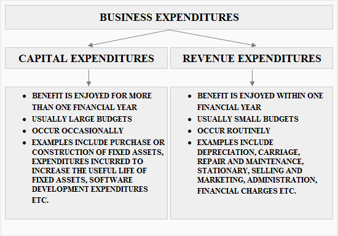

## Table of Contents

## What are capital expenditures?

Capital expenditures, often called CapEx, are the money a business spends on buying or improving long-term assets. These assets can include things like buildings, machinery, or equipment that the company will use for many years. The main idea behind capital expenditures is to invest in the future of the business. By spending money now, the company hopes to increase its ability to make more money later.

These expenditures are different from regular expenses, like paying for electricity or buying office supplies. Those are costs that help keep the business running day to day. Capital expenditures, on the other hand, are more about growth and development. For example, if a company buys a new factory, that's a capital expenditure because it's a big investment that will help the company grow over time. Keeping track of capital expenditures is important because it helps businesses plan for the future and make sure they have enough money to keep growing.

## What are revenue expenditures?

Revenue expenditures are the costs a business pays for things that help it run every day. These are expenses that keep the business going, like paying for electricity, buying office supplies, or fixing small problems with machines. They are different from capital expenditures because they don't last a long time. Instead, they are used up quickly, usually within a year.

These expenses are important because they help the business keep working smoothly. For example, if a company needs to buy paper for its printers, that's a revenue expenditure. It's not a big investment like buying a new printer, but it's necessary to keep the office running. Revenue expenditures are recorded as costs in the same year they are spent, which helps the business understand how much it's spending to operate.

## How do capital expenditures differ from revenue expenditures?

Capital expenditures and revenue expenditures are two different types of spending for a business. Capital expenditures are for buying or improving big things that the business will use for a long time, like buildings or machines. These are investments that help the business grow and make more money in the future. For example, if a company buys a new factory, that's a capital expenditure because it's a big purchase that will help the company for many years.

On the other hand, revenue expenditures are for the day-to-day costs that keep the business running smoothly. These are things like electricity bills, office supplies, or fixing small problems with equipment. Revenue expenditures are used up quickly, usually within a year, and they help the business operate but don't contribute to long-term growth. For instance, buying paper for the office printer is a revenue expenditure because it's needed to keep things going but doesn't last long.

The main difference between the two is how long they last and their purpose. Capital expenditures are about investing in the future, while revenue expenditures are about keeping the business running today. Both are important, but they are treated differently in the company's financial records. Capital expenditures are spread out over several years, while revenue expenditures are fully counted as costs in the year they are spent.

## Can you give examples of capital expenditures?

Capital expenditures are big investments that a business makes to help it grow in the future. These are things that the company will use for a long time, usually more than a year. For example, if a company buys a new factory, that's a capital expenditure. The factory is a big asset that will help the company make more products and earn more money over many years. Another example is when a business buys new machines or equipment. These machines can help the company work faster and make better products, which can lead to more sales and profits in the future.

Another type of capital expenditure is when a company spends money to improve something it already owns. For instance, if a business decides to add a new wing to its office building, that's a capital expenditure. The new wing will make the office bigger and better, helping the company grow. Also, if a company upgrades its computer systems to make them faster and more efficient, that's another example of a capital expenditure. These upgrades can help the business work better and serve more customers, leading to more growth and success in the long run.

## Can you give examples of revenue expenditures?

Revenue expenditures are the costs a business pays to keep running every day. These are things like paying the electricity bill, buying paper for the office printer, or fixing a small problem with a machine. They are important because they help the business keep working smoothly. For example, if a company needs to buy cleaning supplies to keep the office clean, that's a revenue expenditure. It's not a big investment, but it's necessary to make sure the workplace stays nice and tidy.

Another example of a revenue expenditure is paying for internet service. A business needs the internet to communicate with customers and do its work, so this is a cost that comes up every month. Also, if a company has to pay for repairs on a machine that's not working right, that's another revenue expenditure. These repairs help the machine keep running, but they don't make it last longer or work better in the long run. Revenue expenditures are all about keeping the business going day to day, not about making big changes or investments for the future.

## How are capital expenditures recorded in financial statements?

Capital expenditures are recorded in a company's financial statements as long-term assets. When a business spends money on things like buildings, machines, or equipment, these costs are not fully counted as expenses right away. Instead, they are put on the balance sheet as assets. This is because these big purchases will help the company make money for many years, so the cost is spread out over time.

The way this works is called depreciation. Each year, a part of the cost of the capital expenditure is moved from the balance sheet to the income statement as an expense. This helps show how the asset is being used up over time. For example, if a company buys a new factory, it won't count the whole cost of the factory as an expense in the year it was bought. Instead, it will slowly count parts of that cost as an expense over the years the factory is used. This way, the financial statements show a more accurate picture of the company's costs and assets.

## How are revenue expenditures recorded in financial statements?

Revenue expenditures are recorded in a company's financial statements as expenses in the year they are spent. These are the costs for things that help the business run every day, like electricity bills, office supplies, or small repairs. When a company pays for these things, it counts the full amount as an expense right away on the income statement. This helps the company understand how much it's spending to keep operating.

For example, if a business buys paper for the office printer, the cost of that paper is recorded as an expense in the same year it was bought. This is different from capital expenditures, which are spread out over time. Revenue expenditures are all about the day-to-day costs, so they are fully counted in the year they happen, giving a clear picture of the company's regular spending.

## What are the tax implications of capital versus revenue expenditures?

Capital expenditures and revenue expenditures have different tax implications for a business. When a company makes a capital expenditure, like buying a new factory or machine, it can't deduct the whole cost from its taxes right away. Instead, the company can spread out the cost over several years through a process called depreciation. This means the company can deduct a part of the cost each year, which helps lower its taxable income over time. This can be good for the company because it spreads out the tax benefits and helps with long-term financial planning.

On the other hand, revenue expenditures, like paying for electricity or buying office supplies, can be fully deducted from the company's taxes in the year they are spent. This means the company can reduce its taxable income by the full amount of these costs right away. This can help the business save on taxes in the current year, but it doesn't provide any long-term tax benefits like capital expenditures do. Understanding these differences is important for businesses when they plan their spending and taxes.

## How do capital expenditures affect a company's long-term financial health?

Capital expenditures are important for a company's long-term financial health because they help the business grow and make more money in the future. When a company spends money on big things like new factories or machines, it's making an investment. This investment can help the company produce more products, serve more customers, and earn more profits over time. By carefully choosing where to spend money on capital expenditures, a company can improve its ability to make money and stay competitive in the market.

However, capital expenditures also mean spending a lot of money upfront, which can affect a company's cash flow. If a company spends too much on capital expenditures without enough money coming in, it might struggle to pay its bills or invest in other important areas. It's important for a company to balance its capital expenditures with its current financial situation. By planning carefully and making smart investments, a company can use capital expenditures to build a stronger financial future without putting too much strain on its resources right now.

## How do revenue expenditures impact a company's short-term financial performance?

Revenue expenditures are the costs a business pays to keep running every day, like electricity bills or office supplies. These costs can have a big impact on a company's short-term financial performance. When a company spends money on revenue expenditures, it counts the full amount as an expense right away. This means the company's profits for that year will be lower because these costs are taken out of the money the company makes.

If a company has a lot of revenue expenditures, it might see its profits go down in the short term. But these costs are important because they help the business keep working smoothly. By managing revenue expenditures carefully, a company can make sure it has enough money to cover these day-to-day costs without hurting its short-term financial performance too much.

## What are the considerations for classifying an expenditure as capital or revenue?

When a business spends money, it needs to decide if the cost is a capital expenditure or a revenue expenditure. The main thing to think about is how long the thing they bought will last and what it's used for. If the thing will last a long time, like more than a year, and it's used to help the business grow, then it's usually a capital expenditure. For example, buying a new factory or machine is a capital expenditure because it's a big investment that will help the company make more money in the future.

On the other hand, if the thing is used up quickly, usually within a year, and it's needed to keep the business running every day, then it's a revenue expenditure. Things like paying for electricity, buying office supplies, or fixing small problems with equipment are revenue expenditures. These costs help the business operate smoothly but don't contribute to long-term growth. By understanding the difference, a business can keep track of its spending and plan for the future.

## How do accounting standards influence the treatment of capital and revenue expenditures?

Accounting standards are rules that businesses follow to keep their financial records clear and consistent. These standards help decide if a cost should be treated as a capital expenditure or a revenue expenditure. For capital expenditures, like buying a new factory or machine, accounting standards say that the cost should be spread out over time. This is called depreciation. It means the company can slowly count the cost as an expense over the years the asset is used. This helps show a more accurate picture of the company's costs and assets over time.

For revenue expenditures, like paying for electricity or buying office supplies, accounting standards say that the full cost should be counted as an expense right away. This means the company can reduce its taxable income by the full amount of these costs in the year they are spent. This helps the business understand how much it's spending to keep operating and can help with short-term financial planning. By following these standards, businesses can make sure their financial statements are clear and helpful for making decisions.

## What are the accounting treatments for expenditures?

Capital expenditures (CapEx) and revenue expenditures play distinct roles in financial accounting, each with unique accounting treatments that impact a company's financial statements and tax liabilities. Understanding the accounting treatment of CapEx and revenue expenditures is critical for financial transparency and strategic decision-making.

### Capital Expenditures (CapEx)

Capital expenditures are recorded as long-term assets on the balance sheet. These investments, made to acquire or enhance physical assets such as property, equipment, or technology, are not immediately expensed. Instead, they are capitalized and gradually expensed through depreciation over the asset's useful life.

1. **Capitalization and Depreciation**: 
   - The capitalization of CapEx involves adding the expenditure to the asset side of the balance sheet. Various depreciation methods, such as straight-line or declining balance, can be employed to allocate the asset's cost over its useful life.
   - **Straight-Line Depreciation Formula**:
$$
     \text{Annual Depreciation Expense} = \frac{\text{Cost of Asset} - \text{Salvage Value}}{\text{Useful Life of Asset}}

$$
   - **Python Example**:
     ```python
     def straight_line_depreciation(cost, salvage_value, useful_life):
         return (cost - salvage_value) / useful_life

     annual_depreciation = straight_line_depreciation(10000, 2000, 5)
     ```

2. **Impact on Tax Liabilities**:
   - Depreciation reduces taxable income, thus impacting the company's income tax liabilities over time. By spreading the cost of the asset, companies can manage cash flow and tax payments more effectively.

### Revenue Expenditures

Unlike CapEx, revenue expenditures are recorded immediately on the income statement as expenses for the period in which they are incurred. These expenditures are associated with the day-to-day operations of a business, such as utilities, rent, and wages, and directly affect net income and profit margins.

1. **Immediate Expense Recognition**:
   - Since revenue expenditures are considered operating expenses, they reduce net income in the period incurred. This immediate recognition reflects the ongoing costs necessary to operate the business effectively.

2. **Influence on Financial Reporting**:
   - Accurate reporting of both CapEx and revenue expenditures is essential for transparency in financial statements, aiding stakeholders in making informed decisions. Proper accounting treatments ensure that profit margins and returns are accurately calculated, influencing investor and management evaluations.

### Strategic Planning and Profitability Analysis

The distinct accounting treatments of CapEx and revenue expenditures facilitate strategic financial planning and profitability analysis. By understanding these differences, management can make informed decisions about resource allocation and investment strategies, aligning financial operations with overall business objectives. This ensures that firms not only maintain operational efficiency but also strategically invest in long-term growth and development.

## How can one strategically plan finances with CapEx and OpEx?

Efficient allocation of capital expenditures (CapEx) and operational expenditures (OpEx) is crucial for ensuring a business's long-term growth and operational success. CapEx primarily involves investments in long-term assets that are crucial for business expansion and modernization. These can include acquiring new machinery, expanding facilities, or investing in technology upgrades. Such investments enhance a company's production capacity, improve operational efficiency, and can lead to competitive advantages in the market.

On the other hand, OpEx encompasses the day-to-day operational costs necessary for a business's continuity and profitability. This includes expenses such as employee salaries, utilities, and office supplies. Managing OpEx efficiently is vital for maintaining a stable operating environment and ensuring that resources are optimally utilized to support the company's daily operations.

To effectively guide decisions regarding CapEx and OpEx, businesses should employ strategic analysis of key financial metrics. Two crucial metrics are Return on Investment (ROI) and Net Present Value (NPV). ROI measures the profitability of an investment relative to its cost, calculated as:

$$
\text{ROI} = \frac{\text{Net Profit}}{\text{Investment Cost}} \times 100
$$

This metric helps determine the financial return expected from a specific CapEx or OpEx initiative, guiding the allocation of resources to the most beneficial projects.

NPV, on the other hand, assesses the value added by a project, considering the time value of money. It is calculated as the present value of cash inflows minus the present value of cash outflows. A positive NPV indicates that the project is expected to generate more value than its cost, making it a favorable investment:

$$
\text{NPV} = \sum \frac{R_t}{(1 + i)^t} - C_0
$$

Where:
- $R_t$ represents the net cash inflow for period $t$,
- $i$ is the discount rate,
- $C_0$ is the initial investment cost.

Balancing CapEx and OpEx requires a strategic financial approach that ensures resources are utilized effectively while the company remains competitive and profitable. By carefully analyzing these financial metrics, businesses can make informed decisions that optimize resource allocation, sustain profitability, and bolster long-term success.

## References & Further Reading

[1]: ["International Financial Reporting Standards (IFRS)"](https://www.investopedia.com/terms/i/ifrs.asp)- Provides guidelines on accounting treatments for capital and revenue expenditures.

[2]: ["Advances in Financial Machine Learning"](https://www.amazon.com/Advances-Financial-Machine-Learning-Marcos/dp/1119482089) by Marcos Lopez de Prado - Discusses using financial machine learning in trading, related to CapEx in high-performance systems.

[3]: ["Accounting for Capital and Revenue Expenditure"](https://www.financestrategists.com/accounting/capital-and-revenue/accounting-for-revenue-and-capital-expenditures/) - Clarifies the differences between CapEx and OpEx for financial reporting.

[4]: ["Quantitative Trading: How to Build Your Own Algorithmic Trading Business"](https://github.com/LucindaYa/quant-resources/blob/master/Quantitative%20Trading%20How%20to%20Build%20Your%20Own%20Algorithmic%20Trading%20Business.pdf) by Ernest P. Chan - Offers insights into algorithmic trading, relevant to understanding OpEx and CapEx in trading strategies.

[5]: ["Corporate Finance"](https://www.investopedia.com/terms/c/corporatefinance.asp) by Stephen Ross, Randolph Westerfield, and Jeffrey Jaffe - Covers fundamental financial concepts including capital expenditures and financing.

[6]: ["Principles of Corporate Finance"](https://www.mheducation.com/highered/product/Principles-of-Corporate-Finance-Brealey.html) by Richard A. Brealey, Stewart C. Myers, and Franklin Allen - A comprehensive resource on financial management, including capital allocation strategies.