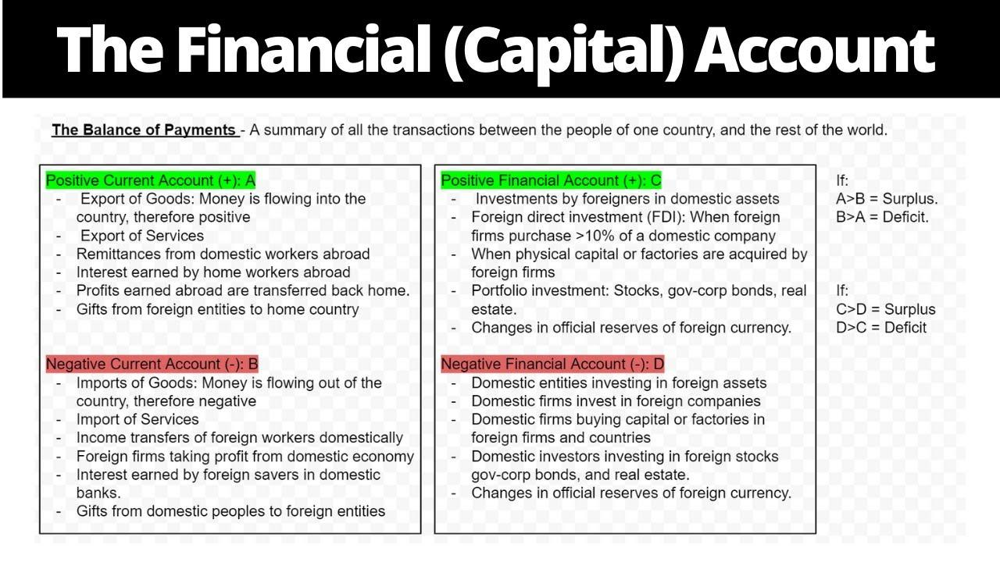

The interplay of financial account, balance of payments, capital account, and algorithmic trading forms the backbone of international finance and trading. These concepts are vital in understanding how economies across the globe interact, influence one another, and maintain financial stability.

The financial account is a core component of a nation's financial statement, documenting movements of financial assets between countries. It plays an integral role in shaping the global economic landscape by capturing transactions related to changes in ownership of international financial assets and liabilities. As a measure of a nation's investment abroad and foreign investments domestically, the financial account is crucial in assessing the country's financial health and its integration into the global market.



The balance of payments (BOP) is a comprehensive record of all economic transactions between a country and the rest of the world over a period. It consists of three main accounts: the current account, the capital account, and the financial account. The BOP serves as an essential indicator of a nation's economic strength and stability, providing insights into the country's trade dynamics, investment trends, and the flow of money.

Within the BOP, the capital account provides detailed information on transactions involving non-financial assets and capital transfers. It works in harmony with the financial account to ensure that a country's economic engagements with the world are accurately represented. By offering a window into how resources are transferred and utilized, the capital account is instrumental in informing economic policy and strategy.

Algorithmic trading has emerged as a transformative force in financial markets. It involves the use of computer algorithms to automate trading activities, thereby enhancing the speed, efficiency, and accuracy of transactions. With technological advancements such as artificial intelligence and machine learning, algorithmic trading has significantly influenced trading patterns, enabling rapid execution and reducing human error.

The aim of this article is to explore the intricate interrelation between these components and their consequential impact on global economic dynamics. By examining the links between financial account movements, the balance of payments structure, capital account activities, and the rise of algorithmic trading, we seek to provide a comprehensive understanding of how these elements coalesce to influence worldwide financial stability and market behavior.

## Table of Contents

## Understanding the Balance of Payments

The Balance of Payments (BOP) is a comprehensive record that summarizes all economic transactions between the residents of a country and the rest of the world over a specific period, providing essential insights into a nation's financial standing on the global stage. BOP is divided into three main components: the current account, the capital account, and the financial account. Each of these parts plays a crucial role in painting a detailed picture of a country's economic interactions and overall health.

The **current account** is primarily concerned with the trade of goods and services, as well as income flows such as dividends and wages, and current transfers like foreign aid. It includes the trade balance, which is the difference between exports and imports of goods and services. A current account surplus indicates that a nation is exporting more than it is importing, implying a net inflow of foreign currency. Conversely, a deficit suggests a net outflow. This account provides insights into how a country funds its consumption and investment from abroad.

The **capital account** is smaller and includes capital transfers and the acquisition or disposal of non-produced, non-financial assets, such as intellectual property rights. Capital transfers may include the transfer of funds for investment purposes or the cancellation of debt. Although smaller than other components, the capital account's transactions reflect significant investments that do not directly affect income or productions, such as debt forgiveness or the transfer of ownership rights.

The **financial account** records all transactions associated with changes of ownership in foreign financial assets and liabilities. It is an indicator of how a nation acquires or loses ownership of assets, both domestically and internationally. The financial account covers direct investment, portfolio investment, and other investments, which include loans and banking flows. A positive balance in the financial account suggests an inflow of capital from foreign investors, indicating confidence in the domestic economy.

Together, the capital and financial accounts complement the current account by detailing how countries fund their current account deficits or invest their surpluses. They serve as crucial barometers for evaluating the sustainability of a nation’s economic policies. 

The BOP's significance extends to guiding national economic policy. A persistent current account deficit might prompt a country to adjust its fiscal policies to reduce dependency on foreign capital. Likewise, a continuous surplus may indicate robust economic health, but it could also prompt discussions about currency appreciation or inflationary pressures.

In conclusion, the BOP offers indispensable data that helps economists and policymakers understand a nation's economic condition. By analyzing these accounts, they can infer a country’s capability in meeting its international liabilities and its overall competitiveness. Thus, monitoring the BOP is vital for designing effective economic strategies that cater to long-term growth and stability.

## The Capital and Financial Accounts Explained

The capital account and financial account are integral parts of the balance of payments (BOP), serving to document a nation's financial transactions with the rest of the world. Each plays a unique role in showcasing economic activity beyond mere trade of goods and services.

### Capital Account

The capital account registers certain financial flows representing capital transfers and the acquisition or disposal of non-produced, non-financial assets. Notable components include:

1. **Capital Transfers**: These involve the transfer of ownership of assets or forgiveness of debt without any corresponding tangible item or obligation. Examples include debt forgiveness, transfer of ownership in fixed assets, and large inheritances.

2. **Non-produced, Non-financial Assets**: This category covers transactions involving intangible assets and natural resources which haven't been produced by human effort. Rights to natural resources (like mining or fishing rights) and contracts, leases, and licenses are some key examples.

### Financial Account

The financial account records changes in ownership of international financial assets and liabilities, capturing cross-border investments. Its primary components include:

1. **Direct Investment**: This covers overseas investments where the investor gains significant control, typically involving ownership of 10% or more in a foreign enterprise.

2. **Portfolio Investment**: Unlike direct investments, portfolio investments refer to buying equities, bonds, and other securities that don't provide control over the foreign company, comprising less than 10% ownership.

3. **Other Investments**: Loans, currency deposits, and trade credits fall into this category, reflecting general cross-border financial interactions.

4. **Reserve Assets**: These are foreign financial assets that a country's central bank controls, including foreign currencies, gold, and other reserve positions in multilateral financial institutions.

### Relationship and Balancing Act

The capital and financial accounts, together with the current account, must theoretically balance out, given that the BOP equation holds: 

$$
\text{Current Account} + \text{Capital Account} + \text{Financial Account} = 0
$$

Imbalances in the current account, which records a country's net trade in goods and services, are offset by corresponding transactions in the capital and financial accounts. For instance, a current account deficit typically implies that a nation is investing more abroad than it is saving, necessitating a capital or financial inflow to maintain equilibrium.

The relationship between these accounts is crucial for reflecting the economic interactions on the global stage. As such, they provide valuable insights into a nation's financial health, dictate the flow of investments, and influence policy decisions. Understanding this relationship helps in comprehending the dynamics of international investments and their subsequent economic implications.

## Algorithmic Trading: A Game Changer in Financial Markets

Algorithmic trading, often referred to as "algo trading," has revolutionized financial markets by automating the process of executing trades. It involves using complex algorithms that, based on pre-defined criteria, determine aspects of a trade such as timing, price, or quantity. This method enables the execution of large orders efficiently and often at speeds far surpassing human capabilities.

The primary advantage of [algorithmic trading](/wiki/algorithmic-trading) lies in its ability to enhance efficiency and precision. Automated systems can process vast amounts of market data, identify trading opportunities, and execute trades in milliseconds. This minimizes the manual errors associated with traditional trading and allows traders to capitalize on fleeting market opportunities. The speed of execution is particularly advantageous in high-frequency trading ([HFT](/wiki/high-frequency-trading-strategies)), where the ability to transact within fractions of a second can yield significant profit margins.

Furthermore, algorithmic trading enhances market [liquidity](/wiki/liquidity-risk-premium). By facilitating rapid buying and selling, algorithms increase the [volume](/wiki/volume-trading-strategy) of trades and narrow the bid-ask spread. This, in turn, can lead to a more robust price discovery process and generally more efficient markets.

Technology plays a crucial role in advancing the capabilities of algorithmic trading. The integration of [artificial intelligence](/wiki/ai-artificial-intelligence) (AI) and [machine learning](/wiki/machine-learning) (ML) has allowed systems to adapt and evolve over time, improving their predictive accuracy. These technologies enable models to analyze historical and real-time data to identify patterns, forecast price movements, and make informed decisions without human intervention. For instance, [deep learning](/wiki/deep-learning) models, a subset of machine learning, can process unstructured data such as news articles or social media sentiment, offering a more comprehensive view of market conditions.

One illustrative example of AI in algorithmic trading is the use of sentiment analysis. Python libraries such as TextBlob or Natural Language Toolkit (NLTK) can be employed to gauge market sentiment through news headlines, as shown in the code snippet below:

```python
from textblob import TextBlob

def analyze_sentiment(text):
    analysis = TextBlob(text)
    return analysis.sentiment.polarity

headline = "Global stocks rise on positive economic data"
sentiment_score = analyze_sentiment(headline)

print(f"Sentiment Score: {sentiment_score}")
```

The real-time assessment of market sentiment enhances the decision-making process and minimizes the risks associated with unexpected market shifts.

In summary, algorithmic trading has significantly impacted modern financial markets by increasing trade efficiency, accuracy, and market liquidity. The continuous evolution of AI and machine learning technologies further augments the potential of algo trading, signaling ongoing advancements and innovations in this domain.

## Connections Between Capital Accounts and Algo Trading

Algorithmic trading, leveraging sophisticated computer algorithms, has fundamentally transformed the landscape of financial markets. These algorithms, often employing artificial intelligence and machine learning techniques, execute trades at speeds and volumes unattainable by human traders. Such technological advances critically influence the capital accounts of nations by affecting cross-border investment flows.

Capital accounts, a key component of a nation's balance of payments (BOP), record capital transfers and transactions in non-produced, non-financial assets. Algorithmic trading, by enabling rapid and large-scale transactions, can significantly affect these flows. For instance, consider a scenario where an algorithm, programmed to identify and exploit [arbitrage](/wiki/arbitrage) opportunities, rapidly moves capital across borders to capitalize on small price differences between markets. Such activities can quickly lead to substantial cross-border capital movements, thereby influencing the capital account balances.

Moreover, algorithmic trading enhances market efficiency by narrowing bid-ask spreads and increasing liquidity. However, this rapid, automated trading can also lead to increased [volatility](/wiki/volatility-trading-strategies) and unintended capital flow disruptions. For example, during periods of market stress, algorithmic strategies may simultaneously trigger buy or sell orders, potentially exacerbating market swings. Such events can impact economic stability by swiftly altering the capital flows recorded in the capital accounts, sometimes leading to abrupt changes in a nation's foreign exchange reserves and exchange rates.

One notable case study highlighting the influence of algorithmic trading on capital accounts is the 2010 Flash Crash. On May 6, 2010, major U.S. equity indices plummeted and rebounded within minutes, with algorithmic trading identified as a significant driver. This event underscores how algorithmic activities can induce rapid capital movements, sparking international concern about the potential for similar occurrences to disrupt global capital flows and financial stability.

Mathematically, the impact of algorithmic trading on capital accounts can be analyzed by examining how algorithm-induced trades affect net capital flows, represented as:

$$
\Delta K = \sum_{i=1}^{n} (I_i - O_i)
$$

where $\Delta K$ represents the change in the capital account balance, $I_i$ denotes capital inflows, and $O_i$ represents capital outflows due to algorithmic trading activities. Given the capacity of algorithms to execute thousands of trades per second, their aggregate impact on $\Delta K$ can be substantial.

In conclusion, algorithmic trading substantially influences capital account balances through rapid and large-scale cross-border investment flows. While it offers benefits like increased market efficiency and liquidity, the potential for exacerbated volatility and swift capital movements poses challenges to economic stability. Therefore, understanding and managing these effects is crucial for maintaining a balanced and stable global financial system.

## Economic Implications and Global Financial Stability

The interplay between capital accounts and algorithmic trading has notable economic implications, particularly concerning global financial stability. Capital accounts, which document the net changes in a country's international financial assets and liabilities, can be significantly influenced by algorithmic trading. This form of trading utilizes complex algorithms to make rapid decisions and execute large volumes of trades at speeds unattainable by humans, thereby impacting cross-border investment flows.

One of the primary economic implications is the accelerated velocity of capital movement across borders. Algorithmic trading facilitates rapid, large-scale transactions that can lead to swift changes in capital account balances. While this can enhance market efficiency and liquidity, it may also contribute to volatility, especially in emerging markets with less robust financial infrastructures. For example, a mechanism such as high-frequency trading can cause abrupt market swings due to its reaction to minute price changes and the massive volume of trades it executes in milliseconds.

The potential challenges associated with these rapid capital flows include financial instability and systemic risks. Flash crashes, instances where major market indices plummet within minutes only to rebound shortly afterward, exemplify how high-frequency trading can destabilize markets. Additionally, the concentration of trading strategies among a few large firms can lead to herding behavior, which heightens risk in periods of market stress.

To mitigate these risks and maintain global financial stability, several strategies can be implemented. Regulatory measures can play a crucial role; establishing circuit breakers in trading platforms can help dampen excessive volatility by temporarily halting trading during precipitous market declines. Moreover, enhancing transparency in algorithmic trading practices by requiring firms to disclose their trading strategies and algorithms can help regulators and other market participants understand potential market impacts better.

Implementing stricter oversight on capital flows, especially short-term speculative flows, can also contribute to stability. Policymakers might consider enforcing position limits in derivative markets, which are often heavily influenced by algorithmic trading, to ensure that single entities do not account for excessive portions of market volume.

Furthermore, fostering international cooperation among regulatory bodies can lead to the development of standardized best practices and coordinated responses to transnational financial disturbances resulting from algorithmic trading. Promoting global dialogue among exchanges, firms, and regulators can aid in addressing the challenges inherent in managing rapid capital flows and maintaining economic stability across borders.

## Conclusion

In conclusion, this article has explored the intricate relationships between financial accounts, balance of payments, and algorithmic trading, illustrating their influence on global economic dynamics. The balance of payments (BOP) serves as a pivotal economic indicator, encapsulating a nation's transactions with the rest of the world through its current, capital, and financial accounts. Understanding these components allows for a comprehensive view of a country's economic health and policy impacts.

Algorithmic trading has emerged as a transformative force in financial markets, providing unparalleled efficiency and precision. Its ability to process complex data and execute trades at lightning speeds vastly influences cross-border financial flows and capital account balances. This connectivity highlights the necessity of understanding the synergistic effects between algorithmic trading and capital accounts, as swift capital movements can lead to significant economic implications, including increased volatility and potential systemic risks.

Further research could focus on developing more robust models and simulations to predict and mitigate the unintended consequences of algorithmic trading on global financial stability. Additionally, examining the evolving regulatory landscape and its effectiveness in managing rapid capital flows could offer insights into safeguarding economic systems against potential disruptions. As financial technology progresses, continuous exploration of these areas will be vital to adapt and maintain equilibrium in an increasingly interconnected financial world.

## References & Further Reading

1. **Books and Articles on Balance of Payments and Capital Accounts**:
   - Krugman, P. R., & Obstfeld, M. (2017). *International Economics: Theory and Policy*. This book offers comprehensive coverage of the balance of payments (BOP) and capital accounts, discussing their roles in international trade and finance.
   - Gandolfo, G. (2013). *International Finance and Open-Economy Macroeconomics*. A thorough exploration of international finance, with a focus on balance of payments and its components.

2. **Academic Papers on Algorithmic Trading**:
   - Chaboud, A. P., Chiquoine, B., Hjalmarsson, E., & Vega, C. (2014). "Rise of the Machines: Algorithmic Trading in the Foreign Exchange Market." *The Journal of Finance*, 69(5), 2045-2084. This paper examines the implications of algorithmic trading in foreign exchange markets, highlighting its effects on liquidity and market efficiency.
   - Hendershott, T., & Riordan, R. (2013). "Algorithmic Trading and the Market for Liquidity." *The Journal of Financial and Quantitative Analysis*, 48(4), 1001-1024. The authors investigate the role of algorithmic trading in liquidity provision and its impact on financial markets.

3. **Reports and Industry Publications**:
   - The Bank for International Settlements (BIS) publishes regular reports and research papers on global financial stability, including the impact of capital movements and the role of algorithmic trading. Visit [BIS website](https://www.bis.org) for access to publications.
   - JPMorgan Chase & Co.'s recent white paper on algorithmic trading provides insights into how financial institutions are integrating technology and artificial intelligence to enhance trading efficiency.

4. **Further Reading on Global Financial Stability**:
   - "Global Capital Flows and the Balance of Payments" by the International Monetary Fund (IMF) offers an in-depth look at how capital account balances influence global financial systems. Access this publication through the [IMF website](https://www.imf.org).

5. **Techniques and Tools in Algorithmic Trading**:
   - Clenow, A. (2013). *Trading Evolved: Anyone Can Build Killer Trading Strategies in Python*. A guide that provides practical insight into using Python for developing algorithmic trading strategies, which can be valuable for those interested in technology-driven finance.

These resources will provide readers with a foundation for understanding how the balance of payments, capital accounts, and algorithmic trading shape global economic dynamics and financial stability.

