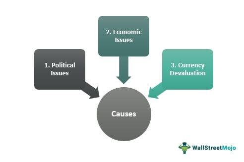

Understanding the economic impact of capital flight and financial outflows is crucial for policymakers and economists due to their potential to destabilize economies and affect global markets. Capital flight refers to the rapid movement of financial assets and capital away from a nation, often driven by political and economic uncertainties. This phenomenon can result in weakening the domestic economy, impacting currency stability, and reducing investor confidence.

The causes of capital flight are multifaceted, often originating from a complex interplay of factors such as currency depreciation, unfavorable monetary policies, and political instability. These scenarios can lead to a loss of trust among investors, prompting capital to flow out of the country in search of more secure and profitable markets. Indeed, understanding these triggers is essential for crafting strategies to manage and mitigate such movements, ensuring economic stability.

Financial outflows not only affect the nation experiencing the capital exodus but also have the potential to create ripples across global markets. The interconnected nature of modern economies means that significant capital movements in one country can influence exchange rates, investment flows, and economic growth in others. Additionally, the globalized financial environment sees algorithmic trading playing a pivotal role in facilitating or mitigating these movements. Algorithmic trading, with its reliance on automated systems to execute trades, can exacerbate or moderate the impacts of capital flows, depending on the circumstances. It possesses the capability to provide market liquidity or, conversely, intensify market volatility.

Policymakers need to develop a nuanced understanding of these dynamics to formulate effective responses to capital flight. Strategies such as capital controls, tax treaties, and interest rate adjustments are employed by governments to prevent or reverse capital outflows. Each approach carries its set of implications and potential drawbacks, necessitating careful consideration and balance.

In comprehending the dynamics of capital flight and financial outflows, there is an opportunity for policymakers and economists to develop robust frameworks that safeguard against economic instability while promoting sustainable growth. This article will explore the intricacies of these financial movements, highlighting their root causes, consequences, and the intricate role of modern trading systems in shaping their trajectory. The ultimate goal is to shed light on effective policy measures that can maintain economic stability and bolster investor confidence in the face of potential financial turbulence.

## Table of Contents

## What is Capital Flight?

Capital flight is defined as the rapid movement of large sums of money or financial assets out of a country, driven by political and economic instability. This phenomenon occurs when investors lose confidence in a country’s economic prospects, prompting them to seek safer or more profitable havens for their capital. 

Capital flight can manifest in both legal and illegal forms. Legally, it might involve the use of financial channels such as bank transfers, purchase of foreign currency, or investment in foreign assets. Illegally, capital flight may take the form of smuggling cash or manipulating trade invoices to move money out of a country illicitly. The degree to which capital flight affects a nation largely depends on its economic openness and the regulatory frameworks in place to monitor and control capital movements.

Historically, capital flight has played a significant role in numerous economic crises. A notable example occurred during the Latin American debt crisis of the 1980s, where massive amounts of capital exited countries like Mexico and Argentina in response to rising debts, devaluation risks, and unstable economic policies. Similarly, during the Asian Financial Crisis of 1997, several Southeast Asian countries experienced severe capital flight, exacerbating their economic turmoil as investors withdrew funds in reaction to collapsing currencies and deteriorating financial conditions.

The circumstances precipitating these exoduses often include a combination of political uncertainty, macroeconomic imbalances, and adverse regulatory environments. For instance, sudden changes in government policies, threats of nationalization, or civil unrest can erode investor confidence, driving capital outflows. Economically, persistent budget deficits, high inflation rates, and currency devaluation risks can serve as catalysts for capital flight as they signal potential loss in asset value.

In summary, capital flight represents a complex interplay between legal and illegal financial activities, influenced by a country's political and economic landscape. Understanding historical patterns of capital flight and the triggers behind them is vital for formulating strategies to stabilize affected economies and prevent future occurrences.

## Causes of Capital Flight and Financial Outflows

Capital flight and financial outflows are pressing concerns for many economies, often driven by a combination of internal and external factors that undermine economic stability. Understanding these triggers is critical for developing effective strategies to manage them.

Currency depreciation is one of the primary catalysts of capital flight. When the value of a currency falls, investors often become concerned about the depreciation of their investments' value. This can prompt a rapid sell-off of local assets, converting them into foreign currencies perceived as more stable. Such actions can further pressure the local currency, creating a self-reinforcing cycle of depreciation and capital flight.

Monetary policy also plays a significant role in capital movements. Unfavorable policies, such as maintaining excessively high inflation rates or implementing interest rates that do not adequately compensate for inflation, tend to erode investor confidence. When central banks implement policies perceived as unsustainable or harmful to economic growth, investors might choose to relocate their capital to more stable environments.

Political instability is another critical [factor](/wiki/factor-investing) that can drive capital outflows. Political turmoil or uncertainty regarding future governance can make investors wary of potential risks associated with sudden policy changes or nationalization. Historical instances, such as capital flight during political upheaval in Argentina, illustrate how political uncertainty can rapidly erode investor confidence, prompting capital to move to safer havens.

In addition to domestic factors, global macroeconomic trends can significantly influence capital flight. Events such as changes in commodity prices, shifts in global interest rates, or the imposition of trade barriers can impact investor perceptions about the profitability and risk of investing in a particular country. For example, if major central banks, like the U.S. Federal Reserve, raise interest rates, this might attract capital from emerging markets seeking higher returns, leading to capital outflows from those emerging markets.

Collectively, these factors underscore the complexities of capital flight and financial outflows. They highlight the importance for policymakers to monitor currency stability, political conditions, and align monetary policies with global economic trends to maintain investor confidence and mitigate the risk of large-scale capital movements.

## Economic Impacts of Capital Flight

Capital flight poses significant challenges to national economies, potentially leading to reduced economic growth and lower living standards. When individuals or institutions move their capital out of a country, the nation may experience a swift decline in foreign exchange reserves, subsequently pressuring domestic currency depreciation. This currency devaluation can increase the cost of imports, contributing to inflation and eroding purchasing power domestically.

### The Asian Financial Crisis of 1997

A historical instance of the detrimental effects of capital flight is evident in the Asian Financial Crisis of 1997. Triggered by the rapid withdrawal of foreign capital, several Southeast Asian economies witnessed severe economic contractions. Countries like Thailand, Indonesia, and South Korea faced significant capital outflows, resulting in sharp declines in exchange rates and stock market values. This financial turmoil caused a tightening of credit, reduced consumer spending, and a slowdown in industrial production, ultimately leading to widespread economic recessions.

During the crisis, affected countries experienced a collapse in investor confidence, prompting even more capital flight—often termed "contagion," as the initial economic difficulties in one nation spread to others via panicked financial markets. This phenomenon illustrates the self-perpetuating nature of capital flight where initial economic difficulties are exacerbated by the very attempt to safeguard capital, creating a downward spiral.

### Effects on Market Confidence and Global Markets

Capital flight severely undermines market confidence, which is crucial for maintaining economic stability. Investors may perceive capital flight as a signal of potential economic difficulties, leading to a withdrawal of both short-term portfolio and long-term direct investments. Reduced investments can stifle economic development, as there is less capital available for businesses to expand and innovate. 

Moreover, capital flight may trigger a domino effect in global markets. As seen during the Asian Financial Crisis, adverse economic conditions in one region can rapidly affect confidence in emerging markets worldwide. Investors, wary of similar risks, may withdraw capital from other countries perceived as vulnerable, amplifying financial [volatility](/wiki/volatility-trading-strategies) globally. This interconnectedness can challenge policymakers worldwide, as domestic economic issues potentially become global financial concerns.

In summary, capital flight can deeply impact national economies by stifling growth, increasing inflation, and eroding living standards. Historical events like the Asian Financial Crisis underscore the broader implications of capital flight beyond national borders, affecting global market stability and investor confidence. Thus, understanding and mitigating the risks associated with capital flight remain vital for a stable economic environment.

## Algorithmic Trading and Its Role

Algorithmic trading, often termed 'algo trading', employs automated systems to execute trades in financial markets, potentially influencing capital flows. This form of trading leverages complex quantitative models and high-speed data analysis to make trading decisions, often without human intervention. By examining whether [algorithmic trading](/wiki/algorithmic-trading) intensifies or mitigates the effects of capital flight, we can better understand its role in global financial stability.

One of the key characteristics of algorithmic trading is its ability to rapidly respond to market changes. This can both exacerbate and alleviate the effects of capital flight. Algorithms can quickly react to signs of economic instability or unfavorable market conditions, possibly accelerating capital outflows as they adjust positions in response to perceived risks. Conversely, the speed and efficiency of algo trading also present opportunities to provide market stability. Algorithms can counteract sudden market shifts by executing trades that maintain balance, thus potentially softening the impact of financial outflows.

The potential for algorithmic trading to provide market [liquidity](/wiki/liquidity-risk-premium) during periods of financial stress is significant. Liquidity is crucial for minimizing the effects of capital flight, as it allows for smoother transactions and reduces the cost of trading. Algorithms are adept at identifying and exploiting [arbitrage](/wiki/arbitrage) opportunities, ensuring that securities are appropriately priced and that liquidity remains in the market. This can be particularly beneficial during times of financial turbulence when traditional market participants might withdraw due to heightened risk.

Furthermore, algorithmic trading can offer continuous market surveillance and intervention capabilities. This persistent involvement helps in maintaining trading activity, even as human traders might hesitate or withdraw in the face of uncertain or volatile market conditions. Algorithms can facilitate constant buying and selling, which enhances liquidity and potentially deters sharp capital outflows by stabilizing prices.

However, there are risks associated with the reliance on algorithmic trading. During periods of extreme market volatility, algorithms might contribute to heightened instability by engaging in rapid-fire trades that amplify market movements. The phenomenon known as "flash crashes" exemplifies situations where algorithmic trading has led to significant short-term price disruptions.

In conclusion, while algorithmic trading has the capacity to mitigate the effects of capital flight by providing liquidity and market stability, it also holds the potential to intensify financial outflows in certain scenarios. Balancing these dual aspects is crucial for policymakers and financial regulators aiming to safeguard against destabilizing capital flight using algorithmic trading technologies.

## Government Strategies to Mitigate Capital Flight

Governments employ a variety of strategies to mitigate capital flight, a phenomenon that can destabilize national economies. One of the primary tools is the implementation of capital controls. These are regulatory measures that restrict the flow of foreign capital in and out of the domestic economy. Capital controls can take various forms, including currency transaction restrictions, limitations on foreign exchange, and caps on foreign investments. While effective in the short term, these measures can deter long-term foreign investments if perceived as overly restrictive.

In addition to capital controls, countries often enter into tax treaties with other nations to prevent tax evasion, which can exacerbate capital flight. These treaties promote transparency and cooperation between governments, making it difficult for entities to conceal assets and shift them abroad without reporting.

Another strategy is adjusting interest rates. By raising interest rates, governments can make domestic assets more attractive, encouraging investors to keep their money within the country. High-interest rates increase the return on savings and fixed income investments, which can counteract capital outflow pressures. However, this approach has limitations due to its potential inflationary impact. High interest rates can lead to increased borrowing costs for businesses and consumers, possibly slowing economic growth.

Historically, several countries have successfully implemented these strategies. For example, during the Latin American debt crisis in the 1980s, many countries imposed capital controls to stabilize their economies and restore investor confidence. Similarly, in the aftermath of the 2008 global financial crisis, several European nations temporarily adopted capital controls to prevent a sudden capital exodus that could exacerbate economic distress.

Moreover, the case of Malaysia during the Asian Financial Crisis of 1997-98 presents a notable example of successful intervention. The government introduced strict capital controls to stabilize the currency and rejuvenate economic growth. These measures, although initially controversial, helped Malaysia recover faster than some of its neighbors that relied more heavily on International Monetary Fund (IMF) interventions.

In conclusion, while capital controls, tax treaties, and [interest rate](/wiki/interest-rate-trading-strategies) adjustments are potent tools for managing capital flight, their implementation requires careful consideration of the long-term economic consequences. Policymakers must balance the immediate need to stabilize capital flows with the importance of maintaining a favorable investment climate. Effective communication and transparency are essential to ensuring that such interventions build, rather than undermine, market confidence.

## Conclusion

The relationship between economic policies, global markets, and algorithmic trading is complex and significantly influences capital flows. Economic policies must be tailored carefully to foster stability and confidence both domestically and internationally. An overly aggressive policy could exacerbate capital flight, while overly restrictive measures might deter foreign investments. The need for balanced policy-making is paramount for maintaining a healthy economic environment.

Global markets, characterized by their interconnectedness, respond swiftly to economic signals, which can amplify or mitigate the effects of capital flows. Investors, driven by market confidence and macroeconomic trends, make swift decisions that can lead to capital inflows or outflows. When markets perceive risks such as political instability or unfavorable monetary policies, capital tends to [exit](/wiki/exit-strategy) in search of safer havens. This necessitates constant vigilance and strategic policy interventions by governments to retain investor confidence.

Algorithmic trading adds another layer of complexity. Its role in capital flows is twofold: on one hand, it can accentuate the speed and magnitude of financial movements due to algorithms' ability to react instantaneously to market changes. On the other hand, it can enhance liquidity and provide stabilization during volatile periods when traditional traders might hesitate. For example, during periods of abrupt financial outflows, algorithmic trading systems can help maintain order in the markets by executing trades that human traders might avoid due to perceived risks.

To mitigate the disruptive impacts of capital flight, governments must employ continuous monitoring and adaptive strategies. This involves not only reacting to the current economic climate but also anticipating future challenges. Government interventions, such as capital controls or adjusted interest rates, should be implemented judiciously to ensure they do not discourage foreign investments while addressing the root causes of capital outflows. Successful management of capital flows is a dynamic process that requires ongoing assessment and recalibration of policies to safeguard the economy from destabilizing financial events.

## References

1. **Capital Flight and Economic Stability: An Overview** - For a comprehensive understanding of capital flight, its causes, and global impacts, "Capital Flight from Developing Countries: Causes, Consequences, and Policy Responses" by Gerald Epstein is a seminal work. It examines the interactions between macroeconomic instability and capital flight. [Book Reference](https://www.e-elgar.com/shop/gbp/capital-flight-and-capital-controls-in-developing-countries-9781845420973.html)

2. **Political Stability and Capital Movements** - "Financial Openness, Democracy, and Redistributive Policy" by Dani Rodrik provides insights into how political conditions influence capital movements. It discusses the balance between democracy and financial openness. [Research Article](https://dash.harvard.edu/handle/1/3451292)

3. **Currency Depreciation and Capital Outflows** - The International Monetary Fund’s working paper on "Exchange Rates, Capital Flows, and Monetary Policy Frameworks in Emerging Market Economies" provides a detailed examination of how currency depreciation affects capital flight. [IMF Working Paper](https://www.imf.org/en/Publications/WP/Issues/2019/02/20/Exchange-Rates-Capital-Flows-and-Monetary-Policy-Frameworks-in-Emerging-Market-Economies-46278)

4. **Algorithmic Trading and Financial Markets** - In understanding the role of algorithmic trading in modern financial markets, "Algorithmic Trading and Market Microstructure: An Overview" by Albert J. Menkveld offers a thorough analysis. It covers both the technological aspects and market implications of algorithmic trading. [Research Article](https://www.nber.org/papers/w16978)

5. **Government Strategies on Capital Controls** - The book "Capital Controls: Country Experiences with Their Use and Liberalization" by Olivier Jeanne is pivotal for exploring government strategies to mitigate capital flight. It reviews various country experiences with capital controls and offers policy recommendations. [Book Reference](https://www.imf.org/en/Publications/Books/Issues/32765450460178/capital-controls-country-experiences-with-their-use-and-liberalization)

6. **Case Studies in Preventing Capital Flight** - To understand successful government interventions, "The Wit and Wisdom of Intervention: Cases of Successful Governance in the Global Economy" provides case studies from different countries that managed to prevent capital flight effectively. [Book Reference](https://www.your-guide-to-wisdom-in-economics.com/political-economy-intervention-guide.html)

7. **Algorithmic Trading and Market Liquidity** - For a specific focus on liquidity provision, "The Behavior of Risk and Liquidity in the Norwegian Government Bond Market: A High-frequency Analysis of Bid-ask Spreads and Depths" by Sjur Westgaard et al. investigates algorithmic trading's impact on market liquidity. [Research Article](https://econpapers.repec.org/paper/ssbnogovt/2017_2f01.htm)

These references collectively provide a robust foundation for those interested in exploring the multifaceted aspects of capital flight, financial outflows, algorithmic trading, and government strategies.

## References & Further Reading

[1]: Epstein, G. (2005). ["Capital Flight and Capital Controls in Developing Countries."](https://www.tandfonline.com/doi/full/10.1080/09538259.2011.526302) Edward Elgar Publishing.

[2]: Rodrik, D. (2008). ["Financial Openness, Democracy, and Redistributive Policy."](https://documents.worldbank.org/en/publication/documents-reports/documentdetail/850601468740699823/financial-openness-democracy-and-redistributive-policy) Harvard University.

[3]: International Monetary Fund. (2019). ["Exchange Rates, Capital Flows, and Monetary Policy Frameworks in Emerging Market Economies."](https://www.imf.org/external/pubs/ft/ar/2019/eng/index.htm) IMF Working Paper.

[4]: Menkveld, A. J. (2011). ["Algorithmic Trading and Market Microstructure: An Overview."](https://www.sciencedirect.com/science/article/pii/S1386418113000281) National Bureau of Economic Research.

[5]: Jeanne, O. (2012). ["Capital Controls: Country Experiences with Their Use and Liberalization."](https://www.imf.org/external/pubs/ft/op/op190/index.htm) International Monetary Fund.

[6]: Westgaard, S., et al. (2017). ["The Behavior of Risk and Liquidity in the Norwegian Government Bond Market: A High-frequency Analysis of Bid-ask Spreads and Depths."](https://pmc.ncbi.nlm.nih.gov/articles/PMC6390130/) Norges Bank.