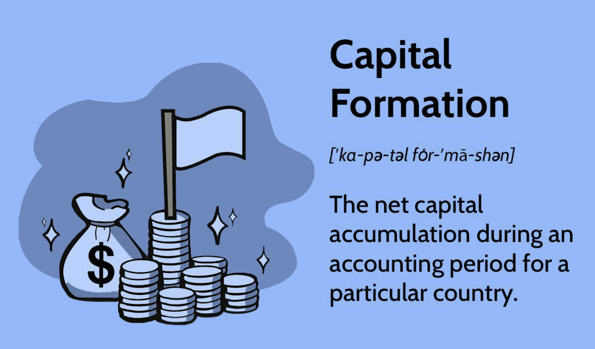

## Table of Contents

## What is capital formation?

Capital formation is the process of building up the amount of capital goods in a country. Capital goods are things like machines, buildings, and tools that businesses use to make products and services. When a country has more capital goods, it can produce more stuff and its economy can grow. Capital formation happens when people save money and then invest that money into building new factories, buying new equipment, or starting new businesses.

For example, if a farmer saves some money and uses it to buy a new tractor, that's capital formation. The tractor helps the farmer grow more crops, which can lead to more income and more savings. Over time, as more and more people save and invest, the total amount of capital in the economy grows. This can lead to more jobs, higher wages, and a higher standard of living for everyone in the country.

## Why is capital formation important for economic growth?

Capital formation is important for economic growth because it helps a country make more things. When businesses have more machines, buildings, and tools, they can produce more goods and services. This means the economy can grow bigger. For example, if a factory gets a new machine that makes it produce twice as many toys, the factory can sell more toys and make more money. This helps the whole economy because more production means more jobs and more income for people.

Also, capital formation leads to better technology and ways of doing things. When businesses invest in new equipment or research, they often find new and better ways to make things. This makes the economy more efficient and can lead to even more growth. For instance, if a company invests in a new computer system that helps them manage their business better, they can save time and money, which they can then use to grow even more. So, capital formation is key to making the economy stronger and helping everyone live better.

## How does capital formation differ from savings?

Capital formation and savings are related but different things. Savings is when people or businesses put money aside instead of spending it right away. It's like keeping money in a piggy bank or a savings account at the bank. Savings is important because it gives people a safety net for emergencies and helps them plan for the future.

Capital formation, on the other hand, is what happens when that saved money is used to buy things that help make more stuff. It's like using the money from the piggy bank to buy a new tool or machine that can help you work faster or make more products. Capital formation is important for the economy because it helps businesses grow and produce more, which can lead to more jobs and a better life for everyone.

## What are the main sources of capital formation?

The main sources of capital formation come from savings and investments. When people save money, they put it aside instead of spending it. This saved money can be put into banks or other places that pay interest. Banks then use these savings to give loans to businesses and people who want to start new projects or buy new equipment. This process turns savings into investments, which helps create new capital like machines, buildings, and tools.

Another source of capital formation is through business profits. When a business makes more money than it spends, it can use those profits to buy new equipment or build new factories. This reinvestment of profits helps the business grow and produce more, which adds to the total capital in the economy. Governments can also play a role by spending money on things like roads, schools, and hospitals, which are all forms of capital that help the economy grow.

Foreign investment is another important source. When companies from other countries invest in a country, they bring in money that can be used to build new factories or buy new equipment. This foreign capital helps increase the total amount of capital in the country and can lead to more jobs and economic growth. So, savings, business profits, government spending, and foreign investment all work together to help with capital formation.

## Can you explain the process of capital formation?

Capital formation happens when people save money and then use that money to buy things that help make more stuff. First, people put their money into savings accounts at banks. The banks then take this saved money and give it to businesses and people as loans. These loans are used to buy new machines, build factories, or start new businesses. For example, a farmer might save some money and then use it to buy a new tractor. The tractor helps the farmer grow more crops, which can lead to more income and more savings.

Another way capital formation happens is when businesses use their profits to buy new things. When a company makes more money than it spends, it can use that extra money to buy new equipment or build new buildings. This helps the business grow and make more products. Governments can also help with capital formation by spending money on things like roads, schools, and hospitals. These things help the economy grow because they make it easier for businesses to work and for people to live better lives. So, capital formation is all about using savings and profits to buy things that help make more stuff and grow the economy.

## What role do financial institutions play in capital formation?

Financial institutions, like banks, are really important for capital formation. They take money from people who save and give it to businesses and people who need it to start new projects or buy new things. When you put money in a savings account, the bank uses that money to give loans to others. This helps turn your savings into new machines, buildings, and tools that businesses use to make more stuff. So, banks help move money from savers to people who can use it to grow the economy.

Another way financial institutions help with capital formation is by making it easier for businesses to get the money they need. Banks offer different types of loans and ways to invest, which helps businesses decide how to use their money best. For example, a bank might give a company a loan to buy a new factory, or help them invest their profits in new technology. By doing this, financial institutions help make sure that money is used in ways that help the economy grow and create more jobs.

## How does government policy affect capital formation?

Government policy can really affect capital formation in a big way. One way is through taxes. If the government makes taxes on savings and investments lower, people and businesses might save and invest more money. This means more money can be used to buy new machines, build new factories, or start new businesses. On the other hand, if taxes are high, people might not want to save as much, and businesses might not want to invest as much, which can slow down capital formation.

Another way government policy affects capital formation is through spending. When the government spends money on things like roads, schools, and hospitals, it's like adding to the country's capital. This helps businesses work better and helps people live better lives, which can lead to more savings and more investment. But if the government doesn't spend enough on these things, or if it spends money in ways that don't help the economy grow, it can make it harder for capital formation to happen. So, what the government does with taxes and spending can make a big difference in how much capital a country can form.

## What is the relationship between capital formation and investment?

Capital formation and investment are closely related. Capital formation happens when people save money and then use that money to buy things that help make more stuff, like machines, buildings, and tools. Investment is when you actually use your savings to buy these things. So, investment is a key part of capital formation. When people invest their savings in new projects or businesses, it helps build up the amount of capital in the economy.

When businesses invest in new equipment or buildings, they can make more products and services. This helps the economy grow because more production means more jobs and more income for people. Governments can also invest in things like roads and schools, which help businesses work better and help people live better lives. So, investment turns savings into new capital, which is important for making the economy stronger and helping everyone live better.

## How does capital formation impact employment?

Capital formation helps create more jobs. When businesses use their savings to buy new machines or build new factories, they can make more stuff. This means they need more workers to help make and sell these things. For example, if a company buys a new machine that makes it produce twice as many toys, it might need to hire more people to work the machine and to sell the extra toys. So, more capital means more jobs for people.

Also, when the government spends money on things like roads and schools, it helps businesses work better. Good roads make it easier for businesses to get their products to stores, and good schools help people learn skills they need for jobs. When businesses can work better, they often grow and need more workers. So, capital formation not only helps businesses make more stuff but also helps create more jobs, which is good for the economy and for people who need work.

## What are the challenges to capital formation in developing countries?

One big challenge to capital formation in developing countries is that people often don't have much money to save. When people are poor, they need to spend almost all their money on food, clothes, and other things they need to live. This means they can't save much, and without savings, there's less money to invest in new machines, factories, or businesses. Also, the banks in these countries might not be very good at taking savings and turning them into loans for businesses. This makes it hard for businesses to get the money they need to grow.

Another challenge is that these countries might not have good laws and rules to help businesses. If the government doesn't make it easy for businesses to start and grow, or if there's a lot of corruption, businesses might not want to invest their money. They might be worried that their money will be taken away or that they won't be able to make a profit. Also, if the country doesn't have good roads, schools, or hospitals, it can be hard for businesses to work well and for people to live good lives. This makes it harder for the country to form new capital and grow its economy.

## How can technology influence capital formation?

Technology can help capital formation by making it easier and cheaper for businesses to make things. When businesses use new technology, like computers or robots, they can make more stuff with less work. This means they can save money and use it to buy more machines or build new factories. For example, if a company uses a new computer system to manage its business better, it can save time and money. This money can then be used to buy more equipment or start new projects, which helps grow the economy.

Technology can also help people save money and invest it in new ways. With the internet, people can put their money into different kinds of investments, like stocks or bonds, from anywhere. This makes it easier for them to save and invest, which is important for capital formation. When more people save and invest, there's more money to be used for building new things and starting new businesses. So, technology can help make the economy stronger by helping with capital formation.

## What advanced metrics are used to measure the effectiveness of capital formation?

To measure how well capital formation is working, economists use some advanced ways of looking at things. One way is by using the Incremental Capital Output Ratio (ICOR). This is a measure that tells us how much new capital, like machines or buildings, is needed to make more stuff. If the ICOR is low, it means that a country can grow its economy with less new capital, which is good. But if the ICOR is high, it means the country needs a lot more capital to grow, which can be a problem.

Another way to check the effectiveness of capital formation is by looking at the Total Factor Productivity (TFP). This measures how well a country uses its capital and labor to make things. If TFP is going up, it means that the country is getting better at using its capital, which can lead to more growth. Economists also look at the Gross Fixed Capital Formation (GFCF) numbers, which show how much money is being spent on new capital each year. If GFCF is growing, it means more money is being used to build new things, which can help the economy grow.

## References & Further Reading

[1]: Aldridge, I. (2013). ["High-Frequency Trading: A Practical Guide to Algorithmic Strategies and Trading Systems."](https://books.google.com/books/about/High_Frequency_Trading.html?id=8QpIsVUMhmEC) John Wiley & Sons.

[2]: Hendershott, T., Jones, C. M., & Menkveld, A. J. (2011). ["Does Algorithmic Trading Improve Liquidity?"](https://onlinelibrary.wiley.com/doi/full/10.1111/j.1540-6261.2010.01624.x) The Journal of Finance, 66(1), 1-33.

[3]: Hasbrouck, J., & Saar, G. (2013). ["Low-Latency Trading."](https://papers.ssrn.com/sol3/papers.cfm?abstract_id=1695460) Journal of Financial Markets, 16(4), 646-679.

[4]: Kirilenko, A. A., Kyle, A. S., Samadi, M., & Tuzun, T. (2017). ["The Flash Crash: The Impact of High-Frequency Trading on an Electronic Market."](https://onlinelibrary.wiley.com/doi/abs/10.1111/jofi.12498) The Journal of Finance, 72(3), 967-998.

[5]: Chan, E. P. (2009). ["Quantitative Trading: How to Build Your Own Algorithmic Trading Business."](https://github.com/ftvision/quant_trading_echan_book) John Wiley & Sons.