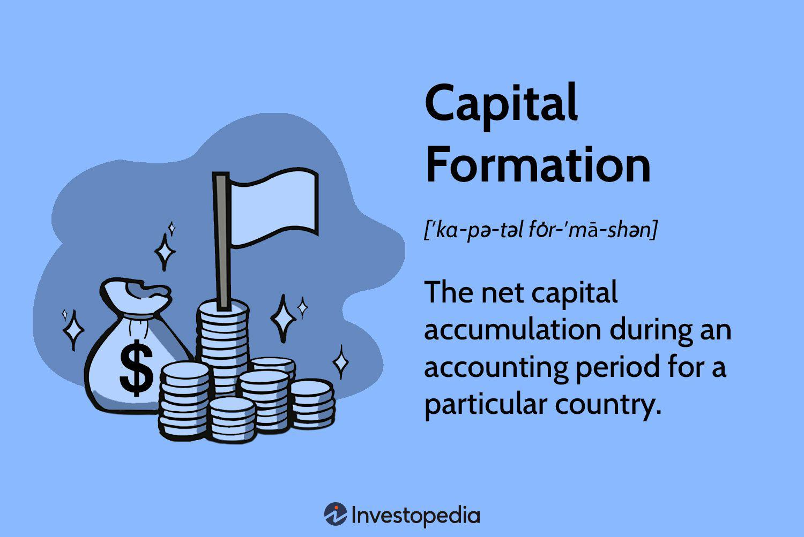

Investment capital formation refers to the process of generating and accumulating capital for future investment, contributing significantly to a nation’s economic productivity and growth. This process involves transforming savings into capital assets such as physical machinery, infrastructure, and technology, which in turn fuels productive activities and economic development. Investment capital is a critical factor in enhancing a country's economic capabilities, facilitating technological advancements, boosting employment, and promoting higher output levels.

Algorithmic trading has emerged as a transformative aspect of modern financial markets. It utilizes computer algorithms and advanced quantitative techniques to execute trading decisions at speeds and volumes that are beyond human capability. This trading method has revolutionized the financial markets by increasing efficiency, lowering transaction costs, and enhancing liquidity. Algorithmic trading facilitates complex trading strategies by analyzing large datasets, identifying trading opportunities, and executing orders with precision.

The interconnection between investment capital formation, economic growth, and algorithmic trading lies in their collective influence on market dynamics. Investment capital formation is pivotal for economic development, providing the necessary means for technological innovations and industrial expansion. Concurrently, algorithmic trading contributes to efficient market functioning, which aids in effective capital allocation—one of the primary drivers of economic growth. By enhancing liquidity and reducing costs, algorithmic trading supports a robust trading environment, thus stimulating investment.

The purpose of this article is to explore the intricate interactions between these elements and their joint contributions to economic development. By examining the role of investment capital formation and algorithmic trading, this article aims to reveal how they can collectively catalyze sustainable economic growth. The structure of the article will include a detailed analysis of investment capital formation, economic growth dynamics, and the impact of algorithmic trading in financial markets. These sections will clarify the synergy between these key elements and offer insights into policy considerations for fostering economic prosperity.

## Table of Contents

## Understanding Investment Capital Formation

Investment capital formation is a crucial economic process that signifies the accumulation of financial resources for future investment. It is a key economic indicator that reflects the ability of an economy to generate funds necessary for enhancing infrastructure, spurring innovation, and achieving long-term economic growth. This process involves transferring savings into productive investments, thus fostering economic development by increasing an economy’s productive capacity and output potential.

Investment capital significantly contributes to infrastructure development, which serves as the backbone of economic activity. Infrastructure investment, such as in transportation, energy, and communication networks, facilitates efficient resource allocation, enhances productivity, and reduces transaction costs across industries. Additionally, capital formation supports innovation by allocating resources toward research and development (R&D), which is essential for technological advancement and competitiveness. By enabling companies to innovate, investment capital increases output and stimulates economic growth in the long run.

The sources of investment capital include domestic savings and foreign direct investment (FDI). Domestic savings, from households and businesses, are critical for providing a stable base of investment capital within a country. These savings can be mobilized through financial intermediaries like banks and capital markets to fund various investments. Foreign direct investment, on the other hand, supplements domestic savings by bringing in external financial resources and expertise, fostering knowledge transfers, and creating job opportunities. FDI often plays a pivotal role in capital formation for developing economies that lack sufficient domestic savings.

However, the process of investment capital formation faces several challenges and opportunities, which vary across different economic environments. In developed economies, challenges such as aging populations and saturated markets may hinder capital accumulation. Conversely, emerging markets might face issues like political instability, inadequate financial infrastructure, and regulatory obstacles impacting their ability to attract and utilize investment capital effectively.

Opportunities for enhancing capital formation include improving financial literacy and access to financial services, which can increase domestic savings rates. Encouraging public-private partnerships and investment-friendly policies can also attract FDI. Innovations in financial technology, such as digital banking and crowdfunding platforms, present additional opportunities by making capital markets more accessible and efficient, thus supporting capital formation.

Overall, investment capital formation is vital for economic prosperity, playing a foundational role in economic growth by enabling infrastructure development, fostering innovation, and increasing productivity. Addressing the challenges and maximizing the opportunities associated with capital formation are essential steps toward achieving sustainable and inclusive economic growth.

## Economic Growth: Drivers and Challenges

Economic growth is a fundamental objective for nations worldwide, directly contributing to improved living standards by increasing the goods and services available to individuals. At its core, economic growth is typically measured by the increase in a country's gross domestic product (GDP) over time, reflecting the economy's enhanced capacity to satisfy the wants and needs of its population.

**Major Drivers of Economic Growth**

Several key factors drive economic growth, including technological innovation, labor force expansion, and capital investment. Technological innovation is perhaps the most significant driver, as it leads to more efficient production processes, new goods and services, and enhanced productivity. Historical examples, like the Industrial Revolution and the Digital Age, highlight how technological advancements can transform economies by creating new industries and optimizing existing ones.

Labor force expansion is another crucial component, encompassing both the quantity and quality of labor. An increase in the labor force can be achieved through population growth, immigration, or higher labor force participation rates. More importantly, improvements in labor quality — made possible through education and training — enhance productivity and spur economic growth.

Capital investment represents another fundamental pillar. Investments in physical capital, such as infrastructure and machinery, as well as human capital, enhance an economy's productive capacity. The accumulation of investment capital enables businesses to expand, innovate, and compete successfully on a global scale, fostering long-term economic growth.

**Challenges to Sustainable Economic Growth**

Despite these drivers, several challenges can hinder sustainable economic growth. One significant challenge is inequality, which can stifle growth by limiting access to education and opportunities for large segments of the population. Unequal resource distribution can lead to inefficiencies and social unrest, challenging the economic stability required for growth.

Resource scarcity poses another threat, as finite natural resources may become excessively depleted or environmentally damaging if managed unsustainably. The pressure to grow economies rapidly can lead to over-exploitation of resources, resulting in economic and environmental consequences that are costly to reverse.

Economic cycles also present challenges, as periods of boom and bust can destabilize economies. Cyclical downturns, characterized by decreased demand and unemployment, reduce economic growth's [momentum](/wiki/momentum) and require careful management to mitigate lasting impacts.

**The Need for Effective Policy Frameworks**

To ensure steady and inclusive economic growth, effective policy frameworks are essential. Governments need to implement policies that promote innovation, enhance labor market efficiency, and encourage investment. This requires creating supportive environments for research and development, fostering educational systems that produce skilled workers, and providing incentives for investment in capital.

Policies should also target inequality reduction, ensuring that economic benefits are widely shared and that marginalized groups have access to the necessary resources and opportunities to participate in the economy. Environmental sustainability must also be a central focus, emphasizing green technologies and sustainable practices to align economic growth with ecological stewardship.

In conclusion, while economic growth holds the promise of enhanced living standards, it must be pursued in a manner that acknowledges and addresses its challenges. By leveraging technological advancement, labor force quality, and capital investment — while implementing policies that promote inclusivity and sustainability — nations can achieve lasting economic prosperity.

## Algorithmic Trading: Revolutionizing Financial Markets

Algorithmic trading, also known as algo trading, refers to the use of computer algorithms to automate trading decisions in financial markets. Over the past few decades, it has significantly altered the landscape of trading by leveraging quantitative models to execute orders at speeds and frequencies beyond human capability.

Algo trading emerged in the late 20th century, with financial institutions adopting automated systems to improve trading efficiency and accuracy. The increased availability of market data and advancements in computer technology catalyzed this evolution. By the 1980s, simple algorithms were executing straightforward tasks such as index fund rebalancing. The 2000s saw a more sophisticated application, including statistical [arbitrage](/wiki/arbitrage) and market-making strategies, leading to the proliferation of high-frequency trading ([HFT](/wiki/high-frequency-trading-strategies)).

The rise of [algorithmic trading](/wiki/algorithmic-trading) has brought several benefits to financial markets. One of the primary advantages is enhanced market efficiency. Algorithms can process vast amounts of data rapidly, allowing for precise price discovery. This speed reduces information asymmetry, ensuring prices more accurately reflect available market information. Algorithms also minimize transaction costs by optimizing the timing of trades and exploiting favorable market conditions, benefiting both individual and institutional investors.

Moreover, algorithmic trading contributes to improved market [liquidity](/wiki/liquidity-risk-premium). The continuous interaction of algorithmic market makers generates a steady stream of buy and sell orders, tightening bid-ask spreads. This liquidity is crucial for reducing the market impact of large trades, as it allows for large volumes to be absorbed without significant price fluctuations.

Despite these advantages, algorithmic trading has faced scrutiny due to its potential risks. One major concern is the risk of market manipulation. Traders might exploit algorithmic strategies to trigger price movements for artificial gains, undermining market integrity. Additionally, the rapid execution associated with algo trading can lead to flash crashes, where prices plummet and recover within minutes, causing temporary market disruptions. Regulatory challenges also arise, as authorities struggle to keep pace with the rapid technological advancements and enforce effective oversight.

The impact of algorithmic trading on investment strategies and capital allocation is profound. Algorithms enable highly sophisticated strategies, such as [statistical arbitrage](/wiki/statistical-arbitrage) and momentum trading, that rely on real-time data analysis and [machine learning](/wiki/machine-learning). These strategies allow traders to identify and exploit subtle market patterns that are inaccessible through manual trading. Consequently, capital is allocated more efficiently, as trades are executed based on objective quantitative criteria rather than subjective judgment.

In summary, algorithmic trading has revolutionized financial markets by enhancing efficiency, reducing costs, and improving liquidity. However, it also presents challenges, including risks of manipulation and regulatory hurdles. The development of robust regulatory frameworks and technological advancements are essential to address these concerns and ensure that the benefits of algorithmic trading are maximized while minimizing potential pitfalls.

## The Synergy Between Capital Formation, Economic Growth, and Algo Trading

Algorithmic trading has emerged as a transformative force in modern financial markets, significantly influencing investment capital formation by enhancing market outcomes and liquidity. At its core, algorithmic trading utilizes complex mathematical models and high-speed computing to execute trades at speeds and frequencies far beyond human capabilities[^1^]. This increased efficiency and precision facilitate better price discovery and market efficiency, ultimately supporting the capital formation process.

### Influence on Capital Formation

Algorithmic trading plays a crucial role in improving market liquidity, which is a key component of capital formation. By providing a continuous flow of buy and sell orders, algorithms help to smooth out price fluctuations and ensure that assets can be bought or sold with minimal cost. This efficiency reduces the barriers for investors to enter and [exit](/wiki/exit-strategy) positions, thereby encouraging investment in various asset classes. Improved liquidity also lowers the transaction costs associated with buying and selling securities, making the markets more attractive to investors, which enhances capital formation[^2^].

### Efficient Capital Allocation

The efficient allocation of capital is another critical aspect where algorithmic trading supports economic growth. Algorithms have the ability to process vast amounts of data to identify potential investment opportunities quickly. This data-driven decision-making process optimizes the allocation of capital across different sectors and industries, directing resources towards high-growth areas and fostering innovation and development. By integrating real-time information and predictive analytics, algorithmic trading enables rapid adjustment to market changes, thus facilitating a more adaptive and responsive capital allocation model.

### Real-World Examples

Several real-world cases illustrate the positive impact of algorithmic trading on market dynamics. Notably, the use of algorithmic trading by large mutual funds and hedge funds has demonstrated significant improvements in trade execution quality. For instance, these entities use algorithms to break large orders into smaller ones, reducing market impact and improving execution prices[^3^]. In volatile markets, algorithms can stabilize price movements by providing liquidity when human traders might hesitate, as observed during certain periods of high market stress.

### Potential Risks and Mitigation

Despite its benefits, algorithmic trading can pose risks such as market manipulation, flash crashes, and systemic instability. Events like the "Flash Crash" of May 6, 2010, where the Dow Jones Industrial Average briefly plummeted before recovering, highlight some of these dangers[^4^]. To mitigate such risks, regulatory bodies are developing measures to enhance market resilience. These include circuit breakers to halt trading during extreme [volatility](/wiki/volatility-trading-strategies) and stricter oversight of high-frequency trading activities. 

Technological advancements also offer solutions for risk mitigation. Improvements in machine learning algorithms and real-time monitoring systems can help detect and prevent potentially harmful trading patterns before they escalate. Moreover, the development of robust risk management frameworks within trading algorithms ensures that trades align with broader market stability goals.

In conclusion, while algorithmic trading significantly enhances market efficiency and capital formation, appropriate regulatory and technological frameworks are essential to mitigate inherent risks. As technology continues to evolve, so too must the strategies and regulations governing its application in financial markets, ensuring that the potential of algorithmic trading is harnessed for sustainable economic growth.

[^1^]: Aldridge, Irene. "High-Frequency Trading: A Practical Guide to Algorithmic Strategies and Trading Systems." John Wiley & Sons, 2013.
[^2^]: Hendershott, Terrence, Charles M. Jones, and Albert J. Menkveld. "Does Algorithmic Trading Improve Liquidity?" *The Journal of Finance* 66.1 (2011): 1-33.
[^3^]: Hasbrouck, Joel, and Gideon Saar. "Low-Latency Trading." *Journal of Financial Markets* 16.4 (2013): 646-679.
[^4^]: Kirilenko, Andrei A., et al. "The Flash Crash: The Impact of High-Frequency Trading on an Electronic Market." *The Journal of Finance* 72.3 (2017): 967-998.

## Policy Implications and Recommendations

### Policy Implications and Recommendations

Enhancing investment capital formation and economic growth requires a comprehensive approach that considers various economic, technological, and regulatory factors. Effective policy frameworks are essential to stimulate and sustain these processes.

#### Key Policy Considerations:

1. **Encouraging Domestic Savings and Investments**:
   Policymakers should create incentives for domestic savings and investments through tax benefits, higher interest rates on savings accounts, and creating a conducive environment for investment funds. Measures such as reducing bureaucratic barriers can also encourage private investments.

2. **Promoting Foreign Direct Investment (FDI)**:
   To boost capital formation, countries should enhance their attractiveness to foreign investors by ensuring political stability, transparent regulations, and policies that protect investors' rights. Streamlining processes for setting up businesses and offering fiscal incentives can also help attract FDI.

3. **Infrastructure Development**:
   Governments should prioritize investments in infrastructure, as it plays a critical role in improving economic productivity and efficiency. This involves investing in transport, energy, and digital infrastructure, creating a multiplier effect across different sectors of the economy.

#### Regulatory Measures for Algorithmic Trading:

1. **Risk Management and Transparency**:
   Regulatory bodies should enforce stringent risk management protocols for algorithmic trading entities to prevent market manipulation and flash crashes. Enhancing transparency by requiring disclosure of trading algorithms’ structure and logic to regulators can help mitigate systemic risks.

2. **Monitoring and Reporting Requirements**:
   Establishing robust monitoring systems to track algorithmic trading activities in real-time and mandating regular reports can deter malicious activities. The use of advanced technologies like machine learning can assist in detecting suspicious patterns that might indicate fraudulent trading behavior.

3. **Adaptive Regulatory Frameworks**:
   As financial technologies evolve, regulatory frameworks should remain flexible and adaptive. This requires continuous dialogue between market participants, technologists, and regulators to update regulations that reflect current market dynamics without stifling innovation.

#### Recommendations for Policymakers:

1. **Education and Training**:
   Invest in education and training programs to equip the financial sector workforce with skills needed to adapt to technological advancements. This enables a balanced integration of technology and human judgment in financial decision-making processes.

2. **Support for Innovation**:
   Governments should provide grants and funding for research and development in financial technologies, promoting innovations that enhance capital allocation efficiency and market liquidity while also ensuring safeguards against associated risks.

3. **Public-Private Partnerships (PPP)**:
   Encourage partnerships between government bodies and private firms to leverage the expertise and resources of both sectors. Such collaborations can accelerate the implementation of technology-driven solutions to enhance market efficiencies and economic growth.

#### Importance of International Cooperation:

The interconnected nature of global financial markets necessitates effective international cooperation. Countries must work together to establish consistent regulatory standards for cross-border trading and capital flows to prevent market distortion and promote global financial stability. International bodies like the Financial Stability Board (FSB) and International Organization of Securities Commissions (IOSCO) can play pivotal roles in facilitating dialogue and coordination between nations to achieve these objectives.

## Conclusion

The intricate relationship between investment capital formation, economic growth, and algorithmic trading underscores a pivotal triad in contemporary economic discourse. Through a deep exploration, we recognize that investment capital formation serves as a cornerstone for fostering sustainable economic growth, by underwriting infrastructure projects, stimulating innovation, and enabling long-term development. The infusion of capital from sources such as domestic savings and foreign direct investments fuels these engines, although varied economic climates present both challenges and opportunities for capital accumulation.

Economic growth hinges on several critical drivers, including technological advancements, labor force expansion, and capital investment. However, realizing its full potential demands navigating complex challenges like inequality, resource scarcity, and the vicissitudes of economic cycles. Algorithmic trading introduces a transformative force in financial markets, enhancing market efficiency, reducing transaction costs, and bolstering liquidity. Despite its benefits, algorithmic trading also presents risks like market manipulation and flash crashes that necessitate vigilant regulatory oversight.

The synergy between these elements highlights how algorithmic trading can facilitate more efficient capital allocation, thereby augmenting capital formation and promoting economic growth. Practical instances of this synergy demonstrate positive impacts, while also warranting measures to mitigate risks through regulation and technological innovation.

In summary, the interconnectedness of investment capital formation, economic growth, and algorithmic trading defines a dynamic ecosystem of mutual influence. The potential of technology-driven financial innovations to accelerate future economic development is immense, inviting a collective call to action. Investors, regulators, and policymakers must collaborate to craft policy frameworks and regulatory measures that not only harness the benefits of these factors but also ensure their sustainable integration. Effective international cooperation remains crucial to regulate cross-border capital flows and trading activities, laying the groundwork for a balanced, sustainable economic future.

## References & Further Reading

[1]: Aldridge, I. (2013). ["High-Frequency Trading: A Practical Guide to Algorithmic Strategies and Trading Systems."](https://books.google.com/books/about/High_Frequency_Trading.html?id=8QpIsVUMhmEC) John Wiley & Sons.

[2]: Hendershott, T., Jones, C. M., & Menkveld, A. J. (2011). ["Does Algorithmic Trading Improve Liquidity?"](https://onlinelibrary.wiley.com/doi/full/10.1111/j.1540-6261.2010.01624.x) The Journal of Finance, 66(1), 1-33.

[3]: Hasbrouck, J., & Saar, G. (2013). ["Low-Latency Trading."](https://papers.ssrn.com/sol3/papers.cfm?abstract_id=1695460) Journal of Financial Markets, 16(4), 646-679.

[4]: Kirilenko, A. A., Kyle, A. S., Samadi, M., & Tuzun, T. (2017). ["The Flash Crash: The Impact of High-Frequency Trading on an Electronic Market."](https://onlinelibrary.wiley.com/doi/abs/10.1111/jofi.12498) The Journal of Finance, 72(3), 967-998.

[5]: Chan, E. P. (2009). ["Quantitative Trading: How to Build Your Own Algorithmic Trading Business."](https://github.com/ftvision/quant_trading_echan_book) John Wiley & Sons.