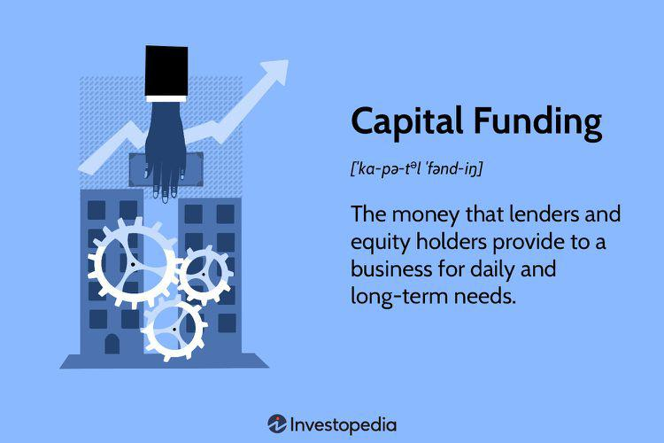

Business financing, capital funding, investment mechanisms, and algorithmic trading are pivotal components in the modern financial landscape. As organizations grow and adapt to changing market conditions, exploring diverse pathways for securing capital and catalyzing growth becomes essential. This article examines these crucial concepts, emphasizing their interaction and the potential they offer to businesses.

In an ever-evolving economic environment, businesses must align their strategic decisions with financial mechanisms that best meet their needs. Business financing and capital funding empower companies to maintain operational continuity, pursue expansion opportunities, and tackle financially intensive initiatives. By integrating investment mechanisms like traditional loans, venture capital, and sophisticated tools such as algorithmic trading, businesses can enhance their strategic positioning and improve financial performance.



Understanding the intricacies of these components is paramount for entrepreneurs and business leaders aiming to optimize financial strategies and drive long-term success. Harnessing the synergy between different financial avenues can lead to innovative business models and competitive advantages in today's complex financial environment. Through careful analysis and informed decision-making, companies can leverage these financial instruments to achieve sustainable growth and operational excellence.

## Table of Contents

## Understanding Business Financing and Capital Funding

Business financing involves the process of acquiring funds necessary to support various operational activities, expansion initiatives, and other significant financial commitments within a company. It is a critical element in ensuring the liquidity necessary for immediate operational requirements as well as for securing long-term strategic growth.

Capital funding encompasses two primary forms: debt and equity financing. Each form plays a crucial role in meeting different types of financial needs. Debt financing includes financial instruments such as loans and bonds. This approach involves borrowing funds that must be repaid over time, typically with interest. The advantage of debt financing is that it allows businesses to retain ownership control since the obligation is to repay the lender rather than relinquish equity. However, the necessity to meet regular interest payments can strain cash flow, especially for businesses with fluctuating revenues or those in the early stages of growth.

In contrast, equity financing involves raising capital by selling company shares. This method does not entail repayment obligations, which can reduce financial burden and improve cash flow flexibility. However, it leads to dilution of ownership and potential loss of control, as new shareholders gain a say in company operations and strategies. The choice between debt and equity financing involves weighing factors such as cost, risk, control, and the company's current financial health.

Evaluating the benefits and drawbacks of each funding mechanism is crucial for businesses when determining their best [course](/wiki/best-algorithmic-trading-courses) of action. Debt financing typically provides tax advantages because interest payments are tax-deductible. Equity financing, on the other hand, can be more attractive in scenarios where cash flow preservation is a priority or in speculative ventures where the value of ownership stakes might significantly increase. 

Businesses must conduct thorough analyses of their financial requirements and growth objectives to decide their optimal funding strategy. This involves understanding their immediate capital needs versus long-term goals and assessing their risk tolerance. A company in an aggressive growth phase might lean towards equity financing to leverage the potential upside of increased valuation, whereas a more established company with steady revenue streams might find debt financing attractive due to its tax advantages and retention of ownership.

In summary, business financing and capital funding are foundational aspects of a company's financial strategy. The decision between debt and equity financing depends on a comprehensive understanding of the company's financial situation, market conditions, and strategic priorities. This decision is pivotal in effectively supporting the financial demands and growth aspirations of a business.

## Investment Mechanisms for Businesses

Investment mechanisms are crucial for businesses aiming to foster growth and enhance financial performance. These mechanisms enable companies to leverage a variety of financial instruments and strategies to raise capital and sustain operations. Among the most prevalent options are traditional bank loans, venture capital (VC), angel investments, and [algorithmic trading](/wiki/algorithmic-trading).

Traditional bank loans are one of the primary sources of business financing. These loans often require businesses to provide collateral and demonstrate creditworthiness. The fixed interest rates and structured repayment schedules make bank loans a predictable financing method. However, their accessibility can be limited, particularly for startups or businesses with insufficient credit history.

Venture capital is a form of private equity financing that investors provide to startups and small businesses with significant growth potential. Unlike bank loans, VC does not require repayment. Instead, venture capitalists acquire equity in the company, which allows them to share in future profits. While venture capital can offer substantial funds, companies must be prepared to cede some control and equity to investors.

Angel investments are similar to venture capital but generally come from affluent individuals rather than professional investment firms. Angels often invest in the early stages of a business, accepting higher risk in exchange for potentially higher returns. These investments are typically more flexible in terms, offering favorable conditions to startups seeking initial funding.

Algorithmic trading represents a more sophisticated approach to investment mechanisms. It employs complex algorithms and trading strategies to automate buying and selling securities. Through rapid data analysis and trade execution, algorithmic trading helps businesses optimize investment returns by capitalizing on market inefficiencies and minimizing transaction costs. This advanced method requires specialized knowledge and infrastructure, making it more suitable for companies with substantial capital and expertise in financial markets.

Choosing the right investment mechanism involves evaluating the business's strategic goals and financial health. An optimal capital structure often balances equity and debt, minimizing the cost of capital and maximizing financial efficiency. For instance, companies might strategically combine debt instruments, like loans, with equity obtained through VC or angel investments to meet diverse objectives.

By carefully selecting and integrating these investment mechanisms, businesses can develop a robust financial strategy that supports their growth and long-term success. It is vital to ensure that these mechanisms align with the company's overall strategy while being adaptable to shifting financial landscapes and opportunities.

## The Role of Algorithmic Trading

Algorithmic trading employs sophisticated algorithms and computational power to execute trades based on predetermined criteria. This method is particularly valued for its ability to process large volumes of data swiftly, minimizing human error and efficiently capturing market opportunities.

One of the primary advantages of algorithmic trading is its capacity to manage vast datasets at high speed. Algorithms can swiftly analyze multiple market variables, such as price movements, [volume](/wiki/volume-trading-strategy), and timing, enabling traders to make informed decisions in milliseconds. This rapid data analysis is crucial in financial markets, where fluctuations can occur in fractions of a second.

The use of algorithmic trading can significantly enhance investment returns. By exploiting rapid market movements, algorithms can identify profitable trading opportunities with precision. For instance, an algorithm might identify a sudden drop in a stock's price as a buying opportunity before the market corrects itself. Such responsiveness leads to better execution of trades, often at more favorable prices. Additionally, algorithmic trading reduces transaction costs by optimizing the timing and size of purchases and sales, thus minimizing slippage and market impact.

Algorithmic trading is increasingly being adopted by both institutional and retail investors. Institutional investors, such as hedge funds and investment banks, leverage algorithmic trading for its ability to handle high-frequency trading ([HFT](/wiki/high-frequency-trading-strategies)) strategies, executed in microseconds, to capitalize on minute price discrepancies across markets. Retail traders benefit from algorithmic platforms that automate trade execution and strategy management, making sophisticated trading tactics accessible to a broader audience.

The adaptability of algorithmic trading systems allows them to cater to various trading strategies, including [market making](/wiki/market-making), statistical [arbitrage](/wiki/arbitrage), and [trend following](/wiki/trend-following). For example, a market-making algorithm might simultaneously place buy and sell orders to profit from the bid-ask spread. A Python implementation could resemble:

```python
def market_making(stock_data):
    bid_price, ask_price = stock_data['bid'], stock_data['ask']
    if ask_price - bid_price > min_spread:
        buy(stock_data['volume'])
        sell(stock_data['volume'])

# Assume stock_data is fetched from a data source and min_spread is predefined
```

The increasing reliance on algorithmic trading necessitates continuous improvements in computational capacity and refinement of algorithms to maintain a competitive edge. As technology evolves, algorithmic trading will likely play an even more prominent role in shaping market dynamics and investment strategies.

## Integrating Algorithmic Trading with Business Finance

Businesses are increasingly looking to leverage algorithmic trading as a strategic component of their financial operations. By integrating algorithmic trading into their broader financial strategy, companies can maximize capital growth and enhance their market positions. This integration can be particularly effective when combined with debt-financed investments, potentially leading to higher returns on investment.

When businesses allocate debt-financed investments toward algorithmic trading operations, they can achieve a better yield by tapping into the rapid and data-driven decision-making processes inherent to algorithmic trading. Algorithmic trading systems utilize complex algorithms and vast computational power to execute trades with high precision and speed, capitalizing on minute market inefficiencies and trends that may be invisible to human traders. This capability can translate into substantial returns, especially when leveraging borrowed capital to amplify investment power.

The synergy between algorithmic trading and capital funding provides a strategic advantage by improving operational efficiencies. By automating the trading process, businesses can significantly reduce transaction costs and minimize the risk of human error. Moreover, algorithmic trading can offer [liquidity](/wiki/liquidity-risk-premium) management and risk management benefits through its ability to analyze vast datasets in real-time and execute trades in a dynamic fashion.

As businesses adopt algorithmic trading, they can gain a competitive edge. The use of data-driven trading strategies allows companies to respond swiftly to market changes, optimize their portfolios, and manage risk more effectively. This results in better financial performance and positions businesses to capitalize on market opportunities more effectively than traditional trading methods.

In conclusion, integrating algorithmic trading with business finance offers companies a pathway to achieving superior financial outcomes. By strategically aligning algorithmic trading operations with capital funding initiatives, businesses can not only improve their investment returns but also enhance their overall competitive standing in today’s fast-paced financial markets.

## Regulatory Considerations and Challenges

Navigating the regulatory landscape is vital for businesses involved in capital markets and algorithmic trading. Compliance with financial regulations is essential as it provides legal safeguarding and ensures the operational integrity of the company. It helps in mitigating risks related to financial fraud, market abuse, and operational failures, which can have severe consequences both legally and financially.

Financial regulations govern aspects such as trading practices, data reporting, and risk management. For example, in the United States, the Securities and Exchange Commission (SEC) enforces regulations to ensure that market participants engage in fair practices. Similarly, the European Securities and Markets Authority (ESMA) oversees the stability of the financial markets within the European Union.

One critical area of concern is the compliance of algorithmic trading strategies with regulations such as the Markets in Financial Instruments Directive II (MiFID II) in Europe, which requires detailed record-keeping of order and transaction data to ensure transparency. The Financial Industry Regulatory Authority (FINRA) in the U.S. has similar mandates requiring extensive records of trade data, which are essential for audits and investigations.

Algorithmic trading firms need to implement robust risk management protocols that involve stress testing and real-time monitoring of trading activities. Compliance monitoring systems can be established using software tools that check for adherence to regulatory requirements, such as limits on order sizes or types of trades executed.

Here is an example of a simple Python compliance monitoring tool that checks for order sizes:

```python
def check_order_size(order_size, max_size=10000):
    if order_size > max_size:
        return "Order size exceeds permitted limit."
    return "Order size is within limit."

# Example usage
order = 12000
result = check_order_size(order)
print(result)  # Output: Order size exceeds permitted limit.
```

It is crucial for companies to stay informed about changes in regulations that can affect their funding and trading strategies. Regulatory bodies frequently update rules to adapt to the evolving market landscape and technological advancements. Failure to comply can result in substantial penalties and damage to a company’s reputation, which can be challenging to recover from. Therefore, ongoing education, regular audits, and collaboration with legal experts are vital for maintaining compliance and upholding the company's integrity in the financial ecosystem.

## Conclusion

The convergence of business financing, capital funding, investment mechanisms, and algorithmic trading offers businesses a distinct set of opportunities to enhance their financial strategies. By strategically leveraging these tools, companies can secure the necessary resources for sustained growth and achieve financial success. To fully exploit these opportunities, businesses must engage in meticulous planning, adhere to regulatory requirements, and maintain ongoing market analysis.

Understanding these dynamics enables companies to tailor their approaches according to evolving market conditions. For instance, algorithmic trading, with its capacity for rapid data processing and execution, can be integrated into a broader financial strategy to optimize investment returns. Simultaneously, discerning between debt and equity financing allows firms to craft a capital structure that aligns with both short-term necessities and long-term objectives.

Additionally, businesses must be vigilant about regulatory considerations, ensuring compliance to protect against legal and financial repercussions. The complexity of modern financial markets necessitates a proactive stance, where continuous analysis and adaptation to regulatory changes are indispensable.

In conclusion, these financial components form a comprehensive framework that can drive efficiencies and competitive edges. Mastery of these elements is crucial for businesses aiming to thrive amid the challenges and opportunities presented in today’s intricate financial landscape.

## References & Further Reading

[1]: Marcos Lopez de Prado. ["Advances in Financial Machine Learning"](https://www.amazon.com/Advances-Financial-Machine-Learning-Marcos/dp/1119482089).

[2]: David Aronson. ["Evidence-Based Technical Analysis: Applying the Scientific Method and Statistical Inference to Trading Signals"](https://www.amazon.com/Evidence-Based-Technical-Analysis-Scientific-Statistical/dp/0470008741).

[3]: Stefan Jansen. ["Machine Learning for Algorithmic Trading"](https://github.com/stefan-jansen/machine-learning-for-trading).

[4]: Ernest P. Chan. ["Quantitative Trading: How to Build Your Own Algorithmic Trading Business"](https://www.amazon.com/Quantitative-Trading-Build-Algorithmic-Business/dp/0470284889).

[5]: J. Bergstra, R. Bardenet, Y. Bengio, and B. Kégl. ["Algorithms for Hyper-Parameter Optimization."](https://dl.acm.org/doi/10.5555/2986459.2986743) Advances in Neural Information Processing Systems 24 (2011).