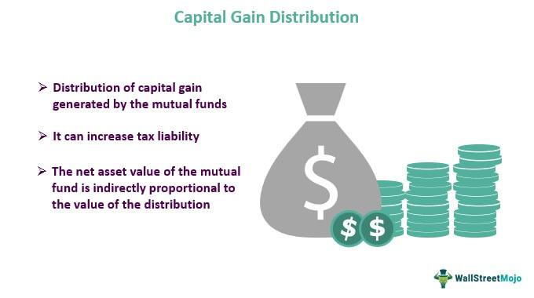

In the world of investing, understanding the nuances of taxation is imperative. One key aspect of this is the capital gains tax, which is imposed on the profit earned from the sale of assets such as stocks, bonds, or real estate. This tax can play a significant role in determining the overall returns from an investment portfolio. The rate at which this tax is applied depends on the duration for which the asset was held, with different treatments for short-term and long-term gains. As a result, careful tax planning is essential to optimize net investment gains after taxes.

Algorithmic trading, which involves using automated systems to execute trades, has become an integral tool for investors. It offers the promise of increased efficiency, precision, and the potential for substantial profits compared to traditional trading methods. By leveraging complex algorithms, investors can automate the decision-making process, allowing trades to occur at speeds and frequencies that are often impossible for human traders to achieve manually.



However, the characteristics of algorithmic trading pose challenges in the context of capital gains taxation. The high frequency and quick turnarounds of trades typical in algo trading can lead to a substantial number of short-term capital gains, which are subject to ordinary income tax rates. This not only increases the tax burden but also introduces a layer of complexity in tax reporting and compliance for investors.

This article examines the intersection of capital gains taxation and algorithmic trading, with the goal of enhancing tax efficiency. By understanding how these elements interact, investors can better navigate the intricacies of capital gains tax in the context of algorithmic trading, thereby aligning their strategies to achieve optimized financial outcomes.

## Table of Contents

## Understanding Capital Gains Taxation

Capital gains tax is an essential consideration for investors because it affects the net returns from the sale of investments. The tax is imposed on the profit earned from selling capital assets, which include stocks, bonds, and real estate. Capital gains can be classified into two categories: short-term and long-term gains, each subject to different tax rates.

Short-term capital gains arise from the sale of assets held for a duration of less than one year. These gains are taxed at ordinary income tax rates, which can be significantly higher than long-term capital gains tax rates. Depending on an investor's income bracket, ordinary income tax rates in the United States can range from 10% to 37% as of 2023.

In contrast, long-term capital gains, resulting from the sale of assets held for more than one year, are subject to preferential tax rates. These rates are considerably lower, with standard rates set at 0%, 15%, or 20%, depending on the individual's taxable income and filing status. The reduced rates for long-term capital gains serve as an incentive for investors to hold onto their investments for a longer period, promoting stability in investment portfolios.

Understanding the classification of capital gains is crucial for strategic tax planning. Investors can leverage these classifications to optimize their investment yields by timing the sale of assets in a way that minimizes their tax liabilities. For instance, by holding an asset for longer than a year, an investor can qualify for the lower long-term capital gains tax rate, potentially saving a significant amount in taxes.

In practice, effective tax planning involves a careful evaluation of the investment holding period and an understanding of the current tax bracket. Investors might schedule the sale of investments to ensure they maximize after-tax returns, particularly if they are transitioning between different income brackets. Additionally, being aware of applicable tax deductions and credits can further enhance tax efficiency.

Overall, understanding the nuances of capital gains taxation allows investors to make informed decisions about the timing and nature of their investment sales, ultimately improving their financial outcomes.

## Algorithmic Trading and Tax Implications

Algorithmic trading utilizes automated systems to execute trades at speeds and frequencies that are often unattainable through manual trading. This methodology is significant for numerous reasons, including its ability to leverage market inefficiencies, minimize human error, and optimize trading strategies based on complex algorithms. However, the nature of [algorithmic trading](/wiki/algorithmic-trading), characterized by rapid and frequent transactions, introduces specific tax implications that traders must navigate carefully.

Foremost among these implications is the increased incidence of short-term capital gains. Typically, algorithmic trading strategies involve the quick buying and selling of securities, often within seconds or minutes. This frequency results in the classification of profits as short-term capital gains, which are taxed at the trader's ordinary income tax rate. The ordinary income tax rate is generally higher than the long-term capital gains tax rate, applied to profits from assets held longer than a year. Thus, the tax burden associated with high-frequency trading can significantly erode net investment returns.

To illustrate, consider a scenario in which a trader uses an algorithm to execute hundreds of trades daily, with the majority of these trades generating a profit. Each transaction resulting in a profit will be subject to short-term capital gains tax, possibly pushing the trader into a higher tax bracket due to the accumulation of these gains. This situation necessitates diligent tax planning to ensure compliance and optimize net returns.

Moreover, algorithmic traders must remain acutely aware of the wash sale rule, a regulation that disallows a tax deduction for a security sold in a wash sale. A wash sale occurs when a security is sold at a loss and repurchased within 30 days. This rule can significantly impact algorithmic traders who frequently trade the same securities, potentially nullifying the benefits of loss generation for tax offset purposes.

Consequently, algorithmic traders need to incorporate tax efficiency into their trading strategy. This involves not only designing algorithms that maximize returns but also recognizing and planning for the tax consequences of trading activity to avoid unexpected liabilities. By doing so, traders can better manage their tax exposure and enhance the overall efficiency of their investment strategy. This delicate balance between trading efficacy and tax implications is crucial to maintaining profitability in algorithmic trading.

## Investment Strategies to Minimize Capital Gains Tax

Investors aiming to enhance tax efficiency in their portfolios can employ several strategies to minimize capital gains tax liabilities. One effective method is tax-loss harvesting, wherein investors sell securities at a loss to offset the capital gains realized from profitable investments. This technique can be particularly beneficial for those engaged in frequent trading activities, as it allows for the reduction of taxable income generated from short-term capital gains, which are taxed at higher rates akin to ordinary income. 

Additionally, holding investments for a period exceeding one year can result in significant tax savings. Long-term capital gains, derived from assets held beyond this period, are subject to reduced tax rates compared to those imposed on short-term gains. This approach not only encourages strategic thinking but also aligns with the long-term investment philosophy advocated by many financial advisors.

Investors can also leverage tax-advantaged accounts, such as Individual Retirement Accounts (IRAs) and 401(k)s, to defer taxes on investment earnings. These accounts allow investors to postpone tax payments until withdrawals are made during retirement, at which point the individual may be in a lower tax bracket, potentially resulting in reduced tax liability. Utilizing these accounts effectively can optimize the growth potential of investments while managing tax responsibilities efficiently.

Furthermore, the strategic use of these investment approaches requires a thorough understanding of the applicable tax regulations and how they interact with specific investment strategies. By carefully planning and implementing these techniques, investors can reduce their capital gains tax burden, thereby enhancing their net returns and overall financial outcomes.

## Balancing Technology with Tax Efficiency

Automated systems in trading have revolutionized how investors manage their portfolios and respond to market variations. These systems not only facilitate efficient trading but also play a crucial role in monitoring tax liabilities that arise from trading activities. By integrating technology with tax planning, investors can enhance their tax efficiency and optimize their net returns.

Automated systems can provide real-time tracking of trades and capital gains, categorizing them into short-term or long-term based on the duration of asset holding. This categorization is essential, as it directly influences the tax rates applicable to the gains. The ability to instantly assess the tax implications of each transaction enables traders to make informed decisions on whether to hold or sell an asset, effectively balancing between profit maximization and tax minimization.

One of the strategies that can be automated is tax-loss harvesting. This involves selling securities at a loss to offset gains from other investments, thereby reducing the overall taxable capital gain. By using Python, investors can develop scripts to automate this process. Here is a simple example in Python:

```python
def tax_loss_harvesting(portfolio):
    for stock in portfolio:
        if stock.current_price < stock.purchase_price:
            print(f"Consider selling {stock.name} to realize a loss for tax purposes.")

# Define a sample portfolio
class Stock:
    def __init__(self, name, purchase_price, current_price):
        self.name = name
        self.purchase_price = purchase_price
        self.current_price = current_price

portfolio = [
    Stock("Stock A", 150, 100),
    Stock("Stock B", 200, 250),
    Stock("Stock C", 300, 250),
]

tax_loss_harvesting(portfolio)
```

The script evaluates a list of stocks and flags those with a current price below their purchase price as potential candidates for tax-loss harvesting. By integrating such automated processes, investors can systematically and effectively manage their tax outcomes.

Moreover, automated tools can project future tax liabilities based on hypothetical trade scenarios, aiding investors in strategic decision making. They can configure trading strategies that minimize short-term gains, subject to higher tax rates, and prioritize long-term gain optimization. This strategic alignment requires a keen understanding of both market dynamics and tax regulations, underscoring the importance of technology in contemporary tax planning.

Ultimately, the seamless integration of automated systems into tax strategy development empowers investors to maintain a balanced approach between leveraging technological advantages and optimizing tax efficiency. This balance is critical in achieving enhanced financial outcomes in an increasingly complex investment landscape.

## Future Trends and Considerations

Algorithmic trading continues to transform the investment landscape, offering efficiency and speed. However, as this practice becomes more widespread, it is essential for investors to stay informed about changes in tax policies that could impact their trading strategies. Tax regulations are not static; they evolve in response to economic changes, government priorities, and technological advancements. This dynamism necessitates that investors remain vigilant and adaptable to maintain tax efficiency.

Proactively adjusting trading strategies is crucial. Investors must monitor legislative developments and anticipate regulatory shifts that could affect capital gains taxation. For instance, modifications in the thresholds for short-term and long-term capital gains could influence decisions regarding the holding periods of assets. Being attuned to such changes allows traders to optimize their strategies, potentially reducing tax liabilities and enhancing net returns.

The role of technology in tax strategy development cannot be understated. Advanced trading platforms equipped with algorithmic capabilities offer automated systems that can track and analyze trading activities in real-time. These systems assist in calculating current tax liabilities and projecting future ones under different market scenarios and tax regimes. Algorithms can be programmed to execute tax-efficient trades, such as harvesting gains strategically when they fall under lower tax rate bands or matching losses against gains to minimize taxable income.

Moreover, ongoing tax education is integral to any investor's toolkit. As tax laws and regulations adapt to digital transformations and economic trends, a foundational understanding of these changes becomes critical. Continuous learning allows investors to not only comply with the law but also harness new opportunities to optimize their tax strategies effectively.

In conclusion, the evolution of algorithmic trading underscores the importance of being informed about potential tax policy changes. By leveraging technology and investing in continuous tax education, investors can proactively adjust their strategies, ensure tax compliance, and enhance their financial outcomes. This adaptive approach will be vital in navigating the complexities of future investment landscapes.

## Conclusion

Algorithmic trading presents both promising opportunities and inherent complexities, particularly in the context of capital gains tax. Automating trades can enhance efficiency and potentially increase returns, but the [high frequency](/wiki/high-frequency-trading) of transactions often leads to a higher incidence of short-term capital gains, which are subject to ordinary income tax rates. Effective tax management within trading activities is crucial not only to maintain compliance with tax regulations but also to optimize financial outcomes.

To achieve this, traders may employ strategies such as tax-loss harvesting and leveraging tax-advantaged accounts to minimize tax liabilities. Automation can also play a key role in monitoring and adjusting trading strategies to align with tax efficiency goals. By maintaining a proactive stance in tax planning and leveraging technological tools, investors can navigate the complexities of tax obligations and enhance their net returns.

Moreover, as algorithmic trading technology continues to evolve, staying abreast of tax policy changes is essential. Investors who are informed and strategic in their approach to tax planning are better positioned to adapt to regulatory adjustments and sustain long-term success in their investment endeavors. By integrating comprehensive tax strategies with advanced trading technologies, investors can effectively address the dual challenges of maximizing returns and managing tax liabilities.

## References & Further Reading

[1]: ["Advances in Financial Machine Learning"](https://www.amazon.com/Advances-Financial-Machine-Learning-Marcos/dp/1119482089) by Marcos Lopez de Prado

[2]: ["Evidence-Based Technical Analysis: Applying the Scientific Method and Statistical Inference to Trading Signals"](https://www.amazon.com/Evidence-Based-Technical-Analysis-Scientific-Statistical/dp/0470008741) by David Aronson

[3]: ["Machine Learning for Algorithmic Trading"](https://github.com/stefan-jansen/machine-learning-for-trading) by Stefan Jansen

[4]: ["Quantitative Trading: How to Build Your Own Algorithmic Trading Business"](https://www.amazon.com/Quantitative-Trading-Build-Algorithmic-Business/dp/1119800064) by Ernest P. Chan

[5]: ["Algorithmic Trading: Winning Strategies and Their Rationale"](https://www.amazon.com/Algorithmic-Trading-Winning-Strategies-Rationale-ebook/dp/B00CY5HC0U) by Ernest P. Chan

[6]: ["Taxation of Securities Transactions"](http://www.securitizationtax.com/detailed_summary.pdf) by Internal Revenue Service (IRS)

[7]: ["The Little Book of Valuation: How to Value a Company, Pick a Stock and Profit"](https://www.amazon.com/Little-Book-Valuation-Company-Profit/dp/1118004779) by Aswath Damodaran