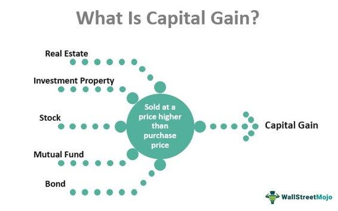

## Table of Contents

## What are capital gains?

Capital gains are the profits you make when you sell something for more than you paid for it. This can happen when you sell things like stocks, bonds, or real estate. If you buy a stock for $100 and later sell it for $150, the $50 difference is your capital gain.

There are two types of capital gains: short-term and long-term. Short-term capital gains are for assets held for one year or less, and they are taxed at your regular income tax rate. Long-term capital gains are for assets held for more than one year, and they usually have a lower tax rate. Knowing the difference can help you plan when to sell your assets to pay less in taxes.

## What is the difference between short-term and long-term capital gains?

Short-term capital gains are the profits you make from selling things like stocks or property that you've owned for one year or less. These gains are added to your regular income and taxed at the same rate as your income tax. This means if you're in a high tax bracket, you'll pay more in taxes on these gains.

Long-term capital gains, on the other hand, are the profits from selling things you've owned for more than one year. These gains have a special lower tax rate, which can be 0%, 15%, or 20%, depending on your income. This lower rate is why many people try to hold onto their investments for over a year before selling, to pay less in taxes.

Understanding the difference between short-term and long-term capital gains can help you make better choices about when to sell your investments. If you can wait a bit longer before selling, you might save a lot on taxes. But, it's also important to consider other factors like the performance of your investment and your financial goals.

## How are capital gains taxed?

Capital gains are taxed based on how long you owned the thing you sold. If you owned it for one year or less, it's called a short-term capital gain. These gains are added to your regular income and taxed at the same rate as your income tax. So, if you make a lot of money, you'll pay more in taxes on these short-term gains.

If you owned the thing for more than one year, it's called a long-term capital gain. These gains have a special lower tax rate. Depending on how much money you make, you could pay 0%, 15%, or 20% on long-term gains. This is why many people try to hold onto their investments for over a year before selling, to pay less in taxes.

It's important to keep track of how long you own your investments because it can save you money on taxes. But, you should also think about other things like how well your investment is doing and what you want to achieve with your money before deciding when to sell.

## What are the tax rates for short-term capital gains?

Short-term capital gains are profits from selling things you owned for one year or less. These gains are added to your regular income and taxed at the same rate as your income tax. This means if you earn a lot of money, you'll pay more taxes on these gains.

The tax rate for short-term capital gains depends on your income tax bracket. For example, if you're in the 10% or 12% tax bracket, your short-term gains will be taxed at that rate. If you're in a higher bracket, like 22%, 24%, 32%, 35%, or 37%, you'll pay that higher rate on your short-term gains. So, it's important to know your income tax bracket to understand how much you'll pay in taxes on these gains.

## What are the tax rates for long-term capital gains?

Long-term capital gains are the profits you make from selling things like stocks or property that you've owned for more than one year. These gains have special tax rates that are usually lower than your regular income tax. The tax rate for long-term capital gains depends on how much money you make each year.

If your income is low, you might not have to pay any taxes on your long-term gains. This means a 0% tax rate. If you make a bit more money, you'll pay 15% on your long-term gains. And if you earn a lot, you'll pay 20%. Knowing these rates can help you plan when to sell your investments to pay less in taxes.

## What types of assets are subject to capital gains tax?

Capital gains tax applies to many types of things you can own and sell for a profit. This includes stocks and bonds, which are common investments that people buy and sell on the stock market. If you buy a stock for $100 and sell it later for $150, the $50 profit is subject to capital gains tax. Real estate is another big one; if you sell your house or a piece of land for more than you paid for it, you'll owe taxes on that profit too.

Other things like art, jewelry, and collectibles can also be subject to capital gains tax if you sell them for a profit. Even things like business assets, like machinery or vehicles, can be taxed if you sell them for more than you paid. It's important to keep track of what you buy and sell because almost anything that goes up in value and is sold can lead to a capital gain that needs to be reported on your taxes.

## Are there any exemptions or deductions available for capital gains?

Yes, there are some ways to reduce or avoid paying taxes on capital gains. One big one is the primary residence exclusion. If you sell your home and it's where you live most of the time, you might not have to pay taxes on up to $250,000 of the profit if you're single, or $500,000 if you're married and file taxes together. You need to have lived in the house for at least two of the last five years to use this rule.

Another way to lower your capital gains tax is by using losses to offset gains. If you sell something for less than you paid for it, that's called a capital loss. You can use these losses to reduce the amount of taxes you owe on your gains. If your losses are more than your gains, you can even use up to $3,000 of that extra loss to lower your regular income tax. Any losses you can't use right away can be saved and used in future years. It's a good idea to talk to a tax professional to make sure you're using all the exemptions and deductions you can.

## How can one calculate capital gains?

To calculate capital gains, you need to know the difference between what you sold something for and what you paid for it. Start by finding out the cost basis, which is usually what you paid to buy the item, including any fees or commissions. Then, subtract the cost basis from the sale price to find your gain. For example, if you bought a stock for $100 and sold it for $150, your capital gain would be $150 - $100 = $50.

After you find out your capital gain, you need to figure out if it's a short-term or long-term gain. If you owned the item for one year or less, it's a short-term gain, and you'll add it to your regular income to be taxed at your income tax rate. If you owned it for more than a year, it's a long-term gain, and you'll use the special long-term capital gains tax rates, which can be 0%, 15%, or 20%, depending on your income. Keeping good records of when you bought and sold things can help you do these calculations accurately and save money on taxes.

## What is the 'wash-sale' rule and how does it affect capital gains?

The wash-sale rule is something the IRS uses to stop people from trying to trick the tax system. It says that if you sell a stock or other thing at a loss and then buy the same or a very similar thing within 30 days before or after the sale, you can't use that loss to lower your taxes right away. This rule is there to make sure people don't sell something just to get a tax break and then quickly buy it back.

If you do a wash sale, you can't claim the loss on your taxes for now. Instead, you add the loss to the cost of the new thing you bought. This means the loss gets pushed to whenever you sell that new thing. It can make things a bit more complicated, but it's important to know about it so you can plan your investments and taxes better.

## How do capital losses offset capital gains?

Capital losses can help you pay less in taxes by offsetting your capital gains. If you sell something for less than you paid for it, that's a capital loss. You can use these losses to reduce the taxes you owe on your capital gains. For example, if you made a $1,000 gain from selling one stock and a $500 loss from selling another, you can subtract the $500 loss from the $1,000 gain. This leaves you with a net gain of $500, and you'll only pay taxes on that amount.

If your capital losses are more than your capital gains, you can use up to $3,000 of the extra loss to lower your regular income tax for the year. Any leftover losses can be carried over to future years. This means you can keep using them to offset gains or income in the future, helping you save on taxes over time. It's a good idea to keep track of your gains and losses so you can make the most of this tax-saving strategy.

## What are the strategies to minimize capital gains tax?

One good way to pay less in capital gains tax is to hold onto your investments for more than a year. When you do this, your gains become long-term capital gains, which are taxed at a lower rate than short-term gains. If your income is low enough, you might even pay no taxes on these gains. Another strategy is to use capital losses to offset your gains. If you sell something at a loss, you can use that loss to reduce the taxes you owe on your gains. If your losses are more than your gains, you can use up to $3,000 of the extra loss to lower your regular income tax.

Another smart move is to take advantage of tax-advantaged accounts like IRAs or 401(k)s. When you sell investments in these accounts, you usually don't have to pay capital gains tax right away. Instead, you might pay taxes when you take money out of the account, and sometimes at a lower rate. Also, if you're selling your home, you might be able to use the primary residence exclusion. This means you won't have to pay taxes on up to $250,000 of the profit if you're single, or $500,000 if you're married and file taxes together, as long as you've lived in the home for at least two of the last five years.

## How do capital gains rules vary internationally?

Capital gains rules can be very different from one country to another. In some countries, like the United States, capital gains are taxed at different rates depending on how long you owned the thing you sold. For example, if you owned it for more than a year, you might pay a lower tax rate. Other countries, like Canada, have a different system where only half of your capital gains are taxed, no matter how long you owned the asset. Some countries, like Singapore, don't tax capital gains at all, which can make them attractive places for investors.

Understanding these differences is important if you invest in different countries. For example, if you live in the U.S. but have investments in Canada, you'll need to know how to report those gains on your U.S. taxes and how they're taxed in Canada. Sometimes, you might have to pay taxes in both countries, but you might also be able to get a credit for the taxes you paid in the other country. It's a good idea to talk to a tax professional who knows about international tax rules to make sure you're doing everything right and not paying more taxes than you need to.

## What is a Case Study and Practical Example?

To illustrate the application of capital gains tax in algorithmic trading, consider a scenario involving an investor, Alex, who employs an algorithmic trading strategy. This strategy primarily focuses on U.S. equities, but also branches into other asset types such as options and cryptocurrencies. The objective is to maximize returns while effectively managing tax liabilities.

### Scenario Overview

Alex's algorithm executes high-frequency trades, characterized by short holding periods. During the fiscal year, his trading algorithm undertook the following transactions:

1. **Stocks**: 
   - **Purchase**: 1,000 shares of Company A at $50 per share.
   - **Sale**: 1,000 shares of Company A at $55 per share within 2 months.

2. **Options**:
   - **Purchase**: 50 call options for Company B at a premium of $2 per option, with a strike price of $100.
   - **Sale**: Exercised the options with the stock trading at $110, and subsequently sold the stock immediately.

3. **Cryptocurrency**:
   - **Purchase**: 2 Bitcoin at $30,000 each.
   - **Sale**: 2 Bitcoin at $35,000 each within 3 months.

### Tax Implications

1. **Stocks**: The profit from the stock transactions is classified as a short-term capital gain due to the holding period being less than one year.
   - **Calculation**:  
$$
     \text{Profit (Stocks)} = (55 - 50) \times 1000 = \$5,000

$$
   - Taxes on short-term capital gains are generally at the ordinary income tax rate, assuming a rate of 24%:  
$$
     \text{Tax (Stocks)} = 0.24 \times 5,000 = \$1,200

$$

2. **Options**: The strategy involving options leads to both intrinsic and time value profits. Here, the options are executed and immediately sold.
   - **Profit Calculation**:
     - Intrinsic value when exercised: $(110 - 100) \times 100 \times 50 = \$50,000$
     - Less the initial premium paid: $2 \times 100 \times 50 = \$10,000$
     - **Net Gain**: $\$50,000 - \$10,000 = \$40,000$
   - **Tax Liability**:  
$$
     \text{Tax (Options)} = 0.24 \times 40,000 = \$9,600

$$

3. **Cryptocurrency**: The gains on Bitcoin are also classified as short-term due to the holding period being under a year.
   - **Calculation**:  
$$
     \text{Profit (Crypto)} = (35,000 - 30,000) \times 2 = \$10,000

$$
   - **Tax on Gains**:  
$$
     \text{Tax (Crypto)} = 0.24 \times 10,000 = \$2,400

$$

### Net Investment Returns and Strategies

The total tax burden for Alex from these activities amounts to $1,200 + $9,600 + $2,400 = $13,200, reducing his net profit from $55,000 (sum of all profits: $5,000 + $40,000 + $10,000) to $41,800.

**Optimization Strategy**:
- **Asset Holding**: Future strategies could involve holding certain assets beyond one year to qualify for long-term capital gains treatment, generally taxed at a lower rate.
- **Diversification**: Incorporating assets that may incur lower tax rates or benefit from tax incentives.
- **Tax-Loss Harvesting**: Introduce losing trades purposefully to offset gains, thereby minimizing overall tax liability.

This practical example demonstrates how algorithmic trading can lead to significant tax obligations, but strategic planning can optimize net returns by effectively managing the timing and nature of transactions.

## References & Further Reading

[1]: IRS. (n.d.). ["Tax Rates on Capital Gains for 2021."](https://www.irs.gov/taxtopics/tc409) Retrieved from https://www.irs.gov/taxtopics/tc409

[2]: IRS. (n.d.). ["Topic No. 409 Capital Gains and Losses."](https://www.irs.gov/taxtopics/tc409) Retrieved from https://www.irs.gov/taxtopics/tc409

[3]: ["Advances in Financial Machine Learning"](https://www.amazon.com/Advances-Financial-Machine-Learning-Marcos/dp/1119482089) by Marcos Lopez de Prado

[4]: ["The Intelligent Investor: The Definitive Book on Value Investing."](https://www.amazon.com/Intelligent-Investor-Third-Definitive-Investing/dp/0063423537) by Benjamin Graham

[5]: ["Algorithmic Trading: Winning Strategies and Their Rationale"](https://www.wiley.com/en-us/Algorithmic+Trading%3A+Winning+Strategies+and+Their+Rationale-p-9781118746912) by Ernie Chan