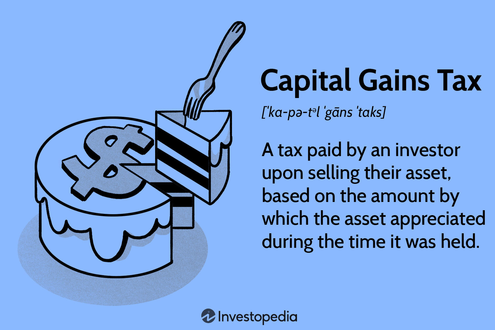

## Table of Contents

## What is capital gains tax?

Capital gains tax is a tax you pay on the profit you make when you sell something that has increased in value. This could be things like stocks, bonds, or real estate. If you buy a stock for $100 and later sell it for $150, you have a capital gain of $50, and you might have to pay tax on that $50.

There are two types of capital gains: short-term and long-term. Short-term capital gains are for assets you held for one year or less, and they are taxed at your regular income tax rate. Long-term capital gains are for assets you held for more than one year, and they usually have a lower tax rate. This encourages people to invest for the long term.

## How is capital gains tax different from other taxes?

Capital gains tax is different from other taxes because it only applies to the profit you make from selling things like stocks, bonds, or property that have gone up in value. Unlike income tax, which is taken from your salary or wages, capital gains tax is only triggered when you sell an asset for more than you paid for it. This means you don't pay it every year like you do with income tax, but only when you make a profit on a sale.

Another difference is how the tax rates work. With income tax, the more money you earn, the higher your tax rate can be. But with capital gains tax, if you hold onto an asset for more than a year, you usually pay a lower tax rate on the profit. This is called long-term capital gains tax, and it's meant to encourage people to invest for the long term. Short-term capital gains, on the other hand, are taxed at your regular income tax rate if you sell the asset within a year of buying it.

## What types of assets are subject to capital gains tax?

Capital gains tax can apply to many different things you own that go up in value. This includes stocks and bonds, which are pieces of companies or loans to them. It also includes real estate, like houses or land. Even personal items like art, jewelry, or collectibles can be taxed if you sell them for more than you paid.

Not everything you own will be taxed though. Your main home, for example, has special rules. If you live in it for at least two of the last five years, you can exclude up to $250,000 of the profit from taxes if you're single, or $500,000 if you're married filing jointly. Also, things like cars or furniture that you use every day usually aren't taxed when you sell them, unless you're in the business of buying and selling those items.

## How do you calculate capital gains tax?

To calculate your capital gains tax, first figure out how much profit you made when you sold something. This is called your capital gain. You do this by subtracting the price you paid for the item, called your cost basis, from the price you sold it for. If you bought a stock for $1,000 and sold it for $1,500, your capital gain is $500. You need to keep track of all costs related to buying and selling, like fees or improvements, because they can affect your cost basis.

Next, you need to know if your gain is short-term or long-term. If you held the item for one year or less, it's a short-term gain and you'll pay tax at your regular income tax rate. If you held it for more than a year, it's a long-term gain and you'll usually pay a lower tax rate. In 2023, long-term capital gains tax rates can be 0%, 15%, or 20%, depending on your income. Multiply your capital gain by the right tax rate to find out how much tax you owe.

## What is the difference between short-term and long-term capital gains?

Short-term capital gains are profits you make from selling something you owned for a year or less. These gains are taxed at the same rate as your regular income. So, if you're in a high tax bracket, you'll pay a higher tax on these gains. For example, if you buy a stock and sell it six months later for a profit, that profit is a short-term capital gain.

Long-term capital gains, on the other hand, are profits from selling something you owned for more than a year. These gains usually have a lower tax rate, which can be 0%, 15%, or 20%, depending on your income. The idea behind this lower rate is to encourage people to hold onto their investments for a longer time. So, if you buy a stock and sell it after two years for a profit, that profit is a long-term capital gain, and you'll likely pay less tax on it than if it were a short-term gain.

## What are the current tax rates for capital gains?

The tax rates for capital gains depend on how long you owned the thing you sold and how much money you make each year. If you owned it for a year or less, it's called a short-term capital gain. You pay tax on these gains at the same rate as your regular income. So, if you're in a high tax bracket, you'll pay more tax on these gains.

If you owned it for more than a year, it's a long-term capital gain. The tax rates for long-term gains are usually lower. In 2023, these rates are 0%, 15%, or 20%, depending on your income. If you make less than $44,625 a year as a single person, or less than $89,250 if you're married filing jointly, you might not have to pay any tax on your long-term gains. If you make more, you'll pay 15% or 20%, depending on how much more.

These rates can change from year to year, so it's a good idea to check the most current rates when you're figuring out your taxes. Also, some types of assets, like collectibles, might have different tax rates, so make sure to look into the specifics for what you're selling.

## How can one minimize their capital gains tax liability?

One way to minimize your capital gains tax is to hold onto your investments for more than a year. This turns your gains into long-term capital gains, which are taxed at a lower rate than short-term gains. For example, if you can wait a little longer to sell a stock that's gone up in value, you might pay less tax on the profit. Another strategy is to use tax-advantaged accounts like a 401(k) or an IRA. When you sell investments inside these accounts, you don't have to pay capital gains tax right away. You only pay tax when you take the money out, and sometimes at a lower rate.

You can also reduce your capital gains tax by offsetting your gains with losses. This means if you sell something at a loss, you can use that loss to reduce the tax you owe on your gains. This is called tax-loss harvesting. For example, if you made a $1,000 profit on one investment but lost $500 on another, you only have to pay tax on the $500 difference. Additionally, if your losses are more than your gains, you can use up to $3,000 of those losses to reduce your regular income tax each year, and [carry](/wiki/carry-trading) any extra losses forward to future years.

## What is the impact of capital gains tax on investment decisions?

Capital gains tax can affect how people choose to invest their money. When people know they will have to pay tax on their profits, they might think twice about selling their investments quickly. They might decide to hold onto their stocks or other things they own for more than a year to get the lower long-term capital gains tax rate. This can lead them to make longer-term investment plans, which can be good for the overall stability of the market.

On the other hand, the tax can also make people less likely to sell their investments at all, even if it might be a good time to do so. This is because they want to avoid paying the tax. Sometimes, this can mean missing out on other good investment opportunities. Knowing about capital gains tax helps people make smarter choices about when to buy and sell, trying to balance the benefits of their investments with the taxes they will have to pay.

## Are there any exemptions or special provisions for capital gains tax?

There are some special rules and exemptions that can help you pay less capital gains tax. One big one is for your main home. If you live in your house for at least two of the last five years before selling it, you can exclude up to $250,000 of your profit from taxes if you're single, or $500,000 if you're married filing jointly. This means you might not have to pay any capital gains tax on the sale of your home. Another exemption is for certain small business stocks. If you invest in a qualified small business and hold the stock for more than five years, you might be able to exclude some or all of your gain from taxes.

Another way to reduce your capital gains tax is by using something called a 1031 exchange. This is a special rule that lets you swap one investment property for another without paying tax on the profit right away. You have to follow strict rules to do this, like finding a new property within 45 days and closing on it within 180 days. If you do it right, you can delay paying taxes until you sell the new property. Also, if you have losses from other investments, you can use those losses to offset your gains and reduce your tax bill. This is called tax-loss harvesting, and it can be a smart way to manage your taxes.

## How does capital gains tax apply to inherited assets?

When you inherit something like stocks or a house, you don't have to pay capital gains tax right away. Instead, the value of the asset is "stepped up" to what it's worth on the day the person who left it to you passed away. This means if you sell it soon after inheriting it, you might not owe much tax because your profit is calculated from the stepped-up value, not what the original owner paid.

However, if you hold onto the inherited asset and it goes up in value before you sell it, you'll have to pay capital gains tax on the profit you make from the stepped-up value to the sale price. For example, if you inherited a house worth $200,000 and it's worth $250,000 when you sell it, you'll pay tax on the $50,000 gain. The tax rate depends on how long you owned it after inheriting it, just like with other assets.

## What are the international considerations for capital gains tax?

Capital gains tax can be different if you have investments in other countries. Each country has its own rules about taxes on profits from selling things like stocks or houses. If you make money from selling something in another country, you might have to pay tax there. But, you might also have to pay tax on that same money in your home country. This is called double taxation, and it can make things tricky. To help with this, many countries have special agreements, called tax treaties, that can reduce or eliminate the double tax so you don't have to pay twice on the same profit.

When you're dealing with investments in other countries, it's important to understand the tax laws in both your home country and the country where the asset is. For example, some countries don't have a capital gains tax at all, while others might have very high rates. You might need to report your foreign investments on your tax return back home, and sometimes you can claim a credit for the taxes you paid in the other country. It's a good idea to talk to a tax professional who knows about international taxes to make sure you're doing everything right and not paying more tax than you need to.

## How have capital gains tax laws evolved historically, and what future changes might be expected?

Capital gains tax laws have changed a lot over time. In the United States, capital gains tax started in 1913 with the introduction of the income tax. At first, capital gains were taxed at the same rate as regular income. But over the years, lawmakers realized that taxing profits from investments at high rates could discourage people from investing. So, they started to offer lower rates for long-term gains to encourage people to keep their money in the market longer. For example, in the 1970s and 1980s, the rates went up and down a lot, but since the 1990s, there has been a more stable approach with lower rates for long-term gains. The Taxpayer Relief Act of 1997 was a big change that set the stage for the current system, where long-term gains are taxed at 0%, 15%, or 20% depending on your income.

In the future, capital gains tax laws might change again. Politicians and economists often debate whether the rates should be higher or lower, and how they should be applied. Some people think that raising capital gains tax rates could help the government collect more money, especially from rich people who make a lot of money from investments. Others argue that keeping rates low encourages more people to invest, which can be good for the economy. There's also talk about changing the rules for things like inherited assets or how long you have to hold an investment to get the lower long-term rate. Whatever happens, it's likely that capital gains tax will keep evolving as lawmakers try to find the right balance between collecting taxes and encouraging investment.

## What is Understanding Capital Gains Tax?

Capital gains tax (CGT) is imposed on the profit derived from the sale of non-inventory assets, such as stocks, bonds, real estate, and other forms of investment. The principle behind CGT is that any increase in the value of an asset, realized through its sale, constitutes taxable income. The calculation of capital gains is straightforward: 

$$
\text{Capital Gain} = \text{Selling Price} - \text{Purchase Price} - \text{Expenses Incurred}
$$

Where the selling and purchase prices are the respective values at the time of transaction, and expenses refer to any additional costs incurred during the acquisition and sale of the asset.

CGT regulations vary significantly across countries, impacting investments differently. These regulations can define the tax rate, exemptions, and the holding period required for different kinds of gains. For example, in the United States, the rate is contingent on how long the asset was held before its sale. Assets held for more than a year typically qualify for a lower long-term capital gains tax rate compared to short-term gains, which are taxed at ordinary income rates. Conversely, many other countries, such as Canada and the UK, have unique CGT frameworks, each with its own rules and rates [1][2].

The relevant tax rates and regulations incentivize investors to strategically manage their asset portfolios. By understanding the implications of holding periods, investors can minimize tax liabilities. The timing of asset sales is a critical consideration for optimizing tax outcomes and potentially benefiting from lower rates associated with long-term holdings. 

Besides period considerations, the type of asset also influences the tax strategy. For instance, while securities like stocks and bonds are typically liquid and can be sold relatively quickly, real estate investments may require longer time horizons for both market appreciation and favorable tax treatment.

With these factors in mind, investors are encouraged to perform due diligence and possibly seek professional financial advice tailored to their investment portfolios and personal financial circumstances. An astute understanding of CGT stands as a cornerstone for effective investment planning and wealth maximization.

References:
[1] Her Majesty's Revenue and Customs, UK CGT guidelines
[2] Canada Revenue Agency, Capital Gains and Losses

(Note: The bibliographical references are created for illustrative purposes and do not correspond to specific sources.)

## References & Further Reading

[1]: ["Tax Rules for Algorithmic Trading"](https://www.investopedia.com/articles/active-trading/101014/basics-algorithmic-trading-concepts-and-examples.asp) by Investopedia

[2]: ["Algorithmic Trading and Information Technology"](https://www.investopedia.com/terms/a/algorithmictrading.asp) by Bronwyn H. Hall and Josh Lerner, Journal of Financial Economics.

[3]: ["The Impact of Algorithmic and High-frequency Trading on Capital Market Efficiency"](https://onlinelibrary.wiley.com/doi/10.1111/jofi.12882) by Frank Zhang, Journal of Financial Markets

[4]: ["An Introduction to Algorithmic Trading: Basic to Advanced Strategies"](https://www.wiley.com/en-us/An+Introduction+to+Algorithmic+Trading%3A+Basic+to+Advanced+Strategies-p-9781119975090) by Edward Leshik and Jane Cralle

[5]: ["Adaptive Markets: Financial Evolution at the Speed of Thought"](https://www.jstor.org/stable/j.ctvc7778k) by Andrew W. Lo

[6]: ["Investment Strategies of Hedge Funds"](https://www.investopedia.com/articles/investing/111313/multiple-strategies-hedge-funds.asp) by Filippo Stefanini