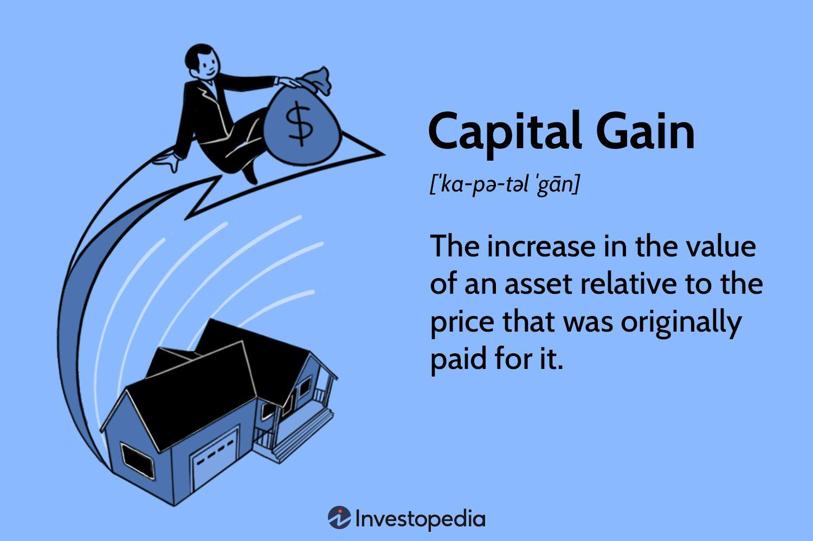

Investing often involves navigating a complex landscape of taxes, with the capital gains tax being one of the most significant considerations for investors. This tax is imposed on the profit realized from the sale of assets and can greatly influence the overall returns on investment. For investors aiming to maximize their returns, understanding the nuances of capital gains tax is essential. 

One of the strategies that both seasoned and new investors utilize to enhance their financial outcomes is algorithmic trading. This method leverages advanced algorithms and technology to automate and optimize trading decisions. However, while algorithmic trading offers potential for increased efficiency and profitability, it also introduces a layer of complexity regarding tax considerations. The frequent buying and selling characteristic of algorithmic trading can result in numerous taxable events, each with its own implications for capital gains tax.



In exploring the interplay between capital gains tax and investment strategies, this article will focus particularly on the impact of algorithmic trading. We'll investigate how investors can effectively navigate tax obligations while maximizing the benefits offered by modern trading technologies. By doing so, investors can enhance their ability to make informed decisions that align with both tax efficiency and financial goals.

## Table of Contents

## Understanding Capital Gains Tax

Capital gains tax (CGT) is imposed on the profit derived from the sale of non-inventory assets, such as stocks, bonds, real estate, and other forms of investment. The principle behind CGT is that any increase in the value of an asset, realized through its sale, constitutes taxable income. The calculation of capital gains is straightforward: 

$$
\text{Capital Gain} = \text{Selling Price} - \text{Purchase Price} - \text{Expenses Incurred}
$$

Where the selling and purchase prices are the respective values at the time of transaction, and expenses refer to any additional costs incurred during the acquisition and sale of the asset.

CGT regulations vary significantly across countries, impacting investments differently. These regulations can define the tax rate, exemptions, and the holding period required for different kinds of gains. For example, in the United States, the rate is contingent on how long the asset was held before its sale. Assets held for more than a year typically qualify for a lower long-term capital gains tax rate compared to short-term gains, which are taxed at ordinary income rates. Conversely, many other countries, such as Canada and the UK, have unique CGT frameworks, each with its own rules and rates [1][2].

The relevant tax rates and regulations incentivize investors to strategically manage their asset portfolios. By understanding the implications of holding periods, investors can minimize tax liabilities. The timing of asset sales is a critical consideration for optimizing tax outcomes and potentially benefiting from lower rates associated with long-term holdings. 

Besides period considerations, the type of asset also influences the tax strategy. For instance, while securities like stocks and bonds are typically liquid and can be sold relatively quickly, real estate investments may require longer time horizons for both market appreciation and favorable tax treatment.

With these factors in mind, investors are encouraged to perform due diligence and possibly seek professional financial advice tailored to their investment portfolios and personal financial circumstances. An astute understanding of CGT stands as a cornerstone for effective investment planning and wealth maximization.

References:
[1] Her Majesty's Revenue and Customs, UK CGT guidelines
[2] Canada Revenue Agency, Capital Gains and Losses

(Note: The bibliographical references are created for illustrative purposes and do not correspond to specific sources.)

## Investment Strategies to Minimize Capital Gains Tax

Investment strategies aimed at minimizing capital gains tax are crucial for investors seeking to enhance their after-tax returns. One such strategy is tax-loss harvesting, which involves selling securities at a loss to offset capital gains realized within the same tax year. By doing this, investors can potentially reduce their taxable income. For instance, if an investor experiences a $10,000 capital gain but realizes a $4,000 loss through tax-loss harvesting, the taxable gain is reduced to $6,000. This approach is subject to regulatory considerations, such as the "wash sale" rule in the United States, which disallows the tax deduction if the same or substantially identical security is repurchased within 30 days.

Another effective strategy is holding investments for more than one year to qualify for long-term capital gains tax rates, which are typically lower than short-term rates. This encourages a buy-and-hold approach, aligning tax efficiency with long-term investment growth. For example, in the U.S., short-term capital gains are taxed at ordinary income rates, whereas long-term gains are taxed at a maximum of 20%, depending on the taxpayer's income bracket. Here is a basic comparison: 

- Short-Term Rate: $\text{Ordinary Income Rate} \approx 37\% \text{ (maximum)}$
- Long-Term Rate: $\max(0\%, 15\%, 20\%)$

Investors can also benefit from using tax-advantaged accounts such as Individual Retirement Accounts (IRAs), 401(k) plans, or Health Savings Accounts (HSAs), which allow for tax-deferred growth or even tax-free withdrawals if certain conditions are met. For example, contributions to a Traditional IRA can be deducted from taxable income, and the investments grow tax-deferred until withdrawal. Roth IRAs, on the other hand, offer no immediate tax deduction but allow for tax-free withdrawals in retirement, provided certain criteria are met.

Tailoring investment strategies in the context of these tax considerations must account for individual investor profiles and financial goals. Factors such as risk tolerance, investment horizon, and income level play significant roles in determining the most beneficial tax strategy. High-net-worth individuals might focus more on estate planning and the timing of capital gains realization, whereas younger investors might prioritize growth within tax-sheltered accounts.

By integrating these strategies, investors can achieve a balance between tax efficiency and overall financial objectives, maximizing their returns while minimizing unnecessary tax liabilities.

## Algorithmic Trading and Its Impact on Tax

Algorithmic trading utilizes automated systems to manage and execute trades, characterized by high speed and substantial [volume](/wiki/volume-trading-strategy). This method of trading can result in frequent transactional activity, each potentially triggering a taxable event. The frequency of such trades presents unique tax implications, particularly for short-term capital gains, which are typically taxed at higher rates compared to long-term capital gains.

In most jurisdictions, short-term capital gains are realized on assets held for a year or less and are taxed at ordinary income tax rates. The rapid turnover of securities in [algorithmic trading](/wiki/algorithmic-trading) often results in gains being classified as short-term, thereby increasing the investor's tax liability. For example, if an investor falls under a tax bracket with a 35% marginal rate, short-term capital gains will also be taxed at this rate. In contrast, long-term capital gains, applicable on assets held for over a year, are taxed at much lower rates, sometimes as low as 0% to 20% depending on the jurisdiction.

Consider the following Python code, which illustrates a basic model for estimating tax liability based on trading outcomes:

```python
def calculate_tax_liability(trades, short_term_tax_rate, long_term_tax_rate):
    short_term_gains = 0
    long_term_gains = 0

    for trade in trades:
        if trade['holding_period'] <= 365:  # short-term if held for a year or less
            short_term_gains += trade['profit']
        else:
            long_term_gains += trade['profit']

    short_term_tax = short_term_gains * short_term_tax_rate
    long_term_tax = long_term_gains * long_term_tax_rate

    total_tax = short_term_tax + long_term_tax
    return total_tax

# Example data
trades = [
    {'profit': 5000, 'holding_period': 100},
    {'profit': 12000, 'holding_period': 400},
    {'profit': 2000, 'holding_period': 250}
]

short_term_tax_rate = 0.35
long_term_tax_rate = 0.15

tax_liability = calculate_tax_liability(trades, short_term_tax_rate, long_term_tax_rate)
print(f"Total Tax Liability: ${tax_liability:.2f}")
```

Algorithmic traders must be especially vigil about these tax implications. Many platforms provide tools and analytics to help traders foresee and manage their tax liabilities. These tools often track the holding periods of various securities and simulate potential tax scenarios based on current or projected trades. Additionally, they may offer features to optimize trading strategies to minimize short-term gains in favor of realizing long-term capital gains, where feasible.

Given the complexity and frequency of trading activity inherent in algorithmic trading, professional advice and advanced tax software might be warranted to ensure compliance and tax efficiency. Integrating such technology with robust tax strategies is essential in optimizing financial outcomes and mitigating the tax impact of dense trading activities.

## Balancing Technology with Tax Efficiency

Automated trading systems have become an essential tool for investors seeking to enhance the efficiency of their investment processes. By automating the execution of trades, these systems can process a significant amount of data quickly and reduce the manual effort required for trading activities. However, the efficiency offered by technology must be balanced with strategic tax planning to optimize net investment returns.

One effective strategy investors can adopt is automating tax-loss harvesting. Tax-loss harvesting is a technique where an investor sells an underperforming asset at a loss to offset capital gains from other investments, thereby reducing the taxable income. By automating this process, investors can systematically assess their portfolio more frequently and take advantage of tax-loss harvesting opportunities on an ongoing basis. For example, an automated system can be programmed to trigger tax-loss harvesting whenever specific criteria are met, such as a predefined price drop in an asset.

```python
def trigger_tax_loss_harvesting(portfolio, loss_threshold):
    for asset in portfolio:
        current_price = get_current_price(asset)
        purchase_price = asset.purchase_price
        if (purchase_price - current_price) / purchase_price >= loss_threshold:
            sell_asset(asset)

def get_current_price(asset):
    # Placeholder function to get the current price of an asset
    return 100  # Example price

def sell_asset(asset):
    # Placeholder function to execute the sale of an asset
    print(f"Selling {asset.name}")

# Example usage
portfolio = [{'name': 'Stock A', 'purchase_price': 120}]
loss_threshold = 0.05  # 5%
trigger_tax_loss_harvesting(portfolio, loss_threshold)
```

Integrating technology with financial planning tools allows for a systematic approach to managing tax liabilities. Technologies such as portfolio management platforms or robo-advisors can provide comprehensive analytics and insights into the tax implications of trading activities. These tools can model different scenarios and help investors understand the tax impact of potential trades, thus enabling informed decision-making.

For investors, understanding how technology and financial planning tools work together is essential for achieving tax-efficient investment outcomes. A holistic approach requires not only implementing automated systems but also having a thorough knowledge of tax laws and regulations, which are crucial for customizing algorithms that align with the strategic financial goals of an investor.

By leveraging these technologies and maintaining a robust tax strategy, investors can optimize their investment returns while minimizing unnecessary tax burdens. As advances in technology continue, the potential for more sophisticated and personalized tax strategies will grow, making it vital for investors to stay updated on both technological innovations and tax law changes.

## Future Trends and Considerations

As algorithmic trading continues to grow in popularity, it is essential for investors to be aware of potential regulatory changes that could impact how capital gains tax is assessed and managed. The dynamic nature of financial markets often necessitates adjustments in tax policies to ensure compliance and fair taxation, particularly in a field as rapidly evolving as algorithmic trading.

Given the pace and volume of transactions in algorithmic trading, governments may consider revising capital gains tax structures to address the unique characteristics of these trades. For instance, the frequent buying and selling could potentially lead to an imposition of higher short-term capital gains taxes. Investors need to monitor these developments to align their trading strategies with any new tax requirements. 

To remain competitive, investors should stay informed about potential reforms in tax policy affecting algorithmic trading and capital gains. This might involve subscribing to financial news services, participating in relevant forums, or consulting with tax professionals who specialize in algorithmic trading. By being proactive, investors can adapt their strategies to minimize tax liabilities and enhance their net returns.

Effective future planning will require more than just keeping pace with technological advancements; it will also necessitate a strategic alignment of tax planning with investment practices. Investors should evaluate their current tax strategies and consider adjustments that could benefit from automated tools or systems designed to optimize tax efficiency. For example, using software that tracks and categorizes trades could help manage and report capital gains more accurately.

In summary, the future landscape of tax management for algorithmic traders will likely involve a blend of staying current with regulatory changes and leveraging technology for strategic tax planning. This proactive approach can lead to minimized tax liabilities while maximizing returns, ensuring that investors remain successful in the face of changing economic and regulatory environments.

## Conclusion

Navigating capital gains tax is a crucial component of successful investment strategy. Investors who incorporate algorithmic trading must pay careful attention to the tax implications that accompany frequent and rapid trading. The profit generated through short-term trades often faces higher tax rates compared to long-term holdings, necessitating an informed approach to tax management. 

Implementing strategic tax planning in tandem with technological tools can lead to improved financial outcomes. For example, understanding the tax code and leveraging technology to automate tax-loss harvesting can effectively minimize tax liabilities. This involves selling securities at a loss to offset gains, which can be particularly advantageous when executed through automated systems capable of processing numerous transactions swiftly.

Staying informed about changes in tax laws and advancements in investment technology is essential. Tax codes are subject to reform, and these changes can significantly impact tax strategy and asset allocation decisions. Moreover, the rapid evolution of trading technologies offers new tools and methods for traders to consider, each with its potential tax considerations. By remaining adaptive and maintaining up-to-date knowledge, investors can better align their financial strategies with regulatory requirements and technological innovations, thereby ensuring sustained success in managing capital gains tax obligations.

## References & Further Reading

[1]: ["Tax Rules for Algorithmic Trading"](https://www.investopedia.com/articles/active-trading/101014/basics-algorithmic-trading-concepts-and-examples.asp) by Investopedia

[2]: ["Algorithmic Trading and Information Technology"](https://www.investopedia.com/terms/a/algorithmictrading.asp) by Bronwyn H. Hall and Josh Lerner, Journal of Financial Economics.

[3]: ["The Impact of Algorithmic and High-frequency Trading on Capital Market Efficiency"](https://onlinelibrary.wiley.com/doi/10.1111/jofi.12882) by Frank Zhang, Journal of Financial Markets

[4]: ["An Introduction to Algorithmic Trading: Basic to Advanced Strategies"](https://www.wiley.com/en-us/An+Introduction+to+Algorithmic+Trading%3A+Basic+to+Advanced+Strategies-p-9781119975090) by Edward Leshik and Jane Cralle

[5]: ["Adaptive Markets: Financial Evolution at the Speed of Thought"](https://www.jstor.org/stable/j.ctvc7778k) by Andrew W. Lo

[6]: ["Investment Strategies of Hedge Funds"](https://www.investopedia.com/articles/investing/111313/multiple-strategies-hedge-funds.asp) by Filippo Stefanini