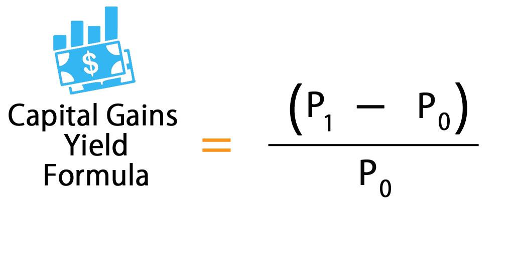

In the modern investment landscape, understanding financial calculations and metrics is essential for achieving optimal investment returns. These calculations and metrics serve as the foundation for making informed decisions and assessing the success of investment strategies. Among these, capital gains yield, investment returns, and the role of algorithmic trading (algo trading) stand out as pivotal components.

Capital gains yield is a key metric that helps investors measure the growth of an investment by looking at the price increase of a security, such as stocks or bonds. It offers insight into how well an investment is performing in terms of appreciation in value. Alongside this, understanding overall investment returns, which include both capital gains and income generated from dividends or interest, is crucial for assessing the complete benefit derived from investments.



Algorithmic trading, often referred to as algo trading, has become an influential force in the financial markets. It involves using computer algorithms to execute trades based on predefined criteria, often resulting in high-frequency trading. This technological advancement has significant implications for investment returns, influencing the way trades are conducted and potentially impacting the capital gains achieved.

This article aims to provide a comprehensive guide to navigating these concepts for better financial decision-making. By examining the intricacies of capital gains yield, evaluating total investment returns, and understanding the impact of algo trading, investors can equip themselves with the knowledge necessary to make strategic decisions. This knowledge is vital for adapting to the dynamic market conditions and optimizing investment outcomes.

## Table of Contents

## Understanding Capital Gains Yield

Capital gains yield represents the percentage increase in the price of an investment security, such as stocks or bonds, compared to its original purchase price. This metric is pivotal for investors aiming to evaluate the performance of their investments over time. It essentially measures the return on investment derived solely from the appreciation in the security's value, excluding any income from dividends or interest.

The capital gains yield is calculated using the formula:

$$
\text{Capital Gains Yield (CGY)} = \frac{P_1 - P_0}{P_0}
$$

where $P_0$ is the original purchase price of the security, and $P_1$ is the current market price.

Understanding capital gains yield is crucial for several reasons:

1. **Performance Measurement**: It provides a clear indicator of how well an investment has performed in terms of price appreciation. Investors can use this metric to compare different investment opportunities or assess the performance of their portfolio over time.

2. **Investment Decision-Making**: Investors use capital gains yield to make informed decisions about buying, holding, or selling securities. A higher capital gains yield can indicate strong price performance, potentially signaling to an investor that a security is worth holding or buying more of.

3. **Risk Assessment**: By analyzing the capital gains yield, investors can assess the risk associated with price volatility. Higher yields often come with increased risk, requiring investors to balance the potential for higher returns against the potential for loss.

4. **Tax Implications**: Capital gains yield also plays a significant role in taxation. In many jurisdictions, realized capital gains (i.e., gains from sold securities) are taxable events. Understanding the capital gains yield helps investors plan for these tax liabilities and consider tax-efficient strategies.

In summary, capital gains yield is an essential metric that helps investors track and compare the potential for price appreciation across different securities, informing their strategies for maximizing returns and balancing risk within their investment portfolios.

## Calculating Capital Gains Yield

The capital gains yield (CGY) is a critical metric for investors seeking to assess the increase in value of an investment, specifically focusing on the price appreciation over a period. This metric excludes dividends or other income, providing a clear view of price performance alone. The formula to calculate the capital gains yield is expressed as:

$$
\text{CGY} = \frac{(P1 - P0)}{P0}
$$

where $P0$ represents the original purchase price of the security, and $P1$ is the current market price.

To see the calculation in practice, consider the following example:

Imagine an investor who purchased a stock at a price $P0 = \$100$. A year later, the stock's price has risen to $P1 = \$120$. To calculate the capital gains yield:

1. Subtract the original purchase price from the current market price:
   \[ P1 - P0 = \$120 - \$100 = \$20
$$

2. Divide this result by the original purchase price:
   \[ \text{CGY} = \frac{\$20}{\$100} = 0.20
$$

3. Convert the result into a percentage, which yields a capital gains yield of 20%.

This example illustrates that the investor achieved a 20% increase in the stock's value over the period, attributed solely to price appreciation.

For more extended scenarios involving multiple transactions or varying prices, Python can provide an efficient way to compute the CGY. Here's a simple code example:

```python
def calculate_cgy(p0, p1):
    return (p1 - p0) / p0

# Example calculation
original_price = 100  # P0
current_price = 120   # P1

cgy = calculate_cgy(original_price, current_price)
print(f"Capital Gains Yield: {cgy * 100:.2f}%")
```

This script defines a function `calculate_cgy` that computes the capital gains yield when provided with the original and current prices. For the given values, it outputs a 20% capital gains yield, aligning with the manual calculation above.

This approach to calculating capital gains yield helps investors independently evaluate the performance of their investments based solely on market price changes, allowing more informed decision-making while distinguishing capital appreciation from other income sources, such as dividends.

## Investment Returns: Total Return vs. Capital Gains Yield

Investment returns are comprised of two fundamental components: capital gains yield and income from dividends or interest. These elements together provide a comprehensive picture of an investor's performance over a given period. 

**Capital Gains Yield** represents the price appreciation of an investment, calculated as the change in the investment's price relative to its original purchase price. It focuses purely on the market value fluctuation of an asset, offering insight into the market-driven component of an investor's return. This yield is crucial for assessing the growth potential of investments, especially in assets like stocks, where price changes can be substantial. 

On the other hand, **Total Return** encompasses capital gains yield and any additional income generated by the investment, such as dividends from stocks or interest payments from bonds. The formula for total return is:

$$
\text{Total Return} = \left(\frac{\text{P1} - \text{P0} + \text{D}}{\text{P0}}\right) \times 100
$$

where:
- $\text{P0}$ is the original purchase price,
- $\text{P1}$ is the current market price,
- $\text{D}$ represents the dividend or interest income received during the holding period.

The inclusion of dividends or interest is vital because it reflects the income-generating capability of an investment, which is particularly significant for income-focused investors. For instance, a stock may show a relatively modest capital gains yield but offer a high dividend yield, resulting in a strong total return figure.

Understanding the distinction between these metrics helps investors tailor their investment strategies according to their financial goals. For example, growth-oriented investors might prioritize capital gains, while income-oriented investors may focus on total return to ensure a steady income stream. Evaluating both capital gains yield and total return offers a holistic view, aiding investors in making well-informed decisions that align with their risk tolerance and investment objectives. 

Assessing overall investment performance through these metrics allows for a nuanced understanding of how different assets contribute to portfolio growth and income, facilitating more strategic asset allocation and financial planning.

## Algorithmic Trading and its Impact on Investment Returns

Algorithmic trading, or algo trading, involves using computer algorithms to automate the execution of trades based on specific rules or strategies. This technological advancement has significantly influenced investment returns, primarily through its impact on trading efficiency, costs, and market dynamics.

### The Role of High-Frequency Trading

High-frequency trading ([HFT](/wiki/high-frequency-trading-strategies)) is a prominent form of [algorithmic trading](/wiki/algorithmic-trading) that leverages speed and computational power to execute a large number of orders in fractions of a second. HFT strategies often aim to capitalize on minute price discrepancies, making them crucial in markets where prices are highly volatile. This rapid trading approach enhances [liquidity](/wiki/liquidity-risk-premium), reduces spreads, and can lead to better price discovery. However, it may increase market [volatility](/wiki/volatility-trading-strategies) and contribute to flash crashes, which can impact investment returns both positively and negatively. The presence of HFT requires traditional investors to adapt by possibly reassessing their strategies and timelines to align with the swift market movements influenced by these algorithms.

### Impact on Capital Gains

Algo trading, particularly HFT, can influence the capital gains of securities by affecting market prices and volumes through its trading activities. The quick turnovers associated with HFT can lead to higher short-term capital gains, which are taxed at a higher rate compared to long-term gains in many jurisdictions. Investors must therefore consider the tax implications of engaging in or competing against these rapid trading strategies.

### Considerations for Taxation

The taxation of capital gains in the context of algo trading varies depending on factors such as trading frequency and holding periods. Frequent trading, characteristic of many algo-driven strategies, often results in short-term capital gains. These gains are typically taxed at ordinary income tax rates, which can diminish net returns compared to long-term capital gains that benefit from preferential rates. Investors utilizing algorithmic strategies need to carefully assess their tax liabilities and explore strategies like tax-loss harvesting to optimize their after-tax returns.

### Balancing Efficiency and Risk

Algorithmic trading systems are designed for efficiency, executing trades far faster than any human trader could. This efficiency can result in optimized entry and [exit](/wiki/exit-strategy) points and reduced transaction costs. However, the reliance on algorithms introduces risks such as technical failures, systematic errors, and unforeseen market impacts. Investors employing algorithmic trading must ensure robust risk management protocols and regularly review algorithms to adapt to evolving market conditions.

In conclusion, algorithmic trading has reshaped the landscape of investment returns, presenting opportunities and challenges. By automating trading strategies, algo trading can enhance efficiency and liquidity but also requires careful consideration of associated risks and tax implications. Investors can benefit from embracing these technologies while maintaining a vigilant approach to managing their investing strategies and tax responsibilities.

## Strategies for Optimizing Investment Returns

Investors seeking to optimize their investment returns can employ various strategies, with tax-loss harvesting and portfolio diversification being among the most effective techniques. These strategies not only enhance an investor's ability to manage capital gains but also improve overall financial performance in a structured manner.

### Tax-Loss Harvesting

Tax-loss harvesting is a strategy designed to minimize an investor’s tax liability on capital gains. This is accomplished by selling underperforming securities at a loss to offset the capital gains realized from other profitable investments. The IRS allows these losses to offset capital gains on a dollar-for-dollar basis, thereby reducing the overall taxable income. In some cases, if the capital loss exceeds the capital gain, the difference can be used to offset up to $3,000 of other taxable income per year, with any remainder carried forward to future tax years.

Implementation of tax-loss harvesting should consider the 'wash-sale rule', which prohibits repurchasing the same or a substantially identical security within 30 days before or after the sale. This rule is intended to ensure that losses claimed are indeed final and not part of a strategy to immediately reacquire the same security.

### Portfolio Diversification

Diversification involves spreading investments across various asset classes, sectors, and geographies to reduce risk and enhance potential returns. By diversifying a portfolio, investors mitigate the impact of volatility, as different asset classes respond differently to economic events. For instance, while equities might suffer during an economic downturn, bonds might perform better, thereby stabilizing the portfolio overall.

A diversified portfolio often includes a mix of stocks, bonds, real estate, and possibly alternative investments such as commodities or hedge funds. The principle behind diversification is that by being exposed to a wider array of investments, investors can potentially achieve a more stable performance over time, reducing reliance on a single asset class's success.

### Understanding Taxation and Regulatory Environments

An essential aspect of optimizing investment returns is understanding the taxation and regulatory environments. Varying tax policies on capital gains and dividends can significantly influence net returns. For example, long-term capital gains are typically taxed at a lower rate than short-term capital gains, incentivizing longer holding periods.

Furthermore, staying informed about changes in regulations, such as modifications in tax codes or new financial regulations, can prepare investors to adjust their strategies accordingly. This awareness aids in compliance and maximizes any available tax efficiencies.

To successfully implement these strategies, investors can leverage financial software or engage professional advisors. Many modern investment platforms provide tools to automate tax-loss harvesting and assess diversification. Adopting such technology can simplify the process of optimizing returns while ensuring compliance with regulatory requirements.

## Conclusion

Effectively managing capital gains yield, understanding investment returns, and leveraging algorithmic trading are key strategies that can significantly enhance financial success. By comprehending and applying these concepts, investors can optimize their portfolios to align with both short-term goals and long-term wealth-building strategies. Capital gains yield, as a critical metric, provides insight into the performance of securities, helping investors make informed decisions based on price appreciations. Simultaneously, parsing total returns, which encompass capital gains and income from dividends or interest, allows for a holistic evaluation of portfolio performance.

Algorithmic trading, with its precision and speed, offers a competitive edge in today's fast-paced markets. By executing trades based on predefined criteria, investors can mitigate human errors and capitalize on fleeting market opportunities. Importantly, understanding the implications of these automated strategies on taxation and regulatory compliance is crucial for maintaining financial efficiency and avoiding potential pitfalls.

To thrive in the ever-changing market landscape, investors are encouraged to remain informed regarding evolving financial trends and regulatory changes. This requires constant education and adaptation of strategies to capitalize on emerging opportunities while managing risks. Equipped with comprehensive knowledge and a proactive approach, investors are better positioned to make strategic, data-driven decisions that significantly enhance their financial outcomes and long-term success.

## References & Further Reading

1. **Capital Gains Yield and Investment Performance**  
   - Bodie, Z., Kane, A., & Marcus, A. J. (2014). *Investments*. McGraw-Hill Education. This textbook provides a comprehensive overview of investment principles, including detailed explanations of capital gains yield.
   - Damodaran, A. (2012). *Investment Valuation: Tools and Techniques for Determining the Value of Any Asset*. Wiley. This book investigates into various valuation methods and the role of capital gains in investment analysis.

2. **Calculating Capital Gains Yield**  
   - Fabozzi, F. J. (2007). *Fixed Income Analysis*. Wiley. Offers insights into calculating capital gains yield in the context of bonds and fixed income securities.
   - Sharpe, W. F. (1994). *The Sharpe Ratio*. Journal of Portfolio Management, 21(1), 49-58. Discusses methods for calculating returns, including capital gains, and evaluating investment performance.

3. **Investment Returns: Total Return vs. Capital Gains Yield**  
   - Malkiel, B. G. (2016). *A Random Walk Down Wall Street: The Time-tested Strategy for Successful Investing*. W.W. Norton & Company. This book evaluates various investment return metrics, including the comparison between total return and capital gains yield.
   - Reilly, F. K., & Brown, K. C. (2011). *Investment Analysis and Portfolio Management*. Cengage Learning. Explores total return calculations and the importance of distinguishing them from capital gains yield.

4. **Algorithmic Trading and its Impact on Investment Returns**  
   - Aldridge, I. (2013). *High-Frequency Trading: A Practical Guide to Algorithmic Strategies and Trading Systems*. Wiley. Provides insights into algorithmic strategies and their implications for capital gains and investment returns.
   - Hendershott, T., & Riordan, R. (2012). Algorithmic trading and the market for liquidity. *Journal of Financial and Quantitative Analysis*, 47(6), 1501-1524. This paper discusses the effects of algorithmic trading on market liquidity and investment returns.

5. **Strategies for Optimizing Investment Returns**  
   - Swensen, D. F. (2009). *Pioneering Portfolio Management: An Unconventional Approach to Institutional Investment*. Free Press. Offers strategies for optimizing investment returns through diversification and effective management of capital gains.
   - Bernstein, W. J. (2001). *The Intelligent Asset Allocator: How to Build Your Portfolio to Maximize Returns and Minimize Risk*. McGraw-Hill. This book discusses strategies like portfolio diversification for optimizing investment returns.

6. **Further Exploration and Academic Sources**  
   - CFA Institute. (n.d.). *CFA Program Curriculum*. The official curriculum covers extensive topics on investment calculations and strategies, providing primary sources for understanding capital gains yield and investment returns.
   - Journal of Finance and Journal of Financial Economics. These journals frequently publish academic papers on investment strategies, capital gains, and the impact of trading technologies like algorithmic trading.

