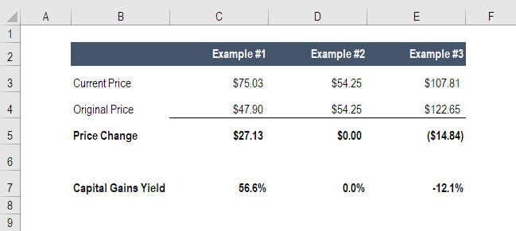

## Table of Contents

## What is capital gains yield?

Capital gains yield is a way to measure how much money you make from an investment just by its price going up. Imagine you buy a stock for $100 and later sell it for $120. The extra $20 you made is your capital gain. To find the capital gains yield, you take that $20 and divide it by the original $100 price, then turn it into a percentage. In this case, the capital gains yield would be 20%.

This measure is important because it helps you see how much your investment has grown in value, not counting any other income like dividends. It's different from total return, which includes both the price increase and any dividends. Capital gains yield focuses only on the price change, so it's a good way to compare how different investments are doing based on their price alone.

## How is capital gains yield different from dividend yield?

Capital gains yield and dividend yield are two ways to look at how much money you're making from an investment, but they focus on different things. Capital gains yield is all about how much the price of your investment, like a stock, has gone up. If you buy a stock and its price increases, that increase is your capital gain. You calculate the capital gains yield by taking the increase in price and dividing it by what you originally paid for the stock, then turning that into a percentage. So, it's a measure of how much your investment has grown just because its value went up.

On the other hand, dividend yield looks at the money you get from an investment without selling it. Many companies pay out part of their profits to their shareholders as dividends. The dividend yield is found by taking the annual dividend payment and dividing it by the price you paid for the stock, then turning that into a percentage. It shows you how much income you're getting from the investment just by holding onto it. While capital gains yield is about the growth in the price of your investment, dividend yield is about the regular payments you receive.

## What is the formula for calculating capital gains yield?

The formula for calculating capital gains yield is pretty simple. You take the increase in the price of your investment and divide it by the original price you paid for it. Then, you turn that number into a percentage. So, if you bought a stock for $100 and it went up to $120, you'd take the $20 increase and divide it by the $100 you paid. That gives you 0.2, which you then multiply by 100 to get a 20% capital gains yield.

This formula helps you see how much your investment has grown just because its price went up. It doesn't include any other money you might get, like dividends. So, if you're looking at how well your stock has done just by looking at its price, this is the number you want. It's a good way to compare different investments based on how their prices have changed.

## Can you provide a simple example of how to calculate capital gains yield?

Let's say you bought a stock for $50, and after a year, the price of that stock went up to $60. To find out the capital gains yield, you need to see how much the price increased. The increase is $60 minus $50, which is $10. Now, you take that $10 increase and divide it by the original price you paid, which was $50. So, $10 divided by $50 gives you 0.2. When you turn that into a percentage, you multiply by 100, and you get a 20% capital gains yield.

This means that just from the price going up, your investment grew by 20%. It's important to remember that this number only looks at the price change and doesn't include any other money you might get, like dividends. If you want to know how much your stock has grown just because its price increased, this is the number you want to use.

## What are the key components needed to calculate capital gains yield?

To calculate capital gains yield, you need to know two main things: the price you originally paid for the investment and the price it's worth now. The first price is called the purchase price, and the second price is the current price. When you know these two numbers, you can figure out how much the price has gone up by subtracting the purchase price from the current price.

Once you have the increase in price, you divide that number by the purchase price. This gives you a decimal number that you can turn into a percentage by multiplying by 100. That percentage is your capital gains yield. It shows you how much your investment has grown just because its price went up, not counting any other money you might get, like dividends.

## How does capital gains yield impact the total return on an investment?

Capital gains yield is a part of the total return on an investment. Total return looks at all the money you make from an investment, including both the increase in its price and any dividends you get. Capital gains yield is just about the price going up. If you buy a stock and its price goes up, that increase is your capital gain. When you add up the capital gains yield with the dividend yield, you get the total return. So, capital gains yield is important because it shows how much of your total return comes from the price going up.

Let's say you bought a stock for $100, and now it's worth $120. The capital gains yield would be 20% because the price went up by $20, which is 20% of $100. If that stock also paid you a $5 dividend during the year, the dividend yield would be 5% (since $5 is 5% of $100). When you add the capital gains yield of 20% and the dividend yield of 5%, you get a total return of 25%. So, the capital gains yield is a big part of the total return, showing how much of your profit comes from the price increase alone.

## What are common mistakes to avoid when calculating capital gains yield?

One common mistake people make when calculating capital gains yield is mixing up the numbers they use. They might use the wrong price for what they paid or what the stock is worth now. It's important to make sure you're using the right numbers. The price you paid is what you use as the starting point, and the price now is what you use to see how much it's gone up. If you get these mixed up, your calculation will be wrong, and you won't know how much your investment really grew.

Another mistake is forgetting to turn the number into a percentage. After you figure out the increase in price and divide it by what you paid, you get a decimal. You have to multiply that decimal by 100 to turn it into a percentage. If you don't do this, your capital gains yield won't make sense because it won't be in the right form. Also, some people might include dividends in their calculation, but capital gains yield is just about the price going up, not about any extra money you get. So, it's important to keep those separate when you're figuring out your capital gains yield.

## How can capital gains yield be used in investment decision-making?

Capital gains yield is a helpful tool when you're trying to decide where to put your money. It tells you how much an investment's price has gone up, which is a big part of how much money you might make. If you're looking at different stocks or other investments, you can use capital gains yield to see which ones have grown the most just because their price went up. This can help you pick investments that have a good chance of making you more money in the future.

But it's not the only thing you should look at. Capital gains yield doesn't tell you about other ways you might make money, like dividends. So, when you're making a decision, you should also think about the total return, which includes both the price going up and any dividends you get. By looking at both capital gains yield and total return, you can get a better idea of which investments might be the best for you.

## What are the tax implications of capital gains yield?

When you make money from an investment because its price goes up, that's called a capital gain. The capital gains yield shows you how much the price went up as a percentage. But when you actually sell the investment and make that gain, you might have to pay taxes on it. The tax you pay depends on how long you held onto the investment before selling it. If you held it for a year or less, it's called a short-term capital gain, and you'll pay taxes on it at your regular income tax rate. If you held it for more than a year, it's a long-term capital gain, and the tax rate is usually lower.

It's important to think about these taxes when you're looking at how much money you're making from an investment. The capital gains yield shows you the growth in price, but the actual money you get to keep after taxes might be less. So, when you're planning your investments, you should consider both the capital gains yield and the taxes you'll have to pay. This way, you can have a better idea of how much you'll really make from your investments.

## How does capital gains yield vary across different types of investments?

Capital gains yield can be different depending on what kind of investment you have. If you're looking at stocks, the capital gains yield shows how much the stock's price has gone up. Stocks can go up a lot in a short time, so their capital gains yield can be high. But other investments, like bonds, usually don't change in price as much. So, the capital gains yield for bonds is often lower. Real estate can also have a capital gains yield, but it depends on how much the property's value goes up over time.

Different investments also come with different risks. Stocks can be risky because their prices can change a lot, which means the capital gains yield can be high but also unpredictable. Bonds are usually safer, so their prices don't change as much, and their capital gains yield is lower but more stable. Real estate can be somewhere in the middle, with the potential for a good capital gains yield if the property value goes up, but it can also take a long time to see that increase. So, when you're thinking about where to put your money, it's good to look at the capital gains yield for different types of investments to see what might work best for you.

## Can you explain how to calculate capital gains yield for a portfolio of investments?

To figure out the capital gains yield for a whole bunch of investments, like a portfolio, you need to look at each investment one by one. First, find out how much the price of each investment went up. You do this by taking the current price and subtracting the price you paid for it. Then, you divide that increase by the price you paid and turn it into a percentage. That's the capital gains yield for each investment. Do this for every investment in your portfolio.

Once you have the capital gains yield for each investment, you add them all up to see the total increase in price for your whole portfolio. But, you need to think about how much of your money is in each investment. If you have more money in one investment than another, that one will have a bigger impact on your total capital gains yield. To get the overall capital gains yield for your portfolio, you take the total increase in value and divide it by the total amount you paid for all your investments, then turn that into a percentage. This way, you can see how much your whole portfolio grew just because the prices went up.

## What advanced strategies can be employed to optimize capital gains yield?

One way to make your capital gains yield better is by [picking](/wiki/asset-class-picking) the right times to buy and sell your investments. If you think a stock's price is going to go up a lot soon, you might want to buy it now. If you think it's going to go down, you might want to sell it before that happens. This is called timing the market. It can be hard to get right, but if you do it well, you can make more money from the price going up. Another thing you can do is look at what's happening in the world and how it might affect the prices of your investments. For example, if a company is about to release a new product that everyone wants, its stock price might go up. By keeping an eye on these things, you can buy and sell at the best times.

Another strategy is to spread your money around in different kinds of investments. This is called diversification. If you put all your money in one stock and its price goes down, you might lose a lot. But if you have money in different stocks, bonds, and maybe even real estate, the price of one going down won't hurt as much. This way, you can still make money from the prices of some of your investments going up, even if others go down. Also, you can look at how much risk you're willing to take. If you're okay with taking more risk, you might put more money into stocks that could go up a lot, but they could also go down a lot. If you want to be safer, you might put more money into bonds, which usually don't change in price as much. By balancing these things, you can try to make your capital gains yield as good as it can be.

## What is Capital Gains Yield?

Capital gains yield represents the percentage increase in the price of an investment security, such as stocks or bonds, compared to its original purchase price. This metric is pivotal for investors aiming to evaluate the performance of their investments over time. It essentially measures the return on investment derived solely from the appreciation in the security's value, excluding any income from dividends or interest.

The capital gains yield is calculated using the formula:

$$
\text{Capital Gains Yield (CGY)} = \frac{P_1 - P_0}{P_0}
$$

where $P_0$ is the original purchase price of the security, and $P_1$ is the current market price.

Understanding capital gains yield is crucial for several reasons:

1. **Performance Measurement**: It provides a clear indicator of how well an investment has performed in terms of price appreciation. Investors can use this metric to compare different investment opportunities or assess the performance of their portfolio over time.

2. **Investment Decision-Making**: Investors use capital gains yield to make informed decisions about buying, holding, or selling securities. A higher capital gains yield can indicate strong price performance, potentially signaling to an investor that a security is worth holding or buying more of.

3. **Risk Assessment**: By analyzing the capital gains yield, investors can assess the risk associated with price volatility. Higher yields often come with increased risk, requiring investors to balance the potential for higher returns against the potential for loss.

4. **Tax Implications**: Capital gains yield also plays a significant role in taxation. In many jurisdictions, realized capital gains (i.e., gains from sold securities) are taxable events. Understanding the capital gains yield helps investors plan for these tax liabilities and consider tax-efficient strategies.

In summary, capital gains yield is an essential metric that helps investors track and compare the potential for price appreciation across different securities, informing their strategies for maximizing returns and balancing risk within their investment portfolios.

## How do you calculate capital gains yield?

The capital gains yield (CGY) is a critical metric for investors seeking to assess the increase in value of an investment, specifically focusing on the price appreciation over a period. This metric excludes dividends or other income, providing a clear view of price performance alone. The formula to calculate the capital gains yield is expressed as:

$$
\text{CGY} = \frac{(P1 - P0)}{P0}
$$

where $P0$ represents the original purchase price of the security, and $P1$ is the current market price.

To see the calculation in practice, consider the following example:

Imagine an investor who purchased a stock at a price $P0 = \$100$. A year later, the stock's price has risen to $P1 = \$120$. To calculate the capital gains yield:

1. Subtract the original purchase price from the current market price:
   \[ P1 - P0 = \$120 - \$100 = \$20
$$

2. Divide this result by the original purchase price:
   \[ \text{CGY} = \frac{\$20}{\$100} = 0.20
$$

3. Convert the result into a percentage, which yields a capital gains yield of 20%.

This example illustrates that the investor achieved a 20% increase in the stock's value over the period, attributed solely to price appreciation.

For more extended scenarios involving multiple transactions or varying prices, Python can provide an efficient way to compute the CGY. Here's a simple code example:

```python
def calculate_cgy(p0, p1):
    return (p1 - p0) / p0

# Example calculation
original_price = 100  # P0
current_price = 120   # P1

cgy = calculate_cgy(original_price, current_price)
print(f"Capital Gains Yield: {cgy * 100:.2f}%")
```

This script defines a function `calculate_cgy` that computes the capital gains yield when provided with the original and current prices. For the given values, it outputs a 20% capital gains yield, aligning with the manual calculation above.

This approach to calculating capital gains yield helps investors independently evaluate the performance of their investments based solely on market price changes, allowing more informed decision-making while distinguishing capital appreciation from other income sources, such as dividends.

## What is the difference between Total Return and Capital Gains Yield in investment returns?

Investment returns are comprised of two fundamental components: capital gains yield and income from dividends or interest. These elements together provide a comprehensive picture of an investor's performance over a given period. 

**Capital Gains Yield** represents the price appreciation of an investment, calculated as the change in the investment's price relative to its original purchase price. It focuses purely on the market value fluctuation of an asset, offering insight into the market-driven component of an investor's return. This yield is crucial for assessing the growth potential of investments, especially in assets like stocks, where price changes can be substantial. 

On the other hand, **Total Return** encompasses capital gains yield and any additional income generated by the investment, such as dividends from stocks or interest payments from bonds. The formula for total return is:

$$
\text{Total Return} = \left(\frac{\text{P1} - \text{P0} + \text{D}}{\text{P0}}\right) \times 100
$$

where:
- $\text{P0}$ is the original purchase price,
- $\text{P1}$ is the current market price,
- $\text{D}$ represents the dividend or interest income received during the holding period.

The inclusion of dividends or interest is vital because it reflects the income-generating capability of an investment, which is particularly significant for income-focused investors. For instance, a stock may show a relatively modest capital gains yield but offer a high dividend yield, resulting in a strong total return figure.

Understanding the distinction between these metrics helps investors tailor their investment strategies according to their financial goals. For example, growth-oriented investors might prioritize capital gains, while income-oriented investors may focus on total return to ensure a steady income stream. Evaluating both capital gains yield and total return offers a holistic view, aiding investors in making well-informed decisions that align with their risk tolerance and investment objectives. 

Assessing overall investment performance through these metrics allows for a nuanced understanding of how different assets contribute to portfolio growth and income, facilitating more strategic asset allocation and financial planning.

## References & Further Reading

1. **Capital Gains Yield and Investment Performance**  
   - Bodie, Z., Kane, A., & Marcus, A. J. (2014). *Investments*. McGraw-Hill Education. This textbook provides a comprehensive overview of investment principles, including detailed explanations of capital gains yield.
   - Damodaran, A. (2012). *Investment Valuation: Tools and Techniques for Determining the Value of Any Asset*. Wiley. This book investigates into various valuation methods and the role of capital gains in investment analysis.

2. **Calculating Capital Gains Yield**  
   - Fabozzi, F. J. (2007). *Fixed Income Analysis*. Wiley. Offers insights into calculating capital gains yield in the context of bonds and fixed income securities.
   - Sharpe, W. F. (1994). *The Sharpe Ratio*. Journal of Portfolio Management, 21(1), 49-58. Discusses methods for calculating returns, including capital gains, and evaluating investment performance.

3. **Investment Returns: Total Return vs. Capital Gains Yield**  
   - Malkiel, B. G. (2016). *A Random Walk Down Wall Street: The Time-tested Strategy for Successful Investing*. W.W. Norton & Company. This book evaluates various investment return metrics, including the comparison between total return and capital gains yield.
   - Reilly, F. K., & Brown, K. C. (2011). *Investment Analysis and Portfolio Management*. Cengage Learning. Explores total return calculations and the importance of distinguishing them from capital gains yield.

4. **Algorithmic Trading and its Impact on Investment Returns**  
   - Aldridge, I. (2013). *High-Frequency Trading: A Practical Guide to Algorithmic Strategies and Trading Systems*. Wiley. Provides insights into algorithmic strategies and their implications for capital gains and investment returns.
   - Hendershott, T., & Riordan, R. (2012). Algorithmic trading and the market for liquidity. *Journal of Financial and Quantitative Analysis*, 47(6), 1501-1524. This paper discusses the effects of algorithmic trading on market liquidity and investment returns.

5. **Strategies for Optimizing Investment Returns**  
   - Swensen, D. F. (2009). *Pioneering Portfolio Management: An Unconventional Approach to Institutional Investment*. Free Press. Offers strategies for optimizing investment returns through diversification and effective management of capital gains.
   - Bernstein, W. J. (2001). *The Intelligent Asset Allocator: How to Build Your Portfolio to Maximize Returns and Minimize Risk*. McGraw-Hill. This book discusses strategies like portfolio diversification for optimizing investment returns.

6. **Further Exploration and Academic Sources**  
   - CFA Institute. (n.d.). *CFA Program Curriculum*. The official curriculum covers extensive topics on investment calculations and strategies, providing primary sources for understanding capital gains yield and investment returns.
   - Journal of Finance and Journal of Financial Economics. These journals frequently publish academic papers on investment strategies, capital gains, and the impact of trading technologies like algorithmic trading.

