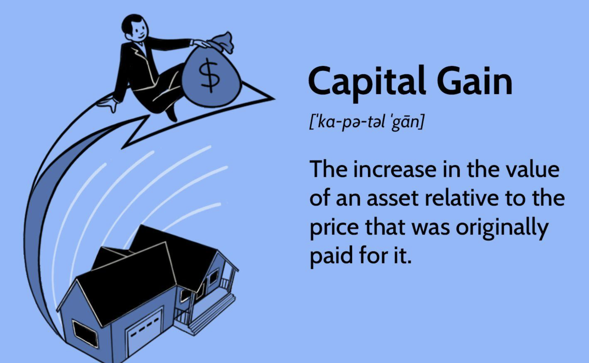

## Table of Contents

## What are capital gains?

Capital gains are the profits you make when you sell something for more than you paid for it. This can happen with things like stocks, real estate, or even a piece of art. If you bought a stock for $100 and later sold it for $150, the $50 difference is your capital gain.

There are two types of capital gains: short-term and long-term. Short-term capital gains are for assets held for one year or less, and they are taxed at your regular income tax rate. Long-term capital gains are for assets held for more than one year, and they usually have a lower tax rate. Understanding the difference can help you plan when to sell your assets to minimize your taxes.

## How are capital gains taxed?

Capital gains are taxed based on how long you held the asset before selling it. If you held it for one year or less, it's called a short-term capital gain. These gains are taxed at the same rate as your regular income. So, if you're in a higher tax bracket, you'll pay more in taxes on these gains.

If you held the asset for more than one year, it's called a long-term capital gain. The tax rate for long-term gains is usually lower than for short-term gains. Depending on your income, you might pay 0%, 15%, or 20% on these gains. This lower rate is meant to encourage long-term investment.

There are also special rules and rates for certain types of assets, like collectibles or real estate. Sometimes, you can use losses from other investments to reduce your capital gains tax. It's a good idea to talk to a tax professional to understand how these rules apply to your specific situation.

## What is the difference between short-term and long-term capital gains?

Short-term capital gains are profits you make from selling something you owned for one year or less. This could be stocks, a house, or anything else you sold for more than you paid. The tax you pay on short-term gains is the same as your regular income tax. So, if you make a lot of money, you'll pay a higher tax rate on these gains.

Long-term capital gains are profits from selling things you owned for more than one year. The tax on long-term gains is usually lower than on short-term gains. You might pay 0%, 15%, or 20% on these gains, depending on how much money you make. This lower rate is meant to encourage people to keep their investments for a longer time.

Understanding the difference between short-term and long-term capital gains is important because it can affect how much tax you pay. If you can, holding onto your investments for over a year can save you money on taxes. It's always a good idea to talk to a tax expert to get advice tailored to your situation.

## Can you provide examples of assets that can result in capital gains?

Stocks are a common example of assets that can result in capital gains. If you buy shares of a company and later sell them for more than you paid, the profit you make is a capital gain. For example, if you bought a stock for $50 and sold it for $75, the $25 difference is your capital gain. Whether it's a short-term or long-term gain depends on how long you held the stock before selling it.

Real estate is another asset that can lead to capital gains. If you buy a house and sell it later for more than you paid, the profit is a capital gain. For instance, if you bought a house for $200,000 and sold it for $300,000, you would have a $100,000 capital gain. Just like with stocks, the tax rate on this gain depends on how long you owned the house before selling it.

Other assets can also result in capital gains. Artwork, for example, can be bought and sold for a profit. If you purchase a painting for $1,000 and later sell it for $2,000, you have a $1,000 capital gain. The same rules apply: the length of time you owned the artwork determines whether the gain is short-term or long-term, which in turn affects the tax you'll pay.

## How do you calculate capital gains?

To calculate your capital gains, start by figuring out how much you sold the asset for. Then, subtract how much you originally paid for it. The difference is your capital gain. For example, if you bought a stock for $100 and sold it for $150, your capital gain is $50.

Next, you need to know if your gain is short-term or long-term. If you owned the asset for one year or less, it's a short-term gain. If you owned it for more than one year, it's a long-term gain. This matters because short-term gains are taxed at your regular income tax rate, while long-term gains have a lower tax rate. Knowing this can help you plan when to sell your assets to pay less in taxes.

## What strategies can be used to minimize capital gains tax?

One way to minimize capital gains tax is by holding onto your investments for more than a year. When you do this, your gains become long-term, and the tax rate is usually lower than for short-term gains. For example, if you're in a higher tax bracket, your short-term gains could be taxed at over 30%, while long-term gains might only be taxed at 15% or even 0% depending on your income. So, if you can wait a bit longer before selling, you might save a lot on taxes.

Another strategy is to use tax-loss harvesting. This means selling investments that have lost value to offset the gains from other investments. If you have a stock that's worth less than you paid for it, you can sell it and use the loss to reduce the tax you owe on your gains. For example, if you made a $1,000 gain on one stock but lost $500 on another, you can subtract the $500 loss from the $1,000 gain, so you only pay tax on $500. This can help lower your overall tax bill.

You can also consider investing in tax-advantaged accounts like IRAs or 401(k)s. In these accounts, you don't pay capital gains tax on your investments until you take the money out. Sometimes, if it's a Roth IRA, you might not pay any taxes at all on your gains if you follow the rules. By using these accounts wisely, you can grow your investments without worrying about capital gains tax each year.

## What are capital losses and how do they affect capital gains?

Capital losses happen when you sell something for less than what you paid for it. For example, if you bought a stock for $100 and sold it for $75, you have a $25 capital loss. Just like with gains, capital losses can be short-term if you owned the asset for one year or less, or long-term if you owned it for more than a year. You can use these losses to help reduce the taxes you owe on your capital gains.

When you have capital losses, you can use them to offset your capital gains. This means you subtract your losses from your gains to figure out how much you owe in taxes. For example, if you made a $1,000 gain on one investment but had a $300 loss on another, you only pay taxes on the $700 difference. If your losses are more than your gains, you can use up to $3,000 of the extra loss to reduce your regular income tax each year. Any remaining loss can be carried over to future years to keep lowering your tax bill.

## How does the holding period affect the taxation of capital gains?

The holding period of an asset affects how much tax you pay on capital gains. If you own an asset for one year or less before selling it, any profit you make is called a short-term capital gain. The tax on these gains is the same as your regular income tax. This means if you are in a high tax bracket, you could pay a lot in taxes on these short-term gains.

If you hold an asset for more than one year before selling, any profit is a long-term capital gain. The tax on long-term gains is usually lower than on short-term gains. Depending on your income, you might pay 0%, 15%, or 20% on these gains. This lower rate is meant to encourage people to keep their investments for a longer time, which can help you save money on taxes if you can wait to sell your assets.

## What is the capital gains tax rate for different income levels?

The capital gains tax rate depends on how long you owned the asset and how much money you make. If you owned the asset for one year or less, it's a short-term capital gain, and you pay the same tax rate as your regular income. So, if you make a lot of money, you might pay over 30% on these gains. But if you're in a lower tax bracket, you'll pay less.

If you owned the asset for more than a year, it's a long-term capital gain, and the tax rate is usually lower. The rate can be 0%, 15%, or 20%, depending on your income. If you're single and make less than $40,400 a year, or married filing jointly and make less than $80,800 a year, you might not pay any tax on your long-term gains. If you make more than that but less than $445,850 as a single person, or $501,600 as a married couple filing jointly, you'll pay 15%. If you make more than those amounts, you'll pay 20%.

## Are there any exemptions or deductions available for capital gains?

There are some ways to reduce or avoid paying capital gains tax. One big way is the primary residence exemption. If you sell your home and make a profit, you might not have to pay tax on that gain. If you're single, you can exclude up to $250,000 of the profit from your taxes. If you're married and filing jointly, you can exclude up to $500,000. But you have to have lived in the home for at least two of the last five years to use this exemption.

Another way to lower your capital gains tax is by using capital losses. If you sell something for less than you paid for it, that's a capital loss. You can use these losses to offset your gains. For example, if you made a $1,000 gain on one investment but had a $300 loss on another, you only pay tax on the $700 difference. If your losses are more than your gains, you can use up to $3,000 of the extra loss to reduce your regular income tax each year. Any remaining loss can be carried over to future years to keep lowering your tax bill.

## How do capital gains affect your overall investment strategy?

Capital gains can play a big role in how you plan your investments. Knowing that you'll pay less tax on long-term gains might make you decide to hold onto your investments for more than a year. This can affect which stocks, real estate, or other assets you choose to buy and when you decide to sell them. For example, if you think a stock will go up in value but you're not sure it will happen in less than a year, you might choose to keep it longer to get the lower long-term capital gains tax rate.

Another thing to think about is how capital gains can change your overall tax bill. If you have other investments that are losing money, you might sell those to offset the gains and pay less tax. This strategy, called tax-loss harvesting, can help you manage your taxes better. By understanding how capital gains work, you can make smarter choices about when to buy and sell your investments to keep more of your money.

## What are the international considerations for capital gains taxation?

When you invest in assets outside your home country, you need to think about how different countries tax capital gains. Each country has its own rules, and they can be very different from what you're used to. For example, some countries might not tax capital gains at all, while others might have higher tax rates than your home country. If you sell an asset in another country, you might have to pay taxes there and then pay taxes again when you bring the money back home. This is called double taxation, and it can make a big difference in how much money you keep.

To avoid paying too much in taxes, you can look into tax treaties between countries. These are agreements that can help you avoid being taxed twice on the same gain. For example, if there's a treaty between your home country and the country where you sold the asset, you might only have to pay taxes in one of those places. It's a good idea to talk to a tax professional who knows about international tax laws. They can help you plan your investments and understand how to pay the least amount of tax possible.

## References & Further Reading

[1]: Pomeranets, A., & Andrei, S. (2014). ["High-frequency trading and its impact on market quality."](https://www.sciencedirect.com/science/article/abs/pii/S1057521921003185) Bank of Canada Working Paper.

[2]: ["Taxation of Algorithmic Trading: A Guide for Professionals"](https://www.investopedia.com/articles/active-trading/101014/basics-algorithmic-trading-concepts-and-examples.asp) by A. Wallace and M. Forcier.

[3]: Taleb, N. N. (2011). ["Antifragile: Things That Gain from Disorder"](https://www.amazon.com/Antifragile-Things-That-Disorder-Incerto/dp/0812979680) Random House.

[4]: SEC Office of Investor Education and Advocacy. (2015). ["Investor Bulletin: Understanding High Frequency Trading."](https://www.sec.gov/about/divisions-offices/office-investor-education-advocacy) 

[5]: DeGennaro, R. P., & Robotti, C. (2007). ["Financial market complexity and the slow diffusion of information."](https://www.atlantafed.org/-/media/Documents/research/publications/economic-review/2007/vol92no3_degennaro-robotti.pdf) Economic Senate Library.