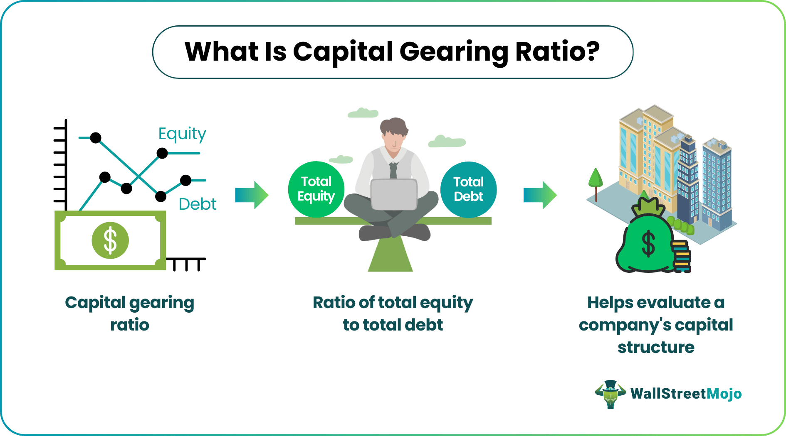

In finance, understanding financial metrics such as the gearing ratio, capital gearing, and financial leverage is essential for investors. These metrics play a vital role in evaluating a company's financial health, risk assessment, and formulating investment strategies. The gearing ratio is a measure of a company's financial leverage, indicating the degree to which its operations are funded by shareholder equity versus creditor financing. A high gearing ratio can signal increased financial risk, as the company relies heavily on borrowed funds, while a low ratio suggests a more conservative approach, reducing potential liabilities.

Capital gearing, often used interchangeably with financial leverage in certain regions, specifically refers to the proportion of a company's capital that is borrowed versus owned. It is a critical indicator for understanding a company’s financial structure, particularly in terms of debt management and equity valuation. This understanding enables investors to make informed judgments about the sustainability of a company's business model and its resilience against economic fluctuations.



With the advent of algorithmic trading, which uses automated systems to execute trades based on predefined rules, incorporating these financial metrics has become vital. Algorithms apply these metrics to scrutinize companies’ financial landscapes, enabling more dynamic and responsive trading strategies that reflect current market conditions. By integrating gearing ratios and financial leverage into trading algorithms, traders can optimize their decision-making processes, enhance portfolio performance, and devise strategies that are both profitable and risk-aware. Consequently, familiarity with these metrics is increasingly important for maintaining a competitive edge in today's fast-paced financial markets.

## Table of Contents

## Understanding Gearing Ratio and Capital Gearing

In finance, the gearing ratio is a critical metric used to understand the financial structure of a company, specifically the level of debt used to finance its operations versus its equity. This ratio provides valuable information about a company's financial leverage, helping investors and analysts assess the financial risk associated with the company's indebtedness. 

Mathematically, the gearing ratio can be expressed as:

$$
\text{Gearing Ratio} = \frac{\text{Total Debt}}{\text{Shareholders' Equity}}
$$

This formula encapsulates the essence of the gearing ratio by illustrating the proportion of the company's capital structure that is financed by debt instead of equity. A higher gearing ratio indicates that a company is more leveraged, meaning it relies heavily on borrowed funds. This could imply higher financial risk, as the company might struggle to cover its debt obligations during economic downturns. Conversely, a low gearing ratio suggests a more conservative approach, with the company relying more on equity financing.

In the context of the UK, the term "capital gearing" is commonly used. This concept closely aligns with what is known as financial leverage in the US. Essentially, capital gearing also measures a company's debt relative to its equity, indicating how much of the company's operations are funded through debt.

Understanding the implications of the gearing ratio is crucial for investors. A high gearing ratio can be a double-edged sword; while it suggests potential for higher returns on equity due to the increased use of debt financing, it simultaneously signals increased risk of financial distress. This is particularly relevant in periods of economic instability, where high levels of debt could lead to challenges in meeting interest payments and maintaining [liquidity](/wiki/liquidity-risk-premium).

From an analytical standpoint, evaluating a company's gearing ratio—alongside other financial metrics—enables more informed investment decisions. For comparative analysis, it is often helpful to assess a company's gearing ratio against industry benchmarks or historical trends to understand its relative leverage position. 

In conclusion, both gearing ratio and capital gearing serve as integral tools in financial analysis. By providing insights into the balance between debt and equity in a company's capital structure, these metrics are essential for assessing financial risk and developing robust investment strategies.

## Financial Leverage: Concepts and Implications

Financial leverage is a critical concept in finance, involving the use of borrowed funds to enhance the potential returns on an investment. By employing leverage, investors and companies can increase their market exposure beyond their initial capital investment. The fundamental premise is that the returns generated from the invested capital will exceed the costs of borrowing, thereby generating higher profits.

However, the benefits of financial leverage are accompanied by substantial risks. During economic downturns or periods of financial instability, the burden of debt servicing can become more pronounced as revenue streams diminish. This heightened risk is attributed to the fixed nature of debt obligations, which must be met regardless of a company's financial health or performance.

For example, consider a company with an equity investment of $1 million and total borrowings of $2 million. The leverage ratio, calculated as total debt divided by equity, would be 2:1. This indicates that for every dollar of equity, there are two dollars of debt. While this leverage can amplify gains during profitable periods, it can also exacerbate losses if investments do not yield the expected returns.

Mathematically, the return on equity (ROE) can be expressed as:

$$
\text{ROE} = \left(\frac{\text{Net Income}}{\text{Equity}}\right) = \left(\frac{\text{Net Income}}{\text{Total Assets}}\right) \times \left(\frac{\text{Total Assets}}{\text{Equity}}\right)
$$

Here, the leverage ratio $\left(\frac{\text{Total Assets}}{\text{Equity}}\right)$ magnifies the net income's impact on equity returns.

Understanding and managing financial leverage is integral to both strategic investment decisions and risk management practices. For investors, leveraging decisions must be aligned with their risk tolerance and market outlook. Companies, on the other hand, need to balance leverage to optimize capital structure while maintaining financial stability. This requires a deep appreciation of how economic cycles and market conditions can influence borrowed capital costs and returns. 

In sum, while financial leverage can enhance investment returns, it requires careful consideration and a disciplined approach to risk management to prevent adverse financial outcomes.

## Algorithmic Trading: Integrating Financial Metrics

Algorithmic trading employs automated systems to execute trades based on predefined criteria, significantly enhancing trading efficiency and accuracy. A critical component of these systems is the integration of financial metrics such as gearing ratio and financial leverage. By incorporating these metrics, algorithms are better equipped to evaluate the financial health of companies and potential risks associated with investments.

The gearing ratio, defined as the proportion of a firm's debt to its equity, offers insights into the company's capital structure and financial stability. A high gearing ratio suggests that a company is heavily reliant on borrowed funds, which could indicate higher financial risk, especially in volatile markets. Conversely, a low gearing ratio signifies a more conservative approach, potentially implying lower risk. In [algorithmic trading](/wiki/algorithmic-trading), this metric is utilized to screen and rank securities, enabling algorithms to select companies with preferred financial profiles.

Financial leverage, the use of borrowed capital to amplify investment returns, is another crucial metric in trading algorithms. While leverage can enhance profits, it also increases exposure to potential losses. Thus, algorithms that incorporate financial leverage must be programmed to evaluate both the potential returns and risks. A balanced strategy involves adjusting leverage based on current market conditions and individual company assessments.

Incorporating these metrics into algorithmic trading systems allows for more informed decision-making processes. Algorithms can conduct real-time assessments of market and company-specific conditions, adjusting trading strategies accordingly. This integration not only aids in crafting robust strategies but also enhances risk management. Risk is scrutinized with greater precision, allowing algorithms to adjust leverage or gear exposure dynamically. This adaptability is crucial in optimizing trading strategy performance.

Ultimately, by embedding financial metrics into trading algorithms, traders achieve a granular understanding of market dynamics and company health. This data-driven approach supports the development of sophisticated trading strategies that balance profitability with risk management, providing a competitive edge in the fast-paced financial markets.

## Pros and Cons of Using Leverage in Algo Trading

Leverage in algorithmic trading serves as a double-edged sword, offering both enhanced profit potential and heightened risk exposure. By utilizing leverage, traders can increase their market exposure beyond their capital's capacity, thus amplifying potential returns on investment. For instance, if a trader uses a leverage ratio of 1:5, a 1% increase in the underlying asset value could potentially yield a 5% increase in the trader's equity. This magnification of market movements allows for significant profit opportunities within short time frames, especially in highly liquid markets.

However, the downside of leverage is its propensity to magnify losses to the same degree as profits. In volatile market conditions, leveraged positions can rapidly result in substantial financial losses. This risk is exacerbated by the potential for sudden market shifts, which can lead to margin calls or forced liquidation of positions if account equity falls below required maintenance levels. Hence, strategic risk management becomes crucial in the execution of leveraged algorithmic trading strategies.

Traders incorporate various risk mitigation techniques to counterbalance the perils associated with leverage. One fundamental strategy is the use of stop-loss orders. These orders are automated instructions to sell a security when it reaches a particular price, thereby capping downside risk. For example, a stop-loss can be set at 10% below the purchase price to protect a leveraged position from excessive losses.

Diversification is another vital strategy in managing leverage-related risks. By spreading investments across different asset classes or sectors, traders can minimize the impact of adverse price movements in any single investment, as losses in one area may be offset by gains in another. This approach is referred to as risk diversification, a key principle in reducing portfolio [volatility](/wiki/volatility-trading-strategies) and potential drawdowns.

Empirical evidence suggests that algorithmic trading systems equipped with leverage can optimize risk-return profiles when combined with robust risk management practices. The ability to dynamically adjust leverage according to market conditions and ongoing performance assessment can further enhance the effectiveness of leveraged trading strategies. Algorithmic models can be programmed to alter leverage ratios based on volatility indices or economic indicators, ensuring that exposure is aligned with prevailing market conditions.

In summary, while leverage enhances the capital efficiency in algorithmic trading, it necessitates a disciplined approach to risk management. Proper implementation of risk controls such as stop-loss orders and diversification, supplemented by systematic adjustments to leverage based on market analysis, can enable traders to harness the benefits of leverage while mitigating potential drawbacks.

## Conclusion

Financial metrics, such as the gearing ratio and leverage, are essential in constructing investment strategies and executing algorithmic trading. These metrics provide a clear view of a company's financial structure, helping traders to assess risk and potential returns more accurately. By integrating these metrics into algorithmic trading systems, traders can refine their decision-making processes and enhance strategy performance.

The incorporation of financial metrics allows algorithms to evaluate a company's financial health comprehensively. This, in turn, informs trading decisions and aids in the management of both profitability and risk. For example, a high gearing ratio might indicate that a company is more leveraged, prompting algorithms to adjust their strategies accordingly, either by decreasing exposure or by seeking compensatory strategies elsewhere in the market.

Continuous learning and adaptation to financial metrics are pivotal in maintaining a competitive edge in the financial industry. As market conditions change and new data becomes available, algorithms must evolve to incorporate these changes effectively. Techniques such as [machine learning](/wiki/machine-learning) can be employed to optimize algorithmic strategies, allowing traders to respond swiftly and effectively to financial metrics and market behaviors.

To successfully leverage these financial metrics, traders can implement Python-based trading algorithms, which can calculate gearing ratios and other indicators in real-time, making use of libraries such as `numpy` for numerical operations or `pandas` for data handling. For instance, calculating a company's gearing ratio could be done with a simple Python script:

```python
import pandas as pd

def calculate_gearing_ratio(debt, equity):
    return debt / equity

# Example usage with sample data
company_data = pd.DataFrame({
    'Debt': [100000, 200000, 150000],
    'Equity': [50000, 300000, 100000]
})

company_data['Gearing Ratio'] = company_data.apply(lambda row: calculate_gearing_ratio(row['Debt'], row['Equity']), axis=1)

print(company_data)
```

This approach ensures that trading algorithms remain not only responsive to current data but also adaptable to future trends and financial conditions. By continuously incorporating financial metrics like gearing ratio and leverage into algorithmic systems, traders can maintain and enhance their position in an increasingly competitive financial market.

## References & Further Reading

Bergstra, J., et al., Algorithms for Hyper-Parameter Optimization. This publication investigates into techniques for optimizing hyper-parameters in machine learning algorithms, which is crucial for enhancing the performance and efficiency of trading algorithms.

Chan, E., *Algorithmic Trading: Winning Strategies and Their Rationale*. This reference provides a comprehensive overview of different algorithmic trading strategies, explaining the rationale behind them and how financial metrics such as gearing ratios and leverage can be employed to enhance these strategies.

Jansen, S., *Machine Learning for Algorithmic Trading*. This book offers insights into the integration of machine learning in algorithmic trading, focusing on data-driven approaches that incorporate financial metrics to optimize trading performance and manage risks effectively.

